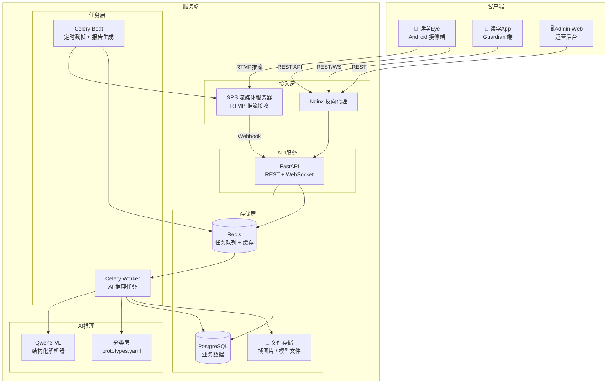
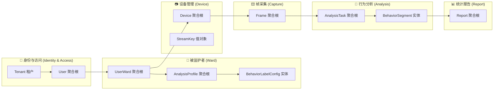

# 读学系统 — 全系统架构概览

> 版本 v1.0 | 本文档描述整体系统结构与领域划分，各端详细设计见各子目录文档。

---

## 一、四端组成

| 端 | 目录 | 角色 | 说明 |
|----|------|------|------|
| 读学Eye（Cam App） | `duxue-cam/` | Android 摄像端 | 架设在 ward 桌面，负责 RTMP 推流 |
| 读学App | `duxue-app/` | Guardian 端 | 查看行为报告、管理分析配置 |
| Admin Web | `duxue-admin/` | 运营后台 | 机构与租户管理、系统运维 |
| Server | `duxue-server/` | 服务端 | REST API、AI 推理、数据存储 |

---

## 二、整体系统架构

---

## 三、领域划分（限界上下文）

---

## 四、核心角色说明

| 角色 | 英文标识 | 说明 |
|------|---------|------|
| 监护人 | `guardian` | 家长、老师或机构管理员，拥有账号，负责配置和查看报告 |
| 被监护者 | `ward` | 孩子、学员等被观察对象，无账号，由 guardian 创建和管理 |
| 摄像设备 | `device` | 绑定到 ward 的摄像端，持有 `stream_key`，不走人类账号体系 |
| 租户 | `tenant` | 一个机构或家庭，所有数据在租户内隔离 |

> 系统设计不假设使用场景仅限于学习/教育，guardian 与 ward 关系可覆盖任意监护观察场景。

---

## 五、各端详细文档

- Server 架构与数据库设计：[duxue-server/docs/ARCHITECTURE.md](../duxue-server/docs/ARCHITECTURE.md)
- 产品需求与摄像端用户手册：[docs/product-requirements.md](./product-requirements.md)
