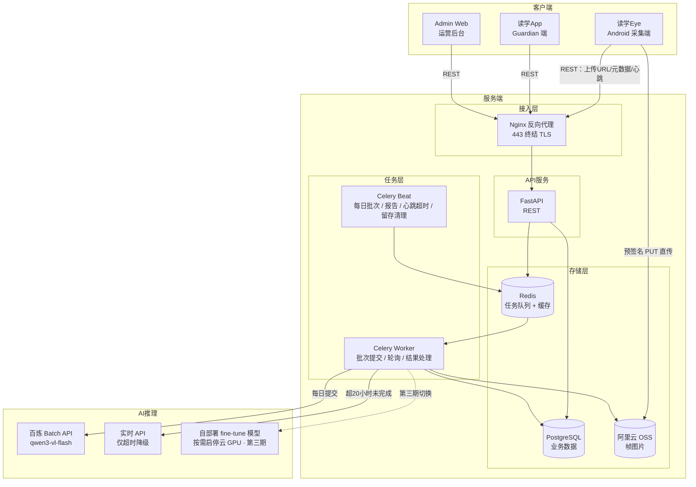
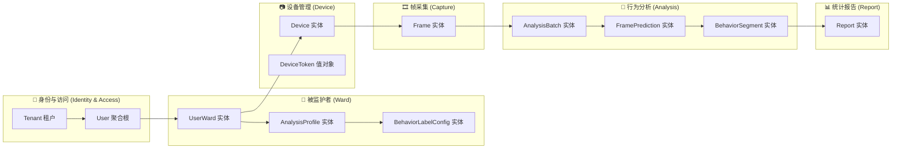

# 读学系统 — 全系统架构概览

> 版本 v2.0 | 本文档描述整体系统结构与领域划分，各端详细设计见各子目录文档。

---

## 一、四端组成

| 端 | 目录 | 角色 | 说明 |
|----|------|------|------|
| 读学Eye（Cam App） | `duxue-cam/` | Android 采集端 | 架设在 ward 桌面，定时抓拍单帧并上传 |
| 读学App | `duxue-app/` | Guardian 端 | 查看行为报告、管理分析配置 |
| Admin Web | `duxue-admin/` | 运营后台 | 机构与租户管理、系统运维（尚未建设） |
| Server | `duxue-server/` | 服务端 | REST API、AI 推理编排、数据存储 |

---

## 二、整体系统架构



**两处关键设计**：帧图片由 Cam 端**直传 OSS 不经过 API 进程**，避免 API 服务器承担全部上行带宽；VLM 推理走**每日 Batch 异步作业**而非逐帧实时调用，单价降为 50% 且规避实时 API 的并发限制。

**第一期不做任何帧过滤，所有帧全量送 VLM。** 早期方案设计过一层帧门控（人形检测 + 帧差比对），已移出第一期——它与第二期 fine-tune 的数据需求冲突（被跳过的帧就是缺失的训练样本），且在第三期自部署形态下收益基本消失（成本按 GPU 运行时长计而非帧数）。详见[服务端架构 §2.5](../duxue-server/docs/ARCHITECTURE.md)。

---

## 三、领域划分（限界上下文）



**分析产物拆成两层**：`FramePrediction` 是逐帧标签（与 Frame 一对一），`BehaviorSegment` 是平滑归并后的连续片段（由多帧派生）。分开存储的收益是——调整平滑参数可以直接重算历史片段，无需重跑 VLM。

---

## 四、核心角色说明

| 角色 | 英文标识 | 说明 |
|------|---------|------|
| 监护人 | `guardian` | 家长、老师或机构管理员，拥有账号，负责配置和查看报告 |
| 被监护者 | `ward` | 孩子、学员等被观察对象，无账号，由 guardian 创建和管理 |
| 摄像设备 | `device` | 绑定到 ward 的采集端，持有 `device_token`，不走人类账号体系 |
| 租户 | `tenant` | 一个机构或家庭，所有数据在租户内隔离 |

> 系统设计不假设使用场景仅限于学习/教育，guardian 与 ward 关系可覆盖任意监护观察场景。
>
> **所有业务表都带 `tenant_id`**，隔离由 Repository 基类强制注入过滤 + PostgreSQL RLS 双重保障，不依赖调用方自觉。详见服务端文档 §4.5。

---

## 五、端到端时延预期

理解这条时间线才能理解为什么系统可以用异步 Batch 推理：

```
ward 在桌前     Cam 抓拍上传      每日 22:00        次日报告就绪
   │              │ 15 秒内          │ 提交 Batch       │ 推送通知
   ▼              ▼                  ▼                  ▼
 ──────────────────────────────────────────────────────────▶
                                   [异步窗口 ≤ 24 小时]
```

系统中**没有任何页面需要"这一帧刚分析完"**——报告是当日结束后生成、guardian 事后查看的。因此 Batch 的异步延迟不是妥协，而是免费换来的 50% 单价。

这个时间线同样支撑了第三期的自部署形态：每日批量分析只需在夜间启动 GPU 实例跑十几分钟、跑完即关，不需要 24 小时常驻。

唯一的实时链路是**设备在线状态**：Cam 每 60 秒上报心跳，服务端超时 3 分钟即置 offline 并推送通知给 guardian。这条链路必须实时，因为"摄像头掉线了"是用户最需要立刻知道的事。

---

## 六、各端详细文档

- Server 架构与数据库设计：[duxue-server/docs/ARCHITECTURE.md](../duxue-server/docs/ARCHITECTURE.md)
- 读学Eye 采集端架构：[duxue-cam/docs/ARCHITECHTURE.md](../duxue-cam/docs/ARCHITECHTURE.md)
- 读学App Guardian 端架构：[duxue-app/docs/ARCHITECHTURE.md](../duxue-app/docs/ARCHITECHTURE.md)
- 产品需求与设备接入手册：[docs/product-requirements.md](./product-requirements.md)
- 可观测性方案：[docs/observability.md](./observability.md)
