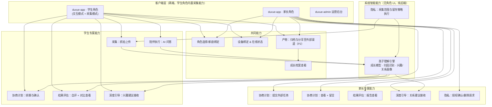

# 读学系统 — 产品架构（Product Architecture）

> 版本 v3.0 | 本文档是读学系统的**产品架构主文档**，涵盖：产品愿景与三大目标、核心角色、五场景闭环、按角色划分的模块地图（§四）、以及各能力规格文档路由（§五 → `prd-*.md`）。
>
> **当前阶段：自用验证期。** 系统尚未对外提供服务，暂不涉及第三方用户的授权与合规流程（见 §七）。
>

---

## 一、产品愿景与目标

读学系统是一款围绕孩子学习过程的 AI 陪伴平台。它不是"监控孩子有没有偷懒"的工具，而是试图同时解决三个互相关联的问题：孩子缺乏专注力和自我管理能力、缺乏自主学习的内在驱动力、以及学习这件事常常消耗甚至损害亲子关系。

### 1.1 三大产品目标

> ⚠️ **未验证假设**：下表"当前问题假设"一列目前是团队基于经验和对孩子学习场景的观察做出的判断，**尚未经过系统性的用户访谈或数据验证**。三者中 G3（家庭关系）的假设风险最高——专注力（G1）和自主学习（G2）至少可以用 v2.0 已经在跑的行为数据侧面验证，但"学习相关的沟通是亲子矛盾高频来源"这个判断目前完全没有一手数据支撑。**建议正式投入 5.7 家庭关系深度引导能力的开发前，先用 5~10 组真实家庭做一轮小范围访谈或日志观察，确认这个假设是否成立、以及问题的真实强度**，避免把最复杂、最敏感的能力建立在一个没验证过的判断上。


| 目标                    | 当前问题假设                                                   | 系统的应对方式                                        | 衡量方式（方向性指标，具体阈值待第一期数据积累后校准）                           |
| --------------------- | -------------------------------------------------------- | ---------------------------------------------- | ----------------------------------------------------- |
| **G1. 提升专注力与自制力**     | 孩子在无人监督时难以维持专注，缺乏对自己状态的客观认知（"我以为自己很专注"与实际不符）             | 客观记录行为状态 → 引导孩子对比自评与实际记录 → 逐步内化自我觉察能力          | 单次任务的有效专注时长占比随时间提升；自评与AI记录的偏差随时间缩小                    |
| **G2. 养成自主驱动学习探索的习惯** | 学习计划长期由家长安排，孩子习惯被动执行，缺少自己拆解任务、探索兴趣的经验                    | 计划由孩子主导、AI 辅助优化；识别孩子在执行过程中表现出的兴趣信号，主动给出深入探索的建议 | 孩子主导发起的计划占比；兴趣探索建议的采纳率与延续时长                           |
| **G3. 优化家庭关系**        | 学习相关的沟通（催促、检查、争执）是许多家庭亲子矛盾的高频来源，家长和孩子对彼此的实际状态、情绪变化缺乏客观了解 | 理解家长与孩子双方的行为、情绪模式，在合适的时机为任意一方提供具体、可执行的建议       | guardian 端"因学习产生的负面互动"频率下降（需设计侧问卷或行为代理指标）；建议的采纳与正向反馈率 |


### 1.2 设计信念

- **AI 补的是"专业认知"和"在场时间"的缺口，不是替代家长的角色。** 家长仍然是关系的主体，AI 承担的是家长做不到或做不好的部分：随时在场答疑、客观记录行为、发现家长难以察觉的模式。
- **自主驱动的前提是决策权在孩子手里。** 只要计划是"AI 或家长安排、孩子执行"，就不可能养成自主驱动的习惯——因此协商计划能力明确要求孩子主导发起，AI 和家长只提供建议。
- **专注力提升靠的是自我觉察，不是外部监督压力。** 系统不以"抓到分心"为目的，而是让孩子有机会看到自己真实的状态并自己得出结论。
- **家庭关系的问题往往双方都有责任，建议也应该给双方。** 不只是"教家长怎么管孩子"，也包括"帮孩子理解家长的状态"。

### 1.3 愿景故事

> 产品最终应该让使用者感受到什么？不要从功能出发，而要从"用户在使用了系统一段时间后，他们的生活发生了什么变化"出发。完整故事见 [`docs/product/user-story.md`](user-story.md)。

---

## 二、核心角色


| 角色                   | 说明                                                         |
| -------------------- | ---------------------------------------------------------- |
| **ward（学生）**         | 被陪伴与观察的孩子。是协商计划、执行学习任务、接受问答陪伴与复盘引导的主体，产品设计上被赋予计划决策权（见 G2）。 |
| **guardian（家长/监护人）** | 创建 ward 档案、参与计划的知情与建议、查看报告、接收系统关于孩子及自身的引导建议。               |


一个 guardian 可以管理多个 ward；一个 ward 在当前阶段关联一个主要 guardian（多监护人协作暂不在本次设计范围内，见 §六)。

> 系统不限定使用场景，guardian 与 ward 的关系当前默认是亲子关系；师生、机构与学员等场景需要的角色扩展（如"教师"角色）暂不在本次设计范围内。

---

## 三、产品闭环：五大场景 + 一条横切能力

系统的产品逻辑围绕一个持续循环的闭环运转，而不是一次性的功能列表：

```
        ┌──────────────────────────────────────────────┐
        │                                                │
        ▼                                                │
   ① 采集输入 ──▶ ② 协商计划 ──▶ ③ 陪伴执行 ──▶ ④ 结果评估 ──▶ ⑤ 深度引导
        │                              │                   │              │
   持续采集行为              孩子主导+AI辅助         AI实时问答         次日可见报告      跨周期的关系与
   数据，贯穿全程              制定当次计划          +行为观测         +自评对比复盘        兴趣洞察
                                                     （实时）          （批量/次日）      （周期性）

   ┄┄┄┄┄┄┄┄┄┄┄┄┄┄┄┄┄┄┄┄┄┄┄┄┄┄┄┄┄┄┄┄┄┄┄┄┄┄┄┄┄┄┄┄┄┄┄┄┄┄┄┄┄┄┄┄┄┄┄┄┄┄┄┄┄┄┄┄┄┄
   横切能力｜产物归档与分享：②③④⑤ 任一阶段都可能产生值得留存的"产物"
   （计划文档 / 学习产出物 / 复盘反思 / 洞察建议），不绑定在某一个步骤上
   ┄┄┄┄┄┄┄┄┄┄┄┄┄┄┄┄┄┄┄┄┄┄┄┄┄┄┄┄┄┄┄┄┄┄┄┄┄┄┄┄┄┄┄┄┄┄┄┄┄┄┄┄┄┄┄┄┄┄┄┄┄┄┄┄┄┄┄┄┄┄
```


| 阶段     | 发生什么                                                   | 主要参与者                     | 时间节奏                   |
| ------ | ------------------------------------------------------ | ------------------------- | ---------------------- |
| ① 采集输入 | 摄像设备持续抓拍 ward 所在场景的图像帧                                 | ward（被动）、设备               | 持续（默认 15 秒/帧）          |
| ② 协商计划 | ward 提出本次学习任务的目标与安排，AI 结合历史数据给出优化建议，最终计划由 ward 确认      | ward 主导、AI 辅助、guardian 知情 | 每次学习任务开始前              |
| ③ 陪伴执行 | ward 执行计划过程中，AI 提供即时问答陪伴；同时系统持续观测行为状态                  | ward、AI                   | 问答：实时；行为观测：持续采集，次日批量分析 |
| ④ 结果评估 | 任务/当日结束后，ward 先自评，系统展示 AI 记录与自评的对比，引导复盘专注度与改进办法        | ward 主导、guardian 查看       | 次日可见（批量分析）             |
| ⑤ 深度引导 | 系统基于跨周期的数据，识别 ward 的兴趣走向、ward/guardian 的情绪与关系变化趋势，给出建议 | ward、guardian（系统主动触达）     | 周期性（如周/月），非单次任务触发      |


闭环体现在：⑤ 阶段产出的兴趣洞察和关系建议会反馈进入下一轮的 ② 协商计划（例如"孩子最近对昆虫很感兴趣，是否要在计划里加一段探索时间"），形成越来越贴合孩子实际状态的循环，而不是每轮都从零开始。

**"产物归档与分享"不是流程里的第六个步骤，而是一条横切能力**——它不发生在固定的时间点，而是伴随其它阶段发生：


| 产生产物的阶段 | 产物是什么                     |
| ------- | ------------------------- |
| ② 协商计划  | 计划本身（本次任务的目标与安排）          |
| ③ 陪伴执行  | 学习产出物（完成的作业照片、创作内容、探索笔记）  |
| ④ 结果评估  | 复盘产出（ward 的自我反思、沉淀出的提升办法） |
| ⑤ 深度引导  | 洞察与建议（兴趣主题总结、家庭关系建议）      |


把它设计成横切能力而不是固定步骤，是因为如果绑定在某一个环节（比如只在③执行结束后触发），会遗漏其它阶段同样值得留存和分享的产出——协商出的计划本身值得回顾，复盘出的反思也是一种成长记录，不应该只有"作业照片"才算产物。

### 3.1 能力分层 × 阶段映射

产品能力按"改变发生的深度"分为三层，与五阶段的映射关系如下（同一能力可能跨越多个阶段）：


| 层次                        | 能力                                   | 所属阶段               |
| ------------------------- | ------------------------------------ | ------------------ |
| 表层：用 AI 替代家长的认知负担         | 5.3 AI 陪学问答能力                        | ③ 陪伴执行             |
| 表层：引导复盘                   | 5.6 复盘评估引导能力                         | ④ 结果评估             |
| 中层：协商任务拆解与计划              | 5.2 协商式计划能力                          | ② 协商计划             |
| 中层：自主驱动学习探索               | 5.5 兴趣探索引导能力                         | ③ 陪伴执行 → ⑤ 深度引导    |
| 深层：优化家庭关系纽带               | 5.7 家庭关系深度引导能力                       | ⑤ 深度引导             |
| 表层→深层的桥梁（横切）：归档成果并转化为家庭互动 | 5.8 产物归档与分享能力                        | 贯穿 ②③④⑤            |
| 基础设施：支撑以上所有能力             | 5.1 数据采集能力、5.4 专注力行为观测能力、5.9 隐私与数据治理 | ① 采集输入、③ 陪伴执行、贯穿全程 |

---

## 四、产品能力模块划分

> 本章从"客户端只有 `duxue-app` 一个统一 App（学生角色 / 家长角色，App 内切换）+ `duxue-admin` + `duxue-server`"这个客户端结构出发，重新审视各能力（见 §五 PRD 路由）应该组织成哪些模块、分别由谁操作。这不是对能力规格 PRD 的替代，而是在其之上补一层"模块地图"，帮助理解各能力之间的依赖关系和角色边界。

### 4.1 方法论

用三种业务架构方法交叉校验，得到下面的划分：

- **价值链分析（Value Chain Analysis）**：区分"直接为用户创造体验、且有顺序依赖"的**主链（Primary）**——对应 §三 的五阶段；"不直接被用户感知、但支撑主链运转"的**支持能力（Support）**；以及不绑定单一阶段的**横切能力（Cross-cutting）**。
- **业务能力地图（Business Capability Map）**：每个模块只回答"系统要具备什么能力"，不涉及技术实现，并可逐条追溯回能力编号与 §五 对应 PRD。
- **MECE 校验**：逐条检查 9 个 Capability 能否被划入唯一模块。校验发现 5.4、5.5（部分）、5.6（部分）、5.7（部分）内部混合了两件不同性质的事——"生成对孩子/家庭的理解"和"把理解转成呈现给用户的建议"。这两者一个是纯后端智能、不面向任何角色的界面，另一个是直接呈现给 ward 或 guardian 的交互，混在一起会导致同一个 Capability 同时"属于学生"又"属于家长"又"不属于任何角色"，MECE 校验不通过。因此下面把"理解"部分独立成一个模块（孩子理解引擎），"呈现"部分仍留在原来的阶段模块里。

### 4.2 按角色划分的模块清单

| 模块 | 角色归属 | 说明 | 对应能力编号 |
|------|---------|------|--------------|
| 采集：抓拍上传 | **学生专属** | 设备以学生身份登录 `duxue-app`，运行在"采集模式" | 5.1（部分） |
| 采集：设备在线状态（ward 端上报心跳 / guardian 端接收掉线通知） | **角色分工，同属 5.1** | 不是独立模块——设备按时上报心跳是 ward 侧被动行为，超时未上报则系统通知 guardian；两端表现不同，能力本质相同 | 5.1（部分） |
| 协商计划：排期与确认 | **学生专属** | ward 主导，决策权不可转移 | 5.2 |
| 协商计划：提交外部任务 | **家长专属** | guardian 转发作业截图/文字 | 5.2 |
| 协商计划：查看 + 留言 | **家长专属**（只读+留言） | 无修改权 | 5.2 |
| 陪伴执行：AI 问答 | **学生专属** | | 5.3 |
| 结果评估：自评 + 对比查看 | **学生专属** | | 5.6（呈现部分） |
| 结果评估：报告查看 | **家长专属** | 家长视角的报告呈现，内容来自同一份理解但表达不同 | 5.4 / 5.6（呈现部分） |
| 深度引导：兴趣建议接收 | **学生专属** | | 5.5（呈现部分） |
| 深度引导：关系建议接收 | **家长专属**（主） | 5.7 里"MAY 帮助 ward 理解 guardian 状态"是少数例外 | 5.7（呈现部分） |
| 产物：归档与分享至外部渠道（**P2**） | **共同** | ward 和 guardian 都可以将成长档案里的报告、状态记录等产物分享至微信等 App 外部渠道；内部归档（成长档案本体）P0，外部分享 P2 | 5.8 |
| 产物：成长档案查看 | **共同** | 两侧都能看历史产物 | 5.8 |
| 身份与关系管理：角色选择/切换、家庭绑定 | **共同** | 双方都要登录、选角色；本次决策落地的地方 | 新增（原架构隐含但未显式定义） |
| 设备管理：绑定操作（邀请码/token） | **共同** | 谁的设备都能操作，通常家长辅助学生完成 | 5.1（部分） |
| 孩子理解引擎（成长模型/归因识别/兴趣与关系画像） | **系统能力**（无角色 UI） | 纯后端智能，B/D/E 三个阶段都从这里取数据，而不是各自现算 | 5.4（全部）+ 5.5（识别部分）+ 5.6（归因部分）+ 5.7（画像部分） |
| 隐私治理：授权确认/删除请求发起 | **家长专属** | 涉及监护人法定同意 | 5.9 |
| 隐私治理：采集范围与留存策略执行 | **系统能力** | 由系统强制执行，不需要任何角色主动操作 | 5.9 |

可以看到一个规律：**学生专属的都是"产生行为/做决策"的动作，家长专属的都是"输入外部信息/接收结果/给反馈"的动作**，两者在同一条主链上交替出现，没有一个模块是家长能替学生做决策的——这与 §1.2 的设计信念一致；**共同模块**集中在"身份/设备/成长档案/分享"这类不涉及学习决策本身的基础操作上。

### 4.3 产品架构图



**图上几个关键关系**：`APPW`/`APPG` 是同一个客户端在两种角色下的形态，通过 `G 角色选择/家庭绑定` 切换；`孩子理解引擎` 是唯一被学生和家长两侧多个模块同时依赖的节点，体现"同一份理解，两种呈现"（见 [`docs/user-story.md`](user-story.md) 一、核心价值）；`SHAREDZONE` 里的分享与成长档案不绑定任何一方发起，两侧都可以触达。

> ⚠️ **待确认的物理前提**：本节假设学生持有两台设备——一台用于交互（查看计划、问答、复盘），一台以学生身份运行在"采集模式"（专职摆放摄像，因为同一台设备不可能同时自拍屏幕又拍摄第三方视角的桌面）。如果实际是学生仅有一台设备，"采集模式"何时启用、如何与交互模式切换需要重新设计，见 §七 第 8 条。

---

## 五、能力规格路由（PRD Index）

> 各产品能力的 Requirement / Scenario 与验收细节以 `docs/product/prd-*.md` 为单一事实源；模块地图见 §四。摄像设备安装与机位操作见 [`docs/camera-setup-guide.md`](../camera-setup-guide.md)。

| 功能 | 规格文档 |
|------|----------|
| 用户、身份与首页导航 | [`prd-user.md`](prd-user.md) |
| 学习观察与行为采集 | [`prd-supervise.md`](prd-supervise.md) |
| 协商式计划 | [`prd-schedule.md`](prd-schedule.md) |
| 陪伴执行与 AI 陪学问答 | [`prd-companion.md`](prd-companion.md) |
| 结果评估与复盘引导 | [`prd-evaluate.md`](prd-evaluate.md) |
| 兴趣探索与家庭关系深度引导 | [`prd-explore.md`](prd-explore.md) |
| 产物归档与分享 | [`prd-archive.md`](prd-archive.md) |
| 孩子理解引擎与记忆系统 | [`prd-memory.md`](prd-memory.md) |

## 六、非目标与范围边界

以下内容明确不在本次设计范围内，避免范围蔓延：

- **摄像设备的安装、机位调整、故障排查等操作步骤** — 见 `[docs/camera-setup-guide.md](camera-setup-guide.md)`，本文档只定义"采集能力应有什么行为"
- **服务端 AI 推理架构、批量/实时降级的具体实现** — 见 `[duxue-server/docs/ARCHITECTURE.md](../duxue-server/docs/ARCHITECTURE.md)`
- **多监护人协作**（如父母双方共同管理同一 ward）— 当前默认一个 ward 关联一个主要 guardian
- **师生/机构场景的角色扩展**（如教师角色、班级管理）— AGENTS.md 中标注为待建设的 Admin Web 依赖此扩展，暂不在本次范围
- **情绪/关系判断的临床诊断能力** — 系统只提供提示性建议，不承担、不宣称具备心理咨询或医疗诊断功能
- **guardian 端的摄像头采集** — 见 [`prd-explore.md`](prd-explore.md) / [`prd-evaluate.md`](prd-evaluate.md) 及相关假设（§七）

---

## 七、待确认假设

以下事项在编写本文档时基于合理推测做出假设，需要在实施前与产品/合规方确认：

1. **guardian 情绪信号来源**：假设 guardian 的状态判断只基于其在 App 内的文字反馈、互动记录、行为模式，不新增摄像头采集。如果产品意图确实是要采集 guardian 的影像/表情数据，需要重新评估整套隐私与硬件方案。
2. **情绪/关系类推断的合规边界**：涉及未成年人的情绪画像分析在《个人信息保护法》下可能需要更严格的单独同意与影响评估，具体要求需法务确认后细化各 PRD 合规章节与 §六 边界。
3. **5.5、5.6、5.7 中多处"达到阈值"的具体数值**：本文档有意不写死具体数字（如"连续几次""置信度多少"），因为第一期没有数据基线。这些阈值应作为可配置参数，在数据积累后校准，而不是在需求阶段拍定。
4. **guardian 对计划的"留言"是否需要更强的介入权**：当前设计中 guardian 无法直接修改 ward 的计划（保护自主驱动目标），如果实际使用中出现 ward 计划长期不合理且拒绝采纳建议的情况，是否需要设计"升级机制"待验证。
5. **产物归档的隐私范围**：5.8 假设归档产物（如作业照片）可能包含比行为帧更多的可识别信息（如手写姓名、学校信息），当前默认仅 guardian 可见、不对外分享；如果后续要支持向其他家庭成员或社区分享，需要重新评估该能力的隐私边界。
6. **AI 陪学问答的不当内容处理边界**（见 §3.2 用户旅程异常路径）：当前只笼统写了"系统 SHALL 拒绝正面回应"，没有细化"不当内容"的判定标准、拒绝后的具体交互（是否告知 guardian、告知的严重程度阈值）。这需要在 [`prd-companion.md`](prd-companion.md) 中补充专门要求，且判定标准需要产品和内容安全侧共同定义，本文档暂不展开。
7. **guardian 提交截图的第三方信息风险**：5.2 中 guardian 提交的作业截图（如班级群通知）可能连带包含其他学生姓名、其他家长的聊天内容等第三方信息。当前假设由 guardian 自行确保提交内容仅包含必要的作业要求部分（如自行裁剪），系统不做自动脱敏或内容审查。如果这个假设不成立（guardian 经常整段转发），需要评估是否要新增自动检测并模糊第三方信息的能力，这不在当前范围内。
8. **学生是否持有两台设备**：§4.3 假设学生有一台交互设备和一台专职采集设备（同一账号，两种运行模式）。如果实际是学生仅持有一台设备，"采集模式"和"交互模式"无法同时运行——需要重新设计切换时机（如写作业时把设备切到采集模式摆在桌上，写完再切回交互模式自评/问答），这会显著改变 5.1、5.3 等能力的交互设计，需要在启动开发前与产品确认真实的设备持有情况。

