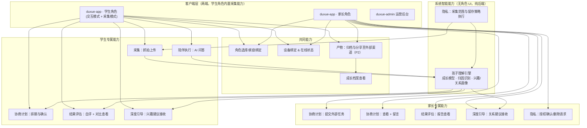

# 读学系统 — 产品架构（Product Architecture）

> 版本 v3.0 | 本文档是读学系统的**产品架构主文档**，涵盖：产品愿景与三大目标、核心角色、五场景闭环、按角色划分的模块地图（§四）、以及每个产品能力的 Requirement/Scenario 规格（§五，遵循 [OpenSpec](https://github.com/Fission-AI/OpenSpec) 规范）。
>
> **当前阶段：自用验证期。** 系统尚未对外提供服务，暂不涉及第三方用户的授权与合规流程（见 §八）。
>

---

## 一、产品愿景与目标

读学系统是一款围绕孩子学习过程的 AI 陪伴平台。它不是"监控孩子有没有偷懒"的工具，而是试图同时解决三个互相关联的问题：孩子缺乏专注力和自我管理能力、缺乏自主学习的内在驱动力、以及学习这件事常常消耗甚至损害亲子关系。

### 1.1 三大产品目标

> ⚠️ **未验证假设**：下表"当前问题假设"一列目前是团队基于经验和对孩子学习场景的观察做出的判断，**尚未经过系统性的用户访谈或数据验证**。三者中 G3（家庭关系）的假设风险最高——专注力（G1）和自主学习（G2）至少可以用 v2.0 已经在跑的行为数据侧面验证，但"学习相关的沟通是亲子矛盾高频来源"这个判断目前完全没有一手数据支撑。**建议正式投入 5.7 家庭关系深度引导能力的开发前，先用 5~10 组真实家庭做一轮小范围访谈或日志观察，确认这个假设是否成立、以及问题的真实强度**，避免把最复杂、最敏感的能力建立在一个没验证过的判断上。


| 目标                    | 当前问题假设                                                   | 系统的应对方式                                        | 衡量方式（方向性指标，具体阈值待第一期数据积累后校准）                           |
| --------------------- | -------------------------------------------------------- | ---------------------------------------------- | ----------------------------------------------------- |
| **G1. 提升专注力与自制力**     | 孩子在无人监督时难以维持专注，缺乏对自己状态的客观认知（"我以为自己很专注"与实际不符）             | 客观记录行为状态 → 引导孩子对比自评与实际记录 → 逐步内化自我觉察能力          | 单次任务的有效专注时长占比随时间提升；自评与AI记录的偏差随时间缩小                    |
| **G2. 养成自主驱动学习探索的习惯** | 学习计划长期由家长安排，孩子习惯被动执行，缺少自己拆解任务、探索兴趣的经验                    | 计划由孩子主导、AI 辅助优化；识别孩子在执行过程中表现出的兴趣信号，主动给出深入探索的建议 | 孩子主导发起的计划占比；兴趣探索建议的采纳率与延续时长                           |
| **G3. 优化家庭关系**        | 学习相关的沟通（催促、检查、争执）是许多家庭亲子矛盾的高频来源，家长和孩子对彼此的实际状态、情绪变化缺乏客观了解 | 理解家长与孩子双方的行为、情绪模式，在合适的时机为任意一方提供具体、可执行的建议       | guardian 端"因学习产生的负面互动"频率下降（需设计侧问卷或行为代理指标）；建议的采纳与正向反馈率 |


### 1.2 设计信念

- **AI 补的是"专业认知"和"在场时间"的缺口，不是替代家长的角色。** 家长仍然是关系的主体，AI 承担的是家长做不到或做不好的部分：随时在场答疑、客观记录行为、发现家长难以察觉的模式。
- **自主驱动的前提是决策权在孩子手里。** 只要计划是"AI 或家长安排、孩子执行"，就不可能养成自主驱动的习惯——因此协商计划能力明确要求孩子主导发起，AI 和家长只提供建议。
- **专注力提升靠的是自我觉察，不是外部监督压力。** 系统不以"抓到分心"为目的，而是让孩子有机会看到自己真实的状态并自己得出结论。
- **家庭关系的问题往往双方都有责任，建议也应该给双方。** 不只是"教家长怎么管孩子"，也包括"帮孩子理解家长的状态"。

### 1.3 愿景故事

> 产品最终应该让使用者感受到什么？不要从功能出发，而要从"用户在使用了系统一段时间后，他们的生活发生了什么变化"出发。完整故事见 [`docs/product/user-story.md`](user-story.md)。

---

## 二、核心角色


| 角色                   | 说明                                                         |
| -------------------- | ---------------------------------------------------------- |
| **ward（学生）**         | 被陪伴与观察的孩子。是协商计划、执行学习任务、接受问答陪伴与复盘引导的主体，产品设计上被赋予计划决策权（见 G2）。 |
| **guardian（家长/监护人）** | 创建 ward 档案、参与计划的知情与建议、查看报告、接收系统关于孩子及自身的引导建议。               |


一个 guardian 可以管理多个 ward；一个 ward 在当前阶段关联一个主要 guardian（多监护人协作暂不在本次设计范围内，见 §七)。

> 系统不限定使用场景，guardian 与 ward 的关系当前默认是亲子关系；师生、机构与学员等场景需要的角色扩展（如"教师"角色）暂不在本次设计范围内。

---

## 三、产品闭环：五大场景 + 一条横切能力

系统的产品逻辑围绕一个持续循环的闭环运转，而不是一次性的功能列表：

```
        ┌──────────────────────────────────────────────┐
        │                                                │
        ▼                                                │
   ① 采集输入 ──▶ ② 协商计划 ──▶ ③ 陪伴执行 ──▶ ④ 结果评估 ──▶ ⑤ 深度引导
        │                              │                   │              │
   持续采集行为              孩子主导+AI辅助         AI实时问答         次日可见报告      跨周期的关系与
   数据，贯穿全程              制定当次计划          +行为观测         +自评对比复盘        兴趣洞察
                                                     （实时）          （批量/次日）      （周期性）

   ┄┄┄┄┄┄┄┄┄┄┄┄┄┄┄┄┄┄┄┄┄┄┄┄┄┄┄┄┄┄┄┄┄┄┄┄┄┄┄┄┄┄┄┄┄┄┄┄┄┄┄┄┄┄┄┄┄┄┄┄┄┄┄┄┄┄┄┄┄┄
   横切能力｜产物归档与分享：②③④⑤ 任一阶段都可能产生值得留存的"产物"
   （计划文档 / 学习产出物 / 复盘反思 / 洞察建议），不绑定在某一个步骤上
   ┄┄┄┄┄┄┄┄┄┄┄┄┄┄┄┄┄┄┄┄┄┄┄┄┄┄┄┄┄┄┄┄┄┄┄┄┄┄┄┄┄┄┄┄┄┄┄┄┄┄┄┄┄┄┄┄┄┄┄┄┄┄┄┄┄┄┄┄┄┄
```


| 阶段     | 发生什么                                                   | 主要参与者                     | 时间节奏                   |
| ------ | ------------------------------------------------------ | ------------------------- | ---------------------- |
| ① 采集输入 | 摄像设备持续抓拍 ward 所在场景的图像帧                                 | ward（被动）、设备               | 持续（默认 15 秒/帧）          |
| ② 协商计划 | ward 提出本次学习任务的目标与安排，AI 结合历史数据给出优化建议，最终计划由 ward 确认      | ward 主导、AI 辅助、guardian 知情 | 每次学习任务开始前              |
| ③ 陪伴执行 | ward 执行计划过程中，AI 提供即时问答陪伴；同时系统持续观测行为状态                  | ward、AI                   | 问答：实时；行为观测：持续采集，次日批量分析 |
| ④ 结果评估 | 任务/当日结束后，ward 先自评，系统展示 AI 记录与自评的对比，引导复盘专注度与改进办法        | ward 主导、guardian 查看       | 次日可见（批量分析）             |
| ⑤ 深度引导 | 系统基于跨周期的数据，识别 ward 的兴趣走向、ward/guardian 的情绪与关系变化趋势，给出建议 | ward、guardian（系统主动触达）     | 周期性（如周/月），非单次任务触发      |


闭环体现在：⑤ 阶段产出的兴趣洞察和关系建议会反馈进入下一轮的 ② 协商计划（例如"孩子最近对昆虫很感兴趣，是否要在计划里加一段探索时间"），形成越来越贴合孩子实际状态的循环，而不是每轮都从零开始。

**"产物归档与分享"不是流程里的第六个步骤，而是一条横切能力**——它不发生在固定的时间点，而是伴随其它阶段发生：


| 产生产物的阶段 | 产物是什么                     |
| ------- | ------------------------- |
| ② 协商计划  | 计划本身（本次任务的目标与安排）          |
| ③ 陪伴执行  | 学习产出物（完成的作业照片、创作内容、探索笔记）  |
| ④ 结果评估  | 复盘产出（ward 的自我反思、沉淀出的提升办法） |
| ⑤ 深度引导  | 洞察与建议（兴趣主题总结、家庭关系建议）      |


把它设计成横切能力而不是固定步骤，是因为如果绑定在某一个环节（比如只在③执行结束后触发），会遗漏其它阶段同样值得留存和分享的产出——协商出的计划本身值得回顾，复盘出的反思也是一种成长记录，不应该只有"作业照片"才算产物。

### 3.1 能力分层 × 阶段映射

产品能力按"改变发生的深度"分为三层，与五阶段的映射关系如下（同一能力可能跨越多个阶段）：


| 层次                        | 能力                                   | 所属阶段               |
| ------------------------- | ------------------------------------ | ------------------ |
| 表层：用 AI 替代家长的认知负担         | 5.3 AI 陪学问答能力                        | ③ 陪伴执行             |
| 表层：引导复盘                   | 5.6 复盘评估引导能力                         | ④ 结果评估             |
| 中层：协商任务拆解与计划              | 5.2 协商式计划能力                          | ② 协商计划             |
| 中层：自主驱动学习探索               | 5.5 兴趣探索引导能力                         | ③ 陪伴执行 → ⑤ 深度引导    |
| 深层：优化家庭关系纽带               | 5.7 家庭关系深度引导能力                       | ⑤ 深度引导             |
| 表层→深层的桥梁（横切）：归档成果并转化为家庭互动 | 5.8 产物归档与分享能力                        | 贯穿 ②③④⑤            |
| 基础设施：支撑以上所有能力             | 5.1 数据采集能力、5.4 专注力行为观测能力、5.9 隐私与数据治理 | ① 采集输入、③ 陪伴执行、贯穿全程 |

---

## 四、产品能力模块划分

> 本章从"客户端只有 `duxue-app` 一个统一 App（学生角色 / 家长角色，App 内切换）+ `duxue-admin` + `duxue-server`"这个客户端结构出发，重新审视 §五 的 9 个 Capability 应该组织成哪些模块、分别由谁操作。这不是对 §五 能力规格的替代，而是在其之上补一层"模块地图"，帮助理解各能力之间的依赖关系和角色边界。

### 4.1 方法论

用三种业务架构方法交叉校验，得到下面的划分：

- **价值链分析（Value Chain Analysis）**：区分"直接为用户创造体验、且有顺序依赖"的**主链（Primary）**——对应 §三 的五阶段；"不直接被用户感知、但支撑主链运转"的**支持能力（Support）**；以及不绑定单一阶段的**横切能力（Cross-cutting）**。
- **业务能力地图（Business Capability Map）**：每个模块只回答"系统要具备什么能力"，不涉及技术实现，并可逐条追溯回 §五 的 5.x 编号。
- **MECE 校验**：逐条检查 9 个 Capability 能否被划入唯一模块。校验发现 5.4、5.5（部分）、5.6（部分）、5.7（部分）内部混合了两件不同性质的事——"生成对孩子/家庭的理解"和"把理解转成呈现给用户的建议"。这两者一个是纯后端智能、不面向任何角色的界面，另一个是直接呈现给 ward 或 guardian 的交互，混在一起会导致同一个 Capability 同时"属于学生"又"属于家长"又"不属于任何角色"，MECE 校验不通过。因此下面把"理解"部分独立成一个模块（孩子理解引擎），"呈现"部分仍留在原来的阶段模块里。

### 4.2 按角色划分的模块清单

| 模块 | 角色归属 | 说明 | 对应 §五 编号 |
|------|---------|------|--------------|
| 采集：抓拍上传 | **学生专属** | 设备以学生身份登录 `duxue-app`，运行在"采集模式" | 5.1（部分） |
| 采集：设备在线状态（ward 端上报心跳 / guardian 端接收掉线通知） | **角色分工，同属 5.1** | 不是独立模块——设备按时上报心跳是 ward 侧被动行为，超时未上报则系统通知 guardian；两端表现不同，能力本质相同 | 5.1（部分） |
| 协商计划：排期与确认 | **学生专属** | ward 主导，决策权不可转移 | 5.2 |
| 协商计划：提交外部任务 | **家长专属** | guardian 转发作业截图/文字 | 5.2 |
| 协商计划：查看 + 留言 | **家长专属**（只读+留言） | 无修改权 | 5.2 |
| 陪伴执行：AI 问答 | **学生专属** | | 5.3 |
| 结果评估：自评 + 对比查看 | **学生专属** | | 5.6（呈现部分） |
| 结果评估：报告查看 | **家长专属** | 家长视角的报告呈现，内容来自同一份理解但表达不同 | 5.4 / 5.6（呈现部分） |
| 深度引导：兴趣建议接收 | **学生专属** | | 5.5（呈现部分） |
| 深度引导：关系建议接收 | **家长专属**（主） | 5.7 里"MAY 帮助 ward 理解 guardian 状态"是少数例外 | 5.7（呈现部分） |
| 产物：归档与分享至外部渠道（**P2**） | **共同** | ward 和 guardian 都可以将成长档案里的报告、状态记录等产物分享至微信等 App 外部渠道；内部归档（成长档案本体）P0，外部分享 P2 | 5.8 |
| 产物：成长档案查看 | **共同** | 两侧都能看历史产物 | 5.8 |
| 身份与关系管理：角色选择/切换、家庭绑定 | **共同** | 双方都要登录、选角色；本次决策落地的地方 | 新增（原架构隐含但未显式定义） |
| 设备管理：绑定操作（邀请码/token） | **共同** | 谁的设备都能操作，通常家长辅助学生完成 | 5.1（部分） |
| 孩子理解引擎（成长模型/归因识别/兴趣与关系画像） | **系统能力**（无角色 UI） | 纯后端智能，B/D/E 三个阶段都从这里取数据，而不是各自现算 | 5.4（全部）+ 5.5（识别部分）+ 5.6（归因部分）+ 5.7（画像部分） |
| 隐私治理：授权确认/删除请求发起 | **家长专属** | 涉及监护人法定同意 | 5.9 |
| 隐私治理：采集范围与留存策略执行 | **系统能力** | 由系统强制执行，不需要任何角色主动操作 | 5.9 |

可以看到一个规律：**学生专属的都是"产生行为/做决策"的动作，家长专属的都是"输入外部信息/接收结果/给反馈"的动作**，两者在同一条主链上交替出现，没有一个模块是家长能替学生做决策的——这与 §1.2 的设计信念一致；**共同模块**集中在"身份/设备/成长档案/分享"这类不涉及学习决策本身的基础操作上。

### 4.3 产品架构图



**图上几个关键关系**：`APPW`/`APPG` 是同一个客户端在两种角色下的形态，通过 `G 角色选择/家庭绑定` 切换；`孩子理解引擎` 是唯一被学生和家长两侧多个模块同时依赖的节点，体现"同一份理解，两种呈现"（见 [`docs/user-story.md`](user-story.md) 一、核心价值）；`SHAREDZONE` 里的分享与成长档案不绑定任何一方发起，两侧都可以触达。

> ⚠️ **待确认的物理前提**：本节假设学生持有两台设备——一台用于交互（查看计划、问答、复盘），一台以学生身份运行在"采集模式"（专职摆放摄像，因为同一台设备不可能同时自拍屏幕又拍摄第三方视角的桌面）。如果实际是学生仅有一台设备，"采集模式"何时启用、如何与交互模式切换需要重新设计，见 §八 第 8 条。

---

## 五、能力规格（Capability Specifications）

> 格式说明：每个能力包含 **Purpose**（这个能力解决什么问题）与若干 **Requirement**（SHALL/MUST 描述的强制行为，MAY 描述的可选行为），每条 Requirement 至少配一个 **Scenario**（GIVEN 前置条件 / WHEN 触发条件 / THEN 预期结果 / AND 附加结果）。

### 5.1 Capability: 数据采集（Data Acquisition）

**所属阶段**：① 采集输入 ｜ **能力层次**：基础设施

#### Purpose

为后续所有 AI 分析提供原始输入。系统需要的是稀疏采样的图像帧，不是视频流——这个选择同时降低了设备成本、隐私风险和分析成本，具体安装操作见 `[camera-setup-guide.md](camera-setup-guide.md)`。

#### Requirement: 固定间隔抓拍

摄像设备 SHALL 以固定间隔抓拍单张图像帧并上传，而不是持续推送视频流。

##### Scenario: 正常采集周期

- **GIVEN** 摄像设备已完成绑定且处于监控状态
- **WHEN** 达到采集间隔（默认 15 秒）
- **THEN** 设备 SHALL 拍摄一帧图像并上传至服务端
- **AND** 系统不对该帧做任何预过滤或跳过判断——即使画面中无人或与上一帧几乎相同

##### Scenario: 网络中断后的补传

- **GIVEN** 设备暂时无法连接服务端
- **WHEN** 网络恢复
- **THEN** 设备 SHALL 按时间顺序自动补传本地暂存的图像帧
- **AND** 本地暂存队列超出上限时 SHALL 丢弃最旧的帧，而非丢弃最新的帧

#### Requirement: 设备在线状态实时可见

系统 SHALL 实时监测设备在线状态，并在设备失联超过阈值时通知 guardian。

##### Scenario: 设备掉线告警

- **GIVEN** 设备正常运行并按预期上报心跳
- **WHEN** 设备连续 3 分钟未上报心跳
- **THEN** 系统 SHALL 在检测到超时后向 guardian 发送掉线通知

> **为什么设备状态是唯一"实时"的部分**：行为分析报告可以次日可见，但"摄像头有没有在正常工作"是 guardian 需要立刻知道的事——否则整天的数据采集可能都是空的。

#### Requirement: 采集范围排除面部与非 ward 人员

采集画面 SHALL 通过机位设计规避 ward 的正脸信息，且不应包含 guardian 或其他家庭成员的可识别信息。

##### Scenario: 机位校验提示

- **GIVEN** ward 或 guardian 正在设置阶段调整摄像机位
- **WHEN** 取景框显示的画面正对人脸
- **THEN** 系统 SHOULD 提示调整机位角度（具体机位指引见 `camera-setup-guide.md` §二）

---

### 5.2 Capability: 协商式计划（Collaborative Planning）

**所属阶段**：② 协商计划 ｜ **能力层次**：中层

#### Purpose

自主驱动学习习惯的起点是"计划由谁决定"。如果计划总是家长或 AI 单方面制定，孩子永远是执行者而不是决策者。但要注意区分两件不同的事：**任务的"内容"（比如学校布置了什么作业）和任务的"安排"（怎么拆解、花多久、什么顺序做）**。前者往往来自外部（学校、老师），guardian 只是转达渠道，不涉及自主权问题；这个能力的核心约束真正管的是后者——**安排与最终确认权始终在 ward 手里，AI 和 guardian 只能提供建议**。

#### Requirement: guardian 可提交外部任务要求作为任务候选

系统 SHALL 支持 guardian 通过文字或图片（如作业截图、班级群通知）提交外部任务要求，并 SHALL 将其解析为结构化的任务候选项，供 ward 在制定计划时参考确认。

##### Scenario: guardian 提交作业截图

- **GIVEN** guardian 收到学校/老师发布的作业要求（如班级群消息、纸质通知拍照）
- **WHEN** guardian 将该内容以文字或截图形式提交到系统
- **THEN** 系统 SHALL 尝试解析出任务项（如学科、内容、页码或数量范围）
- **AND** 解析结果 SHALL 以"待确认的任务候选"形式呈现，MUST NOT 直接生成或修改 ward 的最终计划

##### Scenario: 解析置信度不足

- **GIVEN** 系统完成对 guardian 提交内容的解析
- **WHEN** 部分字段解析置信度不足（如截图模糊、内容有歧义）
- **THEN** 系统 SHALL 将该字段标注为"待确认"，MUST NOT 静默补全或猜测缺失信息
- **AND** guardian SHALL 能够手动修正或补全被标注的字段

> **为什么这不违背"ward 主导"的设计信念**：学校作业的内容本身不是一个可以协商的产品决策——不管是 ward 自己看群里通知、还是 guardian 转发，作业内容都是外部给定的。这个能力要保护的自主权，是 ward 对"如何安排、拆解、执行"这些任务的决定权，而不是对"学校布置了什么"的决定权。两者混为一谈，反而会让"自主"变成一句空话。

#### Requirement: ward 主导任务安排，形成计划

系统 SHALL 允许 ward 基于 guardian 提交的外部任务候选（如有）与自己主动添加的任务，共同决定任务的目标、拆解方式与时间安排，形成计划的初始版本。

##### Scenario: ward 基于任务候选制定安排

- **GIVEN** guardian 已提交并确认本次的外部任务候选（如"数学练习册 P23-25"）
- **WHEN** ward 打开计划页面
- **THEN** 系统 SHALL 展示这些任务候选，并允许 ward 决定每项的执行顺序、时间安排、拆解粒度
- **AND** ward MAY 在此基础上追加自己主动想做的任务（如兴趣探索相关的活动）
- **AND** ward 对外部任务候选的"是否需要完成"没有删除权，但对"怎么安排"拥有完全自主权

##### Scenario: 没有外部任务候选，ward 完全自主发起

- **GIVEN** 本次没有 guardian 提交任何外部任务要求
- **WHEN** ward 需要为一次学习任务（如推进某个项目）制定执行计划
- **THEN** 系统 SHALL 支持 ward 直接输入或选择任务目标、预估时长、时间安排，将该计划记录为初始版本，并标注来源为"ward 提出"

#### Requirement: AI 结合历史数据辅助优化，而非替代决策

系统 SHALL 基于 ward 的历史执行数据（如同类任务的实际耗时、历史专注度表现）对初始计划提出优化建议，并以建议而非强制修改的形式呈现。

##### Scenario: 计划与历史表现存在明显偏差

- **GIVEN** ward 已提交初始计划
- **WHEN** 系统检测到计划中的预估时长与该 ward 历史同类任务的实际耗时存在显著偏差（如预估 30 分钟但历史平均耗时 70 分钟）
- **THEN** 系统 SHALL 提示调整建议，并附上支撑该建议的历史数据摘要（而非仅给出结论）
- **AND** ward SHALL 可以接受、部分采纳或拒绝该建议
- **AND** 最终计划的确认权 SHALL 始终归属 ward

##### Scenario: 计划本身合理，无需干预

- **GIVEN** ward 提交的计划与历史表现基本吻合
- **WHEN** 系统完成计划评估
- **THEN** 系统 SHALL NOT 生成不必要的调整建议，避免过度干预打消 ward 的主动性

#### Requirement: guardian 对最终计划可见并可留言，但无法单方面修改

guardian SHALL 能查看协商后的最终计划及其历史版本，MAY 留言提出看法，但不能直接替 ward 修改计划内容。

##### Scenario: guardian 查看并留言

- **GIVEN** ward 已确认某次学习任务的最终计划
- **WHEN** guardian 打开该计划详情
- **THEN** 系统 SHALL 展示计划内容、AI 的优化建议、ward 的采纳情况
- **AND** guardian MAY 添加留言，该留言会在 ward 下次查看计划时可见，但不会自动改变计划内容

---

### 5.3 Capability: AI 陪学问答（AI Study Companion）

**所属阶段**：③ 陪伴执行 ｜ **能力层次**：表层

#### Purpose

家长在孩子写作业时最常扮演的角色是"随叫随到的答疑者"，这既占用大量时间，也常常因为家长自身学科能力或情绪状态（疲惫、烦躁）导致答疑质量不稳定甚至引发冲突。这个能力用 AI 承担这部分认知负担，把家长从"必须在场答疑"中解放出来。

#### Requirement: 执行任务期间提供即时问答

系统 SHALL 在 ward 执行已确认计划的任务期间，提供实时的问题解答能力。

##### Scenario: ward 提出学科问题

- **GIVEN** ward 正在执行已协商确认的学习任务
- **WHEN** ward 通过文字或语音发起提问
- **THEN** 系统 SHALL 在数秒至数十秒内返回解答
- **AND** 该次问答 SHALL 被记录，供 ④ 结果评估阶段的复盘引用

> **实时 ≠ 全流程实时**：问答是本系统中少数几个"实时"的环节，但行为观测报告仍是次日批量可见（见 5.4）。二者是两条独立的能力，不应混淆——问答的价值在于"随时能问"，报告的价值在于"看整体趋势"，没有必要让报告也实时化。

#### Requirement: 启发式解答，而非直接给最终答案

系统的解答方式 SHALL 优先给出提示、引导性问题或解题步骤，而不是直接提供作业的最终答案。

##### Scenario: ward 直接询问答案

- **GIVEN** ward 提问内容明显指向获取作业的最终答案（而非理解思路）
- **WHEN** 系统识别到该意图
- **THEN** 系统 SHALL 优先返回引导性提示或分步骤的解题思路
- **AND** 系统 MAY 在 ward 表现出多次尝试仍无法理解后，逐步提供更完整的解释

##### Scenario: 问题超出可靠解答范围

- **GIVEN** ward 提出的问题超出系统当前学科能力可靠覆盖的范围
- **WHEN** 系统评估无法给出有信心的解答
- **THEN** 系统 SHALL 明确告知该局限性，而不是给出低置信度但看起来自信的答案

---

### 5.4 Capability: 专注力行为观测（Focus Behavior Observation）

**所属阶段**：③ 陪伴执行 → ④ 结果评估 ｜ **能力层次**：基础设施 / 表层

#### Purpose

要引导 ward 客观认识自己的专注状态，前提是系统本身要有一套不依赖 ward 自我报告的客观记录。这个能力承接 v2.0 中已验证的行为分析流程，作为 ④ 结果评估能力的数据基础。

#### Requirement: 逐帧行为分析与片段归并

系统 SHALL 对采集到的图像帧进行行为状态分析（如手部动作、桌面物品、头部朝向、身体姿态），并将逐帧结果归并为有意义的行为片段。

##### Scenario: 日常批量分析

- **GIVEN** 当日的采集已结束
- **WHEN** 系统在约定时间（默认每日 22:00）汇总当日全部帧
- **THEN** 系统 SHALL 提交批量分析并在完成后生成逐帧标签
- **AND** 系统 SHALL 对时序标签做平滑处理（消除孤立噪声帧）和片段归并（过滤过短碎片），输出行为片段

##### Scenario: 批量分析超时降级

- **GIVEN** 批量分析任务提交后超过约定时长（默认 20 小时）仍未完成
- **WHEN** 系统检测到超时
- **THEN** 系统 SHALL 降级使用实时分析接口完成剩余分析，保证报告仍能在次日可见

> 批量优先、超时降级的具体实现见 [服务端架构 §2.5](../duxue-server/docs/ARCHITECTURE.md)，此处只约束"报告必须在次日可见"这一产品层要求，不约束具体技术选型。

#### Requirement: 报告次日可见

行为报告 SHALL 在次日对 guardian 和 ward 可见，不承诺当日实时生成。

##### Scenario: guardian 查看报告

- **GIVEN** 前一天的行为分析已完成
- **WHEN** guardian 或 ward 在次日打开报告页面
- **THEN** 系统 SHALL 展示当日的行为片段时间轴与统计摘要

---

### 5.5 Capability: 兴趣探索引导（Interest-Driven Exploration）

**所属阶段**：③ 陪伴执行 → ⑤ 深度引导 ｜ **能力层次**：中层

#### Purpose

自主驱动学习习惯不会只靠"计划自己定"就自动养成，还需要系统主动发现孩子在既定任务之外表现出的好奇心，并给予推力，否则这些兴趣信号很容易被日常任务淹没、被家长忽视甚至被视为"分心"。

#### Requirement: 识别超出既定任务范围的兴趣信号

系统 SHALL 从陪伴执行过程中的问答内容和行为记录中，识别 ward 表现出的、超出当前任务范围的兴趣信号。

##### Scenario: 提问偏离任务但体现好奇心

- **GIVEN** ward 在执行某学科任务过程中
- **WHEN** ward 提出与当前任务无直接关系、但体现出主动探究欲的问题（如做数学题时问起某个历史小知识）
- **THEN** 系统 SHALL 记录该信号，而不是仅将其视为分心行为
- **AND** 该信号 SHALL 与单纯的分心行为（如长时间玩手机）在数据层面区分标注

#### Requirement: 主动向 ward 呈现探索建议

系统 SHALL 在合适的时机向 ward（而不仅是 guardian）呈现基于其兴趣信号的深入探索建议。

##### Scenario: 兴趣信号积累到触发阈值

- **GIVEN** 系统在一段时间内多次记录到 ward 对某个主题表现出兴趣信号
- **WHEN** 达到内容/次数触发阈值
- **THEN** 系统 SHALL 向 ward 呈现该主题相关的探索建议（如推荐读物、可尝试的小任务）
- **AND** 该建议 SHALL 允许 ward 直接忽略，不强制转化为任务

#### Requirement: 追踪探索建议的采纳与延续

系统 SHALL 追踪 ward 对探索建议的采纳情况及后续延续时长，作为 G2 目标的衡量依据。

##### Scenario: 探索建议被纳入下一轮计划

- **GIVEN** ward 采纳了某条探索建议并在后续的 ② 协商计划阶段主动加入相关内容
- **WHEN** 系统检测到该关联
- **THEN** 系统 SHALL 将其记录为一次完整的闭环（兴趣发现 → 建议 → 主动纳入计划），用于统计习惯养成进度

---

### 5.6 Capability: 复盘评估引导（Reflection & Evaluation Guidance）

**所属阶段**：④ 结果评估 ｜ **能力层次**：表层

#### Purpose

专注力提升的关键不是"让家长看到孩子分心了"，而是让孩子自己意识到"我以为的状态"和"实际的状态"之间的差距。这个能力的核心机制是**先让 ward 自评，再呈现 AI 记录做对比**，顺序不能反——如果先给出 AI 结论，ward 的自评会变成"猜测系统想听到什么"而失去反思价值。

#### Requirement: 自评先行

系统 SHALL 要求 ward 在查看 AI 行为记录之前完成自我评价。

##### Scenario: 复盘流程的顺序约束

- **GIVEN** 当日行为报告已生成，ward 打开复盘页面
- **WHEN** ward 首次进入该页面
- **THEN** 系统 SHALL 先展示自评问题（如"你觉得今天的专注度如何"），而不能提前展示 AI 记录的统计数据
- **AND** 只有在 ward 完成自评提交后，系统才 SHALL 展示对比结果

#### Requirement: 自评与 AI 记录的对比呈现

系统 SHALL 将 ward 的自评结果与 AI 记录的专注时长、分心时段、行为标签进行并列对比展示。

##### Scenario: 自评与实际记录存在明显差异

- **GIVEN** ward 自评"今天很专注"，但 AI 记录显示分心时段占比较高
- **WHEN** 系统生成对比结果
- **THEN** 系统 SHALL 具体指出差异发生的时间段和场景（而非笼统提示"不够专注"）
- **AND** 系统 SHALL NOT 使用否定式、评判式语气呈现差异

#### Requirement: 基于复盘历史沉淀可执行的提升办法

系统 SHALL 基于 ward 的历史复盘结果，逐步沉淀针对该 ward 的具体提升办法建议，而非通用建议。

##### Scenario: 识别重复出现的分心模式

- **GIVEN** 系统在多次复盘中观察到同一 ward 反复在相似场景下（如任务开始 20 分钟后）出现分心
- **WHEN** 该模式重复出现达到判断阈值
- **THEN** 系统 SHALL 主动提示该规律并给出针对性建议（如"要不要在 20 分钟后安排一次短暂休息"）
- **AND** 该建议 SHALL 反馈进入下一轮 ② 协商计划阶段供 ward 参考

---

### 5.7 Capability: 家庭关系深度引导（Family Relationship Guidance）

**所属阶段**：⑤ 深度引导 ｜ **能力层次**：深层

#### Purpose

这是系统里最有价值也最需要谨慎的能力。目标不是给家长提供"管孩子的技巧"，而是帮助家长和孩子双方更理解彼此，并在双方都可能存在盲区的时候，给出具体可执行的建议——建议的接收方可以是家长，也可以是孩子。

#### Requirement: 构建跨周期的行为与互动画像

系统 SHALL 基于跨周期积累的行为报告、复盘记录、问答与互动记录，构建对 ward 和 guardian 的理解，用于后续的关系引导建议。

##### Scenario: 画像随数据积累逐步完善

- **GIVEN** 某个 ward-guardian 关系已积累若干周期的报告与复盘数据
- **WHEN** 系统进行周期性（如每周/每月）分析
- **THEN** 系统 SHALL 更新对该 ward 的兴趣倾向、专注模式、情绪基线的理解
- **AND** 数据量不足时系统 SHALL NOT 强行给出结论，而是标注"数据不足，暂不生成建议"

#### Requirement: 识别情绪与关系变化趋势

系统 SHALL 识别 ward 和 guardian 各自的状态在一段时间内出现的显著变化趋势，并在达到判断置信度时向对应一方给出建议。

##### Scenario: 识别 ward 的情绪变化并提示 guardian

- **GIVEN** 系统在近期的报告与复盘数据中观测到 ward 出现持续的抵触、疲惫或成就感缺失等趋势
- **WHEN** 该趋势的判断置信度达到阈值
- **THEN** 系统 SHALL 向 guardian 推送一条具体、可执行的建议（而非笼统提示"多关心孩子"）
- **AND** 该建议 SHALL 附带信息来源摘要和不确定性说明

##### Scenario: 识别 guardian 的状态变化并提示 ward 或 guardian 本人

- **GIVEN** 系统从 guardian 在 App 内的行为（如查看报告的频率与情绪化留言、与 ward 的沟通记录）中观测到 guardian 自身状态的变化趋势（如持续焦虑、频繁催促）
- **WHEN** 该趋势的判断置信度达到阈值
- **THEN** 系统 SHALL 向 guardian 本人给出面向自身的建议，MAY 在合适场景下帮助 ward 理解 guardian 当前状态的建议性提示
- **AND** 涉及 guardian 状态的判断 SHALL 明确不依赖摄像头画面（当前机位设计不采集 guardian 影像），仅基于其主动产生的文字与行为数据

> **关键假设**：本能力不新增对 guardian 的摄像头采集。guardian 的情绪/状态信号来自其在 App 内的文字反馈、与 ward 的互动记录、查看报告的行为模式，而不是视觉数据。这是一个产品边界假设，如果不成立需要重新评估隐私范围（见 §八）。

#### Requirement: 建议必须标注边界，不做诊断性结论

系统给出的所有情绪/关系类建议 SHALL 标注为"提示性建议"，MUST NOT 使用诊断性或定论性的表述（如"孩子有社交焦虑"）。

##### Scenario: 建议措辞的边界检查

- **GIVEN** 系统生成一条涉及情绪或关系判断的建议文案
- **WHEN** 该文案进入呈现给用户前的最终检查环节
- **THEN** 系统 SHALL 确保文案使用建议性、观察性语言（如"最近似乎……，可以尝试……"）
- **AND** 系统 MUST NOT 输出等同于临床诊断结论的表述

---

### 5.8 Capability: 产物归档与分享（Artifact Archiving & Sharing）

**所属阶段**：横切 ②③④⑤（不绑定单一步骤，任一阶段产生产物时均可触发）｜ **能力层次**：表层 → 深层的桥梁

#### Purpose

学习过程中值得留存的"产物"不止一种，也不止发生在一个时间点：② 协商计划产出的是计划本身，③ 陪伴执行产出的是作业、创作等实际成果，④ 结果评估产出的是复盘反思，⑤ 深度引导产出的是兴趣与关系洞察。如果把归档与分享设计成绑定在某一个步骤（例如只在执行结束后触发），会遗漏其它阶段同样有价值的产出，也让能力的边界变得脆弱、难以扩展。这个能力因此设计为**横切能力**：不管产物在哪个阶段产生，都能被归档，并在合适的时候转化为一次家庭正向互动。

#### Requirement: 支持任一阶段产生的产物归档

系统 SHALL 支持在 ②③④⑤ 任一阶段产生产物时进行归档，不限定于单一触发时机。

##### Scenario: 陪伴执行阶段的学习产出物

- **GIVEN** ward 完成了本次学习任务的执行
- **WHEN** 任务被标记完成
- **THEN** 系统 SHALL 提示 ward 上传或关联本次任务的产出物（如拍照上传作业、粘贴创作内容）
- **AND** 该产物 SHALL 与对应的计划、行为报告建立关联，而非独立存储

##### Scenario: 其它阶段产生的非实物类产物

- **GIVEN** ② 协商计划确认了最终计划，或 ④ 结果评估生成了复盘反思，或 ⑤ 深度引导给出了兴趣/关系建议
- **WHEN** 该阶段完成其核心流程
- **THEN** 系统 SHALL 将对应的产出（计划文档、复盘反思、洞察建议）一并纳入归档，而不要求用户重复操作

#### Requirement: 归档产物组织为可追溯的成长档案

系统 SHALL 将归档的产物按时间线组织为可追溯的成长档案（作品集）。

##### Scenario: 查看成长档案

- **GIVEN** ward 已积累若干次任务的归档产物
- **WHEN** ward 或 guardian 打开成长档案页面
- **THEN** 系统 SHALL 按时间顺序展示历史产物，并标注其来源阶段
- **AND** 系统 SHOULD 支持按兴趣主题（关联 5.5 兴趣探索识别出的主题）筛选查看

#### Requirement: 分享机制与行为评判解耦

系统 SHALL 提供便捷的分享机制，让 ward 主动将产物分享给 guardian；分享内容 SHALL 与行为分析中的负面标签（如分心时段）解耦。

##### Scenario: ward 主动分享成果

- **GIVEN** ward 对某次产出感到满意或有意愿分享
- **WHEN** ward 选择分享该产物
- **THEN** 系统 SHALL 以适合家庭场景的形式（如一条简短的成果卡片）推送给 guardian
- **AND** 分享内容 SHALL 突出成果本身和过程亮点，MUST NOT 在同一条分享中附带专注度、分心时段等行为评判信息

> **为什么要解耦**：如果每次分享成果都顺带展示行为数据，分享会被 ward 感知为"又一次被检查"，从而失去主动分享的意愿。评判性的复盘属于 ④ 结果评估的场景，不应该出现在这里。

#### Requirement: guardian 可给予正向反馈

系统 SHALL 允许 guardian 对分享的产物给予正向反馈，反馈 SHALL 呈现给 ward。

##### Scenario: guardian 给予反馈

- **GIVEN** guardian 收到 ward 分享的产物
- **WHEN** guardian 查看并想回应
- **THEN** 系统 SHALL 提供便捷的正向反馈方式（如点赞、简短留言、语音留言）
- **AND** 该反馈 SHALL 呈现给 ward，形成一次正向的家庭互动闭环

#### Requirement: 归档与分享数据反哺深度引导

归档产物与分享互动数据 SHALL 作为 ⑤ 深度引导阶段兴趣与关系分析的输入之一。

##### Scenario: 产物归档反哺深度引导

- **GIVEN** 系统积累了若干周期的归档产物与分享互动记录
- **WHEN** ⑤ 深度引导阶段进行周期性分析
- **THEN** 系统 SHALL 将产物主题分布、分享互动的频率与反馈情况纳入兴趣画像和家庭互动画像的输入

---

### 5.9 Capability: 隐私与数据治理（Privacy & Data Governance）

**所属阶段**：贯穿全部阶段 ｜ **能力层次**：横切基础设施

#### Purpose

本次重新设计把系统的观察范围从"孩子的学习行为"扩展到"孩子和家长的情绪与关系模式"，这比 v2.0 单纯的行为分析更敏感。隐私治理能力必须同步升级，而不能停留在 v2.0 的假设上。

#### Requirement: 采集范围最小化

系统 SHALL 将图像采集限定在 ward 的学习场景，MUST NOT 采集 guardian 或其他家庭成员的可识别影像。

##### Scenario: 沿用 v2.0 的机位隐私设计

- **GIVEN** ward 的摄像设备已按推荐机位（侧后方 45°，不拍正脸）安装
- **WHEN** 系统采集图像帧
- **THEN** 送往 AI 分析的图像 SHALL NOT 包含可识别面部特征

#### Requirement: 当前阶段的处理方式与后续必须补齐的事项

系统当前处于自用验证期，SHALL 遵循以下处理方式，同时对外提供服务前 MUST 补齐相应事项。


| 项               | 当前处理方式（自用验证期）                          | 对外提供服务前必须补齐                                   |
| --------------- | -------------------------------------- | --------------------------------------------- |
| 帧图片传输           | 上传至自建服务器（阿里云 OSS），随后送往阿里云百炼 AI 服务分析    | 自部署 VLM 模型，使帧图片完全不出自有服务器（见服务端架构 §2.5 第三期规划）   |
| 帧图片留存           | 90 天后自动删除（用于积累训练数据）；结构化字段与报告长期保留       | 收紧至 30 天                                      |
| ward 授权         | 暂不涉及                                   | 创建流程中加入显式授权确认并留存记录；未成年人需监护人单独同意（《个人信息保护法》要求）  |
| guardian 数据处理范围 | 5.7 能力仅使用 guardian 主动产生的文字/行为数据，不采集其影像 | 明确告知 guardian 其文字反馈、互动记录将用于生成关于自身的分析与建议，并取得同意 |
| 产物类数据的分享范围      | 5.8 归档产物默认仅 guardian 可见，不对外分享          | 若开放向其他家庭成员或外部平台分享，需 ward/guardian 显式授权范围      |
| 情绪类分析的告知        | 暂不涉及第三方授权                              | 情绪/关系类推断结果属于敏感个人信息范畴，需要单独同意，并做个人信息保护影响评估      |
| 数据删除权           | 暂未实现用户可见入口                             | 提供"删除某个 ward 全部数据"的用户可见入口                     |


##### Scenario: 情绪类建议的授权前置

- **GIVEN** 系统尚未对外提供服务
- **WHEN** 5.7 能力尝试生成情绪/关系类建议
- **THEN** 系统在自用验证期 MAY 直接生成，但对外提供服务前 MUST 先完成情绪类分析的单独告知与同意流程，否则 MUST NOT 生成该类建议

---

## 六、优先级路线与指标验证

### 6.1 MVP 优先级与分期路线

9 个能力不应该同时启动——技术复杂度、对现有基础设施的依赖程度、以及所需的数据积累时长都不一样，同时上线会让第一期战线拉得过长。按"能否用最小成本尽快验证三大目标"的原则分期如下：


| 优先级            | 能力                   | 判断依据                                                                                                 |
| -------------- | -------------------- | ---------------------------------------------------------------------------------------------------- |
| **P0（首期 MVP）** | 5.1 数据采集、5.4 专注力行为观测 | v2.0 已有能力，直接复用，是后续一切分析的基础                                                                            |
| **P0（首期 MVP）** | 5.2 协商式计划            | G2 的核心，主要是交互流程 + 简单的历史数据统计，技术风险低，能最快验证"孩子愿不愿意自己定计划"                                                  |
| **P0（首期 MVP）** | 5.6 复盘评估引导           | G1 的核心，直接消费 5.4 已经产出的行为数据，不需要新的数据管道                                                                  |
| **P0（首期 MVP）** | 5.8 产物归档（成长档案内部）   | G3 验证的低成本起点——先把产物存起来、让双方都能回顾成长档案；不需要复杂推断，工程量小                                                           |
| **P0（首期 MVP）** | 5.9 隐私与数据治理          | 合规底线，必须与其它能力同步演进，不能滞后                                                                                |
| **P1（第二期）**    | 5.3 AI 陪学问答          | 产品体验的关键卖点，但需要新增实时 LLM 接入链路（当前系统的分析链路是批量异步的，问答是全新的实时能力），工程量明显大于 P0 各项                                 |
| **P1（第二期）**    | 5.5 兴趣探索引导           | 依赖 5.3 问答过程中产生的"兴趣信号"作为主要识别输入，逻辑上排在 5.3 之后                                                           |
| **P2（压轴能力）**   | 5.7 家庭关系深度引导         | 需要跨周期的数据积累（P0/P1 都稳定运行一段时间后才有足够样本），且涉及对家长和孩子双方的情绪推断，是全部能力中合规与伦理风险最高的一项；同时 §1.1 已标注其问题假设尚未验证，更不适合最先投入 |
| **P2（压轴能力）**   | 5.8 产物外部分享（微信等渠道）   | 在内部归档（P0）稳定运行后，将产物分享至 App 外部渠道（微信等）需额外的分享 SDK 接入；优先级低于主链核心能力，待 P0/P1 跑通后再启动 |

---

## 七、非目标与范围边界

以下内容明确不在本次设计范围内，避免范围蔓延：

- **摄像设备的安装、机位调整、故障排查等操作步骤** — 见 `[docs/camera-setup-guide.md](camera-setup-guide.md)`，本文档只定义"采集能力应有什么行为"
- **服务端 AI 推理架构、批量/实时降级的具体实现** — 见 `[duxue-server/docs/ARCHITECTURE.md](../duxue-server/docs/ARCHITECTURE.md)`
- **多监护人协作**（如父母双方共同管理同一 ward）— 当前默认一个 ward 关联一个主要 guardian
- **师生/机构场景的角色扩展**（如教师角色、班级管理）— AGENTS.md 中标注为待建设的 Admin Web 依赖此扩展，暂不在本次范围
- **情绪/关系判断的临床诊断能力** — 系统只提供提示性建议，不承担、不宣称具备心理咨询或医疗诊断功能
- **guardian 端的摄像头采集** — 见 §五 5.7 的关键假设

---

## 八、待确认假设

以下事项在编写本文档时基于合理推测做出假设，需要在实施前与产品/合规方确认：

1. **guardian 情绪信号来源**：假设 guardian 的状态判断只基于其在 App 内的文字反馈、互动记录、行为模式，不新增摄像头采集。如果产品意图确实是要采集 guardian 的影像/表情数据，需要重新评估整套隐私与硬件方案。
2. **情绪/关系类推断的合规边界**：涉及未成年人的情绪画像分析在《个人信息保护法》下可能需要更严格的单独同意与影响评估，具体要求需法务确认后细化 §5.9 与 §七 的表格。
3. **5.5、5.6、5.7 中多处"达到阈值"的具体数值**：本文档有意不写死具体数字（如"连续几次""置信度多少"），因为第一期没有数据基线。这些阈值应作为可配置参数，在数据积累后校准，而不是在需求阶段拍定。
4. **guardian 对计划的"留言"是否需要更强的介入权**：当前设计中 guardian 无法直接修改 ward 的计划（保护自主驱动目标），如果实际使用中出现 ward 计划长期不合理且拒绝采纳建议的情况，是否需要设计"升级机制"待验证。
5. **产物归档的隐私范围**：5.8 假设归档产物（如作业照片）可能包含比行为帧更多的可识别信息（如手写姓名、学校信息），当前默认仅 guardian 可见、不对外分享；如果后续要支持向其他家庭成员或社区分享，需要重新评估该能力的隐私边界。
6. **AI 陪学问答的不当内容处理边界**（见 §3.2 用户旅程异常路径）：当前只笼统写了"系统 SHALL 拒绝正面回应"，没有细化"不当内容"的判定标准、拒绝后的具体交互（是否告知 guardian、告知的严重程度阈值）。这需要在 5.3 能力规格中补充专门的 Requirement，且判定标准需要产品和内容安全侧共同定义，本文档暂不展开。
7. **guardian 提交截图的第三方信息风险**：5.2 中 guardian 提交的作业截图（如班级群通知）可能连带包含其他学生姓名、其他家长的聊天内容等第三方信息。当前假设由 guardian 自行确保提交内容仅包含必要的作业要求部分（如自行裁剪），系统不做自动脱敏或内容审查。如果这个假设不成立（guardian 经常整段转发），需要评估是否要新增自动检测并模糊第三方信息的能力，这不在当前范围内。
8. **学生是否持有两台设备**：§4.3 假设学生有一台交互设备和一台专职采集设备（同一账号，两种运行模式）。如果实际是学生仅持有一台设备，"采集模式"和"交互模式"无法同时运行——需要重新设计切换时机（如写作业时把设备切到采集模式摆在桌上，写完再切回交互模式自评/问答），这会显著改变 5.1、5.3 等能力的交互设计，需要在启动开发前与产品确认真实的设备持有情况。

