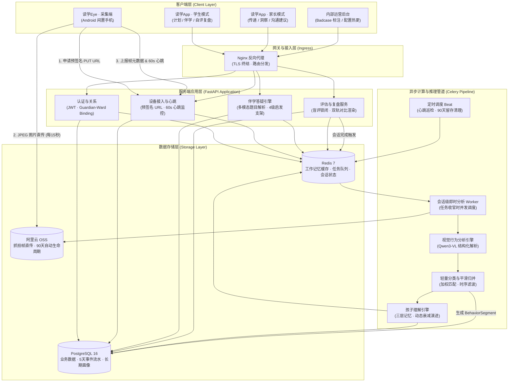

# 读学系统 — 全系统技术架构概览

> 版本 v3.0 | 本文档为读学系统（Duxue）的**系统级技术架构主文档**，涵盖：系统拓扑与四端分工、领域划分与限界上下文、数据流与会话即时分析管线、Guardian-Ward 关系与权限模型、以及合规与性能基线。

---

## 一、系统定位与四端组成

读学系统是一款基于 AI 视觉行为分析与大模型启发式伴学的智能成长平台。全系统遵循**“用户简单、方案简单、智能自动化”**三大设计原则，由以下四端协同构成：

```text
┌──────────────────────────────────────────────────────────────────────────────────┐
│                                     客户端层                                     │
├─────────────────────────┬────────────────────────────────────────────────────────┤
│   【读学Eye (duxue-cam)】 │                 【读学App (duxue-app)】                 │
│   Android 采集专用端     │                 Flutter 统一双角色客户端               │
│  (闲置手机架在书桌侧后方) │       ┌────────────────────────┬───────────────────────┐       │
│   · 稀疏抓拍 (15s/帧)    │       │   Ward (学生专属模式)  │ Guardian (家长专属模式)│       │
│   · 预签名直传 OSS       │       │   · 协商计划/沉浸伴学  │ · 任务传递/查看洞察   │       │
│   · 零本地 AI / 低功耗   │       │   · 4级启发答疑/即时盲评│ · 亲子沟通话术/设备健康│       │
│   · 本地持久化断网队列   │       │   · 双轨对比与专注锦囊 │ · 1-20监护人↔1-100学生│       │
│                         │       └────────────────────────┴───────────────────────┘       │
└────────────┬────────────┴───────────────────────────┬────────────────────────────┘
             │                                       │
     预签名PUT│直传 (不经API)                    REST/SSE│HTTPS API 交互
             ▼                                       ▼
┌──────────────────────────────────────────────────────────────────────────────────┐
│                         服务端与智能中枢 (duxue-server)                          │
├──────────────────────────────────────────────────────────────────────────────────┤
│ 1. 接入与设备管理：FastAPI · OSS 预签名签发 · 设备秒级心跳巡检与掉线告警         │
│ 2. 行为推理流水线：VLM 物理字段解析 ──▶ 分类层加权 ──▶ 时序平滑与片段归并         │
│ 3. 伴学与安全引擎：多模态题目解析 · 4 级启发支架 Prompt 编排 · 100% 安全拦截网关 │
│ 4. 孩子理解引擎：三层记忆架构 (短期工作 / 近5天事件 / 长期画像) · 时间半衰期衰减 │
│ 5. 存储与异步计算：PostgreSQL 16 · Redis 7 · Celery 异步会话处理池 · 阿里云 OSS │
└────────────────────────────┬─────────────────────────────────────────────────────┘
                             │
                             ▼ 内部运营与数据标注闭环
┌──────────────────────────────────────────────────────────────────────────────────┐
│                           内部运营后台 (duxue-admin)                             │
├──────────────────────────────────────────────────────────────────────────────────┤
│ 纯内部工具（免 B2B 复杂度）：Badcase 标注池 · 分类层原型配置热更 · 系统与模型监控 │
└──────────────────────────────────────────────────────────────────────────────────┘
```

| 端 / 模块 | 目录 | 角色定位 | 核心技术栈 | 职责与关键设计 |
|---|---|---|---|---|
| **读学Eye** | `duxue-cam/` | 物理采集端 | Kotlin · CameraX · Foreground Service · Room · OkHttp | 架设在书桌侧后方 45° 俯拍，每 15 秒抓拍一张 JPEG 预签名直传 OSS；零本地 AI、低功耗保活、断网本地 Room 队列暂存。 |
| **读学App** | `duxue-app/` | 统一用户端 | Flutter · Riverpod · go_router · fl_chart | 同一 App 内支持双角色平滑切换：Ward 侧专注伴学、4 级启发答疑、即时自评与双轨对比；Guardian 侧任务传递、客观洞察与睡前亲子沟通建议。 |
| **Server** | `duxue-server/` | 智能中枢与服务端 | FastAPI · PostgreSQL 16 · Redis 7 · Celery · OSS · Qwen3-VL | 会话级近实时行为分析管线、启发式答疑支架与安全拦截网关、三层孩子记忆模型、扁平 Guardian-Ward 绑定鉴权。 |
| **Admin** | `duxue-admin/` | 内部运维/算法工具 | React / Vue（待建设，轻量化） | 纯内部研发与算法运营工具：线上 Badcase 收集标注池、分类层配置在线热更、系统健康度大盘（无需外部机构 B2B SaaS）。 |

---

## 二、整体系统架构拓扑



---

## 三、领域划分与限界上下文（Bounded Contexts）

系统领域模型紧密围绕学生自制力养成与家庭良性互动展开，摒弃冗余的机构抽象：

```mermaid
graph LR
    subgraph IAM["🔐 身份与关系 (IAM & Binding)"]
        U[User 用户]
        GWB[GuardianWardBinding 绑定关系]
    end

    subgraph DEV["📷 设备管理 (Device)"]
        D[Device 采集设备]
        DT[DeviceToken 鉴权凭证]
    end

    subgraph CAP["🎞️ 帧采集 (Capture)"]
        F[Frame 图像元数据]
    end

    subgraph TUTOR["💡 伴学答疑 (Companion & Tutoring)"]
        TS[TutoringSession 答疑会话]
        HH[HintHierarchy 提示阶梯 L1-L4]
        IS[InterestSignal 临时好奇心信号]
    end

    subgraph ANA["🧠 行为分析 (Analysis)"]
        SF[StructuredFields 物理结构化字段]
        FP[FramePrediction 逐帧标签]
        BS[BehaviorSegment 时序平滑片段]
    end

    subgraph MEM["🧬 孩子理解与记忆 (Memory & Understanding)"]
        WM[WorkingMemory 短期工作记忆]
        EM[EpisodicMemory 近5天事件流水]
        LP[LongTermProfile 长期人物画像]
    end

    subgraph EVAL["📊 结果评估与复盘 (Evaluation & Reflection)"]
        SE[SelfEvaluation 盲评自评]
        CR[DualTrackReport 双轨对比报告]
        AT[ActionableTip 专注锦囊]
        DP[DialoguePrompt 亲子沟通话术]
    end

    IAM --> DEV
    IAM --> EVAL
    DEV --> CAP
    CAP --> ANA
    TUTOR --> MEM
    ANA --> EVAL
    MEM --> EVAL
    MEM --> TUTOR
    EVAL --> MEM
```



### 核心聚合与实体定义

1. **身份与绑定（`IAM & Binding`）**：
   - `User`：用户实体，区分 `guardian`（家长/监护人）与 `ward`（学生/被监护人）；
   - `GuardianWardBinding`：M:N 关联表，支持 1~20 个 Guardian 管理 1~100 个 Ward，包含 `relation_type`（父母/老师）与 `permission_level`（完全管理/只读）；
2. **设备管理（`Device`）**：
   - `Device`：绑定到具体 Ward 的闲置 Android 手机，持有专属 `device_token` 与最近心跳时间戳，独立于人类登录账号；
3. **采集与分析（`Capture & Analysis`）**：
   - `Frame`：图像帧元数据（`oss_key`, `captured_at`, `task_id`）；
   - `StructuredFields`：VLM 模型输出的物理客观描述（`body_pos`, `hand_action`, `desk_object`, `seat_status`）；
   - `FramePrediction`：分类层加权计算的单帧标签（学习/走神/离开）；
   - `BehaviorSegment`：经滑动窗口时序平滑与片段归并后的连续行为区间（如 19:10~19:35 专注解题 25 分钟）；
4. **孩子理解与记忆（`Memory`，纯系统智能层）**：
   - `WorkingMemory`：当前任务会话内的交互与实时卡点；
   - `EpisodicMemory`：滚动近 5 天的任务流水、学科卡点与自评事实；
   - `LongTermProfile`：长期专注耐力基线、成熟兴趣图谱与家庭沟通特征；
5. **评估与复盘（`Evaluation`）**：
   - `SelfEvaluation`：Ward 提交的主观盲评；
   - `DualTrackReport`：主客观并列时间轴报告；
   - `ActionableTip`：提炼的可执行专注锦囊（自动反哺计划引擎）；
   - `DialoguePrompt`：面向 Guardian 的睡前正向亲子沟通启发话术。

---

## 四、核心业务关系与权限模型（Guardian 1-20 ↔ Ward 1-100）

系统彻底剥离 B2B 机构与多租户隔离体系（全库无 `tenant_id`），直接采用直观、轻量且可水平扩展的 **Guardian-Ward M:N 绑定关系**：

```sql
-- 核心关系表：监护人与学生绑定关系
CREATE TABLE guardian_ward_bindings (
    id UUID PRIMARY KEY DEFAULT gen_random_uuid(),
    guardian_id UUID NOT NULL REFERENCES users(id) ON DELETE CASCADE,
    ward_id UUID NOT NULL REFERENCES users(id) ON DELETE CASCADE,
    relation_type VARCHAR(32) NOT NULL DEFAULT 'parent',     -- parent(父母), guardian(监护人), tutor(家教老师)
    permission_level VARCHAR(32) NOT NULL DEFAULT 'full',    -- full(排期/配置/复盘), readonly(仅看报告)
    created_at TIMESTAMPTZ NOT NULL DEFAULT NOW(),
    UNIQUE(guardian_id, ward_id)
);
CREATE INDEX idx_gwb_guardian ON guardian_ward_bindings(guardian_id);
CREATE INDEX idx_gwb_ward ON guardian_ward_bindings(ward_id);
```

### 极简 ACL 鉴权机制
服务端通过统一的依赖注入拦截器收口数据权限，杜绝越权访问：
```python
async def verify_ward_access(
    ward_id: UUID,
    current_user: User = Depends(get_current_user),
    db: AsyncSession = Depends(get_db)
) -> UUID:
    """统一学生数据访问鉴权依赖项"""
    if current_user.role == "ward":
        if current_user.id != ward_id:
            raise HTTPException(status_code=403, detail="无权访问其他学生数据")
    elif current_user.role == "guardian":
        is_bound = await check_guardian_ward_binding(
            db, guardian_id=current_user.id, ward_id=ward_id
        )
        if not is_bound:
            raise HTTPException(status_code=403, detail="未绑定该学生，无权访问")
    return ward_id
```

- **家庭场景（1~2 Guardian ↔ 1~3 Ward）**：App 顶部展示头像 Tab，左右滑动一键切换孩子；
- **小班/托管场景（少量 Guardian ↔ 几十个 Ward）**：App 提供学生下拉抽屉、按年级分组与拼音首字母快速检索。

---

## 五、关键数据流与时延架构（会话即时闭环）

系统推翻了传统的“次日早晨批处理”妥协，全面确立为**“会话结束触发（Session-Triggered）的近实时推理与即时自评管线”**：

```text
【20:30 今日任务全部完成 / 点击完成学习】
        │
        ├────────────────────────────────────────────────┐
        ▼ 【前台交互：30秒轻量盲评】                     ▼ 【后台异步计算：并发分析流水线】
 1. 弹出盲评卡片 (状态严格锁闭)                   1. Celery Worker 捞取该会话全部图像帧 (200~400帧)
 2. Ward 勾选：整体体感 + 卡壳感知                2. 并发调用 Qwen3-VL 提取物理结构化字段 (10~15s)
 3. Ward 点击“[ 提交自评，揭晓今日发现 ]”         3. 分类层加权 + 滑窗时序平滑 + 片段归并 (2~3s)
        │                                         4. 交叉比对伴学答疑卡点，生成归因与锦囊 (2s)
        │                                         │
        └───────────────────┬─────────────────────┘
                            │ (耗时重合：学生选完，后台已就绪！)
                            ▼
               【即刻渲染：双轨对比与专注发现】
                 - 上轨展示刚刚提交的主观盲评
                 - 下轨展示 AI 客观还原的真实行为时间轴
                 - 提炼 1 条行动锦囊并支持一键收入
                            │
                            ▼
               【Guardian 端当晚即时同步】
                 - 推送客观事实洞察 (用时、攻克难点、专注节奏)
                 - 附带睡前亲子沟通启发话术，当晚完成正向鼓励
```

### 端到端时延基线

| 交互环节 | 期望时延基线 | 实现保障与技术手段 |
|---|---|---|
| **抓拍单帧上传** | P90 < 1.5s | CameraX 静态抓拍，OSS 预签名 PUT 直传，不经 API 转发 |
| **启发答疑首字响应（TTFT）** | P90 < 1.2s | 流式 Server-Sent Events (SSE)，大模型流式输出与本地公式渲染 |
| **会话全量行为分析** | P90 < 20s | 会话触发并发批处理（`qwen3-vl-flash`），配合滑动窗口快速归并 |
| **自评提交后对比展开** | P95 < 1.0s | 盲评期间后台计算已就绪，前端流式动画展开，零感知等待 |
| **设备掉线告警推送** | 180s ~ 240s | 采集端 60s 心跳，服务端连续 3 分钟未响应自动触发离线推送 |

---

## 六、关键技术决策与架构取舍

```text
┌─────────────────────────────────────────────────────────────────────────────────┐
│ 1. 采集方式：15 秒稀疏抓拍单帧  vs.  持续视频流推流 (RTMP/WebRTC)                │
│    ▶ 决策：选用稀疏抓拍。传输带宽降低 95% (~80kbps)，闲置手机不发热、零风扇，   │
│            无需 SRS 流媒体服务器与复杂转码集群，架构复杂度降低一个量级。        │
├─────────────────────────────────────────────────────────────────────────────────┤
│ 2. 图像传输：OSS 预签名直传  vs.  业务 API 中转代理                             │
│    ▶ 决策：选用 OSS 预签名直传。二进制图片流直达 OSS，API 服务器仅处理轻量     │
│            元数据 JSON，单台廉价云主机即可轻松支撑数千台设备同时在线。          │
├─────────────────────────────────────────────────────────────────────────────────┤
│ 3. 端层计算：采集端零推理  vs.  端侧本地部署 NPU 模型                           │
│    ▶ 决策：端侧零推理。闲置低端手机算力有限，本地推理会导致严重发热并被杀进程； │
│            所有视觉解析收敛在服务端统一演进，模型升级无需强制更新客户端。        │
├─────────────────────────────────────────────────────────────────────────────────┤
│ 4. 隐私防线：侧后方 45° 俯拍机位  vs.  正脸人脸识别与视线追踪                   │
│    ▶ 决策：侧后方 45° 俯拍。物理规避人脸生物特征，图像天然脱敏；严禁向家长提供   │
│            实时监控直播，坚定维护“非监工”与保护未成年人心理安全的产品底线。      │
├─────────────────────────────────────────────────────────────────────────────────┤
│ 5. 租户模型：扁平 Guardian-Ward 关系  vs.  复杂多租户 SaaS 架构                 │
│    ▶ 决策：选用扁平直连模型。移除全库 tenant_id 冗余与 RLS 负担，全自服务 App   │
│            内闭环，完美适配 1~20 监护人到 1~100 学生的自组织学习与家庭场景。    │
└─────────────────────────────────────────────────────────────────────────────────┘
```

---

## 七、合规、安全与数据治理

1. **未成年人数据生命周期管理**：
   - 阿里云 OSS 桶配置生命周期规则，图像帧在上传 **90 天后自动物理擦除**（第一期用于模型微调训练积累）；
   - 服务端提取的 `structured_fields`、`frame_predictions`、`behavior_segments` 体积极小且无生物特征，长期保留；
   - 语音提问的音频切片在内存转写后，**24 小时内物理销毁**。
2. **防作弊与安全防护**：
   - Cam 端长效 `device_token` 由 Android Keystore 加密存储；
   - 预签名 PUT URL 限制 5 分钟有效、限制单文件 < 2MB 并绑定 Object Key；
   - 启发式答疑网关内设 4 级提示强约束，100% 拦截“直接要答案/整篇代写”等作弊请求。
3. **法定监护人知情与被遗忘权**：
   - Guardian 端提供透明的隐私管理看板，支持监护人依法行使“一键清除历史记忆”与“账号注销物理擦除”。

---

## 八、系统文档导航索引

- **产品架构与业务模块地图**：[`docs/product/ARCHITECTURE.md`](../product/ARCHITECTURE.md)
- **协商式计划 PRD**：[`docs/product/prd-schedule.md`](../product/prd-schedule.md)
- **伴学执行与启发答疑 PRD**：[`docs/product/prd-companion.md`](../product/prd-companion.md)
- **结果评估与复盘引导 PRD**：[`docs/product/prd-evaluate.md`](../product/prd-evaluate.md)
- **学习观察与行为采集 PRD**：[`docs/product/prd-supervise.md`](../product/prd-supervise.md)
- **孩子理解引擎与记忆系统 PRD**：[`docs/product/prd-memory.md`](../product/prd-memory.md)
- **服务端详细技术设计**：[`docs/technical/design-server.md`](design-server.md)
- **App端详细技术设计**：[`docs/technical/design-app.md`](design-app.md)
- **Cam端采集详细技术设计**：[`docs/technical/design-cam.md`](design-cam.md)
- **摄像设备接入与操作手册**：[`docs/camera-setup-guide.md`](../camera-setup-guide.md)
