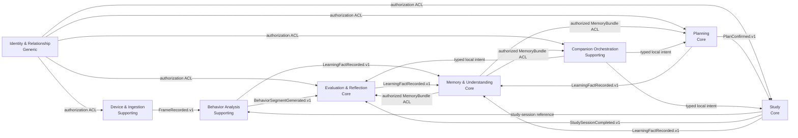
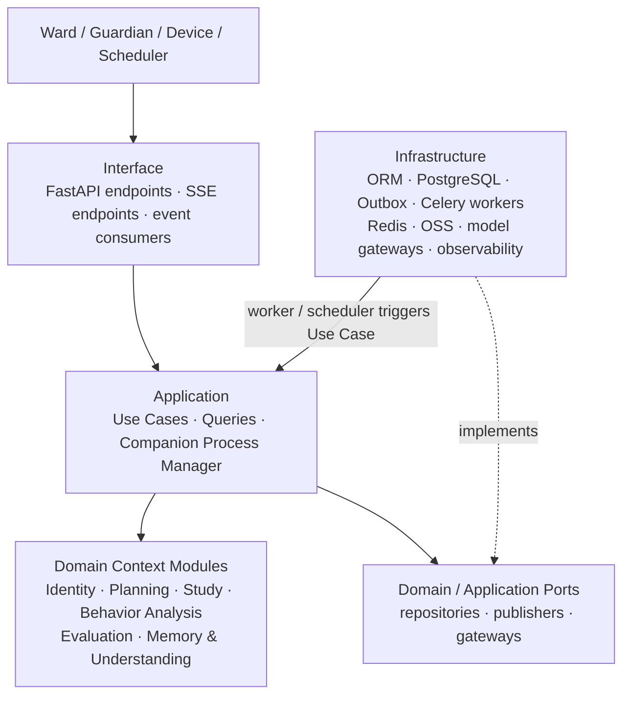

# 读学系统 — DDD 系统级 Overview

> 状态：讨论稿 · 版本：v1.0
> 目的：维护全系统的 Domain Inventory、Bounded Context Map、跨 Context 所有权和协作契约。
> 关联：[Server 系统与物理设计](design-server.md) · [Memory & Understanding Context](design-memory.md) · [Companion 编排](design-agent.md)

## 一、阅读边界与单一事实源

本文只回答“哪个业务能力由哪个 Context 拥有、它们如何协作”。它不定义数据库表、ORM、
队列、HTTP Controller、Aggregate 内部字段或部署拓扑。

| 内容 | 唯一归属文档 | 本文职责 |
|---|---|---|
| Domain Inventory、Context Map、跨 Context 所有权和稳定契约 | 本文 | 唯一维护 |
| Context 内的统一语言、Aggregate、用例、不变量、CQRS 和局部事件流 | 对应 Context 设计文档 | 链接，不复制 |
| 物理表、索引、外键、迁移与运行时组件 | [design-server.md](design-server.md) | 链接，不将其视为 Context 模型 |
| Agent 编排、Run 连续性与 Workflow 边界 | [design-agent.md](design-agent.md) | 链接 |

`Domain / Subdomain` 是业务问题空间的能力划分；`Bounded Context` 是某套统一语言、
模型和可变业务状态有效的边界。一个 Domain 可以由一个或多个 Context 实现；Context
不是表、微服务、页面或 AI Agent 的同义词。

## 二、Domain Inventory

| # | Domain / Subdomain | 类型 | Bounded Context | 拥有的可变业务概念 | 责任与非目标 | 上游 / 下游 | 集成 |
|---|---|---|---|---|---|---|---|
| 1 | 身份与监护关系 | Generic | Identity & Relationship | 身份、角色资料、Guardian-Ward 关系、凭据 | 认证并判定 Ward 访问权；不拥有学习业务状态 | 下游：全部业务 Context | 授权 ACL / 受权查询 |
| 2 | 设备接入与采集 | Supporting | Device & Ingestion | Device、采集帧元数据、设备健康 | 接入设备并记录可信采集；不解释学习行为 | 上游：Identity；下游：Behavior Analysis、Study | 受权 API；`FrameRecorded.v1` |
| 3 | 学习计划协商 | Core | Planning | Task、DailySchedule、PlanDraft | 形成并确认计划；不记录实际执行或理解结论 | 上游：Identity、Memory 查询；下游：Study、Memory | ACL；`PlanConfirmed.v1`、`LearningFactRecorded.v1` |
| 4 | 学习执行 | Core | Study | StudySession、执行区间、任务完成、TutoringSession 生命周期 | 记录实际开始、暂停、完成和答疑事实；不形成长期画像 | 上游：Planning、Identity；下游：Evaluation、Memory、Companion | `PlanConfirmed.v1`；`StudySessionCompleted.v1`、`LearningFactRecorded.v1` |
| 5 | 行为观察与分析 | Supporting | Behavior Analysis | 分析任务、FramePrediction、BehaviorSegment | 从采集事实生成受控观察结果；不判定 Ward 主观感受或长期能力 | 上游：Device & Ingestion、Study；下游：Evaluation、Memory | `FrameRecorded.v1`；`BehaviorSegmentGenerated.v1`、`LearningFactRecorded.v1` |
| 6 | 评估与复盘 | Core | Evaluation & Reflection | SelfEvaluation、DualTrackReport、ActionableTip、DialoguePrompt | 对照主客观结果并形成复盘建议；不回写计划或孩子画像 | 上游：Study、Behavior Analysis、Identity；下游：Memory、Planning | `StudySessionCompleted.v1`、`BehaviorSegmentGenerated.v1`；`LearningFactRecorded.v1` |
| 7 | 孩子理解 | Core | Memory & Understanding | Learning Evidence、EpisodicMemory、DerivedSignal、LongTermProfileView | 将已确认事实演进为可校正理解；不拥有计划、会话、报告或运行时状态 | 上游：Planning、Study、Evaluation、Behavior Analysis；下游：Companion、Planning、Evaluation | `LearningFactRecorded.v1`；受权 `MemoryBundle` 查询 ACL |
| 8 | 陪伴编排 | Supporting | Companion Orchestration | ConversationThread、AgentRunLink、运行编排状态 | 路由一次受权 Run 并保持会话连续性；不拥有 Planning、Study、Evaluation 或 Memory 的业务 Aggregate | 上游：Identity；下游：Planning、Study、Evaluation、Memory | ACL；本地 Use Case；受权查询 |

### 统一语言与所有权原则

- 每个可变业务概念只由其 owning Context 写入；其他 Context 只能持有 ID、消费稳定事件，或通过受权 Query 读取投影。
- `LearningFactRecorded.v1` 是跨 Context 的 Published Language；它不是任何 Context 的 Domain Event，也不是直接方法调用。
- `Working Memory` 是 Companion Runtime 的可恢复运行状态，不属于 Memory & Understanding 的写 Aggregate。
- 模型、VLM、Workflow 和 Worker 是 Interface / Application / Infrastructure 中的实现角色，不因名称成为 Domain 或 Context。

## 三、DDD Context Map

该图仅表达业务所有权、上下游方向与集成契约；不表达表、ORM、队列、Controller 或部署组件。

### 跨 Context 协作规则

1. 发布方在自己的 Use Case 和本地事务中变更自己的 Aggregate；若需跨 Context 通知，原子写入 Outbox 并发布版本化 Integration Event。
2. 消费方的 Consumer Adapter 只负责传输收取、版本验证、去重与重试；接收 Context 的 Use Case 将事件转换为本地业务意图，再改变自己的 Aggregate 或 Projection。
3. 不允许跨 Context 直接调用 Aggregate、Repository、ORM 或写入对方表；强一致只在单个 Context 的本地事务中要求。
4. 跨 Context 反应默认最终一致。每份事件契约必须指定版本、生产者、消费者、幂等键、顺序假设、重试、死信/对账和重放方式。
5. `Companion Orchestration` 是 Application 层 Process Manager 的所有者；它只路由受权 Run，不替业务 Context 作领域决策或跨 Context 写入。

## 四、稳定 Integration Event 契约目录

下表是契约目录，不替代接收方的用例卡或事件 payload schema。尚未实现的契约必须在实现前补足字段、版本兼容与失败处理。

| Integration Event | 生产 Context / 本地事实 | 消费 Context | 接收方本地意图 | 幂等与一致性 |
|---|---|---|---|---|
| `PlanConfirmed.v1` | Planning / `PlanConfirmed` | Study | 准备或校验可执行的任务计划 | `schedule_id + version`；最终一致 |
| `FrameRecorded.v1` | Device & Ingestion / 帧元数据已入账 | Behavior Analysis | 分析受控帧 | `frame_id`；可重试 |
| `BehaviorSegmentGenerated.v1` | Behavior Analysis / 片段已生成 | Evaluation & Reflection | 合并客观行为证据 | `study_session_id + segment version`；最终一致 |
| `StudySessionCompleted.v1` | Study / 执行会话已关闭 | Evaluation & Reflection | 启动或更新复盘材料 | `study_session_id + version`；最终一致 |
| `LearningFactRecorded.v1` | Planning、Study、Behavior Analysis、Evaluation & Reflection / 已确认学习事实 | Memory & Understanding | `IngestLearningFact` | `source_type + source_id + event_type + source_version`；重复无副作用 |

`MemoryBundle` 是受权查询结果，不是 Integration Event。调用方必须传入 actor、Ward、use case、可见性范围和预算；Memory Context 负责 ACL、脱敏与最小化投影。

## 五、Layered Architecture Map

该图表达代码和运行时依赖方向，与 Context Map 分开维护。它允许出现技术角色，但不重新定义业务所有权。

- Interface 不直接操作 Aggregate、Repository 实现或 ORM。
- Worker、Scheduler、Outbox、ORM、缓存和模型 Gateway 均是 Infrastructure；Worker 只能进入 Use Case。
- Application 协调授权、事务和 Port；Domain Context Modules 只承载聚合、值对象、领域服务、不变量和本地领域事件。
- 各 Context 的 Aggregate Map、触发矩阵、时序图和 Infrastructure Design Card 由对应 Context 详情页维护。

## 六、Context 详情入口

| Context | 详情文档 | 当前设计状态 |
|---|---|---|
| Memory & Understanding | [design-memory.md](design-memory.md) | 已有 Aggregate、触发矩阵和局部因果链；物理 Schema 对齐另行处理 |
| Companion Orchestration | [design-agent.md](design-agent.md) | 维护 Run/Coordinator 与目标 Workflow 边界 |
| 其他 Context | [design-server.md](design-server.md) 及其后续独立 Context 设计 | 本文已确定所有权；新增复杂写模型前须补各自详情设计 |
