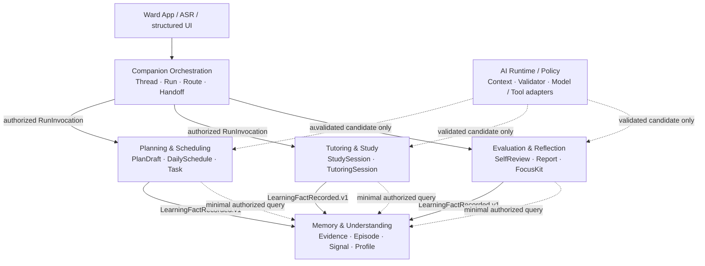
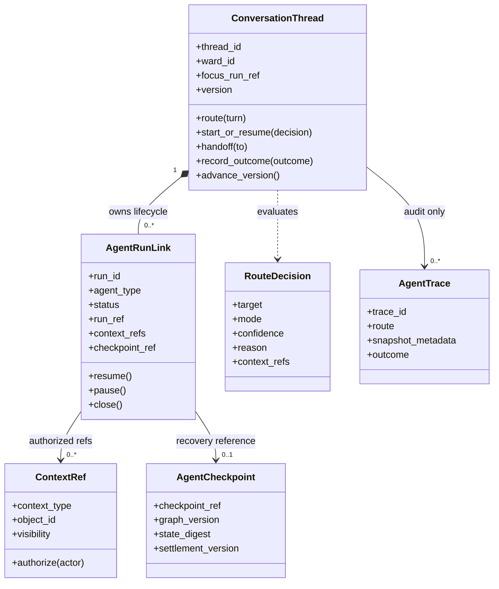
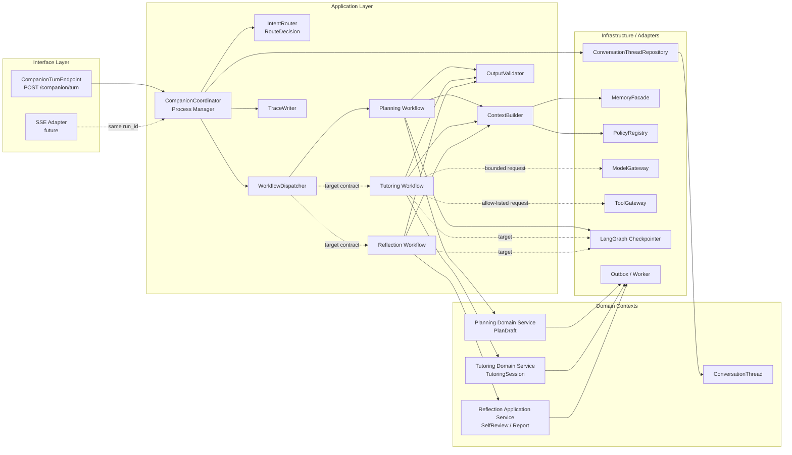
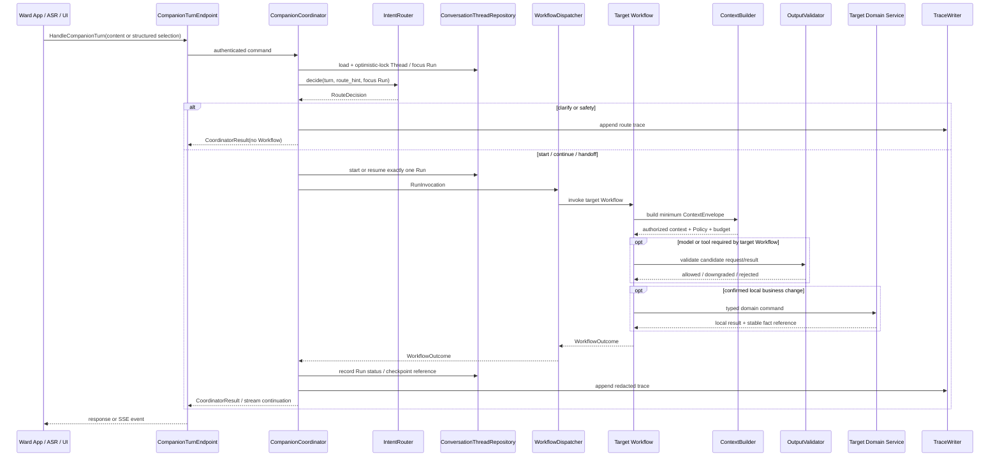
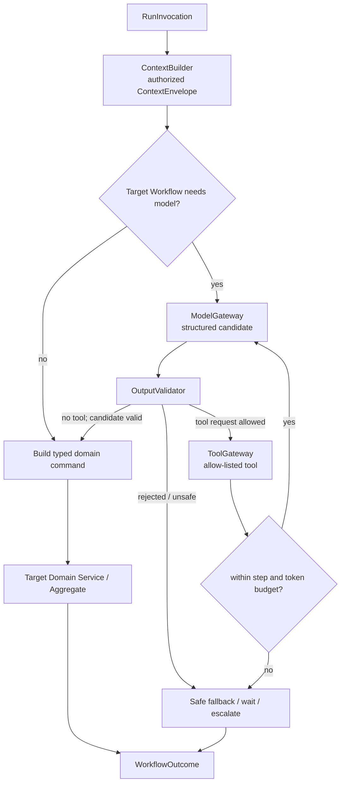
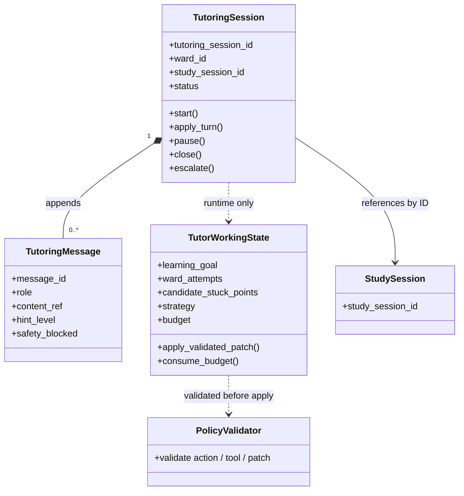

# 读学系统 — Companion Orchestration & Agent Design

> 状态：讨论稿 · 版本：v2.1
> 适用范围：`duxue-server` 的统一陪伴入口、受控 Agent Run、计划协商、启发式答疑、今日复盘与 AI Runtime。
> 关联：[Memory & Understanding Context](design-memory.md) · [服务端物理 Schema](design-server.md) · [计划 PRD](../product/prd-schedule.md) · [陪伴 PRD](../product/prd-companion.md) · [复盘 PRD](../product/prd-evaluate.md)

## 一、Domain Inventory 与 Context Map

本设计不把“Agent”当作拥有全部业务状态的领域模型。`CompanionCoordinator` 是应用层的 Process Manager：它按受控规则路由一轮输入、维护入口连续性，并把命令交给拥有业务不变量的 Context。模型、LangGraph、检索和 SSE 都是 Adapter / Runtime 能力。



全系统级 Context Map 应由系统 DDD Overview 唯一维护；本图只展示 Companion 的邻接边界。实线表示命令或稳定事实，虚线表示受权只读或候选能力；各 Context 不共享 Aggregate。

| Domain / Subdomain | 类型 | Bounded Context | 拥有的可变业务概念 | 与 Companion 的集成 |
|---|---|---|---|---|
| 计划与排程 | Core | `Planning & Scheduling` | `PlanDraft`、`DailySchedule`、`Task` | `RunInvocation` → 本地命令；发布 `LearningFactRecorded.v1` |
| 学习执行与答疑 | Core | `Tutoring & Study` | `StudySession`、`TutoringSession`、受控教学事实 | `RunInvocation` → 本地命令；发布学习事实 |
| 当日评估与复盘 | Supporting | `Evaluation & Reflection` | `SelfReview`、报告版本、行动采纳 | `RunInvocation` → 本地命令；发布学习事实 |
| 孩子理解与记忆 | Supporting | `Memory & Understanding` | Evidence Ledger、`EpisodicMemory`、`DerivedSignal`、Profile 投影 | `MemoryFacade.resolve_context()` 受权只读；消费学习事实 |
| 陪伴入口编排 | Supporting | `Companion Orchestration` | `ConversationThread`、Run 链接、路由/Handoff 审计 | 本地 Process Manager；不拥有其他 Context 的 Aggregate |
| AI Runtime / Policy | Generic | Runtime Adapter | Policy 版本、上下文装配、模型/工具调用、Trace | 只提出结构化候选；不能拥有领域业务状态 |

统一语言：**Thread** 是入口消息顺序与焦点，不是 Ward Memory；**Run** 是一次被路由的领域工作流引用，不是领域 Aggregate 的副本；**Handoff** 是 Ward 确认后的受控 Context 切换；**Fact** 是已确认的业务发生，**Trace** 只是运行审计，不能当作领域事件。

## 二、Companion Orchestration Context

### 2.1 边界与非目标

该 Context 的责任是：认证 Ward、乐观锁保护 Thread、按固定优先级产生 `RouteDecision`、开始/恢复一个 Run、记录最小审计信息，并将受权 `RunInvocation` 交给唯一目标 Workflow。

它不生成面向 Ward 的业务答案、不调用任意领域工具、不读取 Memory 表、不写计划/答疑/复盘状态，也不把多个 Agent 组织成可自由委派的网络。`clarify` 与 `safety` 是入口结果，不启动业务 Workflow。

路由优先级是：安全与权限 → 服务端验证的 `route_hint` → 当前 focus Run 的正常续接 → 明确单一意图 → 有限分类/澄清。一个输入含多个未指定优先级的业务意图时必须澄清；一个 Thread 在一轮内只有一个 Run 可持有回复权。

### 2.2 Aggregate：ConversationThread

`ConversationThread` 是入口连续性的强一致写边界。当前物理实现将 Run、Checkpoint、Trace 分表存储；领域上只有 Thread 负责校验版本和回复权，表结构不改变 Aggregate 的职责。



外部领域状态仅保留 `run_ref`，不得被复制进 Thread；Checkpoint 与 Trace 也不是工作记忆或 Learning Fact。

| 项目 | 设计 |
|---|---|
| Identity | `thread_id`；归属 `ward_id` |
| 内部 Entity | `AgentRunLink`（映射当前 `agent_runs` 的 Thread 内成员关系） |
| Value Object | `RouteDecision`、`RunInvocation`、`ContextRef`、`ThreadVersion` |
| 不变量 | Ward 只能访问自己的 Thread；`expected_thread_version` 必须匹配；每轮只启动/恢复一个 Run；`focus_run_ref` 只能指向本 Thread 未关闭的 Run；跨 Context 只传受权引用 |
| 行为 | `route(turn)`、`start_or_resume(decision)`、`handoff(to)`、`record_outcome(outcome)`、`advance_version()` |
| 领域事件 | Context 内可记 `RunRouted`、`RunHandedOff`；跨 Context 不发布它们。业务 Context 的稳定事实才发布 `LearningFactRecorded.v1` |
| Repository Port | `ConversationThreadRepository`（锁定 Thread 与保存 Run Link 的一体化端口） |

#### Entity Inventory

| 对象 | 类型与 Identity | 关键领域属性 | 主要领域方法 | 不变量职责 |
|---|---|---|---|---|
| `ConversationThread` | Aggregate Root；`thread_id` | `ward_id`、`focus_run_ref`、`version` | `route()`、`start_or_resume()`、`handoff()`、`advance_version()` | Thread 归属、乐观锁、单一回复权与合法 focus Run |
| `AgentRunLink` | Child Entity；`run_id` | `agent_type`、`status`、`run_ref`、`context_refs`、`checkpoint_ref` | `resume()`、`pause()`、`close()`、`can_continue(turn)` | 不允许跨 Ward/Thread 引用；状态转换必须由 Root 裁决 |
| `RouteDecision` | Value Object；无 Identity | `target`、`mode`、`confidence`、`reason`、`context_refs` | `is_startable()` | `clarify` / `safety` 不可创建 Run；原因必须可审计而非模型隐式推理 |
| `ContextRef` | Value Object；无 Identity | `context_type`、`object_id`、`visibility` | `authorize(actor)` | 只能表达已授权对象引用，不能携带领域状态或完整对话 |
| `AgentCheckpoint` | Infrastructure record；`run_id + checkpoint_ref` | `graph_version`、`state_digest`、`settlement_version` | `verify_compatible()` | 仅用于恢复图；不能存完整 Prompt 或成为第二份工作记忆 |
| `AgentTrace` | Audit record；`trace_id` | 路由、裁剪后的 snapshot 元数据、outcome、耗时 | `append()` | 不保存原始聊天全文、工具原文或模型隐式推理；不作为 Learning Fact |

`AgentRunLink` 的生命周期是 `active → waiting_for_ward / paused → closed`，安全升级可进入 `escalated`。它是入口编排状态；计划草稿、答疑会话和复盘结果的生命周期由各自 Context 定义。

### 2.3 Application Commands

| Command / Use Case | 授权与前置条件 | 本地事务 / 调用 | 幂等与失败语义 |
|---|---|---|---|
| `HandleCompanionTurn` | Ward 已认证；Thread 属于 Ward；版本匹配 | 锁定 Thread → 路由 → 仅创建/恢复一个 `AgentRunLink` → 写 Trace | 陈旧版本返回 `409`；多意图返回 `clarify`；不启动多个 Workflow |
| `ResumeAgentRun` | Run 是 focus 且本轮是正常续接 | 创建 `RunInvocation(resume_from_checkpoint=True)` | Graph/Policy 版本不兼容时不盲目恢复，返回重新审阅或澄清 |
| `HandoffRun` | Ward 或受验证 UI 已明确目标；原 Run 可暂停/结算 | 暂停/关闭原 Link，创建或恢复目标 Link | 不传完整状态；未经确认的跨领域意图返回澄清 |
| `RecordWorkflowOutcome` | Adapter 返回已校验 `WorkflowOutcome` | 更新 Run 状态/checkpoint 引用，追加 Trace | 重试不重复记录领域副作用；业务副作用由目标 Context 命令幂等保证 |

### 2.3.1 状态变更触发矩阵

`Companion Orchestration` 只拥有 Thread/Run 的状态；目标业务 Context 才拥有计划、
答疑和复盘的领域状态。因而一次 Turn 可能先同步改变 Thread/Run，再异步或同步地由
目标 Context 处理自己的命令；Coordinator 不能把自己的 `RunRouted` 当作对外业务事实。

| 触发与来源 | Adapter / 入口 | Application Command / Handler | Domain 调用与本地事务 | 本地领域事件 | Outbox / 后续动作 | 一致性、幂等与失败 |
|---|---|---|---|---|---|---|
| Ward 说话、输入或结构化 UI 选择 | `CompanionTurnEndpoint` / ASR Adapter | `HandleCompanionTurn` | load Thread → `route()` → `start_or_resume()` / `handoff()` → `advance_version()` | `RunRouted` / `RunHandedOff`，只限 Orchestration Context | 保存最小 Trace；发起一个 `RunInvocation` | Thread 乐观锁；`clarify/safety` 不创建业务 Run；一次只启动/恢复一个 Run |
| Ward 续接等待中的 Planning Run | Planning Workflow Adapter / checkpoint resume | `SavePlanDraft` 或恢复 Workflow | `PlanDraft.replace_items()` / `mark_needs_input()`；确认前不改正式计划 | `PlanDraftRevised`（本地） | 更新 `PlanDraftReviewView` 或等待 Ward | Run/checkpoint 和 draft version 均需匹配；重复恢复不重复产生正式副作用 |
| Ward 明确确认计划草稿 | 结构化 `ConfirmPlanDraft` UI command，不靠模型猜测 | Planning Application Service | load `PlanDraft` → `confirm()` → 同事务提交 `DailySchedule` / `Task` | `PlanDraftConfirmed`（本地） | 将稳定事实翻译为 `LearningFactRecorded.v1` 写入 Outbox | 基准版本、容量和已开始计划 guard；确认命令幂等或返回既有结果 |
| Ward 提问、提交尝试或选择教学动作 | Tutoring Workflow / typed UI directive | `StartOrResumeTutoring` / `ApplyTutorTurn` | `TutoringSession.start()` / `apply_turn()`；模型候选必须先过 Validator | `TutoringTurnApplied`（本地） | 只在被验证的学习发生后发布 `LearningFactRecorded.v1` | 会话归属、预算、工具白名单与安全 guard；模型拒绝只产生安全 Outcome/Trace |
| Ward 结束答疑会话 | Tutoring Workflow / close command | `CloseTutoringSession` | `TutoringSession.close()`，结算受控会话事实 | `TutoringSessionClosed`（本地） | 发布相关事实；Memory 异步将其归并为 `tutoring_episode` | 关闭后不可继续教学；Memory 不接收完整对话或 Runtime State |
| Ward 提交自评或采纳行动 | Reflection Endpoint / Workflow | `SubmitSelfReview` / `AdoptFocusKit` | `SelfReview.submit()` / Action service 本地行为 | `SelfReviewSubmitted` / `FocusKitAdopted`（本地） | 发布 `LearningFactRecorded.v1`；报告投影可补充 | 自评先落地，不等待异步视觉证据；补充只产生新版本 |
| 目标 Context 发布事实 | Outbox Consumer Adapter | Memory Context 的 `IngestLearningFact` Handler | Memory 自己的 Evidence Ledger / Aggregate 方法 | 属于 Memory Context 的事件 | 见 `design-memory.md` 的结算和投影链路 | 接收方校验 schema、幂等、ACL；绝不由 Coordinator 直接改 Memory 表 |

模型、工具和 Trace 都不是状态变更触发器：模型/工具只能提供经 `OutputValidator`
校验的候选，Trace 仅记录审计。强一致的 Thread/Run 规则由 Coordinator 在本地事务中
同步调用；跨 Context 的事实一律由发布方 Outbox 与接收方 Application Event Handler
衔接。

### 2.3.2 已确认业务结果到 Memory 的跨 Context 因果链

```mermaid
sequenceDiagram
    participant W as Ward UI
    participant E as CompanionTurnEndpoint
    participant C as CompanionCoordinator
    participant F as Planning / Tutoring / Reflection Workflow
    participant AH as Target Application Service
    participant AG as Target Aggregate
    participant O as Target Outbox
    participant CA as Memory Consumer Adapter
    participant MH as Memory IngestLearningFact Handler
    participant L as Memory Evidence Ledger

    W->>E: structured command or confirmed selection
    E->>C: HandleCompanionTurn
    C->>F: authorized RunInvocation
    F->>AH: typed local command
    AH->>AG: invoke domain behavior
    AG-->>AH: local Domain Event
    AH->>O: atomically save Aggregate + LearningFactRecorded.v1
    AH-->>F: WorkflowOutcome
    F-->>C: validated outcome
    C-->>E: Thread/Run response
    O-->>CA: deliver published fact
    CA->>MH: verified event envelope
    MH->>L: idempotent local evidence write
    Note over C,L: Coordinator never writes Memory; the receiving Context owns its local transaction.
```

### 2.4 Application Layer：Companion Agent 编排设计

本节描述的是实现组件和 use case 的协作关系，不是领域对象模型。`CompanionCoordinator`、`IntentRouter`、Workflow 与 Gateway 都不进入 Aggregate 的 Entity Inventory：它们编排命令、端口和生命周期，不能持有或绕过业务不变量。

#### 2.4.1 Application Component Map



依赖只能沿 Interface → Application → Domain Port / Infrastructure Adapter 方向流动。图中 `Planning Workflow` 是当前已接入的有限 Graph；虚线标为 `target` 的 Tutoring、Reflection、SSE、模型和工具链仍是目标契约，不能被当成已上线能力。

| Application Component | 输入 → 输出 | 负责 | 明确禁止 |
|---|---|---|---|
| `CompanionTurnEndpoint` | HTTP/SSE → `HandleCompanionTurn` | 鉴权、请求 Schema、协议响应 | 业务路由、模型调用、领域写入 |
| `CompanionCoordinator` | Command → `CoordinatorResult` | Thread 版本、Run 生命周期、Handoff、一次调用的编排 | 拼 Prompt、选择教学动作、直接改计划/答疑/复盘 |
| `IntentRouter` | Turn + UI hint + focus Run → `RouteDecision` | 固定优先级路由和澄清决策 | 领域查询、工具调用、面向 Ward 的业务回复 |
| `WorkflowDispatcher` | `RunInvocation` → `WorkflowOutcome` | 按 `agent_type` 选择唯一 Workflow，拒绝未知类型 | 决定领域不变量、跨 Context 直接写入 |
| `ContextBuilder` | Invocation + ContextSpec → `ContextEnvelope` | 经 `MemoryFacade` 取得最小授权上下文，解析预算/Policy | 直接读 Memory 表、返回完整档案或原始聊天 |
| `Planning/Tutoring/Reflection Workflow` | Envelope → 经校验候选 / 领域命令 | 编排模型、工具、确认和人机中断 | 直接写 ORM、调用另一 Workflow、篡改 Policy |
| `OutputValidator` | Model/Tool Result → `ValidatedResult` | Schema、证据、反代写、安全、工具和预算校验 | 凭自身决定业务结论或写入事实 |
| `TraceWriter` | 路由/上下文元数据/结果 → Trace | 可观测性与审计 | 保存 CoT、完整 Prompt、未裁剪的工具原文 |

`IntentRouter` 当前是纯规则实现，确实**不调用模型**。未来若有低置信度分类需求，只能由一个 `IntentClassifier` Adapter 产出受限的 `RouteDecision`；规则、安全与 UI hint 仍可覆盖它，Classifier 不得获得工具或领域写权限。

#### 2.4.2 一次 Turn 的 Application Sequence



说话、点击和卡片选择共享同一入口：语音先被 ASR 转为 `content`；确定性 UI 选择应映射为结构化 command 字段，而不是依赖模型猜测。当前 Planning 使用 `planning_items` 和 `planning_confirm`；后续应将这些收敛为类型化的 `PlanDraftPatch` / `ConfirmPlanDraft` 命令。答疑和复盘的选择同样应以 `session_directive`、`AdoptFocusKit` 等领域命令表达。

#### 2.4.3 Workflow 的模型与工具调用边界

`CompanionCoordinator` 编排的是“本轮交给哪个业务 Run”；目标 Workflow 才编排“本轮是否调用模型、工具或等待 Ward”。前者不应知道 Prompt，后者不应越过领域写入边界。



每个 Workflow 必须声明 `ContextSpec`、可用工具、最大模型调用次数、最大工具调用次数、token 预算、可恢复 checkpoint 版本和终止条件。模型只能输出严格 Schema 的候选；`OutputValidator` 通过后才可变成领域命令。`ToolGateway` 返回受限摘要，不能把原始外部结果无限追加进 Context。

#### 2.4.4 Application Ports 与签名

以下是目标端口；当前代码中的 SQLAlchemy / LangGraph 直接调用可逐步收敛为这些 Adapter 实现，不要求一次重写。

```python
class ConversationThreadRepository(Protocol):
    def load_for_update(self, thread_id: UUID, ward_id: UUID, expected_version: int | None) -> ConversationThread: ...
    def save(self, thread: ConversationThread) -> None: ...

class WorkflowDispatcher(Protocol):
    def invoke(self, invocation: RunInvocation) -> WorkflowOutcome: ...

class ContextBuilder(Protocol):
    def build(self, invocation: RunInvocation, spec: ContextSpec) -> ContextEnvelope: ...

class ModelGateway(Protocol):
    def complete(self, request: ModelRequest) -> ModelCandidate: ...

class ToolGateway(Protocol):
    def execute(self, request: ApprovedToolRequest) -> ToolResultSummary: ...

class OutputValidator(Protocol):
    def validate(self, candidate: ModelCandidate, envelope: ContextEnvelope) -> ValidatedResult: ...

class TraceWriter(Protocol):
    def append(self, trace: RedactedAgentTrace) -> None: ...
```

`PlanningWorkflowAdapter` 是当前 `WorkflowDispatcher` 的第一个实现：它负责 LangGraph 编译、Checkpoint 与 `interrupt/resume` 适配；它不拥有 `PlanDraft` 的领域规则。`PlanningDomainService` 的 SQLAlchemy 实现目前同时混合了 Application / Persistence 细节，后续可把持久化放入 Repository Adapter，但确认前后的不变量与事务语义必须保持不变。

#### 2.4.5 事务、Handoff 与失败边界

| 边界 | 强一致责任 | 允许的副作用 | 失败行为 |
|---|---|---|---|
| Coordinator transaction | Thread 所属、版本、唯一 Run、focus/handoff、最小 Trace | 保存 Thread / Run / Trace | 乐观锁冲突 `409`；不得留下半创建的第二个 Run |
| Target Context transaction | 本 Context Aggregate 的不变量 | 保存 Aggregate、稳定 Fact、Outbox | 业务冲突转为 `WorkflowOutcome`；不回滚其他 Context |
| Model / Tool call | 无领域事务 | 返回候选或受限工具摘要 | 超时、预算耗尽、未注册工具或安全拒绝走降级/等待/升级 |
| Outbox Consumer | Memory / Read Projection 最终一致 | 投影、异步结算 | 幂等重试、死信、Evidence Ledger 对账；不回写源 Aggregate |

Handoff 只在 Ward 明确确认、或受验证 UI 语义已明确时执行：原 `AgentRunLink` 必须先转为 `paused`、`waiting_for_ward` 或 `closed`；Coordinator 只传经 `ContextRef.authorize()` 的最小引用；目标 Workflow 再按自己的 ContextSpec 重建上下文。任何完整对话、完整 `TutorWorkingState` 或未验证模型推断都不得作为 Handoff payload。

## 三、跨 Context 编排与 CQRS

```mermaid
flowchart LR
    I[Ward input / UI command]
    C[CompanionCoordinator<br/>lock Thread · route · one Run]
    W[One target Workflow]
    A[Target Aggregate / Application Service]
    O[(Target Outbox)]
    M[Memory Consumer<br/>IngestLearningFact]
    E[(Evidence Ledger)]
    P[Episode / Signal / Profile projections]
    V[Ward-facing Query Views]

    I --> C -->|RunInvocation| W -->|typed local command| A
    C -. redacted trace .-> V
    A -->|same local transaction| O
    O -->|LearningFactRecorded.v1| M --> E --> P --> V
```



Thread/Run 更新在 Orchestration Context 内强一致；领域变更在目标 Context 本地事务中强一致；Learning Fact、Memory 与屏幕投影经 Outbox 最终一致。

### 3.1 Process Manager 边界

| 步骤 | 所有 Context | Trigger / 本地命令 / 发布事件 | 接收方 Application Handler | 一致性 | 失败与补偿 |
|---|---|---|---|---|---|
| 1 | Companion Orchestration | Ward 输入 → `HandleCompanionTurn` → `RouteDecision` | `CompanionCoordinator` | Thread 乐观锁强一致 | `409` 要求客户端刷新；`clarify/safety` 不创建 Run |
| 2 | 目标业务 Context | `RunInvocation` → 类型化目标命令 | 目标 Workflow / Application Service | 目标 Aggregate 本地事务 | 拒绝/冲突转为可展示的 `WorkflowOutcome`，不跨 Context 回滚 |
| 3 | 目标业务 Context | 本地 Domain Event → `LearningFactRecorded.v1` | 发布方 Application Service（写 Outbox） | Outbox 最终一致 | 发布失败保留待投递记录；不撤销已经提交的本地业务状态 |
| 4 | Memory & Understanding | Consumer Adapter 收到 `LearningFactRecorded.v1` | `IngestLearningFact` Handler | Memory 本地事务，后续投影最终一致 | 事件版本/idempotency key 重试、死信与对账；不回写上游 Aggregate |

`CompanionCoordinator` 可以决定**调用哪个** Context，但不能决定其领域规则。例如计划确认的容量、任务归属、版本冲突由 `PlanningDomainService` 及其 Aggregate 处理；答疑关闭和复盘报告版本同理。AI Runtime 产生的是经 Schema 校验的候选命令或展示内容，不能绕过该边界。

### 3.2 Query Models

| Query Model | 消费者 | 来源 | 新鲜度与限制 |
|---|---|---|---|
| `CompanionThreadView` | Ward 聊天入口 | Thread + Run Link 投影 | Thread 提交后强一致；只显示当前 Ward 的 Run 状态、下一步与可恢复引用 |
| `PlanDraftReviewView` | 计划协商界面 | `PlanDraft` 投影 | 草稿写入后强一致；确认前不得视为 `DailySchedule` |
| `TutoringTurnView` | 答疑界面 | Tutoring 会话 / Workflow Outcome | Run checkpoint 后可恢复；完整对话不作为跨 Context Query Model |
| `DailyReflectionView` | 复盘界面 | 自评、执行、报告版本投影 | 客观行为证据可异步补充；必须标注版本与证据到达时间 |
| `MemoryBundle` | ContextBuilder | `MemoryFacade` 聚合读 | 单次授权快照，item/token 预算裁剪；不用于写决策 |

## 四、目标 Context 的命令契约

### 4.1 Planning & Scheduling

`PlanDraft` 是计划协商的写 Aggregate；确认前不能修改 `DailySchedule` 或 `Task` 的正式状态。其详细领域模型应归属 Planning 文档；本设计只定义 Agent 调用契约。

| Command | Aggregate 行为 | 关键不变量 / 结果 |
|---|---|---|
| `SavePlanDraft` | `PlanDraft.replace_items()` | Ward 所属任务、任务字段与每日容量有效；记录 `base_schedule_version` |
| `ConfirmPlanDraft` | `PlanDraft.confirm()` + 本地计划提交 | 待补字段为空，基准版本未变，已开始计划不被覆盖；同事务写 `planning.confirmed` Fact 与 Outbox |

`PlanDraft` 是简单 Aggregate：它只由 Root 和不可独立寻址的 `PlanDraftItem` Value Object 组成，因此以以下 Inventory 替代内部 UML。

| 对象 | 类型与 Identity | 关键领域属性 | 主要领域方法 | 不变量职责 |
|---|---|---|---|---|
| `PlanDraft` | Aggregate Root；`draft_id` | `ward_id`、`plan_date`、`base_schedule_version`、`items`、`pending_fields`、`status`、`version` | `replace_items()`、`mark_needs_input()`、`confirm()` | 草稿归属、容量/字段完整性、版本基线与“确认前不改正式计划” |
| `PlanDraftItem` | Value Object；无 Identity | `assignment_id` 或 `new_task`、`title`、`planned_minutes`、`position` | `validate()` | 只能引用 Ward 的既有任务或是完整新任务；时长合法 |

当前实现已落地 Planning LangGraph Adapter：Graph 只执行“审阅草稿 → Ward `interrupt` 确认 → 调用 `PlanningDomainService`”的有限流程。它不是计划领域模型，也不应在 Graph 节点直接写表。

### 4.2 Tutoring & Study

答疑使用 `TutoringSession` 的领域生命周期与受限 ReAct。`TutorWorkingState` 是 Runtime 的可校正状态，不是 Aggregate，也不能被长期保存为 Ward 画像。



`StudySession` 只通过 ID 引用；`TutorWorkingState` 是有校验的 Runtime Value，不是子实体或长期记忆。

| 对象 | 类型与 Identity | 关键领域属性 | 主要领域方法 | 不变量职责 |
|---|---|---|---|---|
| `TutoringSession` | Aggregate Root；`tutoring_session_id` | `ward_id`、`study_session_id`、`subject`、`question_type`、`status`、`closed_at` | `start()`、`apply_turn()`、`pause()`、`close()`、`escalate()` | Ward 归属、会话状态、关闭后不可继续教学、教学事实必须经验证 |
| `TutoringMessage` | Child Entity；`message_id` | `role`、`content_ref`、`hint_level`、`safety_blocked`、`created_at` | `mark_safety_blocked()` | 由 Root 追加；保存的内容与提示级别必须通过 Policy / 输出校验 |
| `TutorWorkingState` | Runtime Value；无 Identity | `learning_goal`、`ward_attempts`、`candidate_stuck_points`、`strategy`、`budget`、`summary` | `apply_validated_patch()`、`consume_budget()` | 仅表达当前运行假设；可被新输入推翻，不能直接产生长期结论 |

| Command | Aggregate / Service | 结果 |
|---|---|---|
| `StartOrResumeTutoring` | `TutoringSession` | 建立/恢复受权会话与最小工作状态 |
| `ApplyTutorTurn` | Tutoring domain service | 校验教学动作、工具白名单、预算与状态 patch；记录 Ward 尝试、实际提示和检索事实 |
| `CloseTutoringSession` | `TutoringSession.close()` | 结算会话事实；异步形成 `tutoring_episode`，模型候选不能直接成为长期 Signal |

教学动作、工具调用、会话指令必须分离。模型最多提出主要教学动作、可选工具请求、`state_patch` 与 `session_directive`；Runtime / PolicyValidator 决定是否执行。触发反代写、未成年人安全、工具失败、预算耗尽或持续无进展时，返回安全降级、暂停或转交，而不是无限循环或代答。

### 4.3 Evaluation & Reflection

| Command | Aggregate / Service | 结果 |
|---|---|---|
| `SubmitSelfReview` | `SelfReview` | Ward 的感受与反思作为明确陈述保存 |
| `GenerateReflection` | Reflection application service | 基于锁定事实与证据版本输出即时复盘；不得把未到达视觉分析伪装为已知事实 |
| `PublishReflectionSupplement` | Report version service | 新证据到达后创建可追溯补充版本，不覆盖既有证据语义 |
| `AdoptFocusKit` | Action service | Ward 采纳行动写为事实，供后续 Memory 演进 |

`SelfReview` 是简单 Aggregate：以 `ward_id + review_date` 唯一，包含 `feeling`、`reflection`、`timeline` 与 `submitted_at`；其领域行为为 `submit()`。报告版本和 FocusKit 属于 Evaluation Context 的独立投影/行动模型，不应塞入 SelfReview 的原子不变量。

## 五、AI Runtime、Policy 与接口

### 5.1 Runtime 边界

`ContextBuilder` 必须通过 `MemoryFacade.resolve_context(request)` 获取最小 Memory Bundle；它不能直查 `learning_events`、记忆表或其他 Context Aggregate。ContextEnvelope 仅含本轮目标、受权对象引用、经过预算裁剪的证据/记忆、Policy 版本、工具白名单与 Trace ID。

`PolicyRegistry` 管理版本化教学、安全、反代写和隐私规则。`ModelGateway` 与 `ToolGateway` 是基础设施 Adapter。`OutputValidator` 校验 JSON Schema、证据引用、动作、工具权限、预算和安全边界；模型输出永远是建议或候选，不是领域事实。

### 5.2 内部类型与 API 签名

```python
class HandleCompanionTurn(BaseModel):
    thread_id: UUID | None = None
    expected_thread_version: int | None = None
    content: str
    route_hint: Literal["planning", "tutoring", "reflection"] | None = None

class RunInvocation(BaseModel):
    run_id: UUID
    thread_id: UUID
    ward_id: UUID
    agent_type: Literal["planning", "tutoring", "reflection"]
    turn: dict
    context_refs: list[str]
    resume_from_checkpoint: bool = False

class WorkflowOutcome(BaseModel):
    run_status: Literal["active", "waiting_for_ward", "paused", "closed", "escalated"]
    next_interaction: dict | None = None
    handoff_suggestion: Literal["planning", "tutoring", "reflection"] | None = None
    context_refs: list[str] = []

POST /companion/turn  -> HandleCompanionTurn -> CompanionThreadView
```

`POST /companion/turn` 仅接受 Ward 身份；`thread_id` 必须归属当前 Ward；`route_hint` 是经服务端验证的 UI 上下文，不是信任客户端的任意路由。当前实现对 Planning 可返回 Workflow interaction；Tutoring / Reflection 在各自 Runtime 落地前仍只返回受限 Run 元数据，不能假称为完整 AI 回复。SSE 开启后，流也必须绑定同一 `run_id`、Thread 版本、Policy 版本与可恢复位置。

### 5.3 基础设施与可观测性

| 组件 | 职责 | 禁止事项 |
|---|---|---|
| `ConversationThreadRepository` | Thread 乐观锁、Run Link、最小 Trace | 不查询或写其他 Context Aggregate |
| LangGraph Checkpointer | Graph interrupt / resume 状态 | 不取代 `AgentRun` 权威生命周期，不存完整 Prompt |
| MemoryFacade | 授权、visibility、时间窗、item/token 裁剪 | 不提供 Aggregate 写入口 |
| Outbox / Worker | 发布事实、更新 Memory / Projection | 不把 Trace 当作业务事件 |
| Trace | route、引用、Policy/模型版本、工具摘要、时延 | 不保存模型隐式推理、完整原始上下文或不受控工具结果 |

## 六、验收场景

```gherkin
Given Thread 的版本为 4，且 focus Run 是答疑
When Ward 以 expected_thread_version=4 提出“帮我安排明天复习”
Then Coordinator 创建或恢复一个 Planning Run，并暂停可暂停的答疑 Run
And 不复制答疑完整状态到 Planning Context

Given 两个未指定优先级的明确意图同时出现
When Ward 发送“这题不会，也帮我排明天”
Then Coordinator 返回 clarify
And 不启动多个 Workflow

Given PlanDraft 的 base_schedule_version 已过期
When Ward 确认计划草稿
Then Planning Context 返回重新审阅请求
And 不覆盖已变化的 DailySchedule 或 Task

Given 答疑 Workflow 输出未注册工具和可直接抄写的答案
When OutputValidator 校验该结果
Then Runtime 拒绝或降级该输出
And 不写入业务事实、Signal 或 Policy

Given Reflection 的客观行为证据尚未到达
When Ward 完成即时复盘
Then 返回的 ReflectionView 标注其证据版本
And 后续证据只能创建可追溯的补充版本
```

## 七、当前实现与演进

当前已实现：`ConversationThread` / `AgentRun` / Checkpoint / Trace 持久化、规则路由、`MemoryFacade`、`/companion/turn`，以及 Planning 的有限 LangGraph 审阅/确认 Adapter。当前未实现或应保持为目标契约：模型生成、通用 SSE、Tutoring 受限 ReAct、Reflection Workflow、跨 Context 事件消费者与完整 Policy 发布链。

实现顺序：先将 Planning 的 `PlanDraft` 生命周期完善为独立 Context 文档与测试；再落地 Tutoring 会话事实、有限 ReAct 与安全/反代写 Validator；随后实现 Reflection 的版本化报告；最后让各 Context 通过稳定 `LearningFactRecorded.v1` 完成 Memory 的异步闭环。每一步均不得扩大 Coordinator 的业务所有权。
