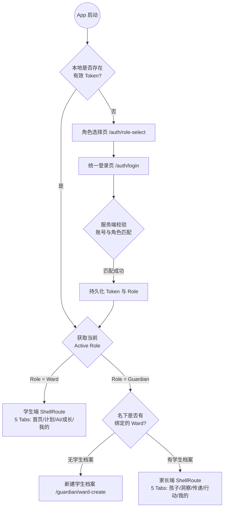
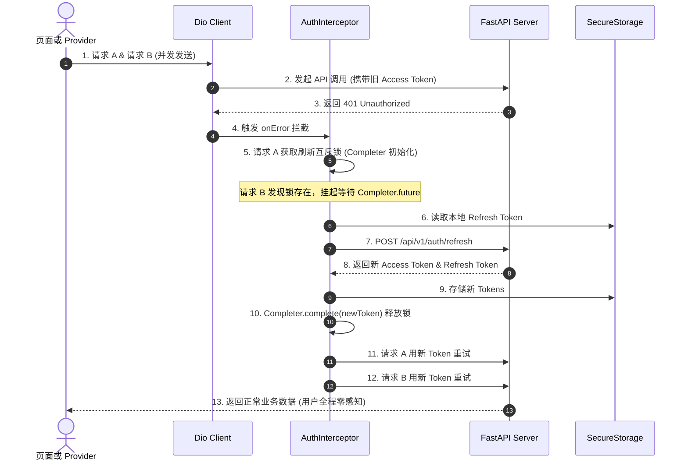

# 读学App — 端侧详细技术架构设计 (design-app.md)

> 版本：v3.0  
> 适用平台：iOS & Android (Flutter 3.x)  
> 核心技术栈：Flutter 3.x · Dart 3.x · Riverpod 2.x (CodeGen) · go_router · Dio · fl_chart · flutter_secure_storage · flutter_markdown · flutter_math_fork  
> 系统定位：读学系统的统一多端用户交互界面，支持 **Ward（学生模式）** 与 **Guardian（家长模式）** 严格隔离的双角色平滑切换。

---

## 〇、架构演进与核心设计目标

### 1. 单 App 双角色架构（Dual-Role Single App）
- **业务诉求**：学生与家长共用一个应用安装包，冷启动根据身份意图分流，登录后在同一 App 内严格隔离界面与权限；
- **技术实现**：基于 `go_router` 的 `StatefulShellRoute` 配合 Riverpod 动态状态机，实现 Ward 5 个 Tab（首页/计划/AI伙伴/成长/我的）与 Guardian 5 个 Tab（孩子/洞察/传递/行动/我的）的按需加载与上下文物理隔离。

### 2. 沉浸伴学与 4 级启发流式交互（Companion & Tutoring）
- **流式体验**：基于 `Server-Sent Events (SSE)` 实现大模型启发答疑的增量流式打字机输出；
- **排版支持**：集成 Markdown 与 LaTeX 数学公式渲染（`flutter_math_fork`），保证数理公式无缝排版且无界面抖动；
- **安全护栏**：毫秒级响应后端的防作弊拦截指令，动态受控于 L1~L4 阶梯提示。

### 3. 盲评锁闭与双轨对比手绘渲染（Dual-Track Timeline Engine）
- **自评锁闭**：完成今日任务后，前端强制锁闭 AI 客观行为数据，仅展示轻量 30 秒盲评卡片；
- **手绘引擎**：采用 Flutter `CustomPainter` 自研高性能双轨时间轴渲染器，实现上轨（主观体感）与下轨（AI 视觉行为片段）的精确微秒级对齐与点击联动。

### 4. 多监护人共管（Co-Guardian）与多 Ward 极速切换
- **学生切换**：支持 Guardian 名下 1~100 名学生的秒级滑动/检索切换；
- **共管同步**：支持一键生成 6 位邀请码/二维码，被邀请人扫码后本地状态全量自动就绪；主监护人后续新增学生时免重新扫码自动同步。

---

## 一、端侧技术选型与分层架构

### 1.1 核心技术选型矩阵

| 模块分类 | 选型组件 / 库 | 版本基线 | 决策理由与场景 |
|---|---|---|---|
| **核心框架** | Flutter SDK (Dart) | 3.22+ / Dart 3.4+ | iOS / Android 双端统一代码库，60fps 声明式 UI 渲染 |
| **状态管理** | `flutter_riverpod` + `riverpod_annotation` | 2.5+ | 强类型安全、无 context 依赖注入、天然支持 `AsyncValue` 异步三态 |
| **代码生成** | `build_runner` + `freezed` + `json_serializable` | 最新稳定版 | 不可变领域模型（Immutable Data）、深度拷贝与 JSON 序列化 |
| **声明式路由** | `go_router` | 14.0+ | 支持深链接（Deep Link）、多角色 ShellRoute 动态嵌套与重定向守卫 |
| **网络与流式** | `dio` + `dio_smart_retry` | 5.4+ | 拦截器链（JWT 自动刷新）、文件上传与 SSE 流式响应解析 |
| **安全存储** | `flutter_secure_storage` | 9.0+ | iOS Keychain 与 Android Keystore 系统级加密存储 Access/Refresh Token |
| **轻量键值存储**| `shared_preferences` | 2.2+ | 用户偏好（角色记忆、离线草稿、主题设置） |
| **图表可视化** | `fl_chart` | 0.68+ | 开源 MIT 协议，绘制自主度趋势、专注占比与成长雷达图 |
| **公式与文本** | `flutter_markdown` + `flutter_math_fork` | 最新版 | 伴学答疑中 Markdown 文本与 LaTeX 复杂公式（KaTeX 解析）无缝排版 |
| **二维码生成** | `pretty_qr_code` | 3.3+ | 生成设备绑定码与家庭共管邀请码，支持中心嵌入 App Logo |
| **图片缓存** | `cached_network_image` | 3.3+ | 题目抓拍与头像的二级磁盘/内存缓存，避免重复网络流量 |

---

### 1.2 Feature-First 架构与目录拓扑

项目采用严格的 **Feature-First + Clean Architecture** 组织结构，确保业务模块高内聚、低耦合：

```text
duxue-app/
├── lib/
│   ├── app.dart                     # MaterialApp.router 入口配置
│   ├── main.dart                    # 生产环境启动入口
│   │
│   ├── core/                        # 核心全局设施 (Core Layer)
│   │   ├── api/                     # Dio 实例、JWT 401 并发刷新拦截器、SSE 解析器
│   │   ├── storage/                 # SecureStorage、SharedPreferences 封装
│   │   ├── router/                  # go_router 配置与重定向守卫 (Guard)
│   │   └── theme/                   # 全局 Design System (颜色、字体、卡片规范)
│   │
│   ├── shared/                      # 跨模块共享组件 (Shared Layer)
│   │   ├── widgets/                 # 通用原子组件 (按钮、输入框、卡片、加载骨架)
│   │   ├── painters/                # 自研 CustomPainter (双轨对比时间轴)
│   │   └── formatters/              # 时间戳、时长、学科文案格式化
│   │
│   └── features/                    # 业务特性模块 (Feature-First)
│       ├── auth/                    # 认证：角色选择、手机登录、Token 维护
│       ├── ward_schedule/           # 学生端：协商计划、任务清单、AI排序
│       ├── ward_companion/          # 学生端：沉浸伴学、4级启发答疑、作弊拦截
│       ├── ward_evaluation/         # 学生端：30s盲评自评、双轨对比展开、锦囊采纳
│       ├── ward_growth/             # 学生端：自主度趋势图表、兴趣图谱、成长档案
│       ├── guardian_home/           # 家长端：多 Ward 切换抽屉、今日学情动态
│       ├── guardian_insights/       # 家长端：双轨日报、跨周期周报、专注模式分析
│       ├── guardian_pass/           # 家长端：作业与通知传递、多模态智能拆解
│       ├── guardian_action/         # 家长端：睡前正向沟通建议、协商发起
│       ├── guardian_coguardian/     # 家长端：共管邀请生成、扫码预览接受、成员治理
│       └── device/                  # 设备管理：闲置手机绑定码、60s心跳状态看板
```

---

## 二、双角色动态路由与鉴权状态机 (go_router + Riverpod)

### 2.1 状态机驱动的重定向守卫（Redirect Guard）

App 路由依据用户登录凭证与角色选择构建严格的状态跳转逻辑：



### 2.2 路由树与双 Shell 拓扑规范

系统路由结构分为三层：**公共认证层**、**角色专属 Shell 导航层**与**全屏沉浸业务层**：

| 路由层级 | 路由路径 | 对应组件 / 功能 | 访问控制约束 |
|---|---|---|---|
| **公共认证** | `/splash`<br>`/auth/role-select`<br>`/auth/login` | 闪屏页<br>角色选择页（我是学生 / 我是家长）<br>手机号密码统一登录页 | 公开访问；已登录用户访问自动重定向至对应角色主页 |
| **Ward Shell**<br>(5 Tabs) | `/ward/home`<br>`/ward/schedule`<br>`/ward/companion`<br>`/ward/growth`<br>`/ward/profile` | 学习行动首页<br>协商式计划任务清单<br>AI 启发伴学工作台<br>成长档案与自主度趋势<br>学生个人中心 | 仅 `Role = ward` 可访问；越权访问自动重定向至 `/ward/home` |
| **Guardian Shell**<br>(5 Tabs) | `/guardian/children`<br>`/guardian/insights`<br>`/guardian/pass`<br>`/guardian/action`<br>`/guardian/profile` | 孩子动态与多 Ward 切换<br>双轨日报与跨周期洞察<br>作业与学校通知传递<br>睡前正向沟通与协商<br>家长个人中心与共管成员 | 仅 `Role = guardian` 可访问；越权访问自动重定向至 `/guardian/children` |
| **全屏沉浸流** | `/ward/tutoring/:sessionId`<br>`/ward/evaluate/:scheduleId`<br>`/guardian/coguardian/invite`<br>`/guardian/coguardian/accept/:code` | 沉浸答疑全屏页（隐藏底部 Tab）<br>今日自评盲评全屏页<br>发起共管邀请全屏页<br>扫码接受共管邀请页 | 使用 `rootNavigatorKey` 挂载，覆盖底部导航栏 |

#### 路由守卫核心逻辑（精简伪代码）

```text
FUNCTION routerRedirectGuard(authState, targetPath):
    IF authState.isLoading THEN RETURN '/splash'
    
    // 1. 未认证状态
    IF NOT authState.isAuthenticated THEN:
        IF targetPath.startsWith('/auth') THEN RETURN null
        RETURN '/auth/role-select'
    
    // 2. 已认证用户的登录页重定向
    IF targetPath.startsWith('/auth') OR targetPath == '/splash' THEN:
        RETURN authState.role == 'ward' ? '/ward/home' : '/guardian/children'
        
    // 3. 角色越权物理隔离拦截
    IF authState.role == 'ward' AND targetPath.startsWith('/guardian') THEN:
        RETURN '/ward/home'
    IF authState.role == 'guardian' AND targetPath.startsWith('/ward') THEN:
        RETURN '/guardian/children'
        
    RETURN null // 放行
```

---

## 三、核心业务功能端侧技术实现

### 3.1 伴学答疑引擎：SSE 流式解析与 LaTeX 混排

#### 1. 架构流程与 SSE 消费
```text
[用户语音/拍照/文本提问] ──▶ POST /api/v1/companion/tutoring-sessions/{id}/ask
                                        │
                                        ▼ (返回 text/event-stream)
                  ┌───────────────────────────────────────────┐
                  │          SSEClient (流式事件拦截)          │
                  ├───────────────────────────────────────────┤
                  │ 1. event: "delta" ──▶ 增量追加 Markdown    │
                  │ 2. event: "level" ──▶ 切换 L1~L4 启发阶梯  │
                  │ 3. event: "blocked"─▶ 触发作弊拦截 UI 态   │
                  │ 4. event: "done" ──▶ 结束流式并持久化缓存  │
                  └───────────────────────────────────────────┘
```

#### 2. 流式 Markdown + LaTeX 混排渲染机制
- **双解析器语法扩展**：在 Markdown 解析管线中挂载自定义 LaTeX Inline (`$...$`) 与 Block (`$$...$$`) 语法解析器；
- **局部 AST 缓存**：流式打字期间仅重绘增量文本节点，避免整段公式频繁重构导致的界面重排闪烁；
- **公式回退降级**：当 KaTeX 解析异常时，自动安全回退为等宽纯文本源码展示，杜绝界面崩溃。

---

### 3.2 评估复盘：盲评锁闭与双轨对比时间轴手绘引擎

#### 1. 状态锁闭与自评先行交互
1. 当学生完成今日所有任务点击“完成今日学习”，页面全屏切换至盲评页；
2. **状态锁闭（Blind State）**：前端 Provider 拦截并隐藏所有 AI 客观行为数据；
3. 学生完成 30 秒主观体感勾选（顺利 / 卡壳 / 疲惫 / 分心）并提交自评；
4. 提交瞬间，触发报告数据解闭，以平滑展开动画（`AnimatedCrossFade`）揭晓双轨对比。

#### 2. 自研高性能双轨时间轴渲染引擎（`CustomPainter` 规范）

双轨时间轴需将时间线精确对齐并映射至屏幕像素坐标：

```text
┌────────────────────────────────────────────────────────────────────────┐
│                        双轨对比时间轴手绘布局规范                      │
├────────────────────────────────────────────────────────────────────────┤
│ 上轨：主观体感色块  [ 顺利 25min (湖蓝) ]──[ 卡壳 15min (橙色) ]       │
├────────────────────────────────────────────────────────────────────────┤
│ 中轴：时间参考中线  ── 19:00 ──────── 19:30 ──────── 20:00 ───────── │
├────────────────────────────────────────────────────────────────────────┤
│ 下轨：AI 客观行为   [ 专注解题 30min (绿) ]──[ 走神 5min (黄) ]──[离开]│
└────────────────────────────────────────────────────────────────────────┘
```

#### 坐标映射与渲染算法（精简伪代码）

```text
CLASS DualTrackTimelinePainter EXTENDS CustomPainter:
    INPUT: startTime, endTime, subjectiveList, objectiveList, trackHeight, trackGap

    METHOD paint(canvas, size):
        totalSeconds = (endTime - startTime).inSeconds
        IF totalSeconds <= 0 THEN RETURN
        
        pixelsPerSecond = size.width / totalSeconds

        // 1. 绘制上轨：主观体感色块
        FOR item IN subjectiveList:
            startX = (item.start - startTime).inSeconds * pixelsPerSecond
            widthX = (item.end - item.start).inSeconds * pixelsPerSecond
            canvas.drawRoundedRect(Rect(startX, 0, widthX, trackHeight), color=getSubjectiveColor(item.feeling))

        // 2. 绘制中轴时间参考虚线
        axisY = trackHeight + trackGap / 2
        canvas.drawDashedLine(Point(0, axisY), Point(size.width, axisY), color=Grey)

        // 3. 绘制下轨：AI 客观行为片段
        bottomY = trackHeight + trackGap
        FOR seg IN objectiveList:
            startX = (seg.start - startTime).inSeconds * pixelsPerSecond
            widthX = (seg.end - seg.start).inSeconds * pixelsPerSecond
            canvas.drawRoundedRect(Rect(startX, bottomY, widthX, trackHeight), color=getBehaviorColor(seg.label))
```

---

### 3.3 Guardian 端多 Ward 极速切换与共管（Co-Guardian）

#### 1. 多 Ward 状态架构与级联刷新
- 在全局持有 `currentWardProvider`，切换 Ward 时级联触发所有以 `wardId` 为入参的下游 Provider（日报、周报、任务传递、设备状态）自动刷新；
- 顶部导航支持两种交互形态：1~3 人使用横向滑动头像 Tab，4~100 人自动降级为带拼音搜索的下拉抽屉。

#### 2. 共管邀请码生成与扫码接收流程（精简伪代码）

```text
CLASS CoGuardianNotifier:
    // 1. 发起共管邀请 (生成 6 位短码/二维码)
    ASYNC METHOD createInvitation(wardIds, permissionLevel):
        response = POST('/api/v1/bindings/invitations', {ward_ids: wardIds, permission: permissionLevel})
        RETURN response.invite_code

    // 2. 扫码一键接受共管邀请
    ASYNC METHOD acceptInvitation(inviteCode):
        POST('/api/v1/bindings/invitations/accept', {invite_code: inviteCode})
        REFRESH(guardianWardsProvider) // 本地学生列表即刻全量就绪
```

---

## 四、网络层设计与认证生命周期

### 4.1 JWT 自动无感刷新与并发拦截器（AuthInterceptor）

为防止多个并发接口同时过期返回 401 导致重复调用 Refresh API，客户端采用 `Completer` 互斥锁机制：



#### 并发刷新锁算法（精简伪代码）

```text
CLASS AuthInterceptor EXTENDS Interceptor:
    VAR refreshLock = NULL // Completer<String>

    METHOD onError(error, handler):
        IF error.statusCode != 401 OR isAuthApi(error.path) THEN:
            RETURN handler.next(error)

        // 若已有刷新正在进行，挂起等待其完成后直接重试
        IF refreshLock != NULL THEN:
            newToken = AWAIT refreshLock.future
            RETURN retryRequest(error.requestOptions, newToken, handler)

        // 首个捕获 401 的请求获取互斥锁并执行刷新
        refreshLock = NEW Completer()
        TRY:
            refreshToken = AWAIT secureStorage.getRefreshToken()
            res = AWAIT dio.post('/api/v1/auth/refresh', {refresh_token: refreshToken})
            saveTokens(res.access_token, res.refresh_token)
            
            refreshLock.complete(res.access_token)
            RETURN retryRequest(error.requestOptions, res.access_token, handler)
        CATCH e:
            refreshLock.completeError(e)
            secureStorage.clearAll() // 刷新失败，广播退出登录
            RETURN handler.next(error)
        FINALLY:
            refreshLock = NULL
```

---

## 五、状态管理设计（Riverpod 2.x 响应式图谱）

```mermaid
graph TD
    subgraph GLOBAL_STATE["全局基础状态"]
        AUTH[authNotifierProvider<br/>UserRole, Tokens, LoginState]
        SECURE[secureStorageProvider]
        API[apiClientProvider]
    end

    subgraph WARD_STATE["Ward 学生状态图谱"]
        ACTIVE_TASK[activeTaskNotifierProvider<br/>当前执行任务/计时器]
        SCHEDULE[wardScheduleProvider(date)<br/>今日计划与待办列表]
        TUTOR_STREAM[tutoringStreamProvider(sessionId)<br/>伴学答疑实时流式状态]
        BLIND_EVAL[blindEvaluationNotifierProvider<br/>盲评卡片提交与状态锁闭]
        DUAL_TRACK[dualTrackReportProvider(scheduleId)<br/>主客观双轨复盘数据]
    end

    subgraph GUARDIAN_STATE["Guardian 家长状态图谱"]
        WARDS_LIST[guardianWardsProvider<br/>绑定的学生列表]
        CUR_WARD[currentWardNotifierProvider<br/>当前选中的学生 ID]
        DAILY_REPORT[guardianDailyReportProvider(wardId, date)<br/>双轨日报与时间轴]
        DIALOGUE_PROMPT[guardianDialoguePromptProvider(scheduleId)<br/>睡前正向沟通建议]
        DEVICE_STATUS[deviceStatusStreamProvider(wardId)<br/>60s 轮询/心跳指示]
        CO_GUARDIANS[coGuardiansProvider<br/>共管成员与管辖范围]
    end

    AUTH --> API
    API --> SCHEDULE & TUTOR_STREAM & BLIND_EVAL & DUAL_TRACK
    API --> WARDS_LIST & DAILY_REPORT & DEVICE_STATUS & CO_GUARDIANS
    WARDS_LIST --> CUR_WARD
    CUR_WARD --> DAILY_REPORT & DEVICE_STATUS & DIALOGUE_PROMPT
    BLIND_EVAL -- 提交成功后触发刷新 --> DUAL_TRACK
```

### 核心 Provider 规格清单

| Provider 名称 | 类型 | 入参 | 职责与生命周期 |
|---|---|---|---|
| `authNotifierProvider` | `Notifier<AuthState>` | 无 | 全局认证状态、角色持久化与退出注销 |
| `currentWardNotifierProvider` | `Notifier<Ward?>` | 无 | Guardian 模式下当前激活的学生实体 |
| `guardianDailyReportProvider` | `FutureProvider` | `wardId`, `date` | 按日期缓存拉取双轨复盘报告，自评提交后自动失效更新 |
| `deviceHeartbeatStreamProvider`| `StreamProvider` | `wardId` | 每 60 秒轮询设备在线、电量与单调时钟状态，异常时发红点提示 |
| `tutoringStreamProvider` | `StreamNotifier` | `sessionId` | 伴学问答 SSE 流式打字机控制器与 L1~L4 阶梯状态 |

---

## 六、性能基线、可观测性与安全合规

### 6.1 性能指标与流畅度基线 (SLO)

| 场景 / 交互环节 | 性能指标目标 | 架构保障手段 |
|---|---|---|
| **冷启动至首页渲染** | P90 < 1.2s | 按需懒加载路由与 Provider，启动期间异步预热 Dio 与 Storage |
| **页面路由切换** | 60 fps (无掉帧) | `StatefulShellRoute` 维持 Tab 实例树，避免重复初始化重建 |
| **双轨对比时间轴拖拽/缩放** | 60 fps (单帧 < 16ms)| 使用 `CustomPainter` 手绘，数据色块剔除（Culling），规避复杂 Widget 嵌套 |
| **LaTeX 公式流式渲染** | 增量打字时延 < 50ms | 语法树增量解析（AST Cache），避免每次输入全量重构 Markdown 树 |
| **App 内存占用基线** | 峰值 < 120 MB | `cached_network_image` 严格限制最大磁盘与内存缓存图幅（640×480） |

### 6.2 异常监控与可观测性体系
1. **统一错误边界与 Sentry 告警**：
   - 捕获 Flutter Framework 级未捕获异常（`FlutterError.onError`）与异步孤儿错误（`PlatformDispatcher.instance.onError`）；
   - 上报脱敏日志：仅携带 `trace_id`、错误堆栈、当前路由与设备型号，**绝不上报任何学生图像或私密对话文本**。
2. **离线与草稿容灾**：
   - 学生编写的自评心得与家长传递的信息，在输入过程中每隔 2 秒自动持久化至 `SharedPreferences` 临时草稿箱；
   - 遭遇意外断网或误触退出时，重新进入页面一键恢复草稿。

### 6.3 移动端隐私与未成年人安全防护
- **凭证安全**：长效凭证强制使用 `flutter_secure_storage`，禁止在 `SharedPreferences` 或 SQLite 中以明文形式保存 Token；
- **防截屏保护**：在伴学与自评页面启用 `flutter_windowmanager`（Android `FLAG_SECURE`）保护未成年人作业与试卷隐私；
- **无监控直播**：App 界面彻底屏蔽任何实时画面拉流播放器，从产品和技术底层杜绝“监工式实时偷看”。

---

## 七、全系统文档导航索引

- **全系统技术架构概览**：[`docs/technical/ARCHITECTURE.md`](ARCHITECTURE.md)
- **服务端详细技术设计**：[`docs/technical/design-server.md`](design-server.md)
- **用户与首页导航 PRD**：[`docs/product/prd-user.md`](../product/prd-user.md)
- **协商式计划 PRD**：[`docs/product/prd-schedule.md`](../product/prd-schedule.md)
- **陪伴执行与启发答疑 PRD**：[`docs/product/prd-companion.md`](../product/prd-companion.md)
- **结果评估与复盘引导 PRD**：[`docs/product/prd-evaluate.md`](../product/prd-evaluate.md)
- **学习观察与行为采集 PRD**：[`docs/product/prd-supervise.md`](../product/prd-supervise.md)
- **孩子理解引擎与记忆系统 PRD**：[`docs/product/prd-memory.md`](../product/prd-memory.md)
- **摄像端接入与操作手册**：[`docs/camera-setup-guide.md`](../camera-setup-guide.md)
- **全系统可观测性方案**：[`docs/observability.md`](../observability.md)
