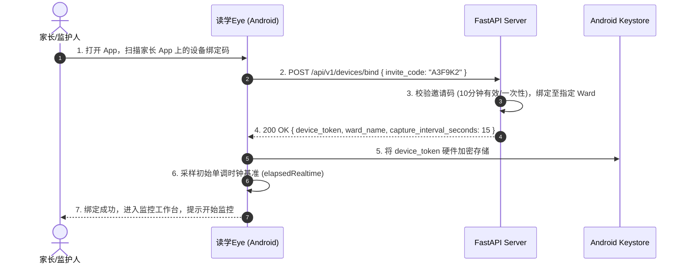
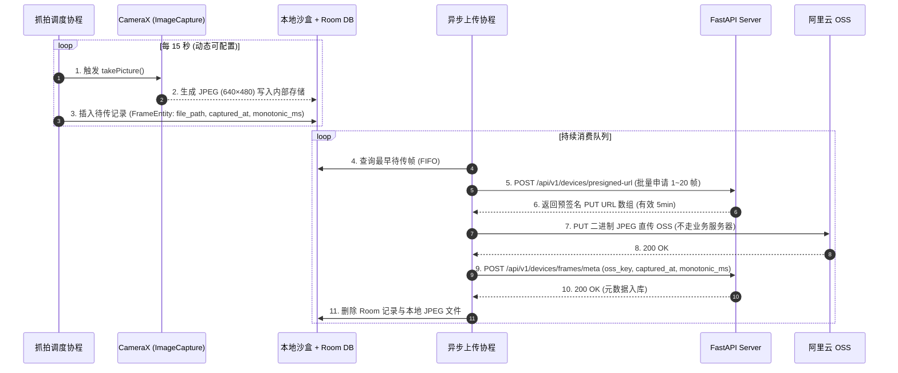

# 读学Eye（Cam App）— 端侧详细技术架构设计 (design-cam.md)

> 版本：v3.0  
> 适用平台：Android 8.0+ (API 26 ~ 34+)  
> 核心技术栈：Kotlin · Jetpack CameraX · Foreground Service · Room · WorkManager · OkHttp / Retrofit · Jetpack Compose · Android Keystore  
> 系统定位：读学系统的物理感知采集专用端，架设在书桌侧后方 45° 俯拍，负责低功耗稀疏抓拍、OSS 预签名直传、断网持久化队列与设备健康心跳。

---

## 〇、架构演进与核心设计原则

### 1. 抓拍直传而非持续推流（Sparse Capture vs. Streaming）
- **带宽与算力解放**：每 15 秒抓拍一张 640×480 JPEG，单设备上行带宽降至 ~80 kbps（比 720p 持续视频流降低 95%），闲置老旧手机零发热、零风扇噪音；
- **传输架构精简**：废弃 SRS 流媒体服务器、RTMP 编码管线与推流状态机，通过 OSS 预签名 PUT 直传，二进制图片流直达对象存储，不占用 API 网关带宽。

### 2. 端层极致轻量与零本地 AI（Zero-Inference Edge）
- **职责单一纯粹**：采集端不运行任何人形检测、姿态估计或边缘计算模型，避免因低端机算力不足导致的发热降频与进程被杀；
- **算法云端收敛**：所有 VLM 特征提取与行为分类收敛在服务端，模型升级客户端完全无感。

### 3. 机位内建物理隐私保护（Privacy by Physical Angle）
- **天然物理脱敏**：设备架设在学生侧后方 45° 略高于头顶俯拍，取景仅覆盖桌面、手部与上半身轮廓，**物理规避正脸**；
- **杜绝实时监工**：App 不提供实时视频推流能力，杜绝向监护人提供“实时监控直播画面”，坚定守护学生心理安全底线。

### 4. 离线韧性与断网容灾（Offline Resilience）
- **生产者-消费者完全解耦**：抓拍协程只负责写入本地 Room 数据库与沙盒存储，独立上传协程消费队列；断网期间抓拍不中断，网络恢复后按时间戳自动补传。

---

## 一、端侧技术选型矩阵

| 模块分类 | 选型组件 / 库 | 版本基线 | 决策理由与场景 |
|---|---|---|---|
| **开发语言** | Kotlin | 1.9+ / 2.0+ | Android 官方第一语言，原生协程（Coroutines）与 Flow 异步流支持 |
| **相机操作** | Jetpack CameraX | 1.3+ | 官方推荐相机库，屏蔽各厂商 Camera2 碎片化底层差异；单用例绑定 `ImageCapture` |
| **后台保活** | Foreground Service | `camera` 类型 | Android 8.0~14+ 后台使用摄像头的官方唯一合规机制，挂载常驻通知 |
| **资源锁** | WakeLock + WifiLock | Android SDK | `PARTIAL_WAKE_LOCK` 保证 CPU 锁屏不休眠；`WIFI_MODE_FULL_HIGH_PERF` 保证网络常连 |
| **本地离线队列** | Room Database | 2.6+ | SQLite 抽象层，持久化待上传帧元数据，支持断电/进程杀死后零丢帧 |
| **补传兜底** | Jetpack WorkManager | 2.9+ | 挂载 `NetworkType.CONNECTED` 约束，在服务被系统异常回收后于联网时自动拉起补传 |
| **网络请求** | OkHttp 4 + Retrofit 2 | 最新稳定版 | 支持 HTTP PUT 大文件直传、连接池复用与指数退避重试 |
| **凭证存储** | EncryptedSharedPreferences | Security-Crypto 1.1+ | 结合 Android Keystore 硬件级加密存储 `device_token`，防止明文提取 |
| **配置存储** | Jetpack DataStore | 1.1+ | 异步非阻塞存储抓拍间隔、单调时钟偏移量与运行偏好 |
| **UI 框架** | Jetpack Compose | 1.6+ | 声明式极简 UI，降低 APK 包体积与内存占用 |
| **二维码扫描** | ML Kit Barcode Scanning | 17.2+ | Google 本地离线识别模型，秒级扫描家长端绑定码 |

---

## 二、模块架构与目录拓扑

项目采用清晰的分层与职责划分：

```text
duxue-cam/
├── src/main/java/com/duxue/cam/
│   ├── service/                     # 前台采集核心服务 (Service Layer)
│   │   ├── CaptureService.kt        # Foreground Service 核心：生命周期、保活与状态分发
│   │   ├── CaptureScheduler.kt      # 15s 定时调度器 (基于协程单调时钟)
│   │   └── SystemLockManager.kt     # WakeLock / WifiLock 的安全申请与释放
│   │
│   ├── capture/                     # 视觉采集模块 (Capture Layer)
│   │   ├── CameraXManager.kt        # ImageCapture 用例封装、Session 管理与 JPEG 输出
│   │   └── MonotonicClock.kt        # SystemClock.elapsedRealtime 采集与时钟校正
│   │
│   ├── upload/                      # 上传与离线队列 (Upload & Queue Layer)
│   │   ├── UploadQueueManager.kt    # Room 队列管理者 (入队、出队、容量超限 FIFO 淘汰)
│   │   ├── DirectOssUploader.kt     # 申请预签名 URL ──▶ PUT 直传 OSS ──▶ 提交元数据
│   │   └── BackfillWorker.kt        # WorkManager 联网兜底补传作业
│   │
│   ├── data/                        # 数据与持久化层 (Data Layer)
│   │   ├── db/                      # Room 实体 (FrameEntity) 与 DAO
│   │   ├── repository/              # 设备配置与本地文件存储 Repository
│   │   ├── api/                     # Retrofit 接口定义 (Bind, Presigned, Meta, Heartbeat)
│   │   └── security/                # Android Keystore 凭证安全存储
│   │
│   ├── receiver/                    # 系统广播接收器 (Receiver Layer)
│   │   └── BootCompletedReceiver.kt # 开机广播：检查绑定状态并下发常驻点击恢复通知
│   │
│   └── ui/                          # 极简 UI 展现层 (Jetpack Compose)
│       ├── bind/                    # 扫码与输码绑定页
│       ├── monitor/                 # 运行状态仪表盘 (已上传数、队列积压、一键开关)
│       └── calibration/             # 45° 俯拍机位校准页 (临时开启 Preview 辅助调角)
```

---

## 三、核心业务流程与时序架构

### 3.1 一次性邀请码绑定与 Keystore 凭证颁发



---

### 3.2 抓拍、预签名直传与元数据上报（解耦管道）

抓拍与上传采用**双独立协程并发管道**，互不阻塞：



#### 管道解耦核心控制（精简伪代码）

```text
CLASS FramePipeline:
    // 生产者：固定 15s 定时抓拍入队
    ASYNC METHOD startCaptureLoop(intervalSeconds):
        WHILE isRunning:
            imageBytes = AWAIT cameraManager.takePicture()
            monotonicMs = SystemClock.elapsedRealtime()
            filePath = saveToInternalStorage(imageBytes)
            
            roomDb.frameDao.insert(FrameEntity(filePath, now(), monotonicMs))
            AWAIT delay(intervalSeconds * 1000)

    // 消费者：持续拉取待传帧直传 OSS
    ASYNC METHOD startUploadLoop():
        WHILE isRunning:
            pendingFrames = roomDb.frameDao.getOldestPending(limit=10)
            IF pendingFrames IS EMPTY THEN:
                AWAIT delay(2000)
                CONTINUE

            urls = AWAIT api.getPresignedUrls(count=len(pendingFrames))
            FOR (frame, presignedUrl) IN zip(pendingFrames, urls):
                AWAIT okHttp.putDirectToOss(presignedUrl, frame.filePath)
                AWAIT api.submitFrameMeta(frame.ossKey, frame.capturedAt, frame.monotonicMs)
                
                deleteFile(frame.filePath)
                roomDb.frameDao.delete(frame)
```

---

### 3.3 断网离线队列、容量淘汰与 WorkManager 兜底

为确保设备在家庭 Wi-Fi 抖动或断网时稳定工作，端侧设计了严格的容灾与容量上限控制：

```text
┌────────────────────────────────────────────────────────────────────────┐
│                        离线队列容量治理与淘汰规则                      │
├─────────────────────┬──────────────────┬───────────────────────────────┤
│ 规则指标            │ 阈值设定         │ 触发动作                      │
├─────────────────────┼──────────────────┼───────────────────────────────┤
│ **队列帧数上限**    │ 2,000 张         │ 约覆盖 8.3 小时连续断网数据   │
├─────────────────────┼──────────────────┼───────────────────────────────┤
│ **存储容量上限**    │ 500 MB           │ 防止占满闲置手机内部存储沙盒  │
├─────────────────────┼──────────────────┼───────────────────────────────┤
│ **超限淘汰策略**    │ FIFO 淘汰最旧帧  │ 删除最早未上传记录及对应文件，│
│                     │ (Drop Oldest)    │ 优先保障最近行为数据的完整性  │
├─────────────────────┼──────────────────┼───────────────────────────────┤
│ **进程被杀兜底**    │ WorkManager      │ 注册 NetworkType.CONNECTED    │
│                     │ 周期任务         │ 约束，联网时自动唤醒补传积压帧│
└─────────────────────┴──────────────────┴───────────────────────────────┘
```

---

### 3.4 60 秒心跳上报与单调时钟时间戳防篡改校正

#### 1. 独立存活心跳（Heartbeat）
- **存活信号解耦**：抓拍上传不能作为存活信号（若画面全黑或网络阻塞可能无帧上传）。`CaptureService` 独立开启每 60 秒定时器执行 `POST /api/v1/devices/heartbeat`，携带当前电量百分比、网络状态与队列积压数；
- **服务端超时判定**：服务端连续 180 秒（3次心跳周期）未收到心跳即判定设备 `offline`，触发向家长端推送离线告警。

#### 2. 单调时钟时间戳防篡改校正（Monotonic Clock Sync）
- **问题**：客户端系统时间（Wall Clock）可能因用户手动修改、时区错误或 NTP 未同步而出现跳变；
- **解决机制**：
  1. 抓拍时记录 Android 单调时钟 `SystemClock.elapsedRealtime()`（设备开机后单调递增，无法被用户修改）；
  2. 设备首次绑定及每次心跳时，服务端记录 `(ServerTime, MonotonicTime)` 锚点；
  3. 服务端计算时间偏移：\( \text{RealCapturedAt} = \text{ServerAnchor} + (\text{MonotonicTime} - \text{MonotonicAnchor}) \)；
  4. 彻底杜绝时间篡改导致的行为时间轴错乱。

---

## 四、Android 系统保活与前台服务合规 (Android 14+)

闲置手机长期挂机采集的最大的挑战在于应对 Android 系统的激进杀后台策略：

### 4.1 前台服务合规声明 (Android 14+ 适配)
- 在 `AndroidManifest.xml` 中严格声明 `android:foregroundServiceType="camera"` 并申请 `FOREGROUND_SERVICE_CAMERA` 权限；
- 在 `Service.onCreate()` / `onStartCommand()` 中必须在 **5 秒内调用 `startForeground()`**，挂载常驻通知栏（通知文案展示“读学Eye 正在守护专注中”，附带今日抓拍总数及停止按钮）。

### 4.2 硬件与系统资源锁（WakeLock & WifiLock）
```text
CLASS SystemLockManager:
    METHOD acquireLocks(context):
        // 1. CPU 保活：防止锁屏后 CPU 进入深度休眠中断协程调度
        wakeLock = PowerManager.newWakeLock(PARTIAL_WAKE_LOCK, "DuxueCam:CaptureCpuLock")
        wakeLock.acquire()

        // 2. WiFi 高性能锁：防止锁屏时 WiFi 芯片降频或休眠断网
        wifiLock = WifiManager.createWifiLock(WIFI_MODE_FULL_HIGH_PERF, "DuxueCam:UploadWifiLock")
        wifiLock.acquire()

    METHOD releaseLocks():
        IF wakeLock.isHeld THEN wakeLock.release()
        IF wifiLock.isHeld THEN wifiLock.release()
```

### 4.3 开机自启合规化改造（通知引导路径）
- **系统限制**：Android 12+ 严禁后台启动 Service；Android 14 明确禁止在 `BOOT_COMPLETED` 广播中直接启动 `camera` 类型前台服务（会抛出 `ForegroundServiceStartNotAllowedException`）；
- **合规降级方案**：
  ```text
  [手机开机] ──▶ BootCompletedReceiver 收到广播
                         │
                         ▼
             检查本地是否存在有效 device_token
                         │
                         ├──【存在】──▶ 弹出高优先级系统通知：「读学Eye 已就绪，点击开始监控」
                         │             (用户点击通知从 Activity 合规启动前台服务)
                         └──【不存在】─▶ 忽略广播
  ```

### 4.4 相机 Session 保持与低功耗策略
- **Session 常开策略**：相机绑定 `ImageCapture` 用例后保持 Session 常开，避免每 15 秒重复初始化相机硬件带来的百毫秒延迟与机械磨损；
- **预览通道物理关闭**：日常采集模式下**坚决不绑定 `Preview` 用例**，关闭 GPU 渲染通道与屏幕显示，功耗降低 70%，手机持续运行不发热。

---

## 五、极简 UI 与机位校准交互 (Jetpack Compose)

App 仅保留 3 个极简页面，遵循“架好即忘（Set and Forget）”原则：

```text
┌────────────────────────────────────────────────────────────────────────┐
│                          读学Eye 界面与状态流转                        │
├───────────────────┬────────────────────────────────────────────────────┤
│ 页面名称          │ 核心功能与交互规范                                 │
├───────────────────┼────────────────────────────────────────────────────┤
│ **1. 绑定配置页** │ - 首次打开展示：ML Kit 极速取景扫码框 + 手动 6 位输码│
│    (BindScreen)   │ - 扫码成功自动存储 Token 并引导去架设机位          │
├───────────────────┼────────────────────────────────────────────────────┤
│ **2. 监控工作台** │ - 核心大卡片：显示已绑定 Ward 姓名（如：小宇）     │
│  (MonitorScreen)  │ - 运行状态指示灯（🟢 采集正常 / 🟡 断网排队中 / 🔴 异常）│
│                   │ - 统计数据：今日已传帧数、本地积压帧数、心跳延迟    │
│                   │ - 底部巨大「开始/暂停监控」控制按钮                │
├───────────────────┼────────────────────────────────────────────────────┤
│ **3. 机位校准页** │ - 临时动态绑定 CameraX `Preview` 用例辅助取景      │
│ (CalibrationPage) │ - 屏幕叠加 45° 辅助虚线框（指引包含桌面与手部，避开正脸）│
│                   │ - 调节完毕退出页面即刻销毁 `Preview` 节省电量      │
└───────────────────┴────────────────────────────────────────────────────┘
```

---

## 六、API 接口对接规范 (RESTful Client)

所有请求通过 HTTPS 进行，以 `Authorization: Bearer <device_token>` 作为身份凭据（绑定接口除外）：

| 接口端点 | Method | 请求参数 / Body | 响应结构 | 触发时机与调用频率 |
|---|---|---|---|---|
| `/api/v1/devices/bind` | `POST` | `{ "invite_code": "A3F9K2" }` | `{ "device_token": "...", "ward_name": "小宇", "capture_interval_seconds": 15 }` | 首次扫码绑定时调用 1 次 |
| `/api/v1/devices/presigned-url` | `POST` | `{ "count": 10 }` | `{ "urls": [{ "oss_key": "...", "upload_url": "https://oss..." }] }` | 批量上传前申请，URL 5分钟有效 |
| `{upload_url}` | `PUT` | `JPEG 二进制流` (`Content-Type: image/jpeg`) | `200 OK` (OSS 响应) | 拿到 URL 后直传 OSS，**不走后端服务器** |
| `/api/v1/devices/frames/meta` | `POST` | `[{ "oss_key": "...", "captured_at": "...", "monotonic_ms": 123456 }]` | `{ "success_count": 10 }` | 帧直传 OSS 成功后批量提交元数据 |
| `/api/v1/devices/heartbeat` | `POST` | `{ "battery_level": 85, "network_type": "WIFI", "pending_queue_count": 0, "monotonic_ms": 123456 }` | `{ "server_time": "..." }` | 每 60 秒定期上报存活心跳 |

---

## 七、性能指标与稳定性基线 (SLO)

| 场景 / 指标项 | 目标基线 | 技术保障手段 |
|---|---|---|
| **单帧抓拍与入库延迟** | P90 < 200ms | CameraX 后台异步生成 JPEG，直接写入内部私有目录 |
| **单帧预签名上传完成** | P90 < 1.5s | 阿里云 OSS 就近 CDN 加速上传，预签名直连 |
| **单设备持续运行功耗** | 功耗 < 1.2W (不插电可运行 6h+) | 零端侧 AI、常闭 Preview 屏幕、纯单张定时抓拍 |
| **连续挂机无故障时间 (MTBF)** | > 72 小时连续运行无崩溃 | 资源锁（WakeLock/WifiLock）、`START_STICKY` 服务自动重启 |
| **断网补传丢包率** | 0% (队列上限内) | Room 持久化事务保证，网络恢复后顺序重试 |
| **敏感凭证防泄漏** | 硬件级安全 (Keystore) | `device_token` 存入加密沙盒，禁止明文导出 |

---

## 八、全系统文档导航索引

- **全系统技术架构概览**：[`docs/technical/ARCHITECTURE.md`](ARCHITECTURE.md)
- **服务端详细技术设计**：[`docs/technical/design-server.md`](design-server.md)
- **App 端详细技术设计**：[`docs/technical/design-app.md`](design-app.md)
- **学习观察与行为采集 PRD**：[`docs/product/prd-supervise.md`](../product/prd-supervise.md)
- **摄像设备接入与操作手册**：[`docs/camera-setup-guide.md`](../camera-setup-guide.md)
- **全系统可观测性方案**：[`docs/observability.md`](../observability.md)
