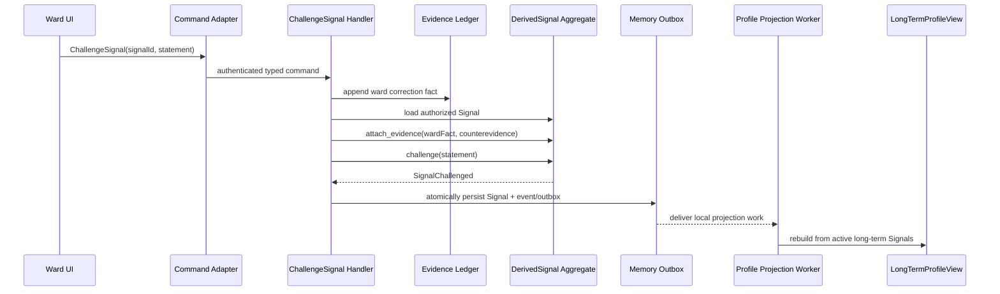

# 读学系统 — Memory & Understanding Bounded Context

> 状态：讨论稿 · 版本：v2.1
> 适用范围：`duxue-server` 中 Ward 学习证据、情境记忆、可校正理解与长期画像投影。
> 关联：[陪伴编排](design-agent.md) · [服务端物理 Schema](design-server.md) · [记忆 PRD](../product/prd-memory.md)

## 一、边界、上下游与统一语言

本 Context 的责任是把其他业务 Context 已确认的学习事实，转换为可追溯、可校正、最小化召回的理解；它不拥有计划、任务、答疑会话或报告的业务状态，也不让模型直接写入事实、画像或 Policy。

[打开本地 Context Map](diagrams/design-memory-context-map.html)（[图源](diagrams/design-memory-context-map.json)）。这是 Memory 的邻接 Context 图；全系统 Context Map 应由未来的系统级 DDD Overview 唯一维护。

| 术语 | Context 内定义 | 所有权 |
|---|---|---|
| Learning Fact | 已确认、不可变、可定位来源的学习发生事实 | 上游 Context 产生；Memory 持久化证据副本 |
| Learning Event | `learning_events` 中的事实证据实体，不是 Event Sourcing | Memory Evidence Ledger |
| Episodic Memory | 近 5 天内可召回的具体经历摘要 | Memory |
| Derived Signal | 有证据、置信度、状态与有效期的可校正理解 | Memory |
| Long-Term Profile | Active 长期 Signal 的可重算读模型 | Memory Query Side |
| Working Memory | 当前 Run 的可恢复运行状态 | Companion Runtime，不是本 Context 写 Aggregate |

上游 Planning、Study 与 Evaluation Context 通过版本化 `LearningFactRecorded.v1` 发布稳定事实；Memory Consumer 以来源四元组 `source_type + source_id + event_type + source_version` 幂等落入 Evidence Ledger。下游 Companion 只能通过 `MemoryFacade` 查询受授权的 `MemoryBundle`。跨 Context 不共享 Aggregate，也不直接改写彼此业务表。

## 二、领域模型与 Aggregate

[打开 Aggregate Map](diagrams/design-memory-aggregate-map.html)（[图源](diagrams/design-memory-aggregate-map.json)）。既有 [数据流图](diagrams/design-memory-dataflow.html) 仍是本 Context 的 Command–Event–Projection Flow。

### 2.1 Learning Evidence：不可变证据实体

`LearningEvent` 是 Evidence Ledger 的 append-only 实体，不是 Aggregate Root，也不取代上游业务主表。其稳定字段为 `ward_id`、`event_type`、`occurred_at`、`scope`、`source`、`confidence`、`payload`、`evidence_refs`、`visibility` 与 `retention_policy`。`source` 只能是 `ward`、`guardian`、`system` 或 `cam`；服务端 VLM/归并结果以 `system` 写入并带 `confidence`。

### 2.2 EpisodicMemory Aggregate

| 项目 | 设计 |
|---|---|
| Identity | `memory_type + aggregate_id + aggregate_version` |
| 内部 Entity | `EpisodicMemoryEvidenceLink`，关联多个 `LearningEvent` |
| Value Object | `TutoringEpisodePayload`、`Outcome`、`DecayWindow` |
| 不变量 | 摘要必须关联至少一条证据；同一证据不得重复关联；原始对话不复制入摘要 |
| 行为 | `settle()`、`attach_evidence()`、`archive()` |
| 领域事件 | `EpisodicMemorySettled`、`EpisodicMemoryArchived` |
| Repository Port | `EpisodicMemoryRepository` |

`tutoring_episode` 是该 Aggregate 的逻辑类型：保存受控题目引用、Ward 可观察尝试、实际支持、结果与下一步；其幂等键为 `tutoring_episode + tutoring_session_id + session_version`。

#### 2.2.1 Internal UML 与 Entity Inventory

[打开 EpisodicMemory 内部领域模型](diagrams/design-memory-episodic-internal.html)（[图源](diagrams/design-memory-episodic-internal.json)）。图中只包含本 Aggregate 的领域对象；`LearningEvent` 位于 Evidence Ledger，只通过 ID 引用。

| 对象 | 类型与 Identity | 关键领域属性 | 主要领域方法 | 不变量职责 |
|---|---|---|---|---|
| `EpisodicMemory` | Aggregate Root；`memory_type + aggregate_id + aggregate_version` | `ward_id`、`memory_type`、`aggregate_ref`、`summary`、`event_date`、`decay_window`、`archived_at` | `settle(payload)`、`attach_evidence(event_id, role)`、`archive(now)` | 原子保证至少一条证据、证据去重、受控摘要不复制原始对话，并决定何时归档 |
| `EpisodicMemoryEvidenceLink` | Child Entity；`episodic_memory_id + learning_event_id` | `learning_event_id`、`evidence_role`、`linked_at` | `matches(event_id)` | 无独立写入口；由 Root 判断重复并维护链接生命周期 |
| `TutoringEpisodePayload` | Value Object；无 Identity | `subject`、`skill_keys`、`ward_attempts`、`support_given`、`next_step`、受控题目引用 | `validate()`、`with_outcome(outcome)` | 构造时保证字段受控、可解释且不含原始逐字对话 |
| `Outcome` | Value Object；无 Identity | `result`、`observed_at`、`confidence` | `validate()` | 结果必须带可观察时间与置信度，不把推测伪装成事实 |
| `DecayWindow` | Value Object；无 Identity | `hot_until`、`expires_at`、`policy_version` | `contains(at)`、`is_expired(at)` | 时间窗口合法，且衰减策略可追溯到版本 |

这里的“属性”是会影响领域决策、生命周期或不变量的状态，不是 `episodic_memories` 的逐列 ORM 映射；持久化字段仍以 `design-server.md` 为准。

### 2.3 DerivedSignal Aggregate

| 项目 | 设计 |
|---|---|
| Identity | `ward_id + signal_type + scope + dimension_key` |
| 内部 Entity | `SignalEvidenceLink`，带 support / counterevidence / ward_confirmation 角色 |
| Value Object | `SignalValue`、`SignalScope`、`SignalStatus`、`Confidence`、`ValidityWindow` |
| 不变量 | 每个 Signal 有证据；Candidate 不可作为确定结论；只有 `long_term + active` 可投影 Profile |
| 行为 | `propose()`、`activate()`、`challenge()`、`expire()` |
| 领域事件 | `SignalProposed`、`SignalActivated`、`SignalChallenged`、`SignalExpired` |
| Repository Port | `DerivedSignalRepository` |

[打开 DerivedSignal 生命周期图](diagrams/design-memory-signal-lifecycle.html)（[图源](diagrams/design-memory-signal-lifecycle.json)）。晋升门槛由版本化 Policy 计算：独立会话数、证据可靠度、时间衰减、Ward 确认与反证。模型只能提出 Candidate。

受控 `signal_type` 为：`focus_endurance_baseline`、`estimation_bias`、`knowledge_gap`、`effective_strategy`、`stable_interest`、`planning_preference` 与 `reflection_accuracy_trend`。每种 `value` 需保留样本数、窗口与计算方法；不得将具体卡点描述为能力或人格标签。

#### 2.3.1 Internal UML 与 Entity Inventory

[打开 DerivedSignal 内部领域模型](diagrams/design-memory-signal-internal.html)（[图源](diagrams/design-memory-signal-internal.json)）。`SignalEvidenceLink` 是可区分、可追溯的子实体；它不拥有也不复制 `LearningEvent`。

| 对象 | 类型与 Identity | 关键领域属性 | 主要领域方法 | 不变量职责 |
|---|---|---|---|---|
| `DerivedSignal` | Aggregate Root；`ward_id + signal_type + scope + dimension_key` | `ward_id`、`signal_type`、`scope`、`dimension_key`、`status`、`confidence`、`policy_version` | `propose(evidence)`、`attach_evidence(event_id, role)`、`activate(policy)`、`challenge(statement)`、`expire(now)` | 原子保证每项结论有证据、Candidate 不作为确定结论、只有 `long_term + active` 可进入 Profile |
| `SignalEvidenceLink` | Child Entity；`derived_signal_id + learning_event_id + role` | `learning_event_id`、`role`、`linked_at`、`note` | `matches(event_id, role)`、`is_counterevidence()` | 无独立写入口；由 Root 保持支持、反证与 Ward 确认的语义和去重 |
| `SignalValue` | Value Object；无 Identity | `value`、`sample_size`、`window`、`calculation_method` | `validate_controlled_value()` | 每个值必须说明样本、窗口和方法，不能把单次表现写成稳定特质 |
| `SignalScope` | Value Object；无 Identity | `time_horizon`、`subject`、`scenario` | `is_long_term()` | Scope 与受控信号类型兼容，决定是否具备画像候选资格 |
| `Confidence` | Value Object；无 Identity | `score`、`basis` | `meets(threshold)` | 分数在合法范围，且不可脱离证据基础解释 |
| `ValidityWindow` | Value Object；无 Identity | `observed_from`、`expires_at` | `contains(at)`、`is_expired(at)` | 有效期不能早于观察起点；到期后不可维持 Active |

`SignalStatus` 是有限状态 Value Object（`candidate`、`active`、`challenged`、`expired`）；允许的转换及其 Policy guard 以生命周期图为唯一说明，不在 Application Service 中以 if/else 复制。

### 2.4 Domain Services

`SignalEvolutionService` 只计算晋升、反证、衰减和到期资格；`EpisodicSettlementPolicy` 只决定哪些相关事实可结算为同一情境。两者不处理 HTTP、鉴权、事务、Worker 调度或 ORM。

## 三、Command Side / Application Use Cases

| Command / Use Case | Actor 与前置条件 | 事务与 Aggregate | 结果与幂等 |
|---|---|---|---|
| `IngestLearningFact` | 已认证上游 Consumer；事件版本受支持 | 幂等写 `LearningEvent` Evidence Ledger | 重复来源四元组无副作用；失败进入重试/对账 |
| `SettleEpisodicMemory` | Outbox Worker；相关事实已到达 | 写一个 `EpisodicMemory` 与证据链接 | 发布 `EpisodicMemorySettled`；按聚合版本幂等 |
| `ProposeCandidateSignal` | 受控 Worker；证据与类型受 Policy 校验 | 写一个 `DerivedSignal` | Candidate 不能直接改变 Profile |
| `ChallengeSignal` | Ward 纠正服务；Ward 可见且有权限 | 调用 `signal.challenge()` | 追加反证链接并发布 `SignalChallenged` |
| `EvolveSignals` | 每日 Worker | 逐个加载 Signal 并调用领域行为 | 状态变化发布事件；可重试 |
| `RebuildLongTermProfile` | Projection Worker | 不修改 Signal Aggregate | 从 Active 长期 Signal 完整覆盖 Profile View |

Application Service 负责授权、命令形状、事务、Repository 与 Outbox；领域规则只在 Aggregate 或 Domain Service 中执行。上游业务 Context 只发布 `LearningFactRecorded.v1`，不直接调用这些写 Use Case。

### 3.1 状态变更触发矩阵

这里的事件有两种严格不同的含义：`LearningFactRecorded.v1` 是**跨 Context
Integration Event**；`EpisodicMemorySettled`、`SignalActivated` 等是本 Context
Aggregate 产生的 **Domain Event**。前者由接收方的 Application Event Handler
转译成本地命令；后者在本地事务提交后才可被投影、同 Context Worker 或 Outbox
处理，不能绕过 Application 层直接改表。

| 触发与来源 | Adapter / 入口 | Memory Application Command / Handler | Domain 调用与原子边界 | 本地领域事件 | 后续 Outbox / Projection | 一致性、幂等与失败 |
|---|---|---|---|---|---|---|
| Planning、Study、Evaluation 发布 `LearningFactRecorded.v1` | Consumer Adapter 验证 transport/schema 后投递 | `IngestLearningFact` 校验版本、来源四元组与 ACL | 仅幂等追加 `LearningEvent` Evidence Ledger；它不是 Aggregate mutation | 无；事实入账不是伪造的 Aggregate Event | 标记可被结算 Worker 处理 | 四元组唯一；未知 schema 死信/人工对账；重复投递无副作用 |
| 会话关闭、关联事实到达或周期性结算窗口 | Scheduler / Outbox Worker | `SettleEpisodicMemory` 选择同一 `aggregate_ref` 的证据并开启本地事务 | `EpisodicSettlementPolicy.decide()` → load/create `EpisodicMemory` → `attach_evidence()` → `settle(payload)` | `EpisodicMemorySettled` | 同 Context 结算/信号 Worker；更新 `EpisodicMemoryView` | 以 `memory_type + aggregate_ref + aggregate_version` 幂等；失败重试并可由 Ledger 重放 |
| 已结算的情境、或受控证据窗口达到候选阈值 | Local Domain-Event Dispatcher / Worker | `ProposeCandidateSignal` | `SignalEvolutionService` 计算资格 → load/create `DerivedSignal` → `propose()` / `attach_evidence()` | `SignalProposed` | 更新 Candidate View；**不**更新 Profile | Policy/version 和 Signal identity 幂等；候选失败不影响 Evidence Ledger |
| Ward 明确纠正 / 否认 | 受权 API / UI Command Adapter | `ChallengeSignal` 先把 Ward 陈述记录为可追溯证据，再处理命令 | load Signal → `attach_evidence(ward_fact, counterevidence)` → `challenge(statement)` | `SignalChallenged` | Profile Worker 移除其 Active 长期投影 | Ward、visibility、Signal 归属必须校验；重复命令按 evidence role 去重 |
| 每日衰减或新证据改变资格 | Scheduler / Worker | `EvolveSignals` | `SignalEvolutionService.evaluate()` → `activate(policy)` 或 `expire(now)` | `SignalActivated` / `SignalExpired` | 触发/排队 `RebuildLongTermProfile` | 每个 Signal 独立事务；可重复扫描；Policy 版本进入审计 |
| Signal 状态变化或每日全量重建 | Projection Worker | `RebuildLongTermProfile` | 不加载或修改 Signal Aggregate；只读取 Active long-term Signal | 无 | 完整覆盖 `LongTermProfileView` | 最终一致；可从 Active Signal 全量重建，失败不回写 Signal |
| 热窗口到期 | Scheduler / Worker | `ArchiveEpisodicMemory` | load `EpisodicMemory` → `archive(now)` | `EpisodicMemoryArchived` | 从热查询投影移除，按留存政策处理 | 幂等归档；删除仍必须走受控清理流程 |

“事实 → 情境记忆”不是先写一个普通 Memory、再把它升级为 Episode 的隐含两级流程。
`tutoring_episode` 从一开始就是 `EpisodicMemory.memory_type`：Application Service
根据结算 Policy 将多条事实归并为该 Aggregate，并同步调用 `attach_evidence()` 与
`settle()`。若未来引入“草稿摘要”生命周期，必须新增其 Aggregate/状态/命令，不能把
它偷偷塞进 `settle()`。

### 3.2 关键因果链时序图

#### 3.2.1 跨 Context 事实入账与情境结算

```mermaid
sequenceDiagram
    participant U as Upstream Context
    participant O as Upstream Outbox
    participant A as Memory Consumer Adapter
    participant H as IngestLearningFact Handler
    participant L as Evidence Ledger
    participant W as Settlement Worker
    participant P as EpisodicSettlementPolicy
    participant M as EpisodicMemory Aggregate
    participant MO as Memory Outbox / Projection

    U->>O: commit stable LearningFactRecorded.v1
    O-->>A: deliver integration event
    A->>H: verified envelope + schema version
    H->>H: deduplicate source four-tuple / ACL
    H->>L: append LearningEvent in local transaction
    H-->>A: consumption recorded
    Note over L,W: Event is evidence only; no Aggregate event is invented here.
    W->>L: select eligible related evidence
    W->>P: decide(event IDs, aggregate_ref)
    P-->>W: settlement decision + controlled payload
    W->>M: load/create by identity
    W->>M: attach_evidence(eventId, role)
    W->>M: settle(payload)
    M-->>W: EpisodicMemorySettled
    W->>MO: atomically save Aggregate + local event/outbox
    MO-->>W: update EpisodicMemoryView / queue local signal work
```

#### 3.2.2 Ward 纠正与长期画像收敛



## 四、CQRS Query Model

| Query Model | 消费者 | 来源 | 新鲜度 |
|---|---|---|---|
| `EpisodicMemoryView` | 受权领域服务 | `EpisodicMemory` 投影 | Outbox 后最终一致，近 5 天热窗口 |
| `ActiveSignalView` | ContextBuilder / 领域服务 | Active `DerivedSignal` | 状态变更后最终一致 |
| `LongTermProfileView` | 报告与受权业务服务 | Active 长期 Signal 的重算投影 | 每日或状态变化后最终一致；不得用于强一致写决策 |
| `MemoryBundle` | Companion | 按 use case 装配上述 View 与运行时 Working Memory | 单次查询快照，受 item/token 预算 |

`MemoryFacade.resolve_context(request)` 是 Agent 的唯一聚合读入口：执行 Ward/角色/`visibility` 授权、结构化优先筛选、脱敏、证据投影与预算裁剪。它不返回完整原始对话、未经验证长期结论或其他 Context 的 Aggregate。

## 五、接口与事件契约

当前为模块化单体，以下为 Python Port；未来可原样暴露为内部 HTTP/gRPC，但不是 App 公共 API。

```python
class MemoryCommandService(Protocol):
    def ingest_learning_fact(self, event: LearningFactRecorded) -> LearningEvent: ...
    def settle_episodic_memory(self, event_ids: list[UUID], aggregate_ref: str) -> UUID: ...
    def challenge_signal(self, signal_id: UUID, ward_statement: str) -> UUID: ...

class MemoryQueryService(Protocol):
    def resolve_context(self, request: MemoryContextRequest) -> MemoryBundle: ...
```

`LearningFactRecorded.v1` 必须包含来源对象、版本、发生时间、Ward、事实类型和受控 evidence reference。Consumer 记录 schema version、idempotency key、消费结果与重试；未知版本进入死信/人工对账，不猜测解析。`MemoryBundle` 的 Query 参数必须含 `actor_id`、`actor_role`、`use_case`、`visibility_scope`、`item_budget` 与 `token_budget`。

## 六、基础设施、留存与删除

物理表、索引与外键以 [design-server.md](design-server.md) 为唯一事实源：`learning_events`、`episodic_memories`、`episodic_memory_events`、`derived_signals`、`derived_signal_events`、`long_term_profiles` 与 `outbox_events`。所有新外键为 `NO ACTION`；普通删除被拒绝。

Outbox Consumer 必须可重试、幂等、可从 Evidence Ledger 对账重放。注销/被遗忘权按受控应用流程：停止 Run/Worker → 清理 Redis 与对象存储 → 删除可删除投影和关联 → 按数据政策处理事实与业务记录；不得依赖数据库 Cascade。Working Memory 在 Redis 与 PostgreSQL Checkpoint 中恢复，关闭后才触发情境结算。

## 七、验收场景

```gherkin
Given 一个 Candidate Signal 仅有关联学习证据
When Companion 请求长期画像
Then 该 Signal 不出现在 LongTermProfileView

Given Ward 否认一个 Active Signal
When ChallengeSignal 成功处理
Then Signal 变为 Challenged 并保留反证链接
And Profile Worker 不再将其投影为 Active 长期理解

Given 同一 LearningFactRecorded.v1 被重复投递
When IngestLearningFact 重试
Then Evidence Ledger 只保留一条对应事实
And 不会重复结算同一情境记忆
```
