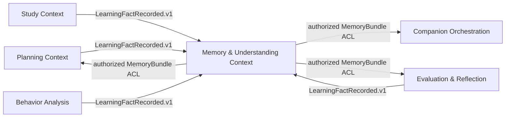
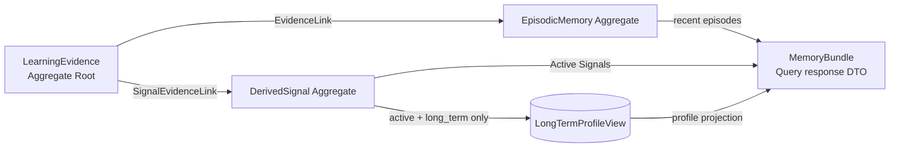
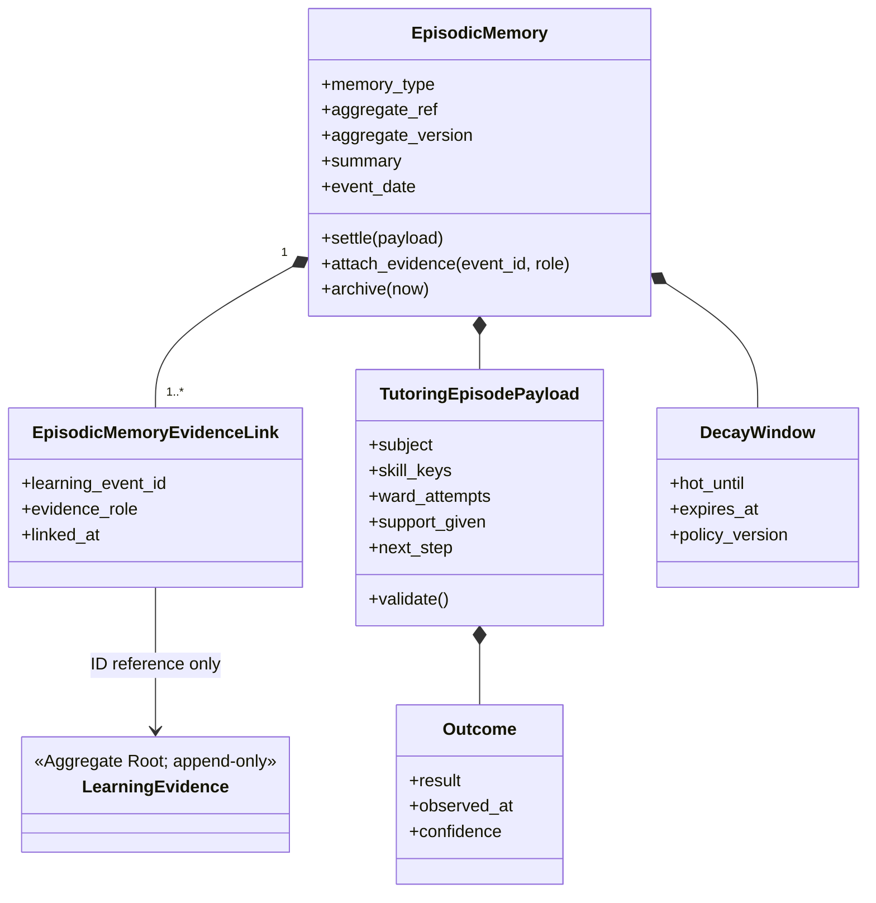
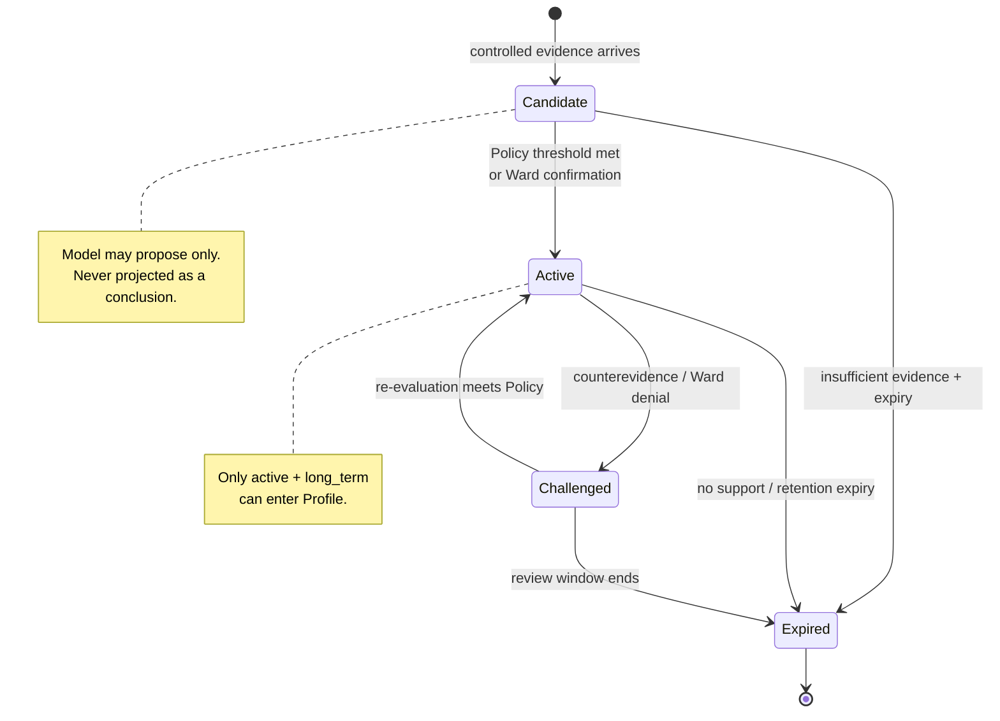
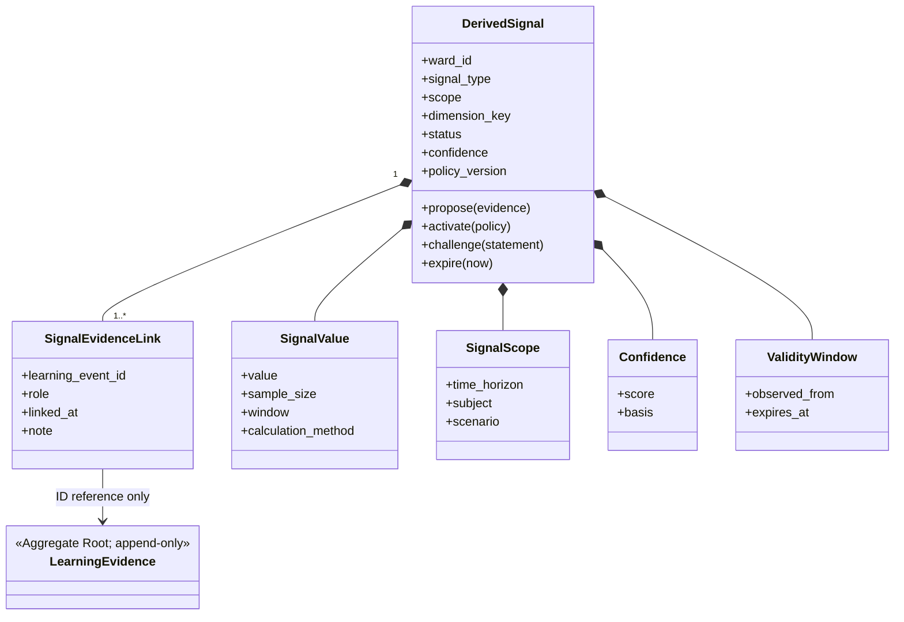
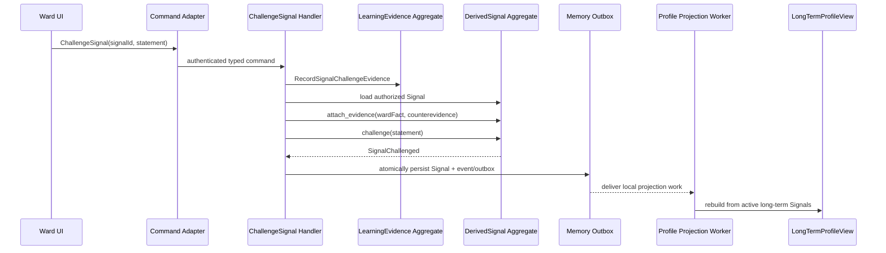

# 读学系统 — Memory & Understanding Bounded Context

> 状态：讨论稿 · 版本：v2.2
> 适用范围：`duxue-server` 中 Ward 学习证据、情境记忆、可校正理解与长期画像投影。
> 关联：[DDD 系统级 Overview](ddd-overview.md) · [陪伴编排](design-agent.md) · [服务端物理 Schema](design-server.md) · [记忆 PRD](../product/prd-memory.md)

## 一、边界、上下游与统一语言

本 Context 的责任是把其他业务 Context 已确认的学习事实，转换为可追溯、可校正、最小化召回的理解；它不拥有计划、任务、答疑会话、报告或运行时 Working Memory，也不让模型直接写入事实、画像或 Policy。



这是 Memory & Understanding Context 的邻接图；全系统 Domain Inventory、Context Map 与跨 Context 写入所有权由 [DDD 系统级 Overview](ddd-overview.md) 唯一维护。上游拥有业务状态，Memory 只保存可追溯证据和派生理解；Companion、Planning 与 Evaluation & Reflection 均只能经 `MemoryFacade` 的受权 Query 边界读取最小 `MemoryBundle`。

| 术语 | Context 内定义 | 所有权 |
|---|---|---|
| Learning Fact | 已确认、不可变、可定位来源的学习发生事实 | 上游 Context 产生；Memory 持久化证据副本 |
| Learning Evidence | 不可变、可定位、来源幂等的证据 Aggregate；物理记录名为 `learning_events` | Memory Evidence Ledger |
| Episodic Memory | 近 5 天内可召回的具体经历摘要 | Memory |
| Derived Signal | 有证据、置信度、状态与有效期的可校正理解 | Memory |
| Long-Term Profile | Active 长期 Signal 的可重算读模型 | Memory Query Side |
| Working Memory | 当前 Run 的可恢复运行状态 | Companion Runtime，不是本 Context 写 Aggregate |

Planning、Study、Behavior Analysis 与 Evaluation & Reflection 在各自 Use Case 的本地事务中发布版本化 `LearningFactRecorded.v1`。Memory Consumer Adapter 负责 transport/schema 校验、去重和投递，`IngestLearningFact` 再以来源四元组 `source_type + source_id + event_type + source_version` 幂等写入本地 Evidence Ledger。跨 Context 不共享 Aggregate，也不直接改写彼此业务表。

## 二、领域模型与 Aggregate



`LearningEvidence` 是 Evidence Ledger 的轻量 Aggregate Root；其物理 append-only 记录名为 `learning_events`。`LongTermProfileView` 是可重算 Projection；`MemoryBundle` 是 Query 根据授权和预算临时装配的 response DTO，不是 Projection，二者都不能反向写入 Aggregate。

### 2.1 LearningEvidence Aggregate：不可变证据账本

`LearningEvidence` 是每条已确认事实的轻量 Aggregate Root，不取代上游业务主表。它在本 Context 内原子保证不可变、来源四元组唯一、Ward/visibility 合法及受控 evidence reference；唯一外部写入口是 `IngestLearningFact` 或本 Context 的 `RecordSignalChallengeEvidence`。其稳定字段为 `ward_id`、`source_type`、`source_id`、`source_version`、`event_type`、`occurred_at`、`scope`、`source`、`confidence`、`payload`、`evidence_refs`、`visibility` 与 `retention_policy`。`source` 只能是 `ward`、`guardian`、`system` 或 `cam`；服务端 VLM/归并结果以 `system` 写入并带 `confidence`。

目标物理约束为 `UNIQUE(source_type, source_id, event_type, source_version)`，并保留 append-only `learning_events` 记录。当前 Schema 若尚未含来源四元组与唯一约束，必须由 [tutoring-reflection-memory-workflows spec](../../.agent/specs/tutoring-reflection-memory-workflows.md) 的迁移先行实现；在此之前不得把重复投递无副作用视为已落地保证。

### 2.2 EpisodicMemory Aggregate

| 项目 | 设计 |
|---|---|
| Identity | `memory_type + aggregate_ref + aggregate_version` |
| 内部 Entity | `EpisodicMemoryEvidenceLink`，关联多个 `LearningEvidence` |
| Value Object | `TutoringEpisodePayload`、`Outcome`、`DecayWindow` |
| 不变量 | 摘要必须关联至少一条证据；同一证据不得重复关联；原始对话不复制入摘要 |
| 行为 | `settle()`、`attach_evidence()`、`archive()` |
| 领域事件 | `EpisodicMemorySettled`、`EpisodicMemoryArchived` |
| Repository Port | `EpisodicMemoryRepository` |

`tutoring_episode` 是该 Aggregate 的逻辑类型：保存受控题目引用、Ward 可观察尝试、实际支持、结果与下一步；其幂等键为 `tutoring_episode + tutoring_session_id + session_version`。

#### 2.2.1 Internal UML 与 Entity Inventory



图中只包含本 Aggregate 的领域对象；`LearningEvidence` 属于独立 Evidence Ledger Aggregate，只通过 ID 引用。

| 对象 | 类型与 Identity | 关键领域属性 | 主要领域方法 | 不变量职责 |
|---|---|---|---|---|
| `EpisodicMemory` | Aggregate Root；`memory_type + aggregate_ref + aggregate_version` | `ward_id`、`memory_type`、`aggregate_ref`、`summary`、`event_date`、`decay_window`、`archived_at` | `settle(payload)`、`attach_evidence(event_id, role)`、`archive(now)` | 原子保证至少一条证据、证据去重、受控摘要不复制原始对话，并决定何时归档 |
| `EpisodicMemoryEvidenceLink` | Child Entity；`episodic_memory_id + learning_event_id` | `learning_event_id`、`evidence_role`、`linked_at` | `matches(event_id)` | 无独立写入口；由 Root 判断重复并维护链接生命周期 |
| `TutoringEpisodePayload` | Value Object；无 Identity | `subject`、`skill_keys`、`ward_attempts`、`support_given`、`next_step`、受控题目引用 | `validate()`、`with_outcome(outcome)` | 构造时保证字段受控、可解释且不含原始逐字对话 |
| `Outcome` | Value Object；无 Identity | `result`、`observed_at`、`confidence` | `validate()` | 结果必须带可观察时间与置信度，不把推测伪装成事实 |
| `DecayWindow` | Value Object；无 Identity | `hot_until`、`expires_at`、`policy_version` | `contains(at)`、`is_expired(at)` | 时间窗口合法，且衰减策略可追溯到版本 |

这里的“属性”是会影响领域决策、生命周期或不变量的状态，不是 `episodic_memories` 的逐列 ORM 映射；持久化字段仍以 `design-server.md` 为准。

### 2.3 DerivedSignal Aggregate

| 项目 | 设计 |
|---|---|
| Identity | `ward_id + signal_type + scope + dimension_key` |
| 内部 Entity | `SignalEvidenceLink`，带 support / counterevidence / ward_confirmation 角色 |
| Value Object | `SignalValue`、`SignalScope`、`SignalStatus`、`Confidence`、`ValidityWindow` |
| 不变量 | 每个 Signal 有证据；Candidate 不可作为确定结论；只有 `long_term + active` 可投影 Profile |
| 行为 | `propose()`、`activate()`、`challenge()`、`expire()` |
| 领域事件 | `SignalProposed`、`SignalActivated`、`SignalChallenged`、`SignalExpired` |
| Repository Port | `DerivedSignalRepository` |



晋升门槛由版本化 Policy 计算：独立会话数、证据可靠度、时间衰减、Ward 确认与反证。模型只能提出 Candidate。

受控 `signal_type` 为：`focus_endurance_baseline`、`estimation_bias`、`knowledge_gap`、`effective_strategy`、`stable_interest`、`planning_preference` 与 `reflection_accuracy_trend`。每种 `value` 需保留样本数、窗口与计算方法；不得将具体卡点描述为能力或人格标签。

#### 2.3.1 Internal UML 与 Entity Inventory



`SignalEvidenceLink` 是可区分、可追溯的子实体；它不拥有也不复制 `LearningEvidence`。

| 对象 | 类型与 Identity | 关键领域属性 | 主要领域方法 | 不变量职责 |
|---|---|---|---|---|
| `DerivedSignal` | Aggregate Root；`ward_id + signal_type + scope + dimension_key` | `ward_id`、`signal_type`、`scope`、`dimension_key`、`status`、`confidence`、`policy_version` | `propose(evidence)`、`attach_evidence(event_id, role)`、`activate(policy)`、`challenge(statement)`、`expire(now)` | 原子保证每项结论有证据、Candidate 不作为确定结论、只有 `long_term + active` 可进入 Profile |
| `SignalEvidenceLink` | Child Entity；`derived_signal_id + learning_event_id + role` | `learning_event_id`、`role`、`linked_at`、`note` | `matches(event_id, role)`、`is_counterevidence()` | 无独立写入口；由 Root 保持支持、反证与 Ward 确认的语义和去重 |
| `SignalValue` | Value Object；无 Identity | `value`、`sample_size`、`window`、`calculation_method` | `validate_controlled_value()` | 每个值必须说明样本、窗口和方法，不能把单次表现写成稳定特质 |
| `SignalScope` | Value Object；无 Identity | `time_horizon`、`subject`、`scenario` | `is_long_term()` | Scope 与受控信号类型兼容，决定是否具备画像候选资格 |
| `Confidence` | Value Object；无 Identity | `score`、`basis` | `meets(threshold)` | 分数在合法范围，且不可脱离证据基础解释 |
| `ValidityWindow` | Value Object；无 Identity | `observed_from`、`expires_at` | `contains(at)`、`is_expired(at)` | 有效期不能早于观察起点；到期后不可维持 Active |

`SignalStatus` 是有限状态 Value Object（`candidate`、`active`、`challenged`、`expired`）；允许的转换及其 Policy guard 以生命周期图为唯一说明，不在 Application Service 中以 if/else 复制。

### 2.4 Domain Services

`SignalEvolutionService` 只计算晋升、反证、衰减和到期资格；`EpisodicSettlementPolicy` 只决定哪些相关事实可结算为同一情境。两者不处理 HTTP、鉴权、事务、Worker 调度或 ORM。

### 2.5 从事实到最小上下文的数据流

```mermaid
flowchart LR
    UC[Upstream Use Case]
    BS[Upstream Aggregate]
    OB[Upstream Outbox]
    CA[Memory Consumer Adapter]
    ILF[IngestLearningFact Use Case]
    LE[LearningEvidence Aggregate]
    CW[Memory Workers]
    EP[(Episodic Memory<br/>hot window)]
    SG[(Derived Signals)]
    PF[(Long-term Profile<br/>rebuildable view)]
    MF[MemoryFacade<br/>ACL · redaction · budgets]
    CE[ContextEnvelope]

    UC -->|same transaction| BS
    UC -->|same transaction: LearningFactRecorded.v1| OB
    OB -->|retryable delivery| CA
    CA -->|validated envelope| ILF
    ILF -->|local transaction: append once| LE
    LE -->|replay / evidence lookup| CW
    CW -->|settle with evidence links| EP
    CW -->|propose / challenge / evolve| SG
    SG -->|active + long_term only| PF
    EP --> MF
    SG --> MF
    PF --> MF
    MF -->|minimum authorized bundle| CE
```



上游业务主表仍是业务状态的唯一事实源；`learning_events` 是 Memory 本地的可追溯证据副本。上游绝不直接写入它；Worker 只触发 Memory Use Case，派生结果可重放、可校正，且不会反向改写上游 Aggregate。

## 三、Command Side / Application Use Cases

| Command / Use Case | Actor 与前置条件 | 事务与 Aggregate | 结果与幂等 |
|---|---|---|---|
| `IngestLearningFact` | Memory Consumer Adapter 已校验的受支持事件 | 幂等创建 `LearningEvidence` Aggregate | 重复来源四元组无副作用；失败进入重试/对账 |
| `SettleEpisodicMemory` | Outbox Worker；相关事实已到达 | 写一个 `EpisodicMemory` 与证据链接 | 发布 `EpisodicMemorySettled`；按聚合版本幂等 |
| `ProposeCandidateSignal` | 受控 Worker；证据与类型受 Policy 校验 | 写一个 `DerivedSignal` | Candidate 不能直接改变 Profile |
| `ChallengeSignal` | Ward 纠正服务；Ward 可见且有权限 | 调用 `signal.challenge()` | 追加反证链接并发布 `SignalChallenged` |
| `EvolveSignals` | 每日 Worker | 逐个加载 Signal 并调用领域行为 | 状态变化发布事件；可重试 |
| `RebuildLongTermProfile` | Projection Worker | 不修改 Signal Aggregate | 从 Active 长期 Signal 完整覆盖 Profile View |

Application Service 负责授权、命令形状、事务、Repository 与 Outbox；领域规则只在 Aggregate 或 Domain Service 中执行。上游业务 Context 只发布 `LearningFactRecorded.v1`，不直接调用这些写 Use Case。

### 3.1 状态变更触发矩阵

这里的事件有两种严格不同的含义：`LearningFactRecorded.v1` 是**跨 Context
Integration Event**；`EpisodicMemorySettled`、`SignalActivated` 等是本 Context
Aggregate 产生的 **Domain Event**。前者由接收方的 Application Event Handler
转译成本地命令；后者在本地事务提交后才可被投影、同 Context Worker 或 Outbox
处理，不能绕过 Application 层直接改表。

| 触发与来源 | Adapter / 入口 | Memory Application Command / Handler | Domain 调用与原子边界 | 本地领域事件 | 后续 Outbox / Projection | 一致性、幂等与失败 |
|---|---|---|---|---|---|---|
| Planning、Study、Behavior Analysis、Evaluation & Reflection 发布 `LearningFactRecorded.v1` | Consumer Adapter 验证 transport/schema 后投递 | `IngestLearningFact` 校验版本、来源四元组与 ACL | create `LearningEvidence`；原子保证 append-only 与来源去重 | `LearningEvidenceRecorded`（本地） | 标记可被结算 Worker 处理 | 四元组唯一；未知 schema 死信/人工对账；重复投递无副作用 |
| 会话关闭、关联事实到达或周期性结算窗口 | Scheduler / Outbox Worker | `SettleEpisodicMemory` 选择同一 `aggregate_ref` 的证据并开启本地事务 | `EpisodicSettlementPolicy.decide()` → load/create `EpisodicMemory` → `attach_evidence()` → `settle(payload)` | `EpisodicMemorySettled` | 同 Context 结算/信号 Worker；更新 `EpisodicMemoryView` | 以 `memory_type + aggregate_ref + aggregate_version` 幂等；失败重试并可由 Ledger 重放 |
| 已结算的情境、或受控证据窗口达到候选阈值 | Local Domain-Event Dispatcher / Worker | `ProposeCandidateSignal` | `SignalEvolutionService` 计算资格 → load/create `DerivedSignal` → `propose()` / `attach_evidence()` | `SignalProposed` | 更新 Candidate View；**不**更新 Profile | Policy/version 和 Signal identity 幂等；候选失败不影响 Evidence Ledger |
| Ward 明确纠正 / 否认 | 受权 API / UI Command Adapter | `ChallengeSignal` 先把 Ward 陈述记录为可追溯证据，再处理命令 | load Signal → `attach_evidence(ward_fact, counterevidence)` → `challenge(statement)` | `SignalChallenged` | Profile Worker 移除其 Active 长期投影 | Ward、visibility、Signal 归属必须校验；重复命令按 evidence role 去重 |
| 每日衰减或新证据改变资格 | Scheduler / Worker | `EvolveSignals` | `SignalEvolutionService.evaluate()` → `activate(policy)` 或 `expire(now)` | `SignalActivated` / `SignalExpired` | 触发/排队 `RebuildLongTermProfile` | 每个 Signal 独立事务；可重复扫描；Policy 版本进入审计 |
| Signal 状态变化或每日全量重建 | Projection Worker | `RebuildLongTermProfile` | 不加载或修改 Signal Aggregate；只读取 Active long-term Signal | 无 | 完整覆盖 `LongTermProfileView` | 最终一致；可从 Active Signal 全量重建，失败不回写 Signal |
| 热窗口到期 | Scheduler / Worker | `ArchiveEpisodicMemory` | load `EpisodicMemory` → `archive(now)` | `EpisodicMemoryArchived` | 从热查询投影移除，按留存政策处理 | 幂等归档；删除仍必须走受控清理流程 |

“事实 → 情境记忆”不是先写一个普通 Memory、再把它升级为 Episode 的隐含两级流程。
`tutoring_episode` 从一开始就是 `EpisodicMemory.memory_type`：Application Service
根据结算 Policy 将多条事实归并为该 Aggregate，并同步调用 `attach_evidence()` 与
`settle()`。若未来引入“草稿摘要”生命周期，必须新增其 Aggregate/状态/命令，不能把
它偷偷塞进 `settle()`。

### 3.1.1 Memory Evolution 核心用例契约

下列用例共同构成“证据升级为可校正理解”的闭环。它们不是一个跨数据库事务；每一步均有
自己的事务、幂等键和失败恢复边界。

| Use Case | 触发与授权 | 输入与本地事务 | 决策结果 / 幂等键 |
|---|---|---|---|
| `CloseTutoringSession` | Ward 明确结束，或受权 UI 发出 `close` 指令；由 Study Context 拥有 | 关闭 `TutoringSession`，同事务记录 `tutoring.session_closed` Fact 与 Outbox | 一次会话关闭只发布一个关闭 Fact；未关闭、暂停或失联不等同于关闭 |
| `IngestLearningFact` | Memory Consumer 接到 `LearningFactRecorded.v1` | 校验 schema、ACL、来源四元组，创建 `LearningEvidence` | `source_type + source_id + event_type + source_version`；重复投递无副作用 |
| `SettleEpisodicMemory` | 收到关闭 Fact 或结算 Worker 扫描到可结算来源 | 按 `EpisodicSettlementPolicy` 加载/创建 Episode，并附加证据链接 | `memory_type + aggregate_ref + aggregate_version`；重试只补齐遗漏链接 |
| `ProposeCandidateSignal` | Episode 已结算，或证据窗口满足候选资格 | `SignalEvolutionService` 检查可用证据，创建/补充 `DerivedSignal` | Signal identity；只能写 `candidate`，不改变 Profile |
| `EvolveSignals` | 定时 Worker 或新证据触发 | 按版本化 Policy 激活、挑战或过期 Signal | 每个 Signal 独立事务；Policy 版本与评估时间进入审计 |
| `RebuildLongTermProfile` | Signal 状态变化或定时全量任务 | 仅读取 `active + long_term` Signals，完整覆盖 Profile View | 可从 Signals 重建；不回写 Signal 或 Evidence Ledger |

#### 3.1.2 Episode 与 Signal Policy

`EpisodicSettlementPolicy` 的职责是**归并已发生的事实**，不是推测孩子状态。首个
`tutoring_episode` 的结算必须同时满足：同一 Ward、同一 `tutoring_session_id`、存在
`tutoring.session_closed` Fact，且至少有一条受控互动 Fact（Ward 尝试、实际提示、理解确认
或已验证工具结果）。`paused`、无活动或客户端断连只可触发提醒/恢复策略，不能隐式结算
为关闭。

`SignalEvolutionPolicy` 的职责是**评估理解主张的证据资格**。它按 `signal_type` 配置
最小独立 Episode 数、可靠度、观察窗口、反证规则与是否需要 Ward 确认。Policy 评估的
“独立”至少要求不同的 `aggregate_ref`（通常是不同答疑会话）；同一会话中的多条消息只能
丰富一个 Episode，不能凑晋升次数。

| Signal 类型 | 可提出 Candidate 的最低条件 | `long_term` Active 的典型 guard |
|---|---|---|
| `knowledge_gap`、`estimation_bias` | 一个已结算 Episode 中存在受控、可定位的证据 | 多个独立 Episode 在窗口内一致，且无未处理反证 |
| `effective_strategy` | 至少一个 Episode 显示策略被实际采用和观察到结果 | 至少两个独立 Episode 支持；结果可靠度达到该策略的阈值 |
| `planning_preference`、`stable_interest` | Ward 陈述或多次可观察选择 | 跨日期/场景的一致证据；主观偏好默认要求 Ward 确认 |
| `focus_endurance_baseline`、`reflection_accuracy_trend` | 足够的可比较样本与明确计算方法 | 样本数、时间窗口、置信区间满足 Policy；不能从单次表现推断 |

`recent` 与 `long_term` 是不同的 Signal scope，也是 Signal identity 的一部分。Policy 应从
已结算 Episode 为 `long_term` scope **另行提出** Candidate，而非将一个 `recent` Signal
原地改名升级。只有 `status = active` 且 `scope = long_term` 的 Signal 可参与
`LongTermProfileView` 重建。Ward 否认或新反证会立即把 Signal 转为 `challenged`；Profile
随后最终一致地移除该投影。

#### 3.1.3 异步投递与恢复契约

| 异步步骤 | 生产者 → 接收方 | 幂等 / 顺序 | 失败、对账与重放 |
|---|---|---|---|
| 稳定 Fact 投递 | Planning / Study / Evaluation 本地事务 → `outbox_events` → Memory Consumer Adapter | 来源四元组；同一来源对象按 `source_version` 有序处理 | 投递失败保留待发送记录并退避重试；未知 schema 死信，人工对账后才可重放 |
| Fact 入账 | Consumer Adapter → `IngestLearningFact` | Evidence Ledger 的来源四元组唯一约束 | 重复投递无副作用；可根据 Outbox 与 Ledger 对账并补投 |
| Episode 结算 | 关闭 Fact / Scheduler → `SettleEpisodicMemory` | `memory_type + aggregate_ref + aggregate_version`，证据链接去重 | 从 Ledger 重放；不能靠重新读取原始聊天补造证据 |
| Signal / Profile 投影 | 本地 Episode 或 Signal 事件 → Worker / Projection | Signal identity；Profile 是全量覆盖式读模型 | 单个 Signal 失败可独立重试；Profile 可从 Active long-term Signals 全量重建 |

### 3.2 关键因果链时序图

#### 3.2.0 从 Ward 消息到 Episode、Signal 与 Profile

```mermaid
sequenceDiagram
    participant W as Ward App / ASR
    participant I as CompanionTurnEndpoint
    participant C as CompanionCoordinator
    participant T as Tutoring Workflow
    participant V as PolicyValidator
    participant A as Study Application Service
    participant S as TutoringSession Aggregate
    participant O as Study Outbox
    participant CA as Memory Consumer Adapter
    participant H as IngestLearningFact Handler
    participant L as LearningEvidence Aggregate
    participant SW as Settlement Worker
    participant SP as EpisodicSettlementPolicy
    participant E as EpisodicMemory Aggregate
    participant EW as Signal Evolution Worker
    participant DP as SignalEvolutionPolicy
    participant D as DerivedSignal Aggregate
    participant P as LongTermProfileView

    W->>I: POST /companion/turn
    I->>C: HandleCompanionTurn(ward, content, directive)
    C->>T: RunInvocation(one authorized tutoring Run)
    T->>A: StartOrResumeTutoring / ApplyTutorTurn
    A->>S: load by study_session_id; verify Ward and status
    alt session absent, belongs to another Ward, or already closed
        S-->>A: reject command
        A-->>T: safe WorkflowOutcome
        T-->>C: no business mutation
        C-->>I: response / clarification
        I-->>W: no Fact, no Memory
    else session is usable
        T->>V: validate safety, action, tool budget, state patch
        alt rejected or no verified learning occurrence
            V-->>T: reject / safe fallback
            T-->>C: safe WorkflowOutcome + Trace metadata
            C-->>I: response
            I-->>W: no Fact, no Memory
        else verified attempt, actual hint, or explicit close
            V-->>T: ValidatedTutorTurn
            T->>A: typed local command
            A->>S: apply_turn() or close()
            S-->>A: local domain event / stable fact reference
            A->>O: one local transaction: persist session + Fact + Outbox
            A-->>T: WorkflowOutcome
            T-->>C: validated outcome
            C-->>I: Thread / Run response
            I-->>W: display response

            O-->>CA: LearningFactRecorded.v1 (retryable delivery)
            CA->>H: verified envelope
            H->>H: validate schema, ACL, source four-tuple
            H->>L: create once by source four-tuple

            opt Fact is tutoring.session_closed
                SW->>L: select same Ward + tutoring_session_id facts
                SW->>SP: decide eligibility and aggregate_ref
                alt closed Fact plus at least one interaction Fact
                    SP-->>SW: controlled TutoringEpisodePayload
                    SW->>E: load/create; attach evidence; settle()
                    E-->>EW: EpisodicMemorySettled
                    EW->>DP: evaluate candidate eligibility across Episodes
                    opt minimum independent evidence is met
                        DP-->>EW: candidate proposal
                        EW->>D: propose() / attach_evidence()
                        D-->>EW: SignalProposed (candidate)
                    end
                    EW->>DP: evaluate activation / challenge / expiry
                    opt scope is long_term and all guards are met
                        DP-->>EW: activate
                        EW->>D: activate(policy)
                        D-->>EW: SignalActivated
                        EW->>P: rebuild from active + long_term Signals
                    end
                else incomplete or ineligible evidence
                    SP-->>SW: defer; await more valid evidence
                end
            end
        end
    end
```

关键边界：原始消息、模型候选、安全拒绝和 Trace 都不是 Memory。只有目标 Context 已验证、
并随本地业务事务写出的 Fact 才能进入 Evidence Ledger；一个会话的 Facts 只会先结算为
一个 Episode，跨 Episode 的证据才可支持 Signal。

该图刻意把关闭表达为 `tutoring.session_closed` Fact，而不是 Worker 对所有开放会话的猜测。
Outbox 投递、Fact 入账、Episode 结算、Signal 演进与 Profile 重建均是可重试的本地事务；
重复消息或重复投递分别由来源四元组、Episode identity 和 Signal identity 处理。

| Participant | Canonical type | Owned responsibility |
|---|---|---|
| Ward App / ASR | Actor | 发起受权学习交互 |
| CompanionTurnEndpoint | Interface | 转换 HTTP/SSE 输入，不直接写领域状态 |
| CompanionCoordinator | Process Manager | 路由一次受权 Run，不拥有 Study 或 Memory Aggregate |
| Tutoring Workflow / Study Application Service | Use Case | 校验并在 Study 本地事务写入稳定 Fact 与 Outbox |
| Study Outbox | Infrastructure | 可靠投递跨 Context `LearningFactRecorded.v1` |
| Memory Consumer Adapter | Interface | 验证 transport/schema、去重投递 `IngestLearningFact` |
| IngestLearningFact | Use Case | ACL、来源四元组幂等和本地事务 |
| LearningEvidence / EpisodicMemory / DerivedSignal | Aggregate Root | 分别保证证据、情境、理解主张的不变量 |
| Settlement / Signal Worker | Infrastructure | 只触发 Memory Use Case，不直接改 Aggregate |
| LongTermProfileView | Projection | 从 Active long-term Signal 重建读模型 |

#### 3.2.1 跨 Context 事实入账与情境结算

```mermaid
sequenceDiagram
    participant U as Upstream Context
    participant O as Upstream Outbox
    participant A as Memory Consumer Adapter
    participant H as IngestLearningFact Handler
    participant L as LearningEvidence Aggregate
    participant W as Settlement Worker
    participant P as EpisodicSettlementPolicy
    participant M as EpisodicMemory Aggregate
    participant MO as Memory Outbox / Projection

    U->>O: commit stable LearningFactRecorded.v1
    O-->>A: deliver integration event
    A->>H: verified envelope + schema version
    H->>H: deduplicate source four-tuple / ACL
    H->>L: create once in local transaction
    H-->>A: consumption recorded
    Note over L,W: Evidence is a local Aggregate; its recorded event may trigger local work only.
    W->>L: select eligible related evidence
    W->>P: decide(event IDs, aggregate_ref)
    P-->>W: settlement decision + controlled payload
    W->>M: load/create by identity
    W->>M: attach_evidence(eventId, role)
    W->>M: settle(payload)
    M-->>W: EpisodicMemorySettled
    W->>MO: atomically save Aggregate + local event/outbox
    MO-->>W: update EpisodicMemoryView / queue local signal work
```

| Participant | Canonical type | Owned responsibility |
|---|---|---|
| Upstream Context | Actor | 已在自己的事务中发布稳定 Integration Event |
| Upstream Outbox | Infrastructure | 重试投递，不共享事务给 Memory |
| Memory Consumer Adapter | Interface | 传输验证与投递，不解释业务意图 |
| IngestLearningFact | Use Case | 校验 ACL/版本/幂等并创建 LearningEvidence |
| LearningEvidence / EpisodicMemory | Aggregate Root | 保证证据不可变性及 Episode 结算不变量 |
| Settlement Worker | Infrastructure | 启动可重试的 `SettleEpisodicMemory` Use Case |
| EpisodicSettlementPolicy | Domain Service | 决定证据是否可归并为受控 Episode |
| Memory Outbox / Projection | Infrastructure / Projection | 提交后驱动本地投影或后续工作 |

#### 3.2.2 Ward 纠正与长期画像收敛



| Participant | Canonical type | Owned responsibility |
|---|---|---|
| Ward UI | Actor | 提出对自身 Signal 的纠正 |
| Command Adapter | Interface | 鉴权并转换为 `ChallengeSignal` 输入 |
| ChallengeSignal Handler | Use Case | 在同一 Memory 本地事务记录纠正证据、加载 Signal 并调用领域行为 |
| LearningEvidence / DerivedSignal | Aggregate Root | 保证纠正证据不可变，及 Signal 状态/反证不变量 |
| Memory Outbox / Profile Worker | Infrastructure | 提交后触发可重试投影 |
| LongTermProfileView | Projection | 仅由 Active long-term Signal 重建 |

## 四、CQRS Query Model

| Query Model | 消费者 | 来源 | 新鲜度 |
|---|---|---|---|
| `EpisodicMemoryView` | 受权领域服务 | `EpisodicMemory` 投影 | Outbox 后最终一致，近 5 天热窗口 |
| `ActiveSignalView` | ContextBuilder / 领域服务 | Active `DerivedSignal` | 状态变更后最终一致 |
| `LongTermProfileView` | 报告与受权业务服务 | Active 长期 Signal 的重算投影 | 每日或状态变化后最终一致；不得用于强一致写决策 |
| `MemoryBundle`（response DTO） | Companion、Planning、Evaluation & Reflection | Query 按 use case 装配上述 View；不含 Working Memory | 单次查询快照，受 item/token 预算 |

`MemoryFacade.resolve_context(request)` 是唯一跨 Context 的受权 Query 边界：执行 Ward/角色/`visibility` 授权、结构化优先筛选、脱敏、证据投影与预算裁剪。它不暴露 Aggregate、完整原始对话、未经验证长期结论或 Working Memory；Working Memory 仍由 Companion Runtime 自己拥有。

## 五、接口与事件契约

当前为模块化单体，以下为 Python Port；未来可原样暴露为内部 HTTP/gRPC，但不是 App 公共 API。

```python
class MemoryCommandService(Protocol):
    def ingest_learning_fact(self, event: LearningFactRecorded) -> LearningEvidence: ...
    def settle_episodic_memory(self, event_ids: list[UUID], aggregate_ref: str) -> UUID: ...
    def challenge_signal(self, signal_id: UUID, ward_statement: str) -> UUID: ...

class MemoryQueryService(Protocol):
    def resolve_context(self, request: MemoryContextRequest) -> MemoryBundle: ...
```

### 5.1 `LearningFactRecorded.v1`：入站 Integration Event

该 Published Language 的目录归属 [DDD Overview](ddd-overview.md)；Memory 是接收方。最小 envelope 为 `source_type`、`source_id`、`source_version`、`event_type`、`occurred_at`、`ward_id`、`visibility`、受控 `evidence_refs`、`payload_schema_version` 与 `payload`。Consumer Adapter 仅验证 transport/schema 并去重投递；`IngestLearningFact` 负责将上游语言经 ACL 转换为本地 `LearningEvidence`。

未知版本、Ward 不匹配、不可见引用或无效 payload 返回可重试/不可重试分类：前者退避重试，后者进入死信并人工对账；不得猜测解析。来源四元组是消费幂等键，同一来源对象按 `source_version` 有序处理。

### 5.2 `MemoryContextRequest → MemoryBundle`

`MemoryContextRequest` 必须包含 `actor_id`、`actor_role`、`ward_id`、`use_case`、`visibility_scope`、`item_budget` 与 `token_budget`。授权失败返回 `Forbidden`，预算为零或没有可见证据时返回结构正确的空 Bundle，投影未赶上时返回明确 freshness 标记；不得因查询失败回退为原始聊天或 Aggregate。

`MemoryBundle` 仅含经允许的 Episodic/Signal/Profile 摘要、来源可追溯 ID 与 freshness，不含 `LearningEvidence.payload` 原文、其他 Ward 数据、Working Memory 或 Aggregate 内部状态。`ChallengeSignal` 由受权 Ward 对自己的 Signal 发起；它在同一 Memory 本地事务中调用 `RecordSignalChallengeEvidence`，再调用 `DerivedSignal.challenge()`，重复键为 `signal_id + correction_evidence_id`。

## 六、基础设施、留存与删除

### 6.1 Ports 与 Adapters

| Port owner | Concrete adapter / dependency | 失败策略 |
|---|---|---|
| `LearningEvidenceRepository`、`EpisodicMemoryRepository`、`DerivedSignalRepository` | SQLAlchemy / PostgreSQL | 仅 Application 依赖 Port；事务失败回滚并由入口决定重试 |
| `IntegrationEventConsumer` | Outbox consumer / queue transport | 校验 schema、来源四元组去重；可重试失败退避，不可解析事件死信 |
| `LocalEventPublisher`、`ProjectionStore` | Transactional Outbox、投影存储 | 仅提交后分发；投影失败不回写 Aggregate，可重建 |
| `MemoryFacade` Query Port | ACL、Projection/read-model store | 失败返回安全空 Bundle / 明确 freshness，不返回原始事实 |

### 6.2 持久化与事务

物理表、索引与外键仍以 [design-server.md](design-server.md) 为唯一事实源。目标映射为：`LearningEvidence → learning_events`、`EpisodicMemory → episodic_memories + episodic_memory_events`、`DerivedSignal → derived_signals + derived_signal_events`、`LongTermProfileView → long_term_profiles`、本地/跨 Context 投递 → `outbox_events`。所有新外键为 `NO ACTION`；普通删除被拒绝。

每个 Aggregate 有独立 Repository Port。`IngestLearningFact` 原子写入 `LearningEvidence` 与消费结果；`SettleEpisodicMemory`、`ChallengeSignal`、`EvolveSignals` 各自拥有本地事务并原子保存 Aggregate 与本地 Domain Event/Outbox。`RebuildLongTermProfile` 只写 Projection。来源四元组、Episode identity、Signal identity 和证据链接唯一键均应由数据库约束兜底。

`tutoring-reflection-memory-workflows` 是补齐 `source_*`、Episode identity/window、`dimension_key` 及 evidence-link role 唯一约束的迁移前置；迁移须先兼容读旧记录、回填/重建 Projection，再切换写入约束。迁移失败或回滚时保留 Evidence Ledger，允许从其重放 Episode、Signal 与 Profile。

### 6.3 异步投递与 Projection

| 事件 / Job | 生产者 | Consumer → 本地意图 | 幂等、顺序与恢复 |
|---|---|---|---|
| `LearningFactRecorded.v1` | 上游 Context Use Case + Outbox | Consumer Adapter → `IngestLearningFact` | 来源四元组；按来源版本有序；死信、对账、从上游 Outbox 补投 |
| `LearningEvidenceRecorded`、`EpisodicMemorySettled` | Memory 本地事务 | Worker → `SettleEpisodicMemory` / `ProposeCandidateSignal` | 本地事件不跨 Context；按 Aggregate identity 去重，可从 Ledger 重放 |
| `SignalActivated`、`SignalChallenged`、`SignalExpired` | Memory 本地事务 | Projection Worker → `RebuildLongTermProfile` | Profile 全量覆盖；最终一致，可从 Active long-term Signal 重建 |

### 6.4 安全、数据治理与可观测性

| Concern | Boundary / retention | Evidence |
|---|---|---|
| Authorization | `MemoryFacade` 与 `ChallengeSignal` 校验 actor、Ward、visibility；不跨 Ward 返回 Bundle | 授权拒绝审计、越权告警 |
| Sensitive evidence | Bundle 脱敏、预算裁剪；不返回原始对话/模型 trace | redaction 测试、payload 访问审计 |
| Retention / deletion | 停止 Run/Worker 后按政策删除 Projection/可删除关联；不依赖 Cascade；Working Memory 由 Companion Runtime 清理 | 删除作业审计、遗留记录对账 |
| Operations | 透传 correlation ID；记录消费滞后、死信、投影 freshness、重放次数与幂等冲突 | 指标、日志、追踪与告警 |

## 七、验收场景

```gherkin
Given 一个 Candidate Signal 仅有关联学习证据
When Companion 请求长期画像
Then 该 Signal 不出现在 LongTermProfileView

Given Ward 否认一个 Active Signal
When ChallengeSignal 成功处理
Then Signal 变为 Challenged 并保留反证链接
And Profile Worker 不再将其投影为 Active 长期理解

Given 同一 LearningFactRecorded.v1 被重复投递
When IngestLearningFact 重试
Then Evidence Ledger 只保留一条对应事实
And 不会重复结算同一情境记忆
```
