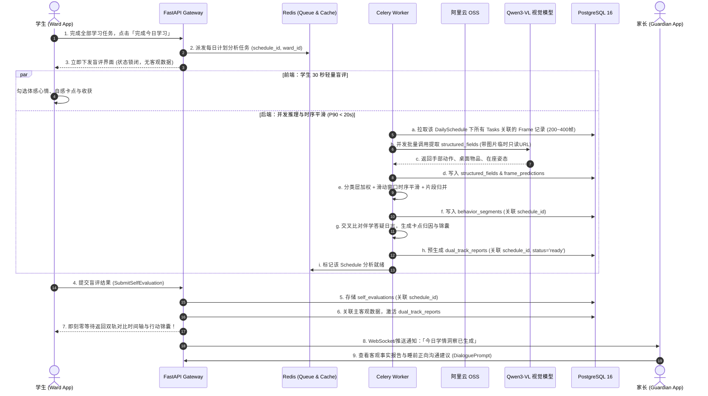
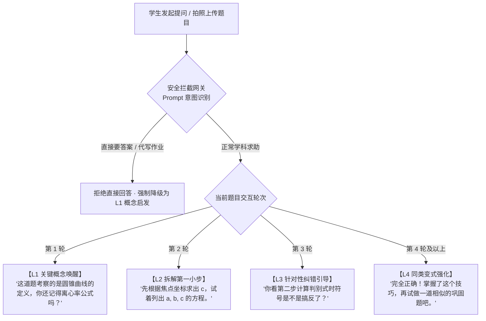

# 读学系统 — Server 端详细技术设计 (design-server.md)

> 版本：v3.0  
> 核心技术栈：Python 3.11 · FastAPI · SQLAlchemy 2.0 (Async) · PostgreSQL 16 · Redis 7 · Celery 5 · 阿里云 OSS · Qwen3-VL / LLM  
> 系统定位：读学系统的智能中枢与服务中台，负责物理感知接入、视觉行为推理、启发式伴学支架编排、三层孩子记忆模型演进与双轨复盘报告生成。

## 一、系统分层架构与目录结构

采用现代清晰的分层架构（Interface -> Application -> Domain -> Infrastructure），严格解耦业务规则与底层实现：

```text
duxue-server/
├── app/
│   ├── api/                     # 接口层 (Interface Layer)
│   │   ├── deps.py              # 统一鉴权与依赖注入 (verify_ward_access 等)
│   │   ├── v1/
│   │   │   ├── auth.py          # 用户注册、登录、Token 刷新
│   │   │   ├── bindings.py      # 家长-学生绑定与权限管理
│   │   │   ├── devices.py       # 采集设备接入、预签名 URL 签发、心跳
│   │   │   ├── schedules.py     # 协商式计划、任务清单
│   │   │   ├── companion.py     # 沉浸伴学、启发式答疑 (SSE 流式)
│   │   │   ├── evaluations.py   # 即时盲评、双轨对比报告、锦囊沉淀
│   │   │   └── admin.py         # 内部运营：Badcase 标注、分类配置热更
│   │
│   ├── application/             # 应用层 (Application Layer)
│   │   ├── commands/            # 写操作用例 (CreateSchedule, SubmitEvaluation)
│   │   ├── queries/             # 读操作用例 (GetDualTrackReport, ListTasks)
│   │   └── orchestrators/       # 复杂业务编排 (ScheduleAnalysisPipeline)
│   │
│   ├── domain/                  # 领域层 (Domain Layer)
│   │   ├── entities/            # 实体与聚合根 (User, Device, DailySchedule, Task, TutoringSession...)
│   │   ├── value_objects/       # 值对象 (StructuredFields, HintLevel, TimeRange)
│   │   ├── services/            # 领域服务
│   │   │   ├── classifier.py    # 行为特征加权匹配
│   │   │   ├── timeline.py      # 时序滑动平滑与片段归并
│   │   │   ├── tutoring.py      # 4级启发支架与作弊拦截
│   │   │   └── memory_engine.py # 记忆抽取、衰减与长期画像演进
│   │   └── repositories/        # 仓储接口抽象
│   │
│   ├── infrastructure/          # 基础设施层 (Infrastructure Layer)
│   │   ├── db/
│   │   │   ├── base.py          # SQLAlchemy 异步引擎与 Base 类
│   │   │   ├── models/          # 数据库 ORM 映射表定义 (无 tenant_id)
│   │   │   └── repositories/    # 仓储具体实现
│   │   ├── cache/               # Redis 缓存与工作记忆操作
│   │   ├── storage/             # 阿里云 OSS 预签名生成与生命周期客户端
│   │   ├── ai/                  # AI 服务客户端 (Qwen3-VL, LLM OpenAI 适配)
│   │   └── security/            # JWT 编解码、密码 bcrypt 哈希、设备 Token 验签
│   │
│   └── workers/                 # 异步任务层 (Celery Workers & Beat)
│       ├── celery_app.py        # Celery 实例与队列配置
│       ├── tasks/
│       │   ├── schedule_tasks.py # 今日计划完成即时分析任务流水线
│       │   ├── memory_tasks.py  # 每日记忆衰减与长期画像固化
│       │   └── health_tasks.py  # 60s 心跳超时巡检、90天留存清理
│
└── config/                      # 环境配置与分类器原型规则 (categories.yaml)
```

---

## 二、领域模型与限界上下文

```mermaid
graph LR
    subgraph IAM["🔐 身份与关系 (IAM & Binding)"]
        U[User 用户]
        GWB[GuardianWardBinding 绑定关系]
        RT[RefreshToken 凭证]
    end

    subgraph DEV["📷 设备管理 (Device & Ingestion)"]
        D[Device 采集设备]
        F[Frame 图像元数据]
    end

    subgraph SCHED["📅 协商计划 (Schedule & Task)"]
        T[Task 任务项]
        DS[DailySchedule 每日计划]
    end

    subgraph COMP["💡 伴学答疑 (Companion & Tutoring)"]
        TS[TutoringSession 答疑会话]
        TM[TutoringMessage 启发交互]
    end

    subgraph ANA["🧠 行为分析 (Behavior Analysis)"]
        SF[StructuredFields 物理特征]
        FP[FramePrediction 单帧预测]
        BS[BehaviorSegment 时序片段]
    end

    subgraph EVAL["📊 评估复盘 (Evaluation & Dual-Track)"]
        SE[SelfEvaluation 盲评自评]
        DTR[DualTrackReport 双轨对比报告]
        AT[ActionableTip 专注锦囊]
        DP[DialoguePrompt 亲子沟通建议]
    end

    subgraph MEM["🧬 孩子理解引擎 (Memory Engine)"]
        WM[WorkingMemory 短期工作记忆]
        EM[EpisodicMemory 5天事件流水]
        LTP[LongTermProfile 长期画像]
    end

    IAM --> DEV
    IAM --> SCHED
    IAM --> EVAL
    DEV --> F
    F --> ANA
    SCHED --> COMP
    COMP --> MEM
    ANA --> EVAL
    EVAL --> MEM
    MEM --> SCHED
    MEM --> COMP
    MEM --> EVAL
```



---

## 三、数据库设计（ER 图与表结构）

### 3.1 完整 ER 图（彻底移除 Tenant，确立直连关系）

```mermaid
erDiagram
    users ||--o{ guardian_ward_bindings : "监护人关系(as guardian)"
    users ||--o{ guardian_ward_bindings : "学生关系(as ward)"
    users ||--o{ guardian_invitations : "发起共管邀请"
    users ||--o{ refresh_tokens : "持有"
    users ||--o{ devices : "Ward拥有采集设备"
    users ||--o{ tasks : "Ward任务清单"
    users ||--o{ daily_schedules : "Ward每日计划"
    users ||--o{ tutoring_sessions : "Ward伴学答疑"
    users ||--o{ self_evaluations : "Ward主观自评"
    users ||--o{ dual_track_reports : "Ward复盘报告"
    users ||--o{ episodic_memories : "Ward事件记忆流水"
    users ||--o| long_term_profiles : "Ward长期人物画像"

    daily_schedules ||--o{ tasks : "包含具体任务"
    daily_schedules ||--o{ behavior_segments : "每日行为时序片段"
    daily_schedules ||--o| self_evaluations : "每日唯一盲评"
    daily_schedules ||--o| dual_track_reports : "每日唯一报告"

    tasks ||--o{ frames : "任务执行期间抓拍"
    tasks ||--o{ tutoring_sessions : "任务卡点答疑"

    devices ||--o{ frames : "物理产生"
    frames ||--o| frame_predictions : "逐帧标签"
    frames }o--o{ behavior_segments : "时序聚合成"

    tutoring_sessions ||--o{ tutoring_messages : "问答交互轮次"

    self_evaluations ||--o| dual_track_reports : "关联主观事实"
    dual_track_reports ||--o{ actionable_tips : "生成行动锦囊"
    dual_track_reports ||--o{ guardian_dialogue_prompts : "生成沟通建议"

    users {
        uuid id PK
        string phone UK "手机号(登录主凭证)"
        string password_hash "哈希密码(bcrypt)"
        string role "guardian(家长) | ward(学生)"
        string display_name "真实姓名或昵称"
        string avatar_url "头像地址"
        jsonb preferences "个人偏好(通知设置、界面模式)"
        timestamp created_at
        timestamp updated_at
    }

    guardian_ward_bindings {
        uuid id PK
        uuid guardian_id FK "监护人 User ID"
        uuid ward_id FK "学生 User ID"
        string relation_type "parent(父母) | guardian(监护人) | tutor(老师)"
        string permission_level "full(完全管理) | readonly(只读)"
        timestamp created_at
    }

    guardian_invitations {
        uuid id PK
        uuid inviter_guardian_id FK "发起邀请的监护人"
        jsonb ward_ids "共享的学生 ID 数组: [uuid1, uuid2]"
        string permission_level "full(完全管理) | readonly(只读)"
        string relation_type "parent | guardian | tutor"
        string invite_code UK "6位随机短码或短Token(24h有效)"
        string status "pending(待接受) | accepted(已接受) | expired(已过期) | revoked(已撤销)"
        timestamp expires_at "过期时间点"
        timestamp created_at
    }

    refresh_tokens {
        uuid id PK
        uuid user_id FK
        string token_hash UK
        timestamp expires_at
        bool revoked
        timestamp created_at
    }

    devices {
        uuid id PK
        uuid ward_id FK "绑定的被监护学生"
        string device_token_hash "长效设备认证哈希"
        string device_type "android_phone | ip_camera"
        string status "online | offline"
        string invite_code "6位数字绑定邀请码(10分钟有效)"
        timestamp invite_code_expires_at
        int capture_interval_seconds "默认15秒"
        timestamp last_heartbeat_at "心跳时间戳"
        string client_version "客户端版本号"
        timestamp created_at
    }

    tasks {
        uuid id PK
        uuid ward_id FK
        uuid schedule_id FK "所属每日计划(可为空)"
        string title "任务名称(如: 完成数学圆锥曲线练习)"
        string subject "math | english | physics | chinese | other"
        int estimated_minutes "预计用时(分钟)"
        int actual_minutes "实际用时(分钟)"
        int priority "优先级: 1(高) ~ 3(低)"
        string status "todo | in_progress | completed | abandoned"
        string source "ward_created | guardian_assigned | system_recommended"
        date scheduled_date "排期日期"
        timestamp started_at
        timestamp completed_at
        timestamp created_at
    }

    daily_schedules {
        uuid id PK
        uuid ward_id FK
        date schedule_date UK "排期所属日期(单学生单日唯一)"
        string status "draft | confirmed | in_progress | completed"
        string schedule_theme "每日主线或口号"
        timestamp confirmed_at "Ward最终确认时间"
        timestamp created_at
        timestamp updated_at
    }

    frames {
        uuid id PK
        uuid device_id FK
        uuid ward_id FK
        uuid task_id FK "关联的任务ID(执行期间挂载)"
        string oss_key "OSS存储相对路径"
        timestamp captured_at "抓拍时间戳"
        bigint monotonic_offset_ms "单调时钟偏移量(校正时间偏差)"
        timestamp received_at "服务端入库时间"
        jsonb structured_fields "VLM输出的物理结构化字段"
        bool analyzed "false=待推理, true=已提取特征"
        bool training_candidate "是否豁免90天清理(用于模型训练)"
        timestamp purge_after "生命周期物理擦除时间点"
    }

    frame_predictions {
        uuid id PK
        uuid frame_id FK UK "一对一关联Frame"
        uuid ward_id FK
        string behavior_label "study | stray | away | unknown"
        float confidence "置信度 (0.0~1.0)"
        string model_version "如 qwen3-vl-flash / duxue-vl-v2"
        string source "api | local"
        timestamp created_at
    }

    behavior_segments {
        uuid id PK
        uuid ward_id FK
        uuid schedule_id FK "关联的每日计划ID"
        timestamp seg_start "片段开始时间"
        timestamp seg_end "片段结束时间"
        string behavior_label "合并后的行为标签"
        int frame_count "片段内聚合的帧数"
        float confidence_avg "平均置信度"
        jsonb meta_info "附加信息(如主要手部动作、桌面物品)"
        timestamp created_at
    }

    tutoring_sessions {
        uuid id PK
        uuid ward_id FK
        uuid task_id FK "关联的任务ID"
        string subject "学科分类"
        string question_type "concept | problem_solving | grammar | general"
        string question_summary "题目/疑问简要概述"
        string status "active | closed"
        timestamp created_at
        timestamp closed_at
    }

    tutoring_messages {
        uuid id PK
        uuid tutoring_session_id FK "关联的伴学答疑会话ID"
        string role "user | assistant | system"
        text content "消息文本(支持Markdown及LaTeX公式)"
        jsonb media_urls "上传的题目局部抓拍/草稿图"
        int hint_level "提示等级: 0(用户), 1~4(引导阶梯)"
        jsonb interest_signal "抽取的兴趣点/好奇心元数据"
        bool safety_blocked "是否因直接索要答案被安全网关拦截"
        timestamp created_at
    }

    self_evaluations {
        uuid id PK
        uuid ward_id FK
        uuid schedule_id FK UK "每日计划唯一盲评"
        date schedule_date "评价日期"
        string overall_feeling "smooth | stuck | exhausted | distracted"
        jsonb perceived_friction "自感卡点(如: 几何第二题计算复杂)"
        int self_focus_score "主观专注打分 (1~5)"
        text ward_note "学生自评心得"
        timestamp submitted_at
    }

    dual_track_reports {
        uuid id PK
        uuid ward_id FK
        uuid schedule_id FK UK "每日计划唯一报告"
        uuid self_eval_id FK "关联的自评记录"
        date schedule_date
        int total_duration_seconds "总学习时长"
        int focus_duration_seconds "AI识别专注时长"
        int stray_duration_seconds "走神/离开时长"
        jsonb dual_track_timeline "上轨主观+下轨客观时间轴合并JSON"
        jsonb friction_attribution "结合答疑日志的深度卡点归因"
        string status "generating | ready | failed"
        timestamp generated_at
    }

    actionable_tips {
        uuid id PK
        uuid report_id FK
        uuid ward_id FK
        string title "锦囊标题(如: 拆解大计算量题目)"
        text content "具体执行动作建议"
        string category "pace | environment | method | mindset"
        bool is_adopted "学生是否一键采纳注入下次计划"
        timestamp created_at
    }

    guardian_dialogue_prompts {
        uuid id PK
        uuid report_id FK
        uuid ward_id FK
        string prompt_theme "今日正面沟通主题"
        jsonb suggested_scripts "正向鼓励沟通话术推荐数组"
        string guardian_feedback "liked | dismissed | custom_used"
        timestamp created_at
    }

    episodic_memories {
        uuid id PK
        uuid ward_id FK
        string event_type "task_complete | tutoring_friction | self_eval | interest_spark"
        date event_date "事件所属日期"
        text summary "事件语义摘要"
        jsonb raw_cues "结构化元数据"
        float decay_weight "当前有效权重 (1.0 随时间指数衰减)"
        timestamp created_at
    }

    long_term_profiles {
        uuid id PK
        uuid ward_id FK UK "每个Ward唯一长期画像"
        int focus_endurance_baseline_min "长期专注耐力基线(分钟)"
        jsonb subject_difficulty_map "学科难点认知画像"
        jsonb mature_interest_radar "沉淀的稳定兴趣雷达"
        jsonb habit_patterns "日常行为节律特征"
        jsonb parental_interaction_pref "家庭互动偏好"
        timestamp updated_at
    }
```

### 3.2 关键索引与约束设计 (PostgreSQL DDL 核心规范)

```sql
-- 1. 监护人-学生关联唯一索引及共管邀请检索索引
CREATE UNIQUE INDEX uq_guardian_ward ON guardian_ward_bindings(guardian_id, ward_id);
CREATE INDEX idx_gwb_ward ON guardian_ward_bindings(ward_id);
CREATE UNIQUE INDEX uq_invitation_code ON guardian_invitations(invite_code);
CREATE INDEX idx_invitations_inviter ON guardian_invitations(inviter_guardian_id, status);

-- 2. 帧数据与时序片段高效检索 (按任务与排期拉取/清理)
CREATE INDEX idx_frames_task ON frames(task_id, captured_at ASC);
CREATE INDEX idx_frames_ward_date ON frames(ward_id, captured_at DESC);
CREATE INDEX idx_frames_purge ON frames(purge_after) WHERE training_candidate = FALSE;
CREATE INDEX idx_segments_schedule ON behavior_segments(schedule_id, seg_start ASC);

-- 3. 伴学消息与事件记忆检索
CREATE INDEX idx_tutoring_msg_session ON tutoring_messages(tutoring_session_id, created_at ASC);
CREATE INDEX idx_episodic_ward_date ON episodic_memories(ward_id, event_date DESC);
CREATE INDEX idx_devices_heartbeat ON devices(status, last_heartbeat_at);
```

---

## 四、核心业务流程与时延架构

### 4.1 今日任务完成即时分析与双轨对比渲染时序



---

## 五、AI 推理与算法流水线设计

### 5.1 视觉行为特征提取（Stage 1: VLM 物理结构化输出）

为避免视觉大模型在开放域提示词下的幻觉与标签漂移，第一阶段严禁直接输出业务结论（如“走神”或“专注”），而是仅提取**物理世界客观状态**：

```json
{
  "seat_status": "in_seat",
  "body_pos": "leaning_forward",
  "head_orientation": "down_towards_desk",
  "hand_action": "writing_with_pen",
  "desk_objects": ["notebook", "pen", "textbook"],
  "motion_state": "slight_motion"
}
```

> **机位与隐私约束**：摄像设备架设在学生侧后方约 45° 俯拍，取景覆盖书桌、手臂、头顶轮廓，**物理规避正脸**。因此系统坚决不用 `gaze_target`（视线追踪），判别权重聚焦于 `hand_action`（手部动作）与 `desk_objects`（桌面物品）。

### 5.2 轻量规则/加权分类与时序平滑（Stage 2: Classifier & Smoothing）

为了消除单帧瞬时动作与模型偶发抖动带来的噪点，系统通过两步时序滤波算法构建连续的行为时间轴：

1. **多数投票滑动窗口滤波**：设定 5 帧窗口（75 秒），取窗口内频次最高标签平滑孤立单帧噪点；
2. **状态行程归并（Run-Length Merging）**：将连续相同状态合并为 `BehaviorSegment`，小于 1 分钟的碎片片段自动向相邻主导片段吸收。

#### 时序滤波与片段归并算法（精简伪代码）

```text
CLASS TimelineBuilder:
    CONST WINDOW_SIZE = 5        // 75秒滑动窗口
    CONST MIN_SEGMENT_FRAMES = 4  // 最短有效片段 (1分钟)

    METHOD smoothAndMerge(predictions):
        IF predictions IS EMPTY THEN RETURN []
        
        // 1. 滑动窗口滤波平滑单帧
        smoothed = []
        FOR i FROM 0 TO len(predictions) - 1:
            window = getWindow(predictions, i, WINDOW_SIZE)
            smoothed.append(mostFrequentLabel(window))

        // 2. 连续相同状态片段归并
        segments = []
        FOR (label, startIdx, endIdx) IN runLengthEncode(smoothed):
            IF (endIdx - startIdx + 1) >= MIN_SEGMENT_FRAMES OR segments IS EMPTY:
                segments.append(createSegment(predictions, label, startIdx, endIdx))
            ELSE:
                segments.last.mergeWith(predictions, endIdx) // 碎片吸收
                
        RETURN segments
```

### 5.3 伴学 4 级启发支架与作弊拦截网关



---

## 六、孩子理解引擎与三层记忆实现（Memory Engine）

记忆引擎完全作为**纯系统智能底座**运作，不向学生提供独立记忆 UI，直接为计划生成、答疑支架与复盘归因提供上下文。

```text
┌────────────────────────────────────────────────────────────────────────┐
│                        三层记忆模型架构与存储                          │
├───────────────────┬────────────────────────────┬───────────────────────┤
│ 记忆层级          │ 存储介质                   │ 覆盖范围与生命周期    │
├───────────────────┼────────────────────────────┼───────────────────────┤
│ 1. 短期工作记忆   │ Redis 7 (Hash / String)    │ 单次任务会话内实时交互 │
│    (Working)      │ Key: `mem:work:{ward_id}`  │ 会话关闭即归档 (TTL 2h)│
├───────────────────┼────────────────────────────┼───────────────────────┤
│ 2. 近期事件流水   │ PostgreSQL 16 (表存储)     │ 滚动近 5 天详细事实   │
│    (Episodic)     │ 表: `episodic_memories`    │ 时间半衰期指数衰减    │
├───────────────────┼────────────────────────────┼───────────────────────┤
│ 3. 长期人物画像   │ PostgreSQL 16 (JSONB 聚合) │ 跨周期稳定特征与基线  │
│    (Long-Term)    │ 表: `long_term_profiles`   │ 每日夜间 Celery 汇总  │
└───────────────────┴────────────────────────────┴───────────────────────┘
```

### 记忆衰减与动态演化算法
近期事件权重随时间推移按半衰期公式 \( W(t) = W_0 \cdot e^{-\lambda \Delta t} \) 衰减（设定半衰期为 3 天，\(\lambda \approx 0.231\)）。当事件发生超过 5 天且无重现时，权重归零并归档，核心特征沉淀至 `long_term_profiles`。

---

## 七、API 接口规范（RESTful & SSE）

### 7.1 认证与关系管理 (IAM & Bindings)
- `POST /api/v1/auth/register`：手机号密码注册（区分角色 `guardian` / `ward`）；
- `POST /api/v1/auth/login`：手机号密码登录，签发 Access Token (15min) 与 Refresh Token (30天)；
- `POST /api/v1/auth/refresh`：刷新 Access Token；
- `POST /api/v1/wards`：创建新学生档案（请求体支持可选 `sync_guardian_ids: List[UUID]`，保存时一键为勾选的已有共管成员建立绑定，免重新扫码）；
- `POST /api/v1/bindings/bind`：监护人单点扫码/输码绑定学生；
- `GET /api/v1/bindings/wards`：监护人拉取名下绑定的所有学生列表（支持 1~100 人分页、分组与快速检索）；
- `POST /api/v1/bindings/invitations`：主监护人发起共管邀请（指定 `ward_ids`，默认全选，设定 `permission_level` 与 `relation_type`，生成 6 位短码/短链 Token，默认 24h 有效）；
- `GET /api/v1/bindings/invitations/{invite_code}`：查验邀请详情（返回发起人昵称、邀请共享的学生姓名列表与权限等级，供被邀请端扫码预览）；
- `POST /api/v1/bindings/invitations/accept`：新监护人一键接受共管邀请（携带 `invite_code`，系统在 `guardian_ward_bindings` 中批量写入绑定记录）；
- `GET /api/v1/bindings/co-guardians`：主监护人查询当前共管成员列表（包含各成员已管辖的学生列表与权限级别）；
- `PUT /api/v1/bindings/co-guardians/{guardian_id}/wards`：主监护人动态调整指定共管成员的管辖学生范围及权限级别；
- `DELETE /api/v1/bindings/co-guardians/{guardian_id}`：解除与某监护人的共管绑定关系。

### 7.2 采集设备接入 (Devices & Frames)
- `POST /api/v1/devices/generate-code`：App 端生成 6 位 10 分钟一次性绑定邀请码；
- `POST /api/v1/devices/bind`：Cam 采集端输码绑定，颁发持久 `device_token`；
- `POST /api/v1/devices/presigned-url`：Cam 端批量申请 OSS 预签名 PUT 直传链接（单次最高 20 帧）；
- `POST /api/v1/devices/frames/meta`：Cam 直传 OSS 成功后批量提交帧元数据；
- `POST /api/v1/devices/heartbeat`：Cam 端每 60 秒上报一次设备电量、网络与单调时钟。

### 7.3 伴学与启发答疑 (Companion & Tutoring)
- `POST /api/v1/companion/tutoring-sessions`：开启某任务的答疑会话；
- `POST /api/v1/companion/tutoring-sessions/{tutoring_session_id}/ask`：流式发起提问（返回 `text/event-stream` SSE，包含 L1~L4 阶梯引导）。

### 7.4 评估与双轨对比 (Evaluations & Reflection)
- `GET /api/v1/evaluations/schedules/{schedule_id}/blind-card`：获取锁闭状态的自评盲评卡片；
- `POST /api/v1/evaluations/schedules/{schedule_id}/submit`：学生提交今日自评，触发双轨对比报告即时就绪；
- `GET /api/v1/evaluations/schedules/{schedule_id}/report`：获取双轨对比报告（主客观时间轴、归因、锦囊与家长沟通话术）；
- `POST /api/v1/evaluations/tips/{id}/adopt`：学生一键采纳行动锦囊进入下次计划。

---

## 八、权限与安全控制（Unified ACL）

服务端摒弃所有多租户与 RLS 基础设施，在 API 依赖项层面统一实行严密收口的权限拦截：

```text
FUNCTION verifyWardAccess(wardId, currentUser, db):
    // 1. 学生身份访问自身资源
    IF currentUser.role == 'ward' THEN:
        IF currentUser.id != wardId THEN THROW 403_Forbidden("越权访问：仅能访问自身数据")
        RETURN wardId

    // 2. 监护人身份访问已绑定学生资源
    IF currentUser.role == 'guardian' THEN:
        isBound = db.hasBinding(guardianId=currentUser.id, wardId=wardId)
        IF NOT isBound THEN THROW 403_Forbidden("未授权：未绑定该学生")
        RETURN wardId

    THROW 403_Forbidden("无权访问")
```

---

## 九、任务队列与定时调度（Celery Pipeline）

```text
┌────────────────────────────────────────────────────────────────────────┐
│                        Celery 队列与 Worker 职能                       │
├─────────────────────┬──────────────────┬───────────────────────────────┤
│ 队列名称            │ 并发与执行模型   │ 职责说明                      │
├─────────────────────┼──────────────────┼───────────────────────────────┤
│ `schedule_pipeline` │ 高并发 (gevent)  │ 今日计划完成即时触发：VLM 并发 │
│                     │ 优先保障 P90<20s │ 解析全部 Task 帧、特征提取、   │
│                     │                  │ 时序平滑、生成双轨复盘报告    │
├─────────────────────┼──────────────────┼───────────────────────────────┤
│ `memory_engine`     │ 低并发 (prefork) │ 每日夜间 01:00：近期事件衰减、│
│                     │ 计算密集型       │ 长期人物画像聚合更新          │
├─────────────────────┼──────────────────┼───────────────────────────────┤
│ `beat_scheduler`    │ 单进程 Beat      │ 60s 心跳离线巡检与推送、      │
│                     │ 定时触发         │ 每日 OSS 90 天到期物理清理    │
└─────────────────────┴──────────────────┴───────────────────────────────┘
```

---

## 十、合规、性能与运维基线

1. **未成年人隐私与存储留存**：
   - 阿里云 OSS 抓拍帧配置生命周期，**90 天到期自动物理销毁**（训练候选集 `training_candidate=true` 豁免）；
   - 伴学问答中上传的草稿与截图片段，**24 小时内物理擦除**；
   - 监护人享有最高“被遗忘权”，支持在 App 端一键彻底注销并清除学生全部记忆与历史档案。
2. **高可用与性能指标（SLO）**：
   - **预签名签发与元数据入库**：P95 < 50ms；
   - **启发式答疑流式首字（TTFT）**：P90 < 1.2s；
   - **会话结束即时分析全流程**：P90 < 20s，P99 < 30s；
   - **单台 2C4G 云主机承载能力**：在抓拍直传 OSS 架构下，轻松支撑 2,000+ 台摄像设备并发心跳与上传。
