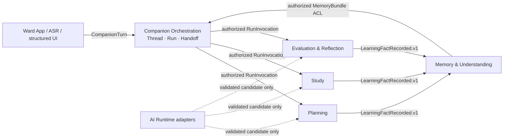
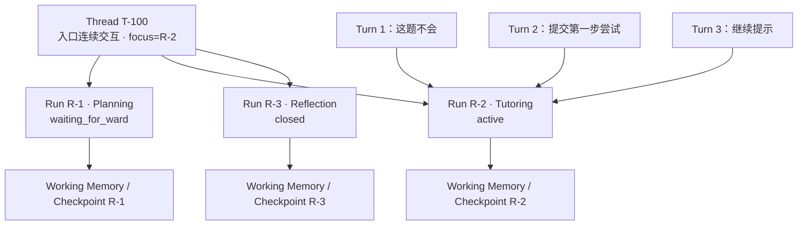
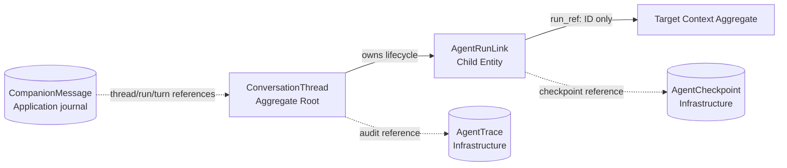
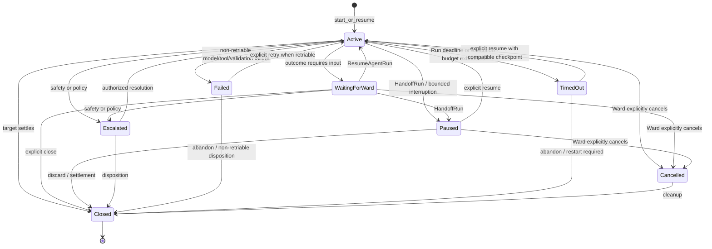
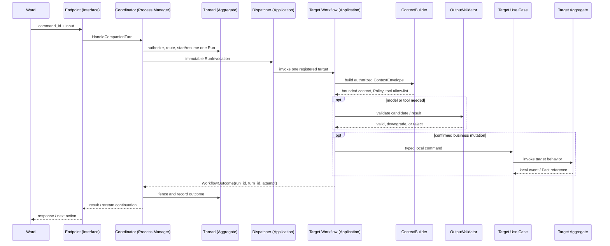
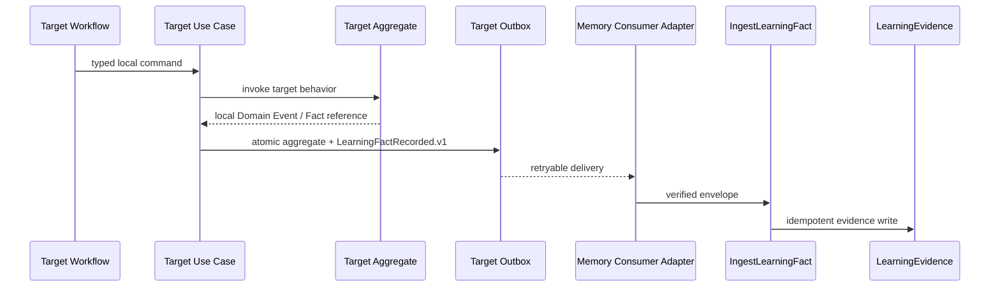

# 读学系统 — Companion Orchestration Context & Agent Runtime Design

> 状态：讨论稿 · 版本：v3.1<br>
> 范围：统一陪伴入口、Thread/Run 连续性、Coordinator Process Manager、目标 Workflow 的受控运行契约，以及 Ward 可见的 Companion Interaction Protocol。<br>
> 关联：[DDD Overview](ddd-overview.md) · [Memory Context](domain-memory.md) · [Planning Context](domain-planning.md) · [Study Context](domain-study.md) · [Evaluation Context](domain-evaluation.md) · [Server 物理设计](design-server.md)

## 一、边界、所有权与统一语言

`Companion Orchestration` 是拥有入口连续性状态的 **Supporting Bounded Context**：它拥有
`ConversationThread`、`AgentRunLink` 和受控 Handoff 状态。Ward 可见 transcript 是 Application
维护的不可变 journal，而非领域状态。它不是核心学习业务领域，也不是
无状态的 Application utility。

`CompanionCoordinator` 是这个 Context 内的 **Application-layer Process Manager**。它路由
一次 Ward 输入、维护 Thread/Run 连续性；它不拥有 Planning、Study、Evaluation 或 Memory 的
Aggregate、领域规则和跨 Context 写权限。

| 内容 | 唯一归属 | 本文职责 |
|---|---|---|
| 全局 Context Map、类型与所有权 | [ddd-overview.md](ddd-overview.md) | 只引用，不重新分类 |
| Planning 的模型、用例与固定 Graph | [domain-planning.md](domain-planning.md) | 仅定义 `RunInvocation` / `WorkflowOutcome` 调用契约 |
| Study/Tutoring 的模型、受限 ReAct 与结算 | [domain-study.md](domain-study.md) | 仅定义 `RunInvocation` / `WorkflowOutcome` 调用契约 |
| Evaluation/Reflection 的模型、证据工作流与报告版本 | [domain-evaluation.md](domain-evaluation.md) | 仅定义 `RunInvocation` / `WorkflowOutcome` 调用契约 |
| Evidence、Episode、Signal、Profile、Memory Bundle | [domain-memory.md](domain-memory.md) | 仅定义 ACL Query 与事实投递边界 |
| Thread/Run、Ward-facing transcript journal、Coordinator、Runtime 执行协议 | 本文 | 唯一维护 |
| 表、索引、迁移与部署 | [design-server.md](design-server.md) | 仅逻辑映射 |



| 术语 | 本 Context 中的含义 | 明确不是 |
|---|---|---|
| **Turn** | 一次 `send message` 或结构化 UI 动作的单次请求处理 | 整段会话，也不是模型多步调用的总称 |
| **Thread** | 同一 Ward 的入口顺序、focus Run 与并发边界 | 长期记忆或内嵌的完整消息集合 |
| **Run** | Thread 内一次指向单一目标 Context、可恢复的工作流引用 | 目标业务 Aggregate 的复制 |
| **CompanionMessage** | 由已接受 Turn/已验证 Outcome 同步写入、供 Ward 查询的不可变 transcript journal record | `ConversationThread` 的 Child Entity、Domain Event、Memory、Trace 或 Checkpoint |
| **Handoff** | Ward 明确意图或受验证 UI 语义触发的 Context 切换 | 完整对话/Prompt/Working Memory 的传递 |
| **Working Memory** | 当前 Run 的确定性状态、已验证交互/工具事实和受预算摘要 | Memory Context 的写 Aggregate |
| **Fact** | 目标 Context 已确认、可追溯的业务发生 | 模型候选、Trace 或原始聊天 |
| **Trace** | 脱敏运行审计 | Domain Event 或学习事实 |

### 1.1 Thread、Run 与 Turn 的层级

一个 `Thread` 是入口连续交互的容器；其内可有多个面向不同目标的 `Run`，每个 Run 可跨
多个 `Turn`，且各自拥有独立的 Working Memory / Checkpoint。Thread 仅管理 focus、
Handoff、回复权和并发版本。



同一 Run 可按 `ContextSpec` 读取受限的、同 Run 的近期消息窗口、确定性业务状态和已验证摘要，解决
“这一步”“刚才那题”的指代。完整 transcript 不得跨 Context Handoff，也不得进入 Memory、Trace 或
Checkpoint。

## 二、Companion 的领域模型

### 2.1 Aggregate Map

`ConversationThread` 是当前唯一写 Aggregate；`AgentRunLink` 是 Child Entity。一个根可原子
保护 focus、唯一回复权与 Handoff，因此不另设 Run Aggregate。Ward-facing transcript 是 Application
journal，不参与这些不变量，也不被加载进 Thread。Checkpoint/Trace 同样是不参与这些不变量的
Infrastructure records。



### 2.2 Aggregate Card 与 Entity Inventory

| 项目 | ConversationThread 设计 |
|---|---|
| Identity | `thread_id`，归属 `ward_id` |
| Child Entity | `AgentRunLink`；Ward-facing transcript 是 Application journal，不属于 Aggregate |
| Value Object | `RouteDecision`、`ContextRef`、`ThreadVersion`、`RunInvocation` |
| 强一致不变量 | Ward 归属；`expected_thread_version` 匹配；focus 指向本 Thread 未关闭 Run；一次 Turn 只启动/恢复一个 Run；同一时刻仅 focus Run 有回复权；Handoff 不携带未授权状态 |
| 领域行为 | `route()`、`start_or_resume()`、`handoff()`、`record_outcome()`、`advance_version()` |
| 本地事件 | `RunRouted`、`RunHandedOff`、`RunOutcomeRecorded`；不跨 Context 发布 |
| Repository Port | `ConversationThreadRepository`，原子加载/保存 Thread 与 Link |

| 对象 | 类型与 Identity | 决策相关状态 | 行为 | 不变量职责 |
|---|---|---|---|---|
| `ConversationThread` | Aggregate Root；`thread_id` | `ward_id`、`focus_run_ref`、`version` | `route()`、`start_or_resume()`、`handoff()`、`record_outcome()` | 所属、版本、focus 合法性、唯一回复权 |
| `AgentRunLink` | Child Entity；`run_id` | `agent_type`、`run_ref`、`status`、`context_refs`、`checkpoint_ref`、`attempt` | `resume()`、`wait_for_ward()`、`pause()`、`close()`、`escalate()` | 不跨 Ward/Thread；仅 Root 可变更生命周期 |
| `RouteDecision` | Value Object | `target`、`mode`、`reason`、`confidence` | `is_startable()` | `clarify/safety` 不建 Run；理由可审计 |
| `ContextRef` | Value Object | `context_type`、`object_id`、`visibility`、`grant_version` | `authorize(actor)` | 仅受权引用，不携带领域状态 |
| `ThreadVersion` | Value Object | `value` | `matches()`、`next()` | 防止并发覆盖 |

### 2.3 Run 生命周期



`clarify` 与 `safety` 是入口结果，不创建业务 Run。每次状态更新带 `turn_id`、Run `attempt`
及 Thread 版本/fencing 条件。旧 Run 的 Outcome/SSE 在 Handoff 后晚到时，必须因 focus 或
attempt 不匹配而被丢弃，不能覆盖新 Run。

`failed` 保存不可在当前 attempt 内自行消解的模型、工具或输出校验失败；仅在 Outcome 标为
`retriable` 且 Ward 显式选择重试时，才可由 `ResumeAgentRun` 进入新 attempt。`timed_out` 表示
Run deadline 或声明的执行预算耗尽，保留兼容 Checkpoint 后等待 Ward 恢复或重新开始；它不是
成功完成。`cancelled` 只由认证 Ward 的显式取消命令产生，不能由 SSE/HTTP 连接断开隐式产生。
模型调用或工具调用内部的短暂重试不改变 Run 生命周期；达到声明上限后才产生 `failed` 或
`timed_out` Outcome。终态或 abandon 后的清理不得从 Trace/摘要重新构造已删除状态。

## 三、Coordinator Process Manager

Coordinator 是 Application-layer Process Manager：它可通过本 Context 的 Aggregate Repository 和
`CompanionTranscriptStore` **Port** 保存已被领域行为接受的 Thread/Run，以及其 Ward-facing journal record，
并编排同一 Context 的短 Unit of Work；它不得直接使用 ORM/SQL，也不能直接写目标 Context 的
Repository/ORM 或创建多 Context 全局事务。

路由优先级固定为：安全与权限 → 服务端验证的 `route_hint` → focus Run 正常续接 → 明确单一
意图 → 有限分类/澄清。多个未指定优先级的业务意图必须澄清。未来分类模型只能提出受限
`RouteDecision`，仍受规则和 UI hint 覆盖，不得获得工具或写权限。

### 3.1 状态变更触发矩阵

| 触发 | Interface | Use Case / Process Manager | 本地行为 | 后续 | 一致性、幂等与失败 |
|---|---|---|---|---|---|
| Ward 文本、ASR 或 UI 动作 | `POST /companion/turn` | `HandleCompanionTurn` | load Thread → `route()` → start/resume Link → version++ → append accepted Ward journal record | `RunRouted`、最小 Trace、`RunInvocation` | optimistic lock；`command_id` 重试返原结果；澄清/安全不建 Run，但可产生已校验的 Ward-facing 回复 |
| focus Run 续接 | 同上 | `ResumeAgentRun` | 校验状态和 checkpoint/policy → `resume()` | 新 attempt 的 Invocation | `run_id + turn_id` 唯一；不兼容返回重新审阅 |
| 明确新目标或受验证 UI | 同上 | `HandoffRun` | 原 Link pause/close，创建/恢复目标 Link，更新 focus | `RunHandedOff` | 同一 Thread 事务；没有明确意图则澄清 |
| Workflow 返回结果 | completion adapter | `RecordWorkflowOutcome` | fence `run_id + attempt + focus` → `record_outcome()` → append validated companion journal record | Trace / 可恢复引用 | 重复无副作用；迟到 Outcome 不夺回回复权或写可见消息 |
| 安全或模型/工具拒绝 | Router / Validator | `HandleCompanionTurn` / `RecordWorkflowOutcome` | 不建 Run 或 `escalate()` | 安全 Outcome/Trace | 不产生 Learning Fact；安全降级/升级 |
| 模型、工具或输出校验失败 | Target Workflow / Runtime adapter | `RecordWorkflowOutcome` | 当前 attempt 内按 Policy 有界重试；耗尽后 `failed` | 脱敏 failure Outcome / Trace | `retriable` 才允许 Ward 显式重试；不写 Fact 或业务状态 |
| Run deadline 或执行预算耗尽 | Runtime budget guard | `RecordWorkflowOutcome` | `timed_out` 并保留兼容 checkpoint 引用 | 恢复/重新开始交互 | 不在同一 attempt 延长预算；恢复会创建新 attempt |
| Ward 取消 Run | 认证 `POST /companion/runs/{run_id}/cancel` | `CancelAgentRun` | focus 且可取消 Link → `cancelled` | 最小 Trace / 停止展示后续输出 | `run_id + command_id` 幂等；迟到 Outcome 仅审计不展示 |
| SSE/HTTP 传输断开 | SSE adapter | 无生命周期写入 | 终止本次传输，Run 状态不变 | 允许同一 focus/attempt 重连 | 不得把断流解释为 Ward 取消或业务失败 |

### 3.2 Use-case Cards

#### `HandleCompanionTurn`

- Actor/授权：认证 Ward；`thread_id` 必须属于 Ward。
- 输入：`command_id`、`thread_id?`、`expected_thread_version?`、`TextTurn | StructuredWardCommand`。
- 事务：短事务加载/创建 Thread、校验版本和命令幂等、路由并仅创建/恢复一个 Link 与最小 Trace；
  仅在 `ConversationThread` 已接受该 Turn 后，通过 `CompanionTranscriptStore` 追加 Ward-facing journal record。
  Thread/Run/命令幂等记录/journal record 必须作为同一 Unit of Work 提交。
- 后续：提交后才交付不可变 `RunInvocation(run_id, turn_id, attempt, context_refs)`；模型调用绝不占用 Thread 事务。
- 失败：陈旧版本 `409`；未知/多意图返回 `clarify`；失败不留下半创建第二个 Run。

#### `ResumeAgentRun`

- 前置：Run 为 focus、状态可恢复、Ward 有权、graph/policy/checkpoint 版本兼容。
- 事务：递增 attempt，保存恢复意图；不复制 Checkpoint 内容。
- 幂等：`run_id + command_id` 相同请求返回原结果；同 key 不同 payload 拒绝。
- 失败：缺失/不兼容 checkpoint 返回重新审阅或重新开始，不猜测恢复状态。

#### `HandoffRun`

- 前置：Ward 明确自然语言目标或服务端验证 UI 语义；目标在 allow-list。
- 事务：原 Link 转 `paused`/`waiting_for_ward`/`closed`，原子更新 focus 并创建/恢复目标 Link。
- 载荷：仅 `ContextRef.authorize()` 后的对象 ID、visibility、授权版本。
- 禁止：完整对话、完整 `TutorWorkingState`、未验证模型推断、共享目标 Aggregate。

#### `RecordWorkflowOutcome`

- 输入：经 schema 校验的 Outcome，含 `run_id`、`turn_id`、`attempt`、`run_status`、`outcome_type`、`trace_id`；失败时必须带 `failure.code`、`failure.retriable` 与 `resume_action`。
- 事务：fence 校验后更新状态/checkpoint 引用，追加红删 Trace；仅当 Outcome 通过展示与安全校验，且
  `run_id + turn_id + attempt + focus` 仍匹配时，追加 companion 的最终 transcript journal record。Run Outcome、
  Trace 与该 journal record 必须作为同一 Unit of Work 提交。
- 业务副作用：只由目标 Context 的 Use Case 写入；Coordinator 不直接改计划、答疑、复盘或 Memory。
- 失败：重复无副作用；迟到结果不展示为当前回复；`failed`、`timed_out` 与 `cancelled` 不能伪造成功或发布 Fact。当前 attempt 内的技术重试由 Runtime 执行，不创建新的 Thread 状态；Ward 选择 retry/resume 后才创建新 attempt。

Application 只编排已接受结果的持久化，不自行判断消息是否有效：`ConversationThread` 的版本、focus、
Run 生命周期与 fence，以及 Workflow 的展示/安全 Validator 是消息可见性的前置业务规则。Aggregate
Repository 与 journal store 负责读写抽象，Infrastructure Adapter 才执行 SQLAlchemy/PostgreSQL 操作；
任何 Entity/record 均不直接执行数据库 I/O。

#### `CancelAgentRun`

- Actor/授权：认证 Ward；`run_id` 必须属于其 Thread，且 Run 必须是当前 focus 或经明确 UI 选择的可取消 Run。
- 输入与幂等：`run_id`、`command_id`、`expected_thread_version?`；同一 `run_id + command_id` 返回同一取消结果，同 key 不同载荷拒绝。
- 事务：fence 校验后将 `active`、`waiting_for_ward` 或 `paused` Link 转为 `cancelled`，清除 focus 或提供后续入口，并追加最小 Trace；不删除由目标 Context 已完成的独立本地事务。
- 后续：通知 Runtime 停止尚未开始的步骤；不可中断的在途外部调用只能让其 Outcome 成为迟到审计记录，不能恢复回复权或业务写入。

## 四、Run 执行协议与目标 Workflow

### 4.1 控制权

```text
Coordinator：本 Turn 路由到哪个唯一 Run、focus、Handoff、Thread 并发和审计
Target Workflow：Run 内是否等待 Ward、读取何种最小上下文、是否调用模型/工具
OutputValidator：候选是否符合 Schema、Policy、预算、工具和安全限制
Target Context Use Case：业务状态是否允许变化、是否产生稳定 Fact / Outbox
```

目标 Workflow 不得调用另一 Workflow；跨目标意图回到 Coordinator，由下一次 Turn 的 Handoff
处理。

### 4.2 单次 Turn 时序



| Participant | Canonical type | 所有职责 |
|---|---|---|
| Ward | Actor | 发起受权 Turn |
| Endpoint | Interface | 鉴权、DTO、错误映射 |
| Coordinator | Process Manager | Thread/Run 连续性与唯一目标路由 |
| Thread | Aggregate Root | focus、生命周期和并发不变量 |
| Dispatcher / Workflow | Application | 调度一个已注册目标并执行受控步骤 |
| ContextBuilder / Validator | Application | 最小上下文与候选/Policy 校验 |
| Target Use Case / Aggregate | Application / Aggregate Root | 本地业务规则与事务 |

### 4.3 ContextEnvelope 与模型/工具循环

Workflow 必须声明版本化 `ContextSpec`：Memory 范围、近期会话窗口、摘要策略、工具 allow-list、
模型/工具次数、token 预算、终止条件与 checkpoint 版本。`ContextBuilder` 只能装配声明允许的内容。

| 内容 | 来源与规则 |
|---|---|
| 当前目标和对象 ID | `RunInvocation` / 授权 `ContextRef` |
| 同一 Run 连续性 | 目标 Context 的受控消息窗口、确定性状态与已验证摘要，按预算裁剪 |
| 学习理解 | `MemoryFacade.resolve_context()` 返回的 ACL、visibility、freshness 标注后的 Bundle |
| Policy / 工具 | `PolicyRegistry` 的版本快照与 allow-list |
| 禁止内容 | 其他 Ward 数据、完整原始聊天、Memory Aggregate、CoT、未裁剪工具原文 |

模型只能产生展示、教学动作、工具请求或 state patch **候选**。任何会持久化或影响提示等级、会话
生命周期、计划、复盘和学习事实的结果，都要转成类型化本地命令，并经目标 Context 规则允许。
纯展示回答可不发布 Fact；已验证的 Ward 尝试、实际提示、工具事实或关闭会话才可能发布 Fact。

### 4.4 目标 Workflow 的最小契约

| 目标 Context | Workflow 可做什么 | 不可做什么 | 当前状态 |
|---|---|---|---|
| Planning | 审阅草稿、补字段、等待确认、调用 Planning 用例 | 绕过确认、容量/version guard 或直接写正式表 | 有限 Adapter 已接入 |
| Study / Tutoring | 受限 ReAct、教学候选、校验动作/工具/预算、调用 Tutoring 用例 | 代写、无限循环、候选直接升 Signal | 目标契约，完整 Runtime 待落地 |
| Evaluation & Reflection | 收集自评、基于锁定证据生成候选、调用 Reflection 用例 | 伪装未到达证据、覆盖旧报告语义 | 目标契约，完整 Workflow 待落地 |

## 五、Query、接口与 Outcome 契约

| Query Model | 消费者 | 来源 | 新鲜度与限制 |
|---|---|---|---|
| `CompanionThreadView` | Ward 入口 | Thread + Run Link | Thread 提交后强一致；仅当前 Ward 的 focus/状态/下一步 |
| `CompanionTranscriptView` | Ward 对话 UI | `CompanionTranscriptStore` 中的 `CompanionMessage` journal | 同一 Unit of Work 后强一致；仅当前 Ward；按 Thread 版本游标分页；可按 `run_id` 分段展示，但不把完整历史作为跨 Context Query 或 Handoff 载荷 |
| `WorkflowInteractionView` | Ward 当前屏 | 已校验 Outcome + 目标 Query 投影 | 见 [§5.2 Companion Interaction Protocol](#52-companion-interaction-protocol)；完整对话不是跨 Context Query Model |
| `MemoryBundle` | ContextBuilder | Memory Query ACL | 单次授权快照；预算/freshness 标记；不能用于写决策 |

### 5.1 Ward-facing transcript journal

`CompanionMessage` 是 Application 维护的 append-only transcript journal，不是写模型。它只记录一条已接受的 Ward
表达或一条已验证的 companion 最终回复；可见作者仅为 `ward | companion`。System prompt、模型推理、
内部路由、Trace、Checkpoint、未校验候选及原始工具输出不可投影。可变的目标业务状态（例如计划草稿）
不复制到历史消息中，只以目标 Context 的对象引用和版本供 UI 刷新其当前视图。

| Contract | 请求/结果语义 | 授权、幂等与兼容 |
|---|---|---|
| `CompanionTurn` | Ward 提交 `command_id`、Thread/version、文本或受验证 UI 动作与 route hint；结果关联 Thread、Run、Turn、当前版本和已校验交互 | `route_hint` 仅来自服务端验证 UI；相同 `command_id` 返回同一结果 |
| `GetCompanionTranscript` | 按 Thread 和 `before_thread_version` 游标返回 Ward-facing messages、下一游标及当前 Thread 版本 | 仅 Thread 所属 Ward；不得一次读取无限历史；只读，不改 Aggregate |
| `WorkflowOutcome` | 返回已校验的展示回复、下一步交互、Run 状态、恢复动作和脱敏失败信息 | 仅当前 `run_id + turn_id + attempt + focus` 可追加 companion journal record；旧 Outcome 只审计不展示 |

目标读取接口为 `GET /companion/threads/{thread_id}/messages?before_thread_version=&limit=`；客户端以
`command_id` 将乐观 Ward 气泡与服务端投影合并，重试同一命令不得产生重复气泡。当前实现仍用较宽松的
`content`、`turn: dict` 和元数据响应；上述为目标契约，迁移必须保持兼容或显式版本化。
`WorkflowFailure` 至少含稳定 `code`、面向 Trace 的脱敏 `detail`、`retriable` 与失败来源
（`model`、`tool`、`validator`、`budget`、`transport`）；`failure` 只在 `outcome_type=failure`
时必填，`resume_action` 必须与 Run 状态机允许的转换一致。

SSE（目标能力）必须绑定 `thread_id`、`run_id`、`turn_id`、`attempt`、Policy 版本与单调
`sequence`。客户端只展示当前 focus Run/attempt 的事件；重连按最后确认 sequence 恢复。流式文本
不是写模型，也不为每个 delta 写 transcript journal：客户端可暂时显示增量，只有最终且通过 fence/
展示校验的 Outcome 才写入一条 companion journal record。传输断开只终止本次 SSE delivery，
不得取消 Run；客户端用最后确认的 sequence 请求同一 focus/attempt 的事件。若 sequence 已过期、
attempt 已变化或 Run 不再是 focus，服务端返回当前 `CompanionThreadView` / `WorkflowOutcome`，
客户端不得拼接旧流。Ward 取消必须走受权、幂等的取消命令。

### 5.2 Companion Interaction Protocol

本协议是读学自有的 **Interface / Application 契约**，版本 `companion-interaction.v1`。
它不是 Domain Aggregate，也不是 AG-UI / Generative UI：模型不得发明 `kind`、按钮或写入命令。
各业务 Context 仍拥有自己的 Query 投影；本协议只规定「这一轮给 Ward 看什么、允许点什么」。

当前实现仍返回宽松 `interaction: dict`。新客户端必须按本信封解析；未知 `kind` 降级为 `text`，
不得执行未知 `action`。迁移期间旧字段（如 `planning_confirm`、`items`）可并行，但不得再扩展。

#### 5.2.1 三层分工

```text
Ward 输入     CompanionTurn = TextTurn | StructuredWardCommand + media_refs
历史气泡     CompanionMessage = text + media_refs + object_ref?     （journal，不可变）
当前屏       WorkflowInteractionView = kind + parts + actions + object_ref
业务真相     PlanDraftView / TutoringInteractionView / DualTrackReport …  （目标 Context Query）
```

| 层 | 拥有者 | 放什么 | 不放什么 |
|---|---|---|---|
| `CompanionTurn` | Interface | 文本、附件引用、已校验动作、`command_id`、Thread 版本 | 模型自由 JSON、未授权媒体 |
| `CompanionMessage` | Application journal | 最终可见文字与媒体引用 | 计划草稿快照、CoT、tool 原文 |
| `WorkflowInteractionView` | Application Outcome | `kind`、展示 parts、允许动作、对象引用 | 另一个 Context 的 Aggregate 内部 |
| 目标 Query | Planning / Study / Evaluation | 确认列表、提示卡、盲评卡等业务字段 | 聊天历史 |

App 按 `kind` 选择组件；业务数字一律用 `object_ref` 再拉一次目标 Query，避免气泡里的过期草稿。

#### 5.2.2 关闭的 `kind` 清单

`kind` 只能由目标 Workflow + OutputValidator 产出。新增 `kind` 必须改本协议并同步 App allow-list。

| kind | 产品用途 | 主要 parts | 允许动作（子集） | 业务投影 |
|---|---|---|---|---|
| `text` | 普通说明、追问、安全降级文案 | `text` | 无，或仅继续输入 | 无 |
| `text_media` | 图文提示（当前仅图片；视频未开放） | `text` + `media_ref` | 无 | 无 |
| `clarify` | 缺时长等单一必要问题 | `text` | `reply` | 无或当前草稿引用 |
| `plan_confirm_list` | 全部未完成任务：耗时、开始、结束 | `text` + `object_ref` | `confirm`（仅 `confirm_enabled`）、`edit`、`discard` | [PlanDraftView](domain-planning.md) |
| `tutoring_hint` | 启发式提示卡 + 阶梯 | `text`（Markdown/LaTeX） | `understood`、`more_hint`、`close` | TutoringInteractionView |
| `self_review` | 盲评自评卡 | `object_ref` | `submit_review` | Evaluation 盲评投影 |
| `achievement` | 任务收官轻量成就 | `text` | `close` | StudySession 结算 |
| `failure` | 可恢复失败 | `text` | `retry` / `restart`（仅 Outcome 允许时） | 无 |

没有 `generative_ui`、`custom_widget`、`tool_call_card`。视频、语音播报作为 `media_ref.kind` 扩展，不新开交互协议。

#### 5.2.3 信封与动作契约

```python
class ObjectRef(BaseModel):
    context: Literal["planning", "study", "evaluation"]
    object_type: str          # plan_draft | tutoring_session | self_review | ...
    object_id: str
    object_version: int
    query: str                # GetPlanDraft / GetTutoringInteraction / ...

class MediaRef(BaseModel):
    kind: Literal["image"]    # 本期仅 image；audio/video 需另开评审
    oss_key: str
    content_type: str

class InteractionPart(BaseModel):
    type: Literal["text", "media_ref", "object_ref"]
    text: str | None = None           # type=text；tutoring 允许 markdown+latex
    media: MediaRef | None = None
    object_ref: ObjectRef | None = None

class AllowedAction(BaseModel):
    name: Literal[
        "confirm", "edit", "discard", "reply",
        "understood", "more_hint", "close",
        "submit_review", "retry", "restart",
    ]
    label: str
    command: Literal[
        "confirm_plan", "patch_plan", "discard_plan",
        "clarify_reply", "tutor_understood", "tutor_more_hint", "tutor_close",
        "submit_self_review", "retry_run", "restart_run",
    ]
    enabled: bool
    payload_schema: str | None = None

class WorkflowInteractionView(BaseModel):
    protocol: Literal["companion-interaction.v1"]
    kind: Literal[
        "text", "text_media", "clarify", "plan_confirm_list",
        "tutoring_hint", "self_review", "achievement", "failure",
    ]
    run_id: str
    turn_id: str
    attempt: int
    parts: list[InteractionPart]
    actions: list[AllowedAction] = []
    object_ref: ObjectRef | None = None

class StructuredWardCommand(BaseModel):
    command_id: str
    thread_id: str
    expected_thread_version: int
    command: str              # 必须落在上一轮 actions[].command 且 enabled
    payload: dict = {}        # 仅符合 payload_schema
```

`POST /companion/turn` 仍是唯一写入口。自然语言 Turn 的 `content` 继续存在；结构化动作必须走
`StructuredWardCommand`，不再新增平行布尔字段（停止扩展 `planning_confirm` 这类一次性开关）。

确认类动作（`confirm_plan`、`submit_self_review`）由目标 Use Case 再校验不变量；信封里的
`enabled=false` 只是 UI 门闩，不是业务授权。

#### 5.2.4 流式事件（目标能力，非写模型）

SSE 只传输展示增量，事件名固定。客户端可拼 `TEXT_DELTA`；只有最终 `INTERACTION_READY` 才刷新当前屏，
只有 fence 通过的 Outcome 才写入一条 `CompanionMessage`。

| event | 含义 |
|---|---|
| `TEXT_DELTA` | 当前 Turn 的可见文字增量；不落库 |
| `INTERACTION_READY` | 完整 `WorkflowInteractionView` |
| `RUN_FINISHED` | `run_status` + `outcome_type` |
| `FAILURE` | `WorkflowFailure`；动作为 `retry`/`restart`/`none` |

禁止 `TOOL_CALL`、`STATE_PATCH`、`CUSTOM_COMPONENT` 一类通用 Agent 事件进入 Ward App。

#### 5.2.5 校验与失败

| 规则 | 行为 |
|---|---|
| 未知 `kind` / 未知 `command` | 拒绝执行；展示 `text` 降级或 `failure` |
| `confirm` 但目标 `confirm_enabled=false` | `409`，返回最新 `PlanDraftView` |
| `media_ref` 不属于当前 Ward 前缀或不存在 | `400`，不展示 |
| 模型候选含未登记 `kind` 或动作 | OutputValidator 丢弃，确定性降级 |
| 旧客户端只认识 `interaction.items` | 服务端可同时填兼容字段一个版本窗口，之后删除 |

## 六、跨 Context 事实边界

目标 Context 在自己的本地事务中持久化业务 Aggregate 与 `LearningFactRecorded.v1` Outbox；
Coordinator 不直接写 Memory。



事件 envelope、来源四元组、顺序、死信与对账以 [domain-memory.md](domain-memory.md) 和
[ddd-overview.md](ddd-overview.md) 为准。Trace、Checkpoint 和模型候选不得替代 Fact。

## 七、Infrastructure、治理与当前实现

| Port owner | Adapter / dependency | 责任与失败边界 |
|---|---|---|
| `ConversationThreadRepository` | SQLAlchemy / PostgreSQL | 原子 Thread/Link；版本冲突 `409`；不读目标 Aggregate |
| `CompanionTranscriptStore` | SQLAlchemy / PostgreSQL | 写入已接受的 Ward/validated companion journal record，按 Ward/Thread/version 游标读取；以 `command_id` 及 Run/Turn/attempt 来源去重；它是 Application journal store，不是 Aggregate Repository |
| `WorkflowDispatcher` | registered Workflow adapters | 仅调用一个 allow-listed target；未知类型安全拒绝 |
| `ContextBuilder` / `MemoryQueryPort` | `MemoryFacade` | ACL、visibility、预算、freshness；失败安全降级，不能回退原始聊天 |
| `ModelGateway` / `ToolGateway` | LLM、检索等 adapters | 超时、限流、预算耗尽、未注册工具均为受控失败，不决定领域状态 |
| `OutputValidator` / `PolicyRegistry` | versioned policy adapter | Schema、安全、反代写、证据、工具/预算校验，记录版本 |
| `CheckpointStore` | LangGraph checkpointer | 仅恢复引用/digest；不兼容则拒绝恢复 |
| `TraceWriter` | redacted audit store | 不保存 CoT、完整 Prompt、完整工具原文 |

当前 ORM/迁移的逻辑映射为：Thread/Run → `conversation_threads` / `agent_runs`；
Checkpoint/Trace → `agent_checkpoints` / `agent_traces`；Application transcript journal →
`companion_messages`。其表、外键、唯一约束、索引、媒体清理和留存策略只在
[design-server.md](design-server.md) 维护，本文不复制物理设计。
Coordinator 事务必须短小，不能包住模型/工具调用；目标 Context 写入是其自己的事务，跨
Context Fact 通过目标 Outbox 最终一致进入 Memory。

若未来改为异步 Run dispatch，须先定义 `dispatching` Run、dispatch Outbox、消费幂等键、
超时租约、死信和对账，不能凭 Checkpoint 猜测是否执行。删除/被遗忘权流程须清理 Thread、Run、
`CompanionMessage`、Checkpoint、Trace 和目标会话消息及其媒体引用，且不得从摘要/Trace 恢复
已删除内容。

当前已实现：Thread/Run/Checkpoint/Trace 持久化、规则路由、`MemoryFacade`、`/companion/turn`、
`command_id` 幂等、Run/turn/attempt/focus fence、取消命令与可重放 SSE 事件。Memory Fact 的异步
投递由 Outbox Consumer/Celery Worker 处理。Planning、Tutoring、Reflection 通过类型化 Qwen
Gateway 各允许每 Turn 一个候选调用，分别由 `PLANNING_MODEL_NAME`、`TUTORING_MODEL_NAME`、
`INSIGHT_MODEL_NAME` 路由；只有 `AGENT_MODEL_ENABLED=true` 才会发送脱敏 `ContextEnvelope`。
外部工具仍为零预算。候选必须通过 Policy/Validator；失败时确定性降级，且不得作为业务写入。
`CompanionMessage` journal 由 Coordinator 在短事务中追加，`CompanionTranscriptView` 通过 Ward 专属
分页 API 读取；Ward 首页只经 `/companion/turn` 写入统一入口。

## 八、验收场景

```gherkin
Given Thread 版本为 4，focus Run 是答疑 Run
When Ward 用新 command_id 和 expected_thread_version=4 明确请求“帮我安排明天复习”
Then Coordinator 在同一 Thread 事务中暂停可暂停答疑 Run 并创建或恢复唯一 Planning Run
And Handoff payload 不含完整答疑状态或原始对话

Given 同一个 command_id 因网络超时重复提交
When HandleCompanionTurn 再次处理
Then 返回原来的 Thread/Run 结果
And 不创建第二个 Run 或重复触发业务写入

Given Planning Run 已 Handoff，旧答疑 Run 的流式 Outcome 随后到达
When RecordWorkflowOutcome 校验 run_id、turn_id、attempt 与 focus
Then 它被审计或丢弃
And 不显示为当前回复，也不覆盖新的 focus Run

Given Tutoring 模型候选含未注册工具和可直接抄写的答案
When OutputValidator 校验
Then Workflow 返回安全降级或等待 Ward 的 Outcome
And 不写业务状态、Learning Fact、Signal 或 Policy

Given Reflection 的客观行为证据尚未到达
When Ward 提交即时自评
Then 结果标注 evidence freshness
And 后续证据只能产生可追溯补充版本

Given Tutoring Run 的模型调用连续达到 Policy 允许的最大重试次数
When Runtime 提交 failure Outcome
Then Thread 只接受带 `failure.code`、`retriable` 和 `resume_action` 的 `failed` Outcome
And 不写 Learning Fact 或业务状态，Ward 只能按 Outcome 显式重试或重新开始

Given Planning Workflow 返回 plan_confirm_list
When App 渲染当前屏
Then 只出现协议允许的 confirm/edit/discard 动作
And 确认列表数据来自 GetPlanDraft，而不是气泡里的过期 items

Given 模型候选带有未登记 kind 或自定义 widget
When OutputValidator 校验
Then 丢弃该候选并降级为 text 或 failure
And 不执行任何 StructuredWardCommand

Given 一个 active Run 的 SSE 连接意外断开
When Ward 在同一 focus Run 和 attempt 上携带最后确认 sequence 重连
Then Run 不因断流进入 cancelled 或 failed
And 服务端仅重放可用的同 attempt 事件，否则返回当前 Thread/Outcome 快照

Given Ward 用新的 command_id 取消当前 focus Run
When CancelAgentRun 通过 Ward、Thread 版本与 Run fence 校验
Then Run 转为 cancelled 且后续迟到 Outcome 不再获得回复权
And 已由目标 Context 提交的独立业务事务不会被 Coordinator 回滚
```
