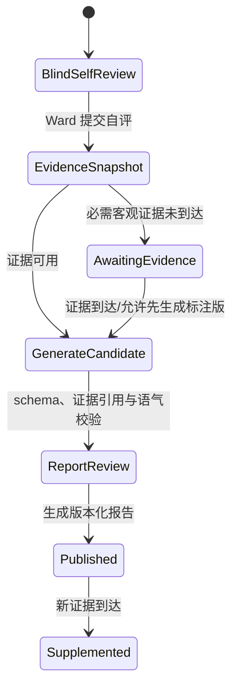

# 读学系统 — Evaluation & Reflection Domain Design

> 状态：讨论稿 · 版本：v1.0  
> 范围：即时自评、客观证据对比、版本化复盘报告、行动锦囊与 Reflection Workflow。  
> 关联：[系统 Context Map](ddd-overview.md) · [Companion 编排](domain-companion.md) · [Memory Context](domain-memory.md) · [Server 物理设计](design-server.md) · [复盘 PRD](../product/prd-evaluate.md)

## 一、边界与不变量

本 Context 拥有 `SelfReview`、复盘报告版本和 Ward 采纳的行动项。它不拥有摄像原始帧/行为分析 Aggregate、答疑会话或长期学习画像。自评是 Ward 的主观陈述；客观证据必须带来源、版本与 freshness，后到证据只能形成可追溯补充而不能篡改既有报告语义。

| 类型 | Identity / 强一致不变量 |
|---|---|
| `SelfReview` Aggregate | `ward_id + review_date/schedule_id` 唯一；提交后保留主观原文和提交时间；不能伪装为客观事实。 |
| `ReflectionReport` Aggregate | `report_id`，含不可变 `ReportVersion` child entity；每版锁定证据与 Policy，补充只追加版本。 |
| `FocusKit` Projection / `ActionAdoption` Aggregate | 建议是可重建 Projection；Ward 采纳创建 `action_adoption_id`，建议本身不等于事实。 |

### 1.1 Aggregate、Use Case 与事件

| Aggregate | 行为 / 本地事件 | Repository Port |
|---|---|---|
| `SelfReview` | `submit()`；`SelfReviewSubmitted` | `SelfReviewRepository` |
| `ReflectionReport` | `publish_version()`、`supplement()`；`ReflectionReportPublished`、`ReflectionSupplementPublished` | `ReflectionReportRepository` |
| `ActionAdoption` | `adopt()`；`FocusKitAdopted` | `ActionAdoptionRepository` |

| Trigger | Entry / Use Case | Domain action | Follow-up |
|---|---|---|---|
| Ward 提交盲评 | API → `SubmitSelfReview` | `SelfReview.submit()` | 触发/请求 EvidenceSnapshot |
| 证据到达或查询完成 | Consumer/Query → `GenerateReflection` | `ReflectionReport.publish_version()` | Report projection；必要时发布 Fact |
| 新证据到达 | Consumer → `SupplementReflectionReport` | `ReflectionReport.supplement()` | 新版 projection，不修改旧版 |
| Ward 采纳行动 | API → `AdoptFocusKit` | `ActionAdoption.adopt()` | `LearningFactRecorded.v1(action_tip_adopted)` Outbox |

## 二、证据版本化 Reflection Workflow

该 Workflow 是固定的证据驱动流程；模型只负责在锁定证据范围内归纳、解释和生成候选表达，不自行补足未到达的视觉/答疑事实。



| 节点 | 控制者 | 要求 |
|---|---|---|
| BlindSelfReview | Evaluation Use Case | Ward 先提交感受、收获、困难；提交前不展示客观行为结论。 |
| EvidenceSnapshot | 查询服务 | 锁定行为片段、答疑事实、计划执行数据及各自版本/freshness。 |
| GenerateCandidate | 模型结构化调用 | 只从 Snapshot 引用证据；缺失信息明确标注，不能推断。 |
| ReportReview | Validator + Domain Service | 校验证据 ID、主客观措辞、未成年人正向沟通与报告版本。 |
| Published / Supplemented | Report service | 发布只读报告版本；新事实生成可追溯补充。 |

## 三、Query、接口、Context 与写回

`ReflectionWorkingState` 是短生命周期运行状态：`schedule_ref`、`self_review_ref`、`evidence_snapshot_ref`、`missing_evidence`、`report_version_draft`、`policy_version`。它不复制行为原始数据或完整答疑聊天；resume 必须重新验证 Evidence Snapshot 是否过期。

`ReflectionInteractionView` 包含盲评表单、证据 freshness、报告状态（`awaiting_evidence` / `ready` / `supplemented`）、主客观时间线、证据说明、行动锦囊和 Ward 可执行动作。Ward 采纳行动项经 `AdoptFocusKit` 写入本 Context，并发布 `LearningFactRecorded.v1(action_tip_adopted)`；报告生成本身只在确有确认事实时发布相应学习事实。

模型不可自由调用写工具；可读能力限于锁定 Evidence Snapshot 和授权的建议资料。证据查询失败或未到达时，返回明确等待/标注版，不输出貌似完整的客观归因。模型/Validator 失败不覆盖既有报告；重新生成产生新候选或保留当前已发布版本。

| Query / View | 消费者与新鲜度 | 来源 |
|---|---|---|
| `GetBlindSelfReview` / `BlindReviewView` | Ward；强一致 | SelfReview / 计划引用 |
| `GetReflectionReport` / `ReflectionInteractionView` | Ward/Guardian；报告发布最终一致，含 evidence freshness | Report Projection、锁定 Snapshot |
| `GetFocusKit` / `FocusKitView` | Ward；可重建 | Report/ActionAdoption Projection |

输入 API 经 Companion Turn 或目标 REST command 映射上述 Use Case；Ward 只能提交/采纳自己的对象，Guardian 只读取已授权报告。Evidence Snapshot 是授权 Query，不直接读取其他 Context Aggregate；`LearningFactRecorded.v1` 的消费由 Infrastructure Consumer → 本地 Use Case 完成，按来源四元组去重。Report/Projection、Outbox 和行为证据 adapter 的物理映射、重试和删除见 [design-server.md](design-server.md) 与 [domain-memory.md](domain-memory.md)。

| Application Port | Adapter / 事务边界 | 失败 / 集成 |
|---|---|---|
| review/report repositories | SQLAlchemy；SelfReview、Report Version、ActionAdoption | 提交/发布/采纳各自本地事务与 command 幂等 |
| evidence snapshot query | 受权行为/Study/Planning Query ACL | freshness/缺失明确进入 InteractionView，不伪造结论 |
| report projection / Fact publisher | Projection Worker；ActionAdoption 本地 Outbox | Report 可重建；`action_tip_adopted` 按来源四元组投递 Memory |

## 四、验收场景

```gherkin
Given Ward 已提交即时自评但客观行为分析尚未完成
When Reflection Workflow 构建 EvidenceSnapshot
Then InteractionView 标记 awaiting_evidence 或已知 freshness
And 不把缺失客观证据写成结论

Given 一份报告已发布，随后新的答疑事实到达
When Report service 生成补充
Then 新内容引用新的证据版本并保留原报告
And Guardian/Ward 可区分补充与原始报告
```
