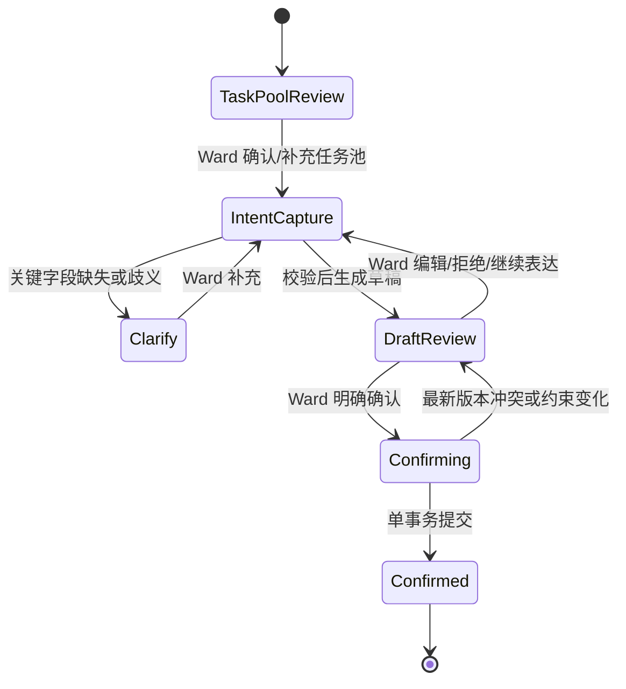
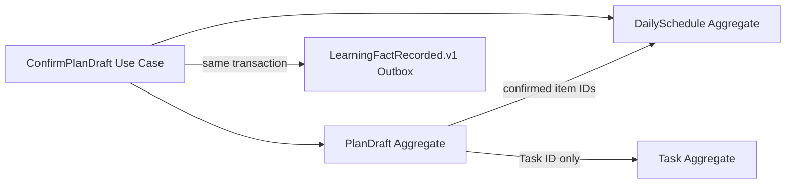

# 读学系统 — Planning & Scheduling Domain Design

> 状态：讨论稿 · 版本：v1.0  
> 范围：已知任务池、Ward 安排意图、计划草稿、确认后的正式日程，以及计划协商 Workflow。  
> 关联：[系统 Context Map](ddd-overview.md) · [Companion 编排](domain-companion.md) · [Memory Context](domain-memory.md) · [Server 物理设计](design-server.md) · [计划 PRD](../product/prd-schedule.md)

## 一、边界与不变量

本 Context 拥有计划草稿、日程安排和任务的计划侧状态；它不拥有入口 Thread/Run、长期记忆、原始摄像行为或 Guardian 对 Ward 的替代决策权。AI 整理 Ward 意图，但 Ward 明确确认前不得写正式计划。

| Aggregate | 强一致不变量 |
|---|---|
| `PlanDraft` | 归属 Ward；引用的任务属于该 Ward；草稿只允许编辑态修改；所有冲突/待澄清项显式存在；确认只能基于当前基准版本。 |
| `DailySchedule` | 仅包含确认后的安排；同一时间槽不可冲突；已开始项不可被静默重排。 |
| `Task` | 任务内容与本次安排分离；必做任务可暂不安排但必须保留原因；未确认来源不能伪装成硬约束。 |

## 二、应用用例与 Workflow Definition

计划协商是固定 Graph，不是 ReAct。模型只在“提取 Ward 意图”“必要追问”“解释草稿调整”节点参与；任务归属、容量、时间冲突、基准版本和确认写入均为确定性服务。



| 节点 | 控制者 | 输入/输出 | 状态与退出条件 |
|---|---|---|---|
| TaskPoolReview | `PlanningDomainService` | 已知任务池、来源、完整度 → 可安排任务/待确认项 | 没有任务时要求 Ward 添加；不生成空正式计划。 |
| IntentCapture | 模型结构化提取 + Validator | 文本/语音/触控 → `ArrangementIntentCandidate` | 只提取 Ward 明示的顺序、时间、时长、休息、偏好和暂不安排理由。 |
| Clarify | 模型生成受控追问 | 待澄清字段 → 单一必要问题 | 字段可由 UI 补齐后回 IntentCapture；不能问卷式扩张。 |
| DraftReview | 确定性排程 + 模型解释 | Intent、任务池、约束 → `PlanDraftView` | 任何调整均带可追溯原因；Ward 可局部编辑、拒绝或恢复原意。 |
| Confirming | `ConfirmPlanDraft` | `draft_id`、基准版本、Ward 确认 → `DailySchedule` | 重新校验任务/日程版本、容量与权限；冲突则回审阅，不覆盖。 |

### 2.1 Aggregate 设计与状态变更



| Aggregate | Identity / 内部对象 | 行为与本地事件 | Repository Port |
|---|---|---|---|
| `PlanDraft` | `draft_id`；`DraftItem` child entity；`ArrangementIntent`、`DraftConstraint` value object | `capture_intent()`、`apply_patch()`、`request_clarification()`、`confirm()`；`PlanDraftConfirmed` | `PlanDraftRepository` |
| `DailySchedule` | `schedule_id`；`ScheduledItem` child entity | `apply_confirmed_draft()`；`ScheduleUpdated` | `DailyScheduleRepository` |
| `Task` | `task_id`；只由 ID 被草稿引用 | `mark_scheduled()` / 本 Context 已有任务行为 | `TaskRepository` |

`ConfirmPlanDraft` 是唯一同时需要 `PlanDraft`、`DailySchedule` 与受影响 `Task` 的本地强一致 Use Case；它以 `draft_id + confirmation_id` 去重，并原子保存正式安排、领域事件及 `LearningFactRecorded.v1` Outbox。

| Trigger | Interface / Use Case | Aggregate 行为 | Projection / Integration Event |
|---|---|---|---|
| Ward 提交意图 | Companion invocation → `CaptureArrangementIntent` | `PlanDraft.capture_intent()` | `PlanDraftView` 强一致更新 |
| Ward 编辑草稿 | UI command → `PatchPlanDraft` | `PlanDraft.apply_patch()` | `PlanDraftView` 强一致更新 |
| Ward 确认 | UI command → `ConfirmPlanDraft` | `PlanDraft.confirm()`、`DailySchedule.apply_confirmed_draft()` | `LearningFactRecorded.v1(plan_confirmed)` Outbox |

## 三、Query、接口与基础设施映射

| Query / View | 消费者与新鲜度 | 来源 |
|---|---|---|
| `GetPlanningTaskPool` / `TaskPoolView` | Ward；查询时强一致 | Task、固定约束、授权 MemoryBundle |
| `GetPlanDraft` / `PlanDraftView` | Ward；草稿提交后强一致 | PlanDraft、任务/日程引用 |
| `GetConfirmedSchedule` / `ScheduleView` | Ward/Guardian；确认后强一致 | DailySchedule projection |

`POST /companion/turn` 是统一入口；目标 UI 的 `edit`、`regenerate`、`confirm` 由 `StructuredWardCommand` 映射为上述 Use Case。Ward 只能修改自己的草稿；Guardian 对确认日程只读。版本冲突映射为 `409` 与最新 `PlanDraftView`。

| Port | Adapter / 物理映射 | 失败与治理 |
|---|---|---|
| repositories | SQLAlchemy；`plan_drafts`、tasks、schedules 表 | `ConfirmPlanDraft` 短事务、乐观版本与幂等约束；物理细节见 [design-server.md](design-server.md) |
| Memory query | `MemoryFacade` ACL adapter | 失败时不用历史偏好，仍可按当前 Ward 意图生成草稿 |
| Outbox publisher | 本 Context 本地事务 → Memory Consumer | `source_type + source_id + event_type + source_version`；投递/死信由 [domain-memory.md](domain-memory.md) 定义 |

## 四、Working State、Context 与工具

`PlanningWorkingState` 随 `PlanDraft` 持久化，字段为 `task_pool_version`、`arrangement_intent`、`missing_fields`、`baseline_schedule_version`、`draft_items`、`unassigned_task_reasons`、`last_reviewed_at`。它不是长期记忆，也不保存完整语音或聊天。

| ContextSpec 内容 | 来源 | 用途 |
|---|---|---|
| 已知任务池和约束 | Planning Query | 生成/校验草稿的唯一任务来源 |
| 当前草稿与版本 | `PlanDraft` | 支持继续编辑与确认前重检 |
| 最近本 Run 的表达摘要 | 受控消息窗口 | 解决“放到后面”等指代 |
| 估时偏差/计划偏好 | `MemoryFacade` 的最小 Bundle | 仅作软建议，数据不足时不推断 |

允许模型调用的能力仅为 `extract_arrangement_intent`、`ask_required_clarification`、`explain_draft_adjustment`。可由 Workflow 直接调用的确定性服务为任务池查询、草稿 patch 校验、容量/冲突校验、确认事务；它们不是模型自由选择的 Tool。模型不得生成任务 ID、时间槽事实或正式写入命令。

## 五、写回、交互与失败

`ConfirmPlanDraft` 在本地事务中写 `DailySchedule` / `Task` 安排状态和 `LearningFactRecorded.v1(plan_confirmed)` Outbox。草稿保存、审阅、取消不产生已确认学习事实。

前端通过 [Companion Interaction 契约](domain-companion.md) 发送 Turn；本 Context 的 `WorkflowInteractionView` 至少包含任务池、草稿时间轴、未安排项、待澄清字段、每项调整理由、基准版本和允许动作（`edit`、`regenerate`、`confirm`、`discard`）。确认失败必须返回版本冲突或约束错误的结构化字段，保留草稿。

模型解析失败返回可编辑的原输入与 `clarify`；约束不可满足返回多个受限草稿或缺口说明；确认的重复请求以 `draft_id + confirmation_id` 幂等返回同一正式日程。

## 六、验收场景

```gherkin
Given Ward 已表达“先数学四十分钟，再英语”
When 计划 Workflow 生成草稿
Then 草稿保留该顺序，任何因固定课程产生的调整都有原因
And 草稿仍为 editable，不写正式日程

Given Ward 确认草稿前日程基准版本已变化
When ConfirmPlanDraft 重新校验
Then 返回结构化版本冲突并回到 DraftReview
And 不覆盖现有正式安排
```
