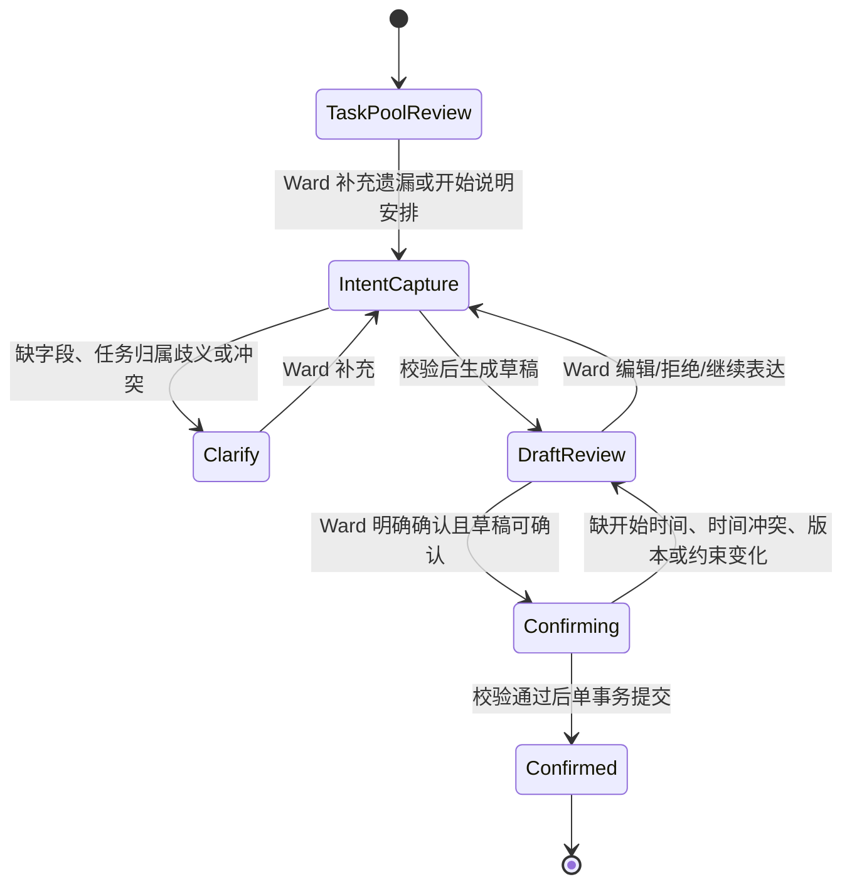
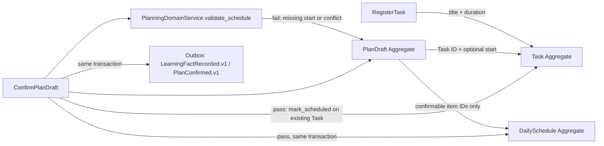
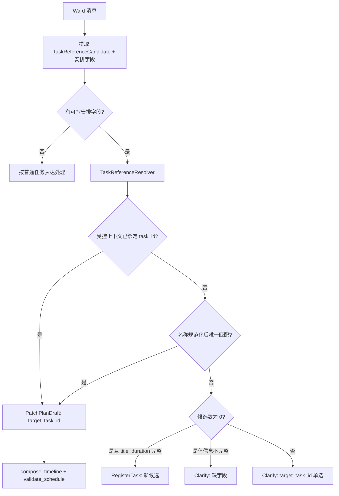
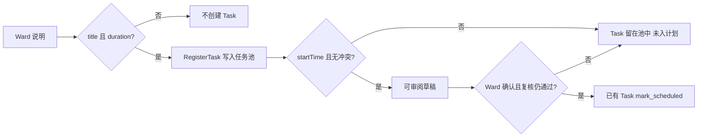
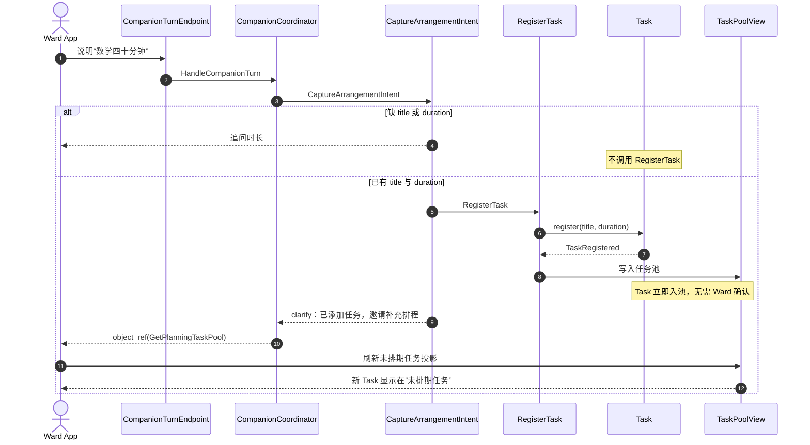
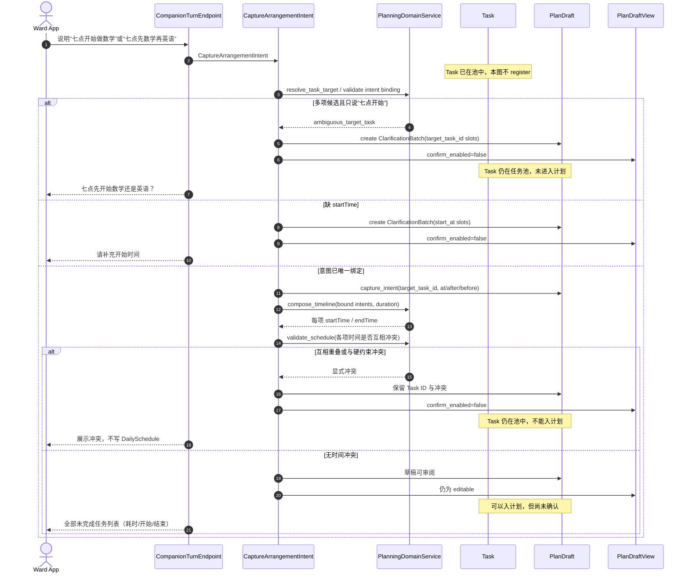
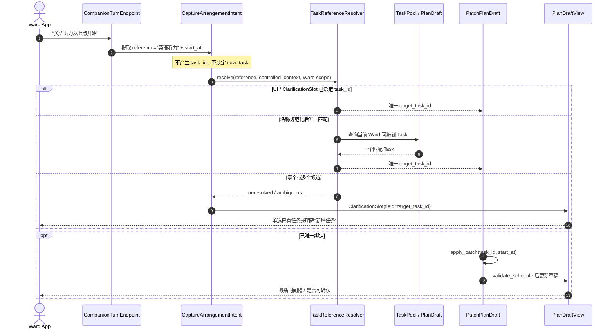
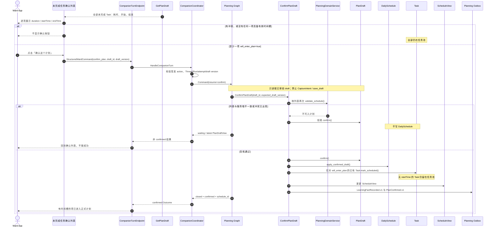
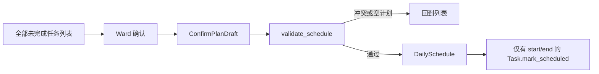

# 读学系统 — Planning & Scheduling Domain Design

> 状态：讨论稿 · 版本：v1.5
> 范围：已知任务池、Ward 安排意图、计划草稿、确认后的正式日程，以及计划协商 Workflow。  
> 关联：[系统 Context Map](ddd-overview.md) · [Companion 编排](domain-companion.md) · [Memory Context](domain-memory.md) · [Server 物理设计](design-server.md) · [计划 PRD](../product/prd-schedule.md)

## 一、边界与不变量

本 Context 拥有任务池、计划草稿和确认后的日程。它不拥有入口 Thread/Run、长期记忆、原始摄像行为或 Guardian 对 Ward 的替代决策权。**创建任务**与**进入计划**分离：有 `title` 与 `planned_minutes` 即可登记 `Task`；要排入正式计划，还须每项有 `start_at` 且通过确定性冲突校验，再经 Ward 确认。所有非结构化 Ward 文本均由模型理解意图与提取槽位；模型不能创建任务、绑定真实 Task ID 或判定无冲突。

`plan_date` 是 Ward 面向用户的本地日历日，而不是 UTC 日期；当前产品时区固定为 `Asia/Shanghai`。时间戳仍以 UTC 存储。Planning Graph、草稿查询、确认和 App 的“今天”必须使用同一个本地 `plan_date`，否则在本地午夜至 UTC 午夜之间会出现草稿落在昨天、今日计划 404 或基准版本错误。

| Aggregate | 强一致不变量 |
|---|---|
| `PlanDraft` | 归属 Ward；只引用已存在的 `Task` ID；每个时间意图必须唯一绑定目标 Task；草稿只允许编辑态修改；要把任务排入计划，每项必须有 `start_at`/`end_at` 且无未解决时间冲突；确认只能基于当前审阅版本。 |
| `DailySchedule` | 仅包含确认后的安排；只挂接已有 Task；同一时间槽不可冲突；已开始项不可被静默重排。 |
| `Task` | 任务内容与本次安排分离；**创建条件是 `title` + `planned_minutes`**，不要求开始时间；未入计划的任务留在任务池；必做任务可暂不安排但必须保留原因；未确认来源不能伪装成硬约束。若本轮可唯一解析为已有 Task 的引用，必须先走该 Task 的 patch，绝不可同时降级为 `new_task`。 |

## 二、应用用例与 Workflow Definition

计划协商是固定 Graph，不是 ReAct。模型只在“提取 Ward 意图”“必要追问”“解释草稿调整”节点参与；任务归属、容量、时间冲突、基准版本和确认写入均为确定性服务。



| 节点 | 控制者 | 输入/输出 | 状态与退出条件 |
|---|---|---|---|
| TaskPoolReview | `PlanningDomainService` | 已知任务池、来源、完整度 → 可安排任务 | 没有任务时要求 Ward 添加；**新任务只要 title+时长即写入任务池，不另做确认**。 |
| IntentCapture | 模型结构化提取 + Validator | 文本/语音 → 无 ID 的 `ArrangementIntentCandidate` | 每条非结构化文本都进入模型，且输入当前草稿、任务池与 active clarification slots。模型可在一轮同时返回时长、开始时间、顺序和局部 patch；不能输出 Task ID、直接写入或判定无冲突。 |
| Clarify | 模型提取 + 确定性写入 | `ClarificationBatch` + 本轮文本 → `slot_updates` 与 `schedule_patches` | active Batch 是模型上下文，不能抢占或短路本轮其它安排意图。缺时长则还不能创建 Task；缺开始时间或 `target_task_id` 歧义时 Task 已在池中、计划不可确认。结构化表单携带 `slot_id` 时才可跳过模型直接写入。 |
| DraftReview | 确定性排程 + 模型解释 | 全部未完成 Task → 确认列表（耗时、开始、结束） | 列表含已排与未排项。`validate_schedule()` 只检查**已填开始/结束**的项是否互相冲突。有冲突或必做任务未排且无原因则禁用确认。 |
| Confirming | `ConfirmPlanDraft` | `draft_id`、基准版本、Ward 确认 | **再次**校验每项开始/结束时间、槽位重叠、硬约束、容量、权限与基准版本；任一失败回 DraftReview，不写 `DailySchedule`。 |

### 2.1 Aggregate 设计与状态变更



| Aggregate | Identity / 内部对象 | 行为与本地事件 | Repository Port |
|---|---|---|---|
| `PlanDraft` | `draft_id`；`DraftItem`（**只含 Task ID** + `TaskScheduleIntent` + 可选派生 `start_at`/`end_at`）；`ArrangementIntent`、`DraftConstraint` | `capture_intent()`、`apply_patch()`、`request_clarification()`、`confirm()`；仅入计划校验通过才发 `PlanDraftConfirmed` | `PlanDraftRepository` |
| `DailySchedule` | `schedule_id`；`ScheduledItem` child entity（Task ID + 时间槽） | `apply_confirmed_draft()`；`ScheduleUpdated` | `DailyScheduleRepository` |
| `Task` | `task_id`；`title`、`planned_minutes`；安排引用另存 | `register(title, planned_minutes)`、`mark_scheduled(schedule_id)`、`unschedule()` | `TaskRepository` |

任务与计划是两条生命周期：`RegisterTask` 在具备 `title` + `planned_minutes` 时**立即**创建 `Task` 并进入任务池，不经过 Ward 确认；说错了删除即可。`start_at` 不是创建条件。`PlanDraft` / `DailySchedule` 只按 Task ID 引用。要把任务排入正式计划，确认屏必须列出**全部未完成 Task**（每项含耗时、开始、结束时间）；Ward 看清后点「确认这个计划」，只有带有效时间槽且无冲突的项才 `mark_scheduled()`。缺开始/结束的项继续留在任务池，不会因为确认而被悄悄排入。口头说明不能替代该动作。

`PlanningDomainService` 拥有跨根的排程规则：`compose_timeline()` 把明示开始时间与各 Task 的时长展开为时间槽；`validate_schedule()` 检查缺开始时间、槽位重叠、硬约束和当日容量。模型只能解释调整，不能判定“无冲突”，也不能创建 Task。

`TaskScheduleIntent` 是时间表达的唯一中间表示，不能只写一个脱离归属的 `start_at`：

| 字段 | 规则 |
|---|---|
| `target_task_id` | 必填；必须属于当前 Ward 的未完成任务，且解析结果只能唯一匹配一个 Task。 |
| `anchor` | `at` \| `after` \| `before`。 |
| `start_at` | 仅 `anchor=at` 时由 Ward 明示；不可由模型猜测。 |
| `reference_task_id` | `after/before` 时必填，且不能等于目标任务。 |
| `source` | `ward_explicit` 或 `deterministic_derived`；后者只能由 `compose_timeline()` 产生。 |

例如“数学 18 点开始”绑定数学；“18 点先数学再英语”绑定数学的 `at=18:00` 和英语的 `after=数学`；任务池有数学、英语但 Ward 只说“18 点开始”时，不得给两项都填 18:00，必须以 `ambiguous_target_task` 进入 Clarify。

#### 2.1.1 任务引用解析与 Patch 分支

“已有任务的排程 patch”不是由“改、调整、修改”等字面关键词触发，而是由本轮意图是否同时包含**任务引用**与**可写的安排字段**决定。模型只能产出不含 ID 的候选，例如 `TaskReferenceCandidate(surface="英语", role="schedule_target")` 与 `patch={start_at: ...}`；`TaskReferenceResolver` 在当前 Ward 的可编辑 Task/草稿范围内完成唯一绑定，之后才允许写入。



模型负责从自然语言抽取 `TaskReferenceCandidate`、`slot_updates` 与 `schedule_patches`；`TaskReferenceResolver` 不再扫描原句判断“几分”是时长还是钟表时间，只对模型给出的无 ID 引用做绑定。其绑定优先级固定如下；每一步必须只产生一个合法 Task，才可进入下一写入动作：

1. 已校验的 UI/Structured command 明示 `task_id`；
2. 当前 `ClarificationSlot.target.task_id`；
3. 当前受控会话焦点（例如 Ward 从某个 Task 卡片进入对话）携带的 `task_id`；
4. 当前 Ward 未完成、可编辑 Task 的规范化名称唯一匹配；
5. 以上均不能唯一确定时，建立 `target_task_id` 的 `ClarificationSlot`，以单选或携带 `slot_id` 的表单要求 Ward 选择。

名称规范化只做可解释、可复现的比较：Unicode/大小写/空白/全半角统一，及经 Task 创建时保存的明确别名；不得仅凭向量相似度、历史偏好或模型猜测绑定。一个缩写（如“英语”）只在它在当前候选集中唯一时可绑定；同时存在“英语听力”和“英语阅读”时必须澄清。解析到已有 Task 的唯一引用后，即使模型同时给出了同名 `new_task` 候选，也必须拒绝该候选并仅执行 patch。若 Ward 确实要新增同名任务，应通过受控“新增任务”动作，或在澄清中明确选择“新增”而非现有项。

`ClarificationBatch` 是澄清交互的最小单位，不等同于一个 Task，也不等同于一条聊天消息：

| 对象 | 字段与规则 |
|---|---|
| `ClarificationSlot` | `slot_id`、`field`（`planned_minutes/start_at/target_task_id/...`）、`target`（已有 `task_id` 或未创建任务的 `candidate_id`）、`status`（`pending/resolved/skipped`）。 |
| `ClarificationBatch` | `batch_id`、多个 Slot、`response_mode`（`named_text/structured_form/single_choice`）、`issued_draft_version`、`status`（`active/resolved/expired`）。同一 Draft 同时最多一个 active Batch。 |
| `named_text` | 本轮原文连同 Batch 交给模型；模型可在一轮返回多个 `slot_updates` 与独立 `schedule_patches`。模型无法唯一归属时必须保留 Slot 并要求澄清；服务端不得用正则、关键词或字符串广播规则自行写入。 |
| `structured_form` | 每个表单字段携带 `slot_id`，可一次安全提交多个值，不依赖模型猜测。 |

完整信息可在一轮内更新多个 Task，不产生 Clarification：例如“英语试卷和数学作业分别 30 分钟和 50 分钟”会生成两个任务候选/更新。只有仍缺字段时才创建一个含多个待补 Slot 的 Batch。

`ConfirmPlanDraft` 是把**已有 Task** 写入正式日程的本地强一致 Use Case；它必须先通过 `validate_schedule()`，再以 `draft_id + confirmation_id` 去重，原子保存 `DailySchedule`、对已有 Task 做 `mark_scheduled()`、领域事件及 Outbox。它不创建 Task。Ward 点击确认不是入计划的充分条件。

| Trigger and source | Interface / entrypoint | Use Case / Process Manager | Aggregate / domain method | Local domain event | Outbox / projection / next | Consistency, idempotency, failure |
|---|---|---|---|---|---|---|
| Ward 说明新任务且已有 title 与时长 | `POST /companion/turn` | Coordinator → `RegisterTask`（可由 `CaptureArrangementIntent` 同事务协调） | `Task.register(title, planned_minutes)` | `TaskRegistered` | 同事务更新 `TaskPoolView` | **无 Ward 确认**；无开始时间也可创建；缺时长则不创建；纠错靠删除 |
| Ward 说明安排（顺序/开始时间） | `POST /companion/turn` | Coordinator → `CaptureArrangementIntent` → `TaskReferenceResolver` | 唯一已有引用则 `PlanDraft.apply_patch()`；否则 `request_clarification()` | 无确认事件 | 同事务 `PlanDraftView`；缺 `start_at` 或目标 Task 歧义则任务留在池中、计划不可确认 | `command_id` 幂等；不得为入计划默认开始时间、复制时间给多个 Task，或将唯一已有引用创建成新 Task |
| 已有 Task 且开始时间足够后生成时间轴 | Planning Workflow / DraftReview | `CaptureArrangementIntent` 后续调用 Domain Service | `compose_timeline()` + `validate_schedule()` | 无 | 有冲突则禁用确认按钮；无冲突仍为 editable 草稿 | 同步、强一致；不写 `DailySchedule`，不新建 Task |
| Ward 局部改时间/顺序 | 文本、语音或已校验 `edit` | `TaskReferenceResolver` → `PatchPlanDraft` | `apply_patch(task_id, schedule_patch)` 后再次 `validate_schedule()` | 无 | 同事务 `PlanDraftView` | 解析依据是任务引用 + 安排字段，不依赖“改”等关键词；非唯一引用进入单选澄清；无 Outbox |
| Ward 确认入计划 | 未完成任务列表上的「确认这个计划」→ 已校验 `confirm` | Coordinator → Planning Graph `Command(resume)` → `ConfirmPlanDraft` | 复核**已审阅** `draft_id + draft_version`，仅对有 start/end 且无冲突的已有 Task `mark_scheduled()` | `PlanDraftConfirmed`、`ScheduleUpdated` | `ScheduleView` | resume 路径不得重新 Capture/Save Draft；列表必须含全部未完成任务；无有效时间槽则不能确认空计划；未填开始时间的项确认后仍留在任务池 |

`PatchPlanDraft` 是同 Context 同步写，无 Outbox。下面 UML 时序图把三件事拆开：**创建任务**只要 title+时长；**已有任务 patch** 必须先唯一绑定 Task ID；**进入计划**要 startTime 且无冲突。确认不再创建 Task。



### 2.2 UML 时序图：创建任务（只要 title + duration）

此图**没有** `start_at`、`DailySchedule`、`validate_schedule`，也**没有 Ward 确认**。缺时长则根本没有 Task；说错了从任务池删除即可。

| Participant | Canonical type | Owned responsibility |
|---|---|---|
| Ward App | Actor | 说出任务名与预计时长 |
| CompanionTurnEndpoint | Interface | 鉴权与 DTO |
| CompanionCoordinator | Process Manager | 路由 Planning Run |
| CaptureArrangementIntent | Use Case | 判断能否登记任务 |
| RegisterTask | Use Case | 创建 Task |
| Task | Aggregate Root | 拥有 title 与 duration |
| TaskPoolView | Read Model / Projection | 任务池强一致展示 |



### 2.3 UML 时序图：进入计划（要 startTime，且任务之间无冲突）

前置条件：`Task` 已经在任务池。此图不再创建 Task，只决定能不能排进计划。

| Participant | Canonical type | Owned responsibility |
|---|---|---|
| Ward App | Actor | 给出开始时间或调整时间轴 |
| CompanionTurnEndpoint | Interface | 鉴权与 DTO |
| CaptureArrangementIntent | Use Case | 把已有 Task ID 与开始时间交给排程 |
| PlanningDomainService | Domain Service | `compose_timeline` 与 `validate_schedule` |
| PlanDraft | Aggregate Root | 只引用已有 Task ID |
| PlanDraftView | Read Model / Projection | 展示能否入计划 |



### 2.4 UML 时序图：已有任务的引用解析与局部 Patch

此分支以“任务引用 + 安排字段”为条件，而非以某个编辑动词为条件。`TaskReferenceResolver` 只能绑定当前 Ward 可编辑范围内的已有 Task；不唯一时先澄清，禁止创建同名新 Task。



### 2.5 UML 时序图：用全部未完成任务列表确认入计划

确认屏不是只展示“即将排入”的那几项，而是 **全部未完成 Task**：每项都给出耗时、开始时间、结束时间。开始/结束为空表示本次不入计划。Ward 看完整张表后点「确认这个计划」；只有时间槽完整且无冲突的项才真正 `mark_scheduled()`。

确认列表是 Query 投影，不是新的写模型。行字段如下。

| 字段 | 来源 | 确认时含义 |
|---|---|---|
| `task_id` / `title` | `Task` | 已存在的未完成任务，确认时不创建 |
| `planned_minutes` | `Task` | 耗时；创建任务时已具备 |
| `start_at` / `end_at` | `PlanDraft` 时间槽，可空 | 都有值才可能入计划；空则确认后仍留在任务池 |
| `will_enter_plan` | 由 `validate_schedule()` 计算 | 有开始/结束且与其它已填时间项无冲突 |
| `unscheduled_reason` | Ward 对必做未排项的说明 | 必做任务未排且无原因时 `confirm_enabled=false` |



| Participant | Canonical type | Owned responsibility |
|---|---|---|
| 未完成任务确认列表 | Interface | 展示全部未完成任务的耗时与时间槽，收集明确确认 |
| GetPlanDraft | Query | 投影确认列表；不是写模型 |
| ConfirmPlanDraft | Use Case | 再校验后只安排有有效时间槽的已有 Task |
| Task | Aggregate Root | 确认时只 `mark_scheduled()`，不创建 |



一致性点：Ward 看到的正式计划以本事务提交后的 `ScheduleView` 为准。Memory / Study 最终一致；投递失败由 Outbox 重试。重复确认返回同一 `DailySchedule`。

## 三、Query、接口与基础设施映射

| Query / View | 消费者与新鲜度 | 来源 |
|---|---|---|
| `GetPlanningTaskPool` / `TaskPoolView` | Ward；`TaskRegistered` 提交后必须重新读取最新投影 | 未完成且未入正式日程的 Task、固定约束、授权 MemoryBundle |
| `GetPlanDraft` / `PlanDraftView` | Ward；草稿提交后强一致 | **全部未完成 Task** 的确认列表：`title`、`planned_minutes`、`start_at`、`end_at`、`will_enter_plan` |
| `GetConfirmedSchedule` / `ScheduleView` | Ward/Guardian；确认后强一致 | DailySchedule projection |

`POST /companion/turn` 是统一入口；目标 UI 的 `edit`、`regenerate`、`confirm` 由 `StructuredWardCommand` 映射为上述 Use Case。Ward 只能修改自己的草稿；Guardian 对确认日程只读。版本冲突（包括确认时草稿或日程基准变化）必须原样映射为 `409` 与最新 `PlanDraftView`，不得被包装为 HTTP 200 的 workflow failure；App 收到后撤销旧 action 并刷新版本。

| Port | Adapter / 物理映射 | 失败与治理 |
|---|---|---|
| repositories | SQLAlchemy；`plan_drafts`、tasks、schedules 表 | `ConfirmPlanDraft` 短事务、乐观版本与幂等约束；物理细节见 [design-server.md](design-server.md) |
| Memory query | `MemoryFacade` ACL adapter | 失败时不用历史偏好，仍可按当前 Ward 意图生成草稿 |
| Outbox publisher | 本 Context 本地事务 → Memory / Study Consumer | 仅 `validate_schedule()` 通过并确认后写入；四元组去重；Memory 死信见 [domain-memory.md](domain-memory.md)，`PlanConfirmed.v1` 见 [ddd-overview.md](ddd-overview.md) |

## 四、Working State、Context 与工具

`PlanningWorkingState` 随 `PlanDraft` 持久化，字段为 `task_pool_version`、`arrangement_intent`、`task_reference_candidates`、`target_resolution`、`missing_fields`、`ambiguous_target_task_ids`、`active_clarification_batch`、`timeline_slots`、`schedule_conflicts`、`confirm_enabled`、`baseline_schedule_version`、`draft_items`、`unassigned_task_reasons`、`last_reviewed_at`。它不是长期记忆，也不保存完整语音或聊天。`target_resolution` 至少记录引用原文、候选 Task ID、采用的优先级来源和结果；它使重试、审计与澄清保持确定性。`active_clarification_batch` 是下一轮模型的受控上下文，不是规则引擎的短路指令；模型输出可同时更新其中多个 Slot 和独立时间槽。只有携带 `slot_id` 的结构化表单允许绕过模型。`confirm_enabled` 仅在同时满足时为真：确认列表包含全部未完成 Task；没有 pending Slot；每个已填时间意图有唯一 `target_task_id`；至少一项有 `start_at`/`end_at`；已填时间项通过 `validate_schedule()`；必做未排项已有原因。

| ContextSpec 内容 | 来源 | 用途 |
|---|---|---|
| 已知任务池和约束 | Planning Query | 生成/校验草稿的唯一任务来源 |
| 当前草稿与版本 | `PlanDraft` | 支持继续编辑与确认前重检 |
| 最近本 Run 的表达摘要 | 受控消息窗口 | 解决“放到后面”等指代 |
| 估时偏差/计划偏好 | `MemoryFacade` 的最小 Bundle | 仅作软建议，数据不足时不推断 |

允许模型调用的能力仅为 `extract_arrangement_intent`、`ask_required_clarification`、`explain_draft_adjustment`。`extract_arrangement_intent` 每次处理非结构化文本，输出无 ID 的任务引用、`slot_updates`、安排字段与新任务候选；时间点、时长、顺序和本轮是否同时补多个字段均由模型语义判断。可由 Workflow 直接调用的确定性服务为 schema/range 校验、任务池查询、`TaskReferenceResolver`、名称规范化/唯一性校验、`compose_timeline`、`validate_schedule`、草稿 patch 校验、确认事务；它们不解释自然语言。模型不得生成任务 ID、不得发出正式写入命令。

## 五、写回、交互与失败

`ConfirmPlanDraft` 仅在 `validate_schedule()` 通过后，才在本地事务中写 `DailySchedule`、对**已有** `Task` 做 `mark_scheduled()`，以及 `LearningFactRecorded.v1` 与 `PlanConfirmed.v1` Outbox。它不创建 Task。草稿保存、冲突解释、审阅、取消，以及缺开始时间或仍有冲突的确认请求，都不产生已确认学习事实，也不通知 Study。

前端交互信封见 [Companion Interaction Protocol](domain-companion.md#52-companion-interaction-protocol)。新 Task 已登记但尚未有可唯一绑定的时间意图时，返回 `clarify + object_ref(GetPlanningTaskPool)`，App 必须刷新“未排期任务”。`named_text` 始终由模型结合 Batch 语境解析；`structured_form` 的每项必须回传 `slot_id`，可直接确定性写入。计划确认的 `kind` 为 `plan_confirm_list`：`object_ref` 指向 `GetPlanDraft`，列表含全部未完成任务的耗时、开始、结束；`confirm_plan` 仅在 `confirm_enabled=true` 且 Graph 正停在对应 review interrupt 时 `enabled`。确认命令必须带 `draft_id + expected_draft_version + interaction_id`；它恢复已审阅草稿，不能重新生成草稿。确认后只有 `will_enter_plan=true` 的项进入 `DailySchedule`。创建任务没有确认动作。当前 App 的 `planning_confirm` 与「标题+分钟」卡片是兼容过渡，不得继续扩展。

模型解析失败返回可编辑的原输入与 `clarify`；约束不可满足返回多个受限草稿或缺口说明；确认的重复请求以 `draft_id + confirmation_id` 幂等返回同一正式日程。

## 六、验收场景

```gherkin
Given Ward 已表达“先数学四十分钟，再英语”
When CaptureArrangementIntent 处理本轮意图
Then 数学因具备 title 与时长被 RegisterTask 写入任务池
And 英语因缺少时长不创建 Task
And 因缺少开始时间，已有任务未入计划，confirm_enabled=false

Given 任务池已有数学和英语，均具备 title 与时长
And Ward 已表达“七点开始，先数学四十分钟，再英语二十分钟”
And 七点到七点四十与固定网课冲突
When compose_timeline 与 validate_schedule 执行
Then 两个 Task 仍在任务池
And 草稿标出冲突原因，confirm_enabled=false
And 不写 DailySchedule

Given 任务池有数学、英语、阅读三件未完成任务
And 数学、英语已有 startTime/endTime 且无冲突
And 阅读没有开始时间
When 打开确认列表
Then 三件全部展示，各含耗时、开始、结束
And 阅读的开始/结束为空
When Ward 点击「确认这个计划」且复核通过
Then 仅数学、英语被 mark_scheduled
And 阅读仍留在任务池

Given Ward 点击确认但开始时间已被清空或冲突重新出现
When ConfirmPlanDraft 调用 validate_schedule
Then 返回结构化错误并回到 DraftReview
And Task 仍在任务池，不覆盖现有正式安排

Given 任务池有数学和英语
When Ward 只表达“18 点开始”
Then 不给数学和英语同时写入 18:00
And `ambiguous_target_task` 进入 missing_fields
And 系统只追问“18 点先开始数学还是英语？”

Given Ward 表达“18 点先数学再英语”
When 时间意图通过唯一任务绑定校验
Then 数学的 `start_at=18:00` 来自 `ward_explicit`
And 英语的时间槽只由 `after=数学` 和确定性时长推导
And DraftReview 在确认前展示无重叠时间轴

Given 任务池已有“英语听力”且 Ward 表达“英语听力从 19 点开始”
When `TaskReferenceResolver` 以规范化名称唯一匹配
Then 生成该 Task 的 `target_task_id + start_at` patch
And 不生成 `new_task` 候选或新的 Task

Given 任务池同时有“英语听力”和“英语阅读”
When Ward 表达“英语从 19 点开始”
Then `TaskReferenceResolver` 不能选择任一 Task
And 创建 `target_task_id` 的 single_choice ClarificationSlot
And 在 Ward 选择前不创建 Task，也不写任何时间槽

Given Ward 从“英语听力”的受控 Task 卡片进入对话
When Ward 只表达“19 点开始”
Then 卡片携带的 `task_id` 优先绑定为 target_task_id
And 不依赖“修改”或“调整”等关键词

Given Ward 已打开 draft version 8 的确认列表
When `confirm_plan` 使 Planning Graph resume
Then resume 只读取 version 8 的 draft 并调用 ConfirmPlanDraft
And 不调用 CaptureArrangementIntent、RegisterTask 或 save_draft
And 只有返回 `closed + confirmed` 后 App 才提示确认成功

Given 数学试卷和英语阅读都缺预计时长
When 系统创建 active ClarificationBatch
Then Batch 含两个 `planned_minutes` Slot
And Ward 可回复“数学 30 分钟，英语 50 分钟”一次解决两个 Slot
And Ward 只回复“30 分钟”时系统不得广播，必须澄清归属

Given active ClarificationBatch 的 response_mode 是 structured_form
When Ward 一次填写两个 Slot
Then 每个值按 `slot_id` 原子写入其目标 Task 或 Candidate
And 不调用模型猜测字段归属

Given “英语听力”有 active planned_minutes ClarificationSlot
When Ward 表达“英语听力改成十九点三十分开始”
Then 本轮文本仍进入 `extract_arrangement_intent`
And 模型返回英语听力的 `start_at=19:30` schedule patch
And 不把“十九点三十分”中的“三十分”写入 planned_minutes

Given active ClarificationBatch 尚有时长 Slot
When Ward 表达“英语听力三十分钟，十九点半开始”
Then 模型在同一轮返回该 Slot 的 duration update 与 start_at patch
And 服务端分别校验、绑定并写入两类更新

Given Ward 以 named_text 回答 active ClarificationBatch
When 模型无法唯一归属某个值
Then 服务端不以正则、关键词或字符串规则猜测写入
And 返回带未解决 Slot 的 clarify interaction
```
