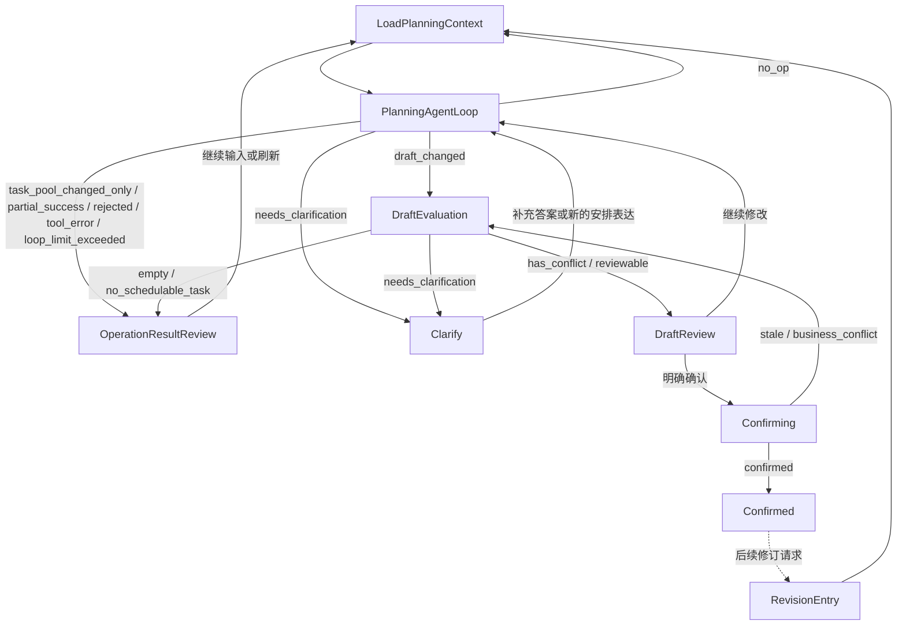
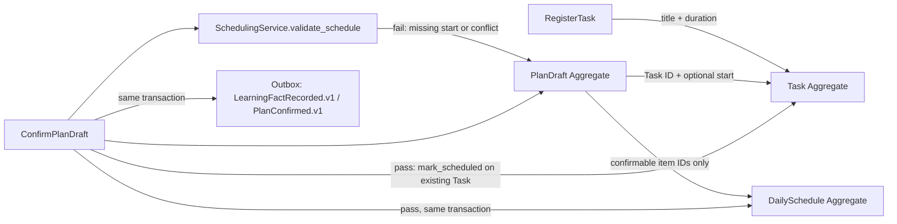
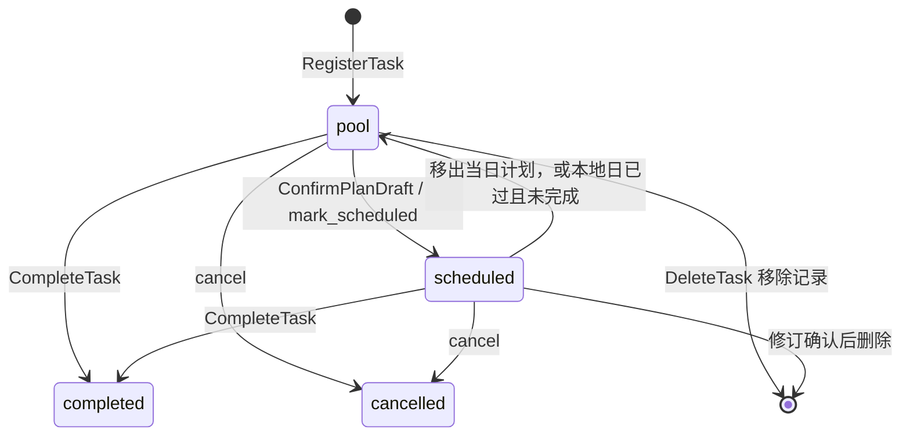
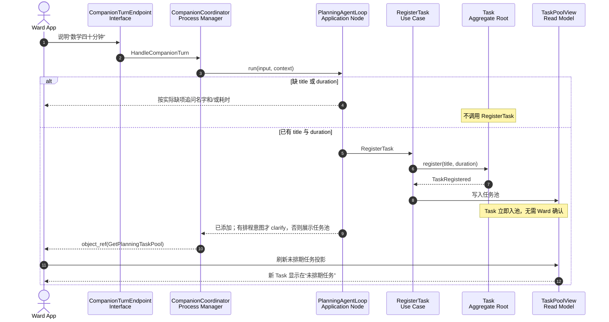
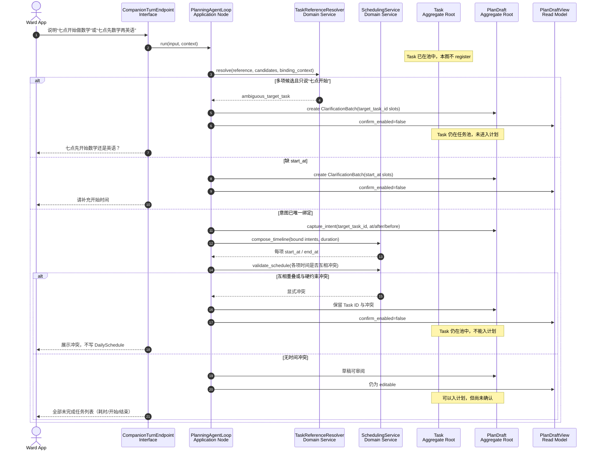
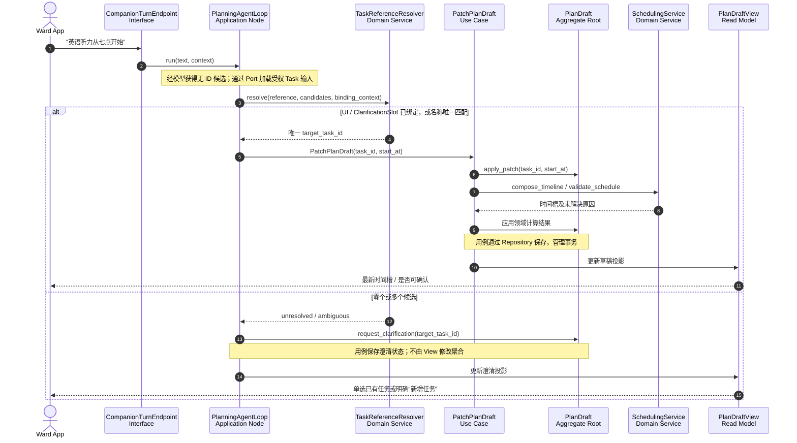

# 读学系统 — Planning & Scheduling Domain Design

> 状态：讨论稿 · 版本：v1.12
> 范围：已知任务池、Ward 安排意图、计划草稿、确认后的正式日程，以及计划协商 Workflow。  
> 关联：[系统 Context Map](ddd-overview.md) · [Companion 编排](domain-companion.md) · [Memory Context](domain-memory.md) · [Server 物理设计](design-server.md) · [计划 PRD](../product/prd-schedule.md)

## 一、边界与不变量

本 Context 拥有任务池、计划草稿和确认后的日程。它不拥有入口 Thread/Run、长期记忆、原始摄像行为或 Guardian 对 Ward 的替代决策权。**创建任务**与**进入计划**分离：有 `title` 与 `planned_minutes` 即可登记 `Task`；要排入正式计划，还须每项有 `start_at` 且通过确定性冲突校验，再经 Ward 确认。所有非结构化 Ward 文本均由模型理解意图与提取槽位；模型不能创建任务、绑定真实 Task ID 或判定无冲突。

`plan_date` 是 Ward 面向用户的本地日历日，而不是 UTC 日期；当前产品时区固定为 `Asia/Shanghai`。时间戳仍以 UTC 存储。Planning Graph、草稿查询、确认和 App 的“今天”必须使用同一个本地 `plan_date`，否则在本地午夜至 UTC 午夜之间会出现草稿落在昨天、今日计划 404 或基准版本错误。

## 二、应用用例与 Workflow Definition

计划协商是固定 Graph + 局部受控 Agent Loop，不是全自由 ReAct。固定 Graph 负责业务阶段、等待点、版本恢复和确认提交；`PlanningAgentLoop` 只在本轮自然语言处理阶段使用一组窄工具完成任务提取、引用解析、重复名澄清、任务创建/修改/删除和草稿 patch。任务归属、容量、时间冲突、基准版本和确认写入仍为确定性服务，模型不能创建真实 ID、不能判定无冲突、不能确认正式计划。

Workflow 及其阶段属于 **Application（应用层）编排**；`LoadPlanningContext`、`PlanningAgentLoop`、`OperationResultReview`、`Clarify`、`DraftReview`、`Confirming` 等只是阶段标签，不是独立 DDD 构件。`RegisterTask`、`UpdateTask`、`DeleteTask`、`PatchPlanDraft`、`ConfirmPlanDraft` 是 **Application Use Case（应用用例）**。例如 `Confirming` 阶段执行 `ConfirmPlanDraft`，后者调用 Domain 层的 `PlanDraft.confirm()` 等领域行为。阶段、用例与领域方法不要求一一对应，名称也不要求对应同名实现类；时序图生命线已标注角色。

以下是目标业务流程。顶层 Workflow 只画应用阶段和等待点；阶段内部判断、工具调用、版本复核和事务写入不作为顶层节点出现。`PlanningAgentLoop` 可以在一次输入中处理多个独立操作，不按一句话强制选择单一分支；每个写入动作都必须通过工具返回结构化 observation 后才能继续。

```mermaid
flowchart TD
    A[LoadPlanningContext] --> B[PlanningAgentLoop]
    B -->|task_pool_changed_only / partial_success / rejected / tool_error / loop_limit_exceeded| C[OperationResultReview]
    B -->|needs_clarification| D[Clarify]
    B -->|draft_changed| E[DraftEvaluation]
    B -->|no_op| A
    C -->|继续输入或刷新| A
    D -->|补充答案或新的安排表达| B
    E -->|needs_clarification| D
    E -->|empty / no_schedulable_task| C
    E -->|has_conflict / reviewable| F[DraftReview]
    F -->|继续修改| B
    F -->|明确确认| G[Confirming]
    G -->|stale / business_conflict| E
    G -->|confirmed| H[Confirmed]
    H -.->|后续修订请求| R[RevisionEntry]
    R --> A
```

`PlanningAgentLoop` 内部是受控工具循环，不是固定流水线。模型只能基于工具 observation 选择下一步工具；每轮最终必须以 `finish_loop(status, operation_report)` 退出。

```mermaid
flowchart TD
    A[输入文本 + Context] --> B[模型选择下一工具]
    B --> C[调用只读/解析/写入/澄清/校验工具]
    C --> D[获得结构化 observation]
    D --> E{是否满足退出条件?}
    E -->|否| B
    E -->|是| F[finish_loop(status, operation_report)]
```

`PlanningAgentLoop` 的输出不是自然语言结论，而是 `finish_loop(status, operation_report)`。`status` 只能是 `draft_changed`、`task_pool_changed_only`、`needs_clarification`、`partial_success`、`no_op`、`rejected`、`tool_error` 或 `loop_limit_exceeded`。一个操作同时改内容与安排时，先处理内容，再按新耗时处理安排并统一校验；已排期目标先走修订入口，内容变更暂存草稿，不走直接 UpdateTask。所有返回路径都应展示本轮已保存、尚待补充和被拒绝的操作，不能只回复最后一个澄清问题。模型失败或存储失败走下方失败规则，不自动进入 Confirmed。

节点职责、AI 驱动边界、退出条件和工具授权以 §四的 Workflow 节点表为准。这里不再维护第二张阶段表，避免 Workflow 阶段、Agent 工具和领域操作三套名词重复漂移。

#### 本轮操作、目标澄清与任务内容修改

1. **新候选可以暂缺名字或耗时。** `candidate_id` 在补充期间保持不变；例如“加一个二十分钟的任务”只追问名字。缺两项时一次列出两项，不能将缺名字统一回复成“请补充时长”。补齐后以候选身份幂等登记 Task，并绑定其 ID。
2. **唯一绑定针对每一个引用，不限制一轮只能操作一个 Task。** “英语改三十分钟”遇到听力和阅读时，不得擅自选中两项；“听力和阅读都改三十分钟”则可产生两个已绑定目标。`target_task_ids` 多选答案必须来自当前签发的受权候选集合，去重且非空；候选集合为空时不得签发该 Slot，必须作为 `no_match/rejected` observation 返回给 Agent Loop；每个更新值须明确是分别赋值还是显式共同赋值。
3. **澄清必须保留待执行修改。** Slot / Batch 关联 `operation_id`、操作种类、目标候选及已接受字段，答案只补绑定关系，不丢失原有“改三十分钟”等要求。名称为空、目标未匹配或歧义不等于新增任务；只有明确新增操作才进入 RegisterTask。
4. **批量修改不静默执行一半。** 一个明确的多目标修改操作中，任一目标未绑定或无效，该操作整体等待；目标和字段都合法后，目标集合的内容修改在同一本地事务中原子保存。一轮中相互独立的操作可以分别成功，依赖未完成操作的后续安排继续等待。每项以 `command_id + operation_id` 去重，报告逐项结果；重试不重复登记已成功任务。
5. **内容与安排分开维护。** `UpdateTask` 用例加载 Task 与受影响的当前草稿，校验 Ward、Task 版本及草稿版本，调用 `update_details()` 后保存。改名字不换 Task ID；改耗时使旧审阅动作失效，并重新推导结束时间及受影响的相对安排。Ward 明示的绝对开始时间保持不变，产生重叠则展示冲突，不静默平移。其他草稿保存其引用 Task 的版本，确认时必须重验，不能靠旧时间槽确认。
6. **已正式排期任务的修改进入修订。** 不通过 UpdateTask 直接改变已确认安排所依赖的名字或耗时；拟修改内容保存在修订草稿 `proposed_task_changes`，与新日程一起确认提交。`UpdateTask` 直接修改范围限定为未正式排期、未开始执行的任务。
7. **删除任务是独立 Use Case，不等于暂不安排。** 未进入正式计划的 Task，`DeleteTask` 用例只在目标唯一绑定、Ward 有权限且任务未开始/无学习记录时执行；成功后从任务池移除 Task，并在同一事务清理 active/pending 草稿、澄清 Slot 和 Task 版本快照中的引用。已进入正式计划的 Task 不允许在 `PlanningAgentLoop` 中直接删除，只能写入修订草稿的 `proposed_task_deletions`，在 `DraftReview` 二次确认后由 `ConfirmPlanDraft` 同事务删除 Task、移除日程项并记录历史版本。已有 `StudySession`、学习事实或已开始执行的任务返回结构化拒绝，不物理删除。`remove_task_from_draft()` 只移除本次草稿安排，`defer_task()` 只表示本次暂不安排，二者都保留 Task。

#### 澄清范围与开始时间

登记 Task 与本次排程分离：任务只加入池中时不强制追问开始时间；当 Ward 要安排该任务且没有明示或可推导的时间锚点时，才创建 `start_at` Slot。仅说“先数学再英语”仍缺一个可确定的起点；“十九点先数学再英语”可由耗时推导英语时间。

本设计保留“没有 pending Slot 才能确认”的门禁，但允许 Ward **明确暂不安排某个目标**：`PlanDraft.defer_target()` 在目标明确且可编辑时从本次拟安排范围中移除该目标，对依赖它的相对安排继续澄清，不自动删除其他 Task 的安排，将对应待执行操作标为本次不执行、关联 Slot 标为 skipped，并记录原因。必做 Task 必须有暂不安排原因；候选不会因此变为完整 Task，既有 Task 继续留池。skipped 不等于字段有效；重新加入安排时必须重新检查并生成必要问题。不能仅因为另一任务已完整而自动跳过旧 Slot。

#### 确认冲突、恢复与正式计划修订

- **提交前冲突：** ConfirmPlanDraft 在短事务内重验草稿、相关 Task、日程基准版本与最新硬约束，领域校验覆盖合并后的日程。版本比较与写入必须有原子并发保护；两个请求不能都基于同一旧版本成功写入冲突安排。版本变化返回 409，缺项或重叠返回业务错误码、涉及的 Task ID、冲突区间和最新草稿视图。旧确认动作撤销，刷新后的安排必须重新审阅，不能自动确认。
- **已提交后的新问题：** 已成功提交的版本仍是历史事实，不能事后标为“原确认失败”。Ward 后续修改或最新约束暴露冲突时，返回已有日程及冲突说明，由 `CreateScheduleRevision(schedule_id, expected_schedule_version)` 创建新草稿与新 Run；新草稿引用正式版本及 Task 版本，修改、澄清与审阅复用主流程。
- **修订的当前范围：** 仅支持正式计划尚未开始执行的修订；已经开始的计划返回明确拒绝原因，执行中调整另行设计。修订保留原日程项，只有明确修改或移除的项才替换；确认时再次校验执行状态、版本与完整合并结果。修改 Task 内容、更新日程版本、确认草稿与 Outbox 同事务提交，保留历史版本及修改主体。取消或失败不改变原正式计划；修订期间出现新的版本变化再次返回 409。
- **运行恢复：** 结构化答案或确认动作进入 Graph 前校验 actor、run、等待点、草稿版本及 action 绑定；失效时刷新，不盲目恢复。自然语言补充继续进入意图提取。Checkpoint 丢失时重新加载权威业务状态并建立新的审阅入口，不重放确认副作用。
- **技术失败：** 模型解析失败保留输入、提供编辑或重试，不写未验证候选；存储事务失败回滚该操作，不声称成功。确认请求超时且提交结果未知时，用原 confirmation_id 查询或幂等重试，不能创建另一个正式版本。每个等待点允许继续输入或退出，退出保留已保存草稿、不确认日程。

### 2.1 Aggregate 设计与状态变更

```mermaid
flowchart LR
    RT[RegisterTask] -->|title + duration| TK[Task Aggregate]
    PD[PlanDraft Aggregate] -->|Task ID + optional start| TK
    PD -->|confirmable item IDs only| DS[DailySchedule Aggregate]
    UC[ConfirmPlanDraft] --> DSG[SchedulingService.validate_schedule]
    DSG -->|fail: missing start or conflict| PD
    UC --> PD
    UC -->|pass: mark_scheduled on existing Task| TK
    UC -->|pass, same transaction| DS
    UC -->|same transaction| OB[Outbox: LearningFactRecorded.v1 / PlanConfirmed.v1]
```

| Aggregate | Identity / 内部对象 | 行为与本地事件 | Repository Port |
|---|---|---|---|
| `PlanDraft` | `draft_id`；`DraftItem`（**只含 Task ID** + `TaskScheduleIntent` + 可选派生 `start_at`/`end_at`）；`ArrangementIntent`、`DraftConstraint` | `capture_intent()`、`apply_patch()`、`request_clarification()`、`confirm()`；仅入计划校验通过才发 `PlanDraftConfirmed` | `PlanDraftRepository` |
| `DailySchedule` | `schedule_id`；`ScheduledItem` child entity（Task ID + 时间槽） | `apply_confirmed_draft()`（修订保留历史版本）；`ScheduleUpdated` | `DailyScheduleRepository` |
| `Task` | `task_id`；`title`、`planned_minutes`；安排引用另存；状态见下表 | `register(title, planned_minutes)`、`update_details()`、`delete()` / `cancel()`、`mark_scheduled(schedule_id)`、`unschedule()`、`complete()` | `TaskRepository` |

任务与计划是两条生命周期：`RegisterTask` 在具备 `title` + `planned_minutes` 时**立即**创建 `Task` 并进入任务池，不经过 Ward 确认；说错了删除即可。`start_at` 不是创建条件。`PlanDraft` / `DailySchedule` 只按 Task ID 引用。要把任务排入正式计划，确认屏必须列出**全部未完成 Task**（每项含耗时、开始、结束时间）；Ward 看清后点「确认这个计划」，只有带有效时间槽且无冲突的项才 `mark_scheduled()`。缺开始/结束的项继续留在任务池，不会因为确认而被悄悄排入。口头说明不能替代该动作。

#### `Task` 状态

`Task` 只有下表四种状态。学习进行中、暂停属于 [StudySession](domain-study.md)，不写入 `Task`。当日可安排的任务是 `pool`，以及已经排在**今天**这份 `DailySchedule` 上的 `scheduled`。登记写入 `pool`，确认写入 `scheduled`，`ReleaseUnfinishedTasks` 在读取当天任务或处理当天安排时释放已过本地日的未完成任务，`FinishStudySession` 发布事实后由 `CompleteTask` 写入 `completed`。

| 状态 | 含义 | 转入 | 转出 | 当日任务池 | 终态 |
|---|---|---|---|---|---|
| `pool` | 未完成，且没有绑定当前本地日的正式日程 | `RegisterTask` → `register()`。确认时该项没有完整时间槽，保持 `pool`。修订确认把任务移出当日计划 → `unschedule()`。`ReleaseUnfinishedTasks` 把已过本地日、仍未完成的 `scheduled` 释放回任务池 | 确认进入当日计划 → `scheduled`。无学习记录且未开始时 `DeleteTask` 移除记录。`CompleteTask` → `completed`。明确放弃且需保留记录 → `cancelled` | 是 | 否 |
| `scheduled` | 已进入某一本地日的正式日程 | `ConfirmPlanDraft` 对带有效时间槽的项调用 `mark_scheduled(schedule_id)` | 同一天的修订把它移出计划 → `pool`。绑定日程的本地日早于今天，且任务仍未完成 → `pool`（见下）。`CompleteTask` → `completed`。已入计划的删除只经修订草稿确认后移除记录。明确放弃且需保留记录 → `cancelled` | 仅当 `schedule_id` 属于今天 | 否 |
| `completed` | 这项任务已经完成 | `CompleteTask` 消费带 `task_id` 的 `StudySessionCompleted.v1` 后调用 `complete()`。无任务的答疑完成不会发布该事件，也不能把别的任务标完成。重复投递保持 `completed` | 无。新的一天不回到任务池 | 否 | 是 |
| `cancelled` | 明确放弃，记录保留 | Ward 明确取消，且任务已有学习记录或已开始执行、不能物理删除时，`cancel()` | 无 | 否 | 是 |

本地日以 `Asia/Shanghai` 的 `plan_date` 为准。`ReleaseUnfinishedTasks` 由本地日切换触发，对「状态为 `scheduled`、所绑日程日期早于今天、且不是 `completed` / `cancelled`」的任务调用 `unschedule()`。昨天的 `DailySchedule` 保留为历史，不把原来的时间槽搬到今天。进行中的 `StudySession` 不阻止这次释放；会话仍按自己的状态继续，任务回到当天任务池后可以被今天重新安排。Study 不直接修改 `Task`。

```mermaid
stateDiagram-v2
    [*] --> pool: RegisterTask
    pool --> scheduled: ConfirmPlanDraft / mark_scheduled
    scheduled --> pool: 移出当日计划，或本地日已过且未完成
    pool --> completed: CompleteTask
    scheduled --> completed: CompleteTask
    pool --> cancelled: cancel
    scheduled --> cancelled: cancel
    pool --> [*]: DeleteTask 移除记录
    scheduled --> [*]: 修订确认后删除
```

#### 首页任务卡片

首页任务卡片是读模型 `HomeTaskCard`，不是 `Task` 的另一种写状态。安排状态来自 `Task`，进行中和暂停来自该任务未结束的 [StudySession](domain-study.md)。

| 卡片展示 | 判定 |
|---|---|
| 已完成 | `Task.status = completed` |
| 进行中 | 该任务有 `status = active` 的 `StudySession` |
| 暂停 | 该任务有 `status = paused` 的 `StudySession` |
| 已排期 | `Task.status = scheduled`，日程是今天，且没有未结束的学习会话 |
| 未排期 | `Task.status = pool`，且没有未结束的学习会话 |

未排期卡片和今日计划卡片都可以点按并确认开始。确认后调用 Study 的 `StartStudySession`，并带上该 `task_id`。`Task` 仍保持 `pool` 或 `scheduled`。进行中的卡片可以选择暂停或完成；暂停的卡片可以继续。暂停、继续只改变 `StudySession`。完成且会话带有 `task_id` 时，才由 `CompleteTask` 把任务写成 `completed`。不挂任务的问答不走这张卡片，见 [无任务答疑](domain-study.md#无任务答疑)。

#### 领域模型清单（聚合及领域服务）

下表统一列出 Domain 层的聚合根、内部实体、值对象和领域服务。“所属聚合”表示所有权；领域服务标为“不属于聚合”，同属 Domain 不表示属于某个聚合内部。聚合内部行同时构成 Entity Inventory。子实体只经根修改，不设独立 Repository；跨聚合仅传 ID 或不可变输入。方法名描述目标业务契约，不代表现有 Python 类已经实现。

| 所属聚合 | 对象 / 规范类型 | 身份 | 主要业务状态 / 输入 | 主要方法 / 输出 | 业务职责与约束 |
|---|---|---|---|---|---|
| Task | `Task` / Aggregate Root | `task_id` | 标题、预计时长、排期引用、上表四种状态 | `register()`、`update_details()`、`delete()` / `cancel()`、`mark_scheduled()`、`unschedule()`、`complete()` | 登记条件、合法排期变更；任务内容与本次安排分离；已有学习记录或已开始执行时不可删除；状态迁移只按上表 |
| PlanDraft | `PlanDraft` / Aggregate Root | `draft_id` | Ward、本地日期、版本、编辑状态、草稿项、澄清批次、基准日程/Task 版本、拟修改内容 | `capture_intent()`、`apply_patch()`、`request_clarification()`、`resolve_clarification()`、`defer_target()`、`confirm()` | 目标归属、编辑资格、审阅版本；保护子对象之间的一致性 |
| PlanDraft | `DraftItem` / Entity | 聚合内 `task_id` | 既有 Task 引用、安排意图、可选时间槽 | `change_arrangement()`、`clear_arrangement()` | 当前草稿每个 Task 至多一项；不得通过草稿项创建 Task |
| PlanDraft | `ClarificationBatch` / Entity | `batch_id` | 槽位集合、响应模式、签发版本、状态 | `resolve_slot()`、`expire()` | 同一草稿最多一个 active 批次；过期回答不能改变新版本 |
| PlanDraft | `ClarificationSlot` / Entity | `slot_id` | 待补字段、Task/Candidate 目标、operation_id、待执行修改、解决状态 | `resolve()`、`skip()` | 值只能作用于绑定目标与字段；跳过不等于满足必填约束 |
| PlanDraft | `TaskCandidate` / Entity | `candidate_id` | 可缺省的标题与时长、待绑定安排字段、登记后的 Task 引用 | `supplement()`、`bind_registered_task()` | 保持跨轮身份；不是 Task，也不是 DraftItem。应用用例登记 Task 后经根绑定引用，再形成草稿项 |
| PlanDraft | `TaskScheduleIntent` / Value Object | 无 | 目标 Task、时间锚点、参考 Task、来源 | 构造校验 | 字段组合见下表；只能引用唯一绑定的既有 Task |
| PlanDraft | `ArrangementIntent` / Value Object | 无 | 已接受的任务安排意图集合 | 构造校验 | 与未验证模型候选分离；集合内的目标归属由根保护 |
| PlanDraft | `DraftConstraint` / Value Object | 无 | 约束内容、来源、硬/软性质 | 构造校验 | 未确认来源不能成为硬约束 |
| DailySchedule | `DailySchedule` / Aggregate Root | `schedule_id` | Ward、本地日期、版本、正式日程项 | `apply_confirmed_draft()` | 接受安排时保护整体无冲突和已开始项不可静默重排；服务校验不能代替根的保护 |
| DailySchedule | `ScheduledItem` / Entity | 聚合内 `task_id` | Task 引用、确认后的时间槽 | `reschedule()`（仅由根调用） | 当前日程每个 Task 至多一项；调整保留身份并受根的重排规则约束 |
| PlanDraft / DailySchedule | `TimeSlot` / Value Object | 无 | `start_at`、`end_at` | 构造校验、`overlaps()` | 结束晚于开始；以统一时区语义比较，不拥有排程或事务状态 |
| 不属于聚合 | `TaskReferenceResolver` / Domain Service | 无 | 无状态；reference、受权 candidates、binding_context | `resolve()` → 唯一 Task ID / 歧义候选 / 未匹配 | 按受控优先级与名称规则回答“指的是谁”；不解释自然语言。规则独立于时间安排，排程只接收已绑定意图 |
| 不属于聚合 | `SchedulingService` / Domain Service | 无 | 无状态；bound_intents、task_estimates、existing_schedule；校验输入为 proposed_slots、existing_schedule、constraints | `compose_timeline()` → 时间槽及未解决原因；`validate_schedule()` → 结构化校验结果 | 展开明示时间与相对顺序，不猜缺失字段；检查完整度、重叠、硬约束与当日容量，按 Task ID 排除被替换旧槽位。生成与校验共享排程语言，保留在同一服务；确认仅重验已审阅安排，不重新计算并静默修改 |

当前采用“一项 Task 在一个草稿/日程内至多出现一次”的身份规则；若未来支持分段安排，须先修订项身份及确认契约。`TaskCandidate` 只保存已接受的待补业务信息，不保存模型原始输出；完整模型候选仍是应用层输入。`Task` 当前无子实体，不需要额外的内部 UML。

时间冲突采用统一的半开区间 `[start_at, end_at)`：`end_at` 必须由 `start_at + planned_minutes` 确定性计算，前一任务在 19:30 结束、后一任务在 19:30 开始属于相邻而不冲突；只有 `start_a < end_b` 且 `start_b < end_a` 时才产生 `time_overlap`。排程校验先检查草稿内项目，再把修订项目与当前正式日程中未被替换的项目合并检查；确认事务会在锁定 Ward、草稿、日程和相关 Task 后再次执行同一校验。任一重叠、缺少完整时间槽、超过当日容量或版本过期，都只能返回结构化原因并保留草稿，不能自动平移或提交部分日程。

聚合所有权以上表为准：Slot 的目标只保存 Task/Candidate ID，正式日程项不持有 DraftItem 对象；两处 `TimeSlot` 是各自按值保存的对象，不是共享可变实体。

Application Use Case 负责授权、通过 Port 加载输入、调用服务和聚合行为、校验并发版本、保存与事务。上述服务不使用 ORM Session、HTTP、模型 SDK、Outbox 或 Checkpoint，也不决定 Graph 跳转。`TimeSlot` 的有效构造、`PlanDraft` 的版本/编辑资格、`DailySchedule` 的整体合法性仍由各自领域对象保护。

当前实现已把无状态的引用解析与排程校验拆到 `app/contexts/planning/domain/scheduling.py`，把多轮操作协调放在 `app/application/workflows/planning_operations.py`。`planning_domain_service.py::PlanningDomainService` 仍同时承担 Repository Adapter、事务应用服务和兼容入口，因此它是过渡实现名称，不等同于表中的纯 Domain Service。目标聚合方法目前仍由应用服务围绕持久化模型保护，后续若继续拆分，必须保持这里的版本、确认门禁与原子提交契约。

`TaskScheduleIntent` 是时间表达的唯一中间表示，不能只写一个脱离归属的 `start_at`：

| 字段 | 规则 |
|---|---|
| `target_task_id` | 必填；必须属于当前 Ward 的未完成任务，且解析结果只能唯一匹配一个 Task。 |
| `anchor` | `at` \| `after` \| `before`。 |
| `start_at` | 仅 `anchor=at` 时由 Ward 明示；不可由模型猜测。 |
| `reference_task_id` | `after/before` 时必填，且不能等于目标任务。 |
| `source` | `ward_explicit` 或 `deterministic_derived`；后者只能由 `compose_timeline()` 产生。 |

例如“数学 18 点开始”绑定数学；“18 点先数学再英语”绑定数学的 `at=18:00` 和英语的 `after=数学`；任务池有数学、英语但 Ward 只说“18 点开始”时，不得给两项都填 18:00，必须以 `ambiguous_target_task` 进入 Clarify。

#### 2.1.1 任务引用解析与 Patch 分支

“已有任务的排程 patch”不是由“改、调整、修改”等字面关键词触发，而是由本轮意图是否同时包含**任务引用**与**可写的安排字段**决定。`PlanningAgentLoop` 可以用模型理解自然语言，但只能把无 ID 引用交给 `TaskReferenceResolver`；解析成功后才允许调用 `PatchPlanDraft`。绑定优先级固定如下，每一步必须只产生一个合法 Task，才可进入下一写入动作：

1. 已校验的 UI/Structured command 明示 `task_id`；
2. 当前 `ClarificationSlot.target.task_id`；
3. 当前受控会话焦点（例如 Ward 从某个 Task 卡片进入对话）携带的 `task_id`；
4. 当前 Ward 未完成、可编辑 Task 的规范化名称唯一匹配；
5. 以上均不能唯一确定时，建立 `target_task_id` 的 `ClarificationSlot`，以单选或携带 `slot_id` 的表单要求 Ward 选择。

名称规范化只做可解释、可复现的比较：Unicode NFKC、大小写折叠、空白折叠/移除和有限的标点归一化；不得仅凭向量相似度、历史偏好或模型猜测绑定。引用解析可以在规范化名称上做前缀匹配，但**标题重名检测只允许规范化后的精确等价**，不能用正则、关键词命中或模糊相似度。一个缩写（如“英语”）只在它在当前候选集中唯一时可绑定；同时存在“英语听力”和“英语阅读”时必须澄清。解析到已有 Task 的唯一引用后，即使模型同时给出了同名 `new_task` 候选，也必须拒绝该候选并仅执行 patch。若 Ward 确实要新增同名任务，应通过标题冲突澄清明确选择“仍然新增”，不能由模型自行决定。

标题冲突澄清有三个受控结果：`use_existing(task_id)` 将本次操作绑定到用户选中的已有 Task；`create_new`/`accept_duplicate` 明确允许新增同名 Task 或保留改名结果；`cancel` 放弃本次操作。冲突检查覆盖同一 Ward 当前可编辑的任务、同一草稿中本轮已经创建的候选和正式计划修订中的任务；已完成/取消任务不参与当前可编辑集合。新增、改名和兼容结构化入口必须使用同一规则，不能一条路径静默复用、另一条路径静默创建。

`ClarificationBatch` 是澄清交互的最小单位，不等同于一个 Task，也不等同于一条聊天消息：

| 对象 | 字段与规则 |
|---|---|
| `ClarificationSlot` | `slot_id`、`field`（`title/planned_minutes/start_at/title_conflict/target_task_id/target_task_ids/...`）、`target`（已有 `task_id` 或未创建任务的 `candidate_id`）、`status`（`pending/resolved/skipped`）；关联 `operation_id`、操作种类、已接受字段与候选目标，解决目标后恢复该操作。 |
| `ClarificationBatch` | `batch_id`、多个 Slot、`response_mode`（`named_text/structured_form/single_choice/multiple_choice`）、`issued_draft_version`、`status`（`active/resolved/expired`）。同一 Draft 同时最多一个 active Batch。 |
| `named_text` | 本轮原文连同 Batch 交给模型；模型可在一轮返回多个 `slot_updates` 与独立 `schedule_patches`。模型无法唯一归属时必须保留 Slot 并要求澄清；服务端不得用正则、关键词或字符串广播规则自行写入。 |
| `structured_form` | 每个表单字段携带 `slot_id`，可一次安全提交多个值，不依赖模型猜测。 |

完整信息可在一轮内更新多个 Task，不产生 Clarification：例如“英语试卷和数学作业分别 30 分钟和 50 分钟”会生成两个任务候选/更新。只有仍缺字段时才创建一个含多个待补 Slot 的 Batch。

`ConfirmPlanDraft` 是把**已有 Task** 写入正式日程的本地强一致 Use Case；它必须先通过 `validate_schedule()`，再以 `draft_id + confirmation_id` 去重，原子保存 `DailySchedule`、对已有 Task 做 `mark_scheduled()`、领域事件及 Outbox。它不创建 Task。Ward 点击确认不是入计划的充分条件。下面三张 UML 只保留对象分工：创建任务、进入草稿计划、已有任务局部 Patch。

### 2.2 UML 时序图：创建任务（只要 title + duration）

此图**没有** `start_at`、`DailySchedule`、`validate_schedule`，也**没有 Ward 确认**。缺时长则根本没有 Task；说错了从任务池删除即可。

| Participant | Canonical type | Owned responsibility |
|---|---|---|
| Ward App | Actor | 说出任务名与预计时长 |
| CompanionTurnEndpoint | Interface | 鉴权与 DTO |
| CompanionCoordinator | Process Manager | 路由 Planning Run |
| PlanningAgentLoop | Application Node | 理解本轮输入并调用登记工具 |
| RegisterTask | Use Case | 创建 Task |
| Task | Aggregate Root | 拥有 title 与 duration |
| TaskPoolView | Read Model / Projection | 任务池强一致展示 |

```mermaid
sequenceDiagram
    autonumber
    actor W as Ward App
    participant I as CompanionTurnEndpoint<br/>Interface
    participant C as CompanionCoordinator<br/>Process Manager
    participant U as PlanningAgentLoop<br/>Application Node
    participant RT as RegisterTask<br/>Use Case
    participant T as Task<br/>Aggregate Root
    participant TP as TaskPoolView<br/>Read Model

    W->>I: 说明“数学四十分钟”
    I->>C: HandleCompanionTurn
    C->>U: run(input, context)
    alt 缺 title 或 duration
        U-->>W: 按实际缺项追问名字和/或耗时
        Note over T: 不调用 RegisterTask
    else 已有 title 与 duration
        U->>RT: RegisterTask
        RT->>T: register(title, duration)
        T-->>RT: TaskRegistered
        RT->>TP: 写入任务池
        Note over T,TP: Task 立即入池，无需 Ward 确认
        U-->>C: 已添加；有排程意图才 clarify，否则展示任务池
        C-->>W: object_ref(GetPlanningTaskPool)
        W->>TP: 刷新未排期任务投影
        TP-->>W: 新 Task 显示在“未排期任务”
    end
```

### 2.3 UML 时序图：进入计划（要 start_at，且任务之间无冲突）

前置条件：`Task` 已经在任务池。此图不再创建 Task，只决定能不能排进计划。

| Participant | Canonical type | Owned responsibility |
|---|---|---|
| Ward App | Actor | 给出开始时间或调整时间轴 |
| CompanionTurnEndpoint | Interface | 鉴权与 DTO |
| PlanningAgentLoop | Application Node | 解析安排意图并协调引用解析、草稿 patch 与校验 |
| TaskReferenceResolver | Domain Service | 在用例已加载的候选中唯一绑定目标 |
| SchedulingService | Domain Service | `compose_timeline` 与 `validate_schedule` |
| Task | Aggregate Root | 已存在的任务，仅作本图前置状态 |
| PlanDraft | Aggregate Root | 只引用已有 Task ID |
| PlanDraftView | Read Model / Projection | 展示能否入计划 |

```mermaid
sequenceDiagram
    autonumber
    actor W as Ward App
    participant I as CompanionTurnEndpoint<br/>Interface
    participant U as PlanningAgentLoop<br/>Application Node
    participant B as TaskReferenceResolver<br/>Domain Service
    participant S as SchedulingService<br/>Domain Service
    participant T as Task<br/>Aggregate Root
    participant P as PlanDraft<br/>Aggregate Root
    participant R as PlanDraftView<br/>Read Model

    W->>I: 说明“七点开始做数学”或“七点先数学再英语”
    I->>U: run(input, context)
    Note over T: Task 已在池中，本图不 register
    U->>B: resolve(reference, candidates, binding_context)
    alt 多项候选且只说“七点开始”
        B-->>U: ambiguous_target_task
        U->>P: create ClarificationBatch(target_task_id slots)
        U->>R: confirm_enabled=false
        Note over T,P: Task 仍在任务池，未进入计划
        I-->>W: 七点先开始数学还是英语？
    else 缺 start_at
        U->>P: create ClarificationBatch(start_at slots)
        U->>R: confirm_enabled=false
        I-->>W: 请补充开始时间
    else 意图已唯一绑定
        U->>P: capture_intent(target_task_id, at/after/before)
        U->>S: compose_timeline(bound intents, duration)
        S-->>U: 每项 start_at / end_at
        U->>S: validate_schedule(各项时间是否互相冲突)
        alt 互相重叠或与硬约束冲突
            S-->>U: 显式冲突
            U->>P: 保留 Task ID 与冲突
            U->>R: confirm_enabled=false
            Note over T,P: Task 仍在池中，不能入计划
            I-->>W: 展示冲突，不写 DailySchedule
        else 无时间冲突
            U->>P: 草稿可审阅
            U->>R: 仍为 editable
            Note over T,P: 可以入计划，但尚未确认
            I-->>W: 全部未完成任务列表（耗时/开始/结束）
        end
    end
```

### 2.4 UML 时序图：已有任务的引用解析与局部 Patch

此分支以“任务引用 + 安排字段”为条件，而非以某个编辑动词为条件。`TaskReferenceResolver` 只能绑定当前 Ward 可编辑范围内的已有 Task；不唯一时先澄清，禁止创建同名新 Task。

| Participant | Canonical type | Owned responsibility |
|---|---|---|
| Ward App | Actor | 表达局部安排 |
| CompanionTurnEndpoint | Interface | 接收输入并交给应用用例 |
| PlanningAgentLoop | Application Node | 通过工具加载受权候选，协调解析与后续操作 |
| TaskReferenceResolver | Domain Service | 对传入候选执行唯一绑定规则，不自行查询数据库 |
| PatchPlanDraft | Use Case | 协调局部修改、排程校验和保存 |
| PlanDraft | Aggregate Root | 修改草稿或记录待澄清问题 |
| SchedulingService | Domain Service | 计算与校验时间安排 |
| PlanDraftView | Read Model / Projection | 展示提交后的草稿结果 |

```mermaid
sequenceDiagram
    autonumber
    actor W as Ward App
    participant I as CompanionTurnEndpoint<br/>Interface
    participant U as PlanningAgentLoop<br/>Application Node
    participant R as TaskReferenceResolver<br/>Domain Service
    participant P as PatchPlanDraft<br/>Use Case
    participant D as PlanDraft<br/>Aggregate Root
    participant S as SchedulingService<br/>Domain Service
    participant V as PlanDraftView<br/>Read Model

    W->>I: “英语听力从七点开始”
    I->>U: run(text, context)
    Note over U: 经模型获得无 ID 候选；通过 Port 加载受权 Task 输入
    U->>R: resolve(reference, candidates, binding_context)
    alt UI / ClarificationSlot 已绑定，或名称唯一匹配
        R-->>U: 唯一 target_task_id
        U->>P: PatchPlanDraft(task_id, start_at)
        P->>D: apply_patch(task_id, start_at)
        P->>S: compose_timeline / validate_schedule
        S-->>P: 时间槽及未解决原因
        P->>D: 应用领域计算结果
        Note over P,D: 用例通过 Repository 保存，管理事务
        P->>V: 更新草稿投影
        V-->>W: 最新时间槽 / 是否可确认
    else 零个或多个候选
        R-->>U: unresolved / ambiguous
        U->>D: request_clarification(target_task_id)
        Note over U,D: 用例保存澄清状态；不由 View 修改聚合
        U->>V: 更新澄清投影
        V-->>W: 单选已有任务或明确“新增任务”
    end
```

### 2.5 确认列表与正式提交

确认屏不是只展示“即将排入”的那几项，而是 **全部未完成 Task**：每项都给出耗时、开始时间、结束时间。开始/结束为空表示本次不入计划。Ward 看完整张表后点「确认这个计划」；只有时间槽完整且无冲突的项才真正 `mark_scheduled()`。

确认列表是 Query 投影，不是新的写模型。普通草稿显示当前 Task 内容；修订草稿优先显示 `proposed_task_changes` 中待确认的名字/耗时，并标出与正式版本的差异，不能让确认屏仍显示旧耗时。修订确认的时间槽必须与这份已审阅拟修改内容一致。行字段如下。

| 字段 | 来源 | 确认时含义 |
|---|---|---|
| `task_id` / `title` | `Task`；修订名称取拟修改内容 | 已存在的未完成任务，确认时不创建 |
| `planned_minutes` | `Task`；修订耗时取拟修改内容 | 耗时；普通登记已具备，修订随确认原子更新 |
| `start_at` / `end_at` | `PlanDraft` 时间槽，可空 | 都有值才可能入计划；空则确认后仍留在任务池 |
| `will_enter_plan` | 由 `validate_schedule()` 计算 | 有开始/结束且与其它已填时间项无冲突 |
| `unscheduled_reason` | Ward 对必做未排项的说明 | 必做任务未排且无原因时 `confirm_enabled=false` |

确认动作必须是绑定当前 `draft_id + expected_draft_version + interaction_id` 的结构化命令。`ConfirmPlanDraft` 只读取已审阅草稿并再次执行 `validate_schedule()`；通过后原子更新 `DailySchedule`、入计划 Task、修订内容和 Outbox。Ward 看到的正式计划以本事务提交后的 `ScheduleView` 为准；重复确认以 `confirmation_id` 返回同一 `DailySchedule`。

## 三、Query、接口与基础设施映射

| Query / View | 消费者与新鲜度 | 来源 |
|---|---|---|
| `GetPlanningTaskPool` / `TaskPoolView` | Ward；`TaskRegistered` 或日界释放提交后必须重新读取最新投影 | 状态为 `pool` 的 Task（含已过本地日、未完成而释放回来的任务）、固定约束、授权 MemoryBundle |
| `GetPlanDraft` / `PlanDraftView` | Ward；草稿提交后强一致 | **全部未完成 Task** 的确认列表：`title`、`planned_minutes`、`start_at`、`end_at`、`will_enter_plan` |
| `GetConfirmedSchedule` / `ScheduleView` | Ward/Guardian；确认后强一致 | DailySchedule projection |
| `GetHomeTaskCards` / `HomeTaskCard` | Ward 首页；`Task` 或该任务的 `StudySession` 提交后重新读取 | 上表：安排状态来自 `Task`，进行中和暂停来自未结束的 `StudySession` |

`POST /companion/turn` 是统一入口；目标 UI 的 `edit`、`regenerate`、`confirm` 由 `StructuredWardCommand` 映射为上述 Use Case。Ward 只能修改自己的草稿；Guardian 对确认日程只读。版本冲突（包括确认时草稿或日程基准变化）必须原样映射为 `409` 与最新 `PlanDraftView`，不得被包装为 HTTP 200 的 workflow failure；App 收到后撤销旧 action 并刷新版本。

| Port | Adapter / 物理映射 | 失败与治理 |
|---|---|---|
| repositories | SQLAlchemy；`plan_drafts`、tasks、schedules 表 | `ConfirmPlanDraft` 短事务、乐观版本与幂等约束；物理细节见 [design-server.md](design-server.md) |
| Memory query | `MemoryFacade` ACL adapter | 失败时不用历史偏好，仍可按当前 Ward 意图生成草稿 |
| Outbox publisher | 本 Context 本地事务 → Memory / Study Consumer | 仅 `validate_schedule()` 通过并确认后写入；四元组去重；Memory 死信见 [domain-memory.md](domain-memory.md)，`PlanConfirmed.v1` 见 [ddd-overview.md](ddd-overview.md) |

## 四、Working State、Context 与工具

`PlanningWorkingState` 随 `PlanDraft` 持久化，字段为 `task_pool_version`、`arrangement_intent`、`task_reference_candidates`、`target_resolution`、`missing_fields`、`ambiguous_target_task_ids`、`active_clarification_batch`、`timeline_slots`、`schedule_conflicts`、`confirm_enabled`、`baseline_schedule_version`、`task_versions`、`proposed_task_changes`、`draft_items`、`unassigned_task_reasons`、`last_reviewed_at`。它不是长期记忆，也不保存完整语音或聊天。`target_resolution` 至少记录引用原文、候选 Task ID、采用的优先级来源和结果；它使重试、审计与澄清保持确定性。`active_clarification_batch` 是下一轮模型的受控上下文，不是规则引擎的短路指令；模型输出可同时更新其中多个 Slot 和独立时间槽。只有携带 `slot_id` 的结构化表单允许绕过模型。`confirm_enabled` 仅在同时满足时为真：确认列表包含全部未完成 Task；没有 pending Slot（仅显式暂不安排的目标可按 §二规则关闭相关槽位）；每个已填时间意图有唯一 `target_task_id`；至少一项有 `start_at`/`end_at`；已填时间项通过 `validate_schedule()`；必做未排项已有原因。

| ContextSpec 内容 | 来源 | 用途 |
|---|---|---|
| 已知任务池和约束 | Planning Query | 生成/校验草稿的唯一任务来源 |
| 当前草稿与版本 | `PlanDraft` | 支持继续编辑与确认前重检 |
| 同一条对话的最近原句 | 受控消息窗口，按 Thread 而不是当前 Run 截取 | 解决“同样的操作”“放到后面”等指代 |
| 估时偏差/计划偏好 | `MemoryFacade` 的最小 Bundle | 仅作软建议，数据不足时不推断 |

`PlanningAgentLoop` 是有工具边界的应用层循环。模型可以决定下一步调用哪个工具，但工具参数必须是结构化数据；所有真实 ID、版本、重复名结果和草稿状态都必须来自工具 observation。Loop 内任何写工具成功后，必须在退出前触发 `validate_draft_plan()` 或由 Graph 在 `DraftEvaluation` 自动重验；不能只凭模型回复宣布 start_at 已生效。

每个 Workflow 节点只暴露最小工具集。下表是节点级完整授权、AI 驱动边界和满足条件；未列出的工具不可在该节点调用，正式计划确认不属于 Agent Tool。

| Workflow 节点 | AI-driven | Loop / 等待类型 | 满足 / 退出条件 | 允许的全部工具 | 规则与禁止事项 |
|---|---|---|---|---|---|
| `LoadPlanningContext` | 否 | 单步确定性节点 | 成功加载任务池、未排期 Task、当前草稿、正式日程和 active ClarificationBatch；失败则返回可重试技术错误 | `get_task_pool()`、`get_unscheduled_tasks()`、`get_active_draft()`、`get_daily_schedule()`、`get_pending_clarifications()` | 只读；负责建立本轮权威上下文，不调用模型，不写 Task 或 Draft |
| `PlanningAgentLoop` | 是，唯一 AI-driven 节点 | 受控工具循环，建议 `max_tool_calls=8-12` | 必须调用 `finish_loop(status, summary)`；`status` 只能是 `draft_changed`、`task_pool_changed_only`、`needs_clarification`、`partial_success`、`no_op`、`rejected`、`tool_error`、`loop_limit_exceeded` | `get_task_pool()`、`get_unscheduled_tasks()`、`get_active_draft()`、`get_daily_schedule()`、`get_pending_clarifications()`、`get_task_detail(task_id)`、`resolve_task_reference(surface, role, candidate_scope?)`、`resolve_task_references_batch(references[])`、`check_title_conflict(title)`、`create_task_candidate(title?, planned_minutes?, arrangement?)`、`register_task(title, planned_minutes)`、`update_task_details(task_id, title?, planned_minutes?, expected_task_version?)`、`delete_task(task_id, expected_task_version?, deletion_id)`、`propose_task_deletion(task_id, expected_task_version?, deletion_id)`、`patch_draft_start_at(task_id, start_at, source)`、`patch_draft_order(task_id, anchor, reference_task_id)`、`remove_task_from_draft(task_id)`、`defer_task(task_id, reason)`、`create_clarification_slot(type, candidates, pending_operation)`、`resolve_clarification_slot(slot_id, value)`、`cancel_pending_operation(operation_id)`、`validate_draft_plan()`、`preview_timeline()`、`get_operation_summary()`、`finish_loop(status, summary)` | 模型只决定工具调用顺序和结构化参数。删除意图必须先唯一绑定：未入正式计划可调用 `delete_task` 并返回 `changed/no_op/stale/rejected/not_editable/has_learning_record/tool_error`；已入正式计划只能调用 `propose_task_deletion`，返回 `draft_changed/requires_confirmation` 并进入 `DraftReview`，真正删除只能由 `ConfirmPlanDraft` 执行。不能生成 Task ID、不能把“本次不安排”当删除、不能绕过 `title_conflict`、不能判定无冲突、不能调用 `confirm_plan_draft()` |
| `OperationResultReview` | 否 | 展示节点 | 本轮结果已渲染：已保存、未排期、已入草稿、待澄清、被拒绝和失败操作均可见；用户继续输入后回 `LoadPlanningContext` | `get_operation_summary()`、`get_task_pool()`、`get_unscheduled_tasks()`、`get_active_draft()`、`preview_timeline()`、`render_operation_result()` | 只读展示本轮结果；不能继续补写任务或草稿 |
| `Clarify` | 否 | 用户等待点，不是 Agent Loop | 用户提交结构化 Slot 答案、取消待执行操作，或输入自然语言补充；解决受控 Slot 后必须回到 `PlanningAgentLoop` | `get_pending_clarifications()`、`resolve_clarification_slot(slot_id, value)`、`cancel_pending_operation(operation_id)`、`get_operation_summary()` | 只处理已签发 Slot 或取消待执行操作；自然语言答案可同时包含新意图，因此不能在本节点直接完成全部业务 |
| `DraftEvaluation` | 否 | 单步确定性校验节点 | `validate_draft_plan()` 输出 `needs_clarification`、`empty/no_schedulable_task`、`has_conflict` 或 `reviewable` | `get_active_draft()`、`preview_timeline()`、`validate_draft_plan()`、`compose_timeline()`、`validate_schedule()` | 不调用模型；不做用户可见话术；只判断事实状态和下一跳 |
| `DraftReview` | 否 | 用户等待点，不是 Agent Loop | 用户继续修改则回 `PlanningAgentLoop`；用户触发当前版本绑定的结构化确认动作才进入 `Confirming` | `get_active_draft()`、`preview_timeline()`、`validate_draft_plan()`、`render_review_card()`、`get_pending_clarifications()` | 只读渲染确认列表和冲突；自然语言“行吧”等不能替代带版本的确认动作 |
| `Confirming` | 否 | 单步事务节点 | `confirm_plan_draft()` 返回 `confirmed`、`stale`、`business_conflict` 或 `unknown_timeout`；未知提交结果用 `confirmation_id` 查询或幂等重试 | `confirm_plan_draft(draft_id, expected_draft_version, confirmation_id, expected_schedule_version, expected_task_versions)`、`get_active_draft()` | 不调用模型；不重新生成草稿；事务内重验版本、Task、日程和冲突。成功才进入 `Confirmed` |
| `Confirmed` | 否 | 终止展示节点 | 正式计划结果已返回；后续修改必须新建修订草稿 | `get_confirmed_schedule(schedule_id)`、`get_operation_summary()` | 只读返回提交结果；不恢复已关闭草稿 |
| 后续修订入口 | 否 | 单步确定性入口 | 正式计划尚未开始且 `expected_schedule_version` 匹配时，创建新草稿和新 Run 后回到 `LoadPlanningContext` / `PlanningAgentLoop` | `create_schedule_revision(schedule_id, expected_schedule_version)`、`get_confirmed_schedule(schedule_id)` | 已开始执行或版本变化时拒绝；原正式计划在修订确认前不变 |

由 Workflow 通过应用用例协调的确定性能力为 schema/range 校验、任务池查询、`TaskReferenceResolver`、名称规范化/唯一性校验、`compose_timeline`、`validate_schedule`、草稿 patch 校验、确认事务；它们不解释自然语言。模型不得生成任务 ID、不得绕过重复名澄清、不得发出正式日程确认写入命令。

## 五、写回、交互与失败

`ConfirmPlanDraft` 仅在 `validate_schedule()` 通过后，才在本地事务中写 `DailySchedule`、对**已有** `Task` 做 `mark_scheduled()`，以及 `LearningFactRecorded.v1` 与 `PlanConfirmed.v1` Outbox。它不创建 Task。草稿保存、冲突解释、审阅、取消，以及缺开始时间或仍有冲突的确认请求，都不产生已确认学习事实，也不通知 Study。

前端交互信封见 [Companion Interaction Protocol](domain-companion.md#52-companion-interaction-protocol)。新 Task 登记后，App 必须刷新“未排期任务”；若 Ward 要将其排入本次计划但时间意图尚未唯一绑定，返回 `clarify + object_ref(GetPlanningTaskPool)`。仅登记任务时返回已添加结果和任务池，不强制生成开始时间 Slot。`named_text` 始终由模型结合 Batch 语境解析；`structured_form` 的每项必须回传 `slot_id`，可直接确定性写入。计划确认的 `kind` 为 `plan_confirm_list`：`object_ref` 指向 `GetPlanDraft`，列表含全部未完成任务的耗时、开始、结束；`confirm_plan` 仅在 `confirm_enabled=true` 且 Graph 正停在对应 review interrupt 时 `enabled`。确认命令必须带 `draft_id + expected_draft_version + interaction_id`；它恢复已审阅草稿，不能重新生成草稿。确认后只有 `will_enter_plan=true` 的项进入 `DailySchedule`。创建任务没有确认动作。

模型解析失败返回可编辑的原输入与 `clarify`；约束不可满足返回多个受限草稿或缺口说明；确认的重复请求以 `draft_id + confirmation_id` 幂等返回同一正式日程。

## 六、验收场景

| 场景 | 必须满足 |
|---|---|
| 新任务登记 | `title + planned_minutes` 即创建 Task 并进入未排期列表；缺任一字段只保存 Candidate 和 Slot，不追问开始时间 |
| 入计划 | 只有明确 `start_at` 或可推导顺序的 Task 才进入 PlanDraft；只说“18 点开始”且目标不唯一时进入 `target_task_id` 澄清 |
| 相对顺序 | “18 点先数学再英语”只把数学标为 `ward_explicit`，英语由 `after=数学` 和时长确定性推导 |
| 引用解析 | 唯一命中写入 `target_task_id + schedule patch`；多候选必须单选澄清；受控卡片携带的 `task_id` 优先于名称匹配 |
| 标题重复 | 新增/改名遇到规范化精确重名时进入 `title_conflict`，由 Ward 选择复用、仍新增/接受重复或取消 |
| 澄清批次 | 一个 Batch 可含多个 Slot；结构化表单按 `slot_id` 原子写入；自然语言无法唯一归属时不得广播写入 |
| 混合输入 | `PlanningAgentLoop` 可在同一轮同时处理 Slot 答案和新的时间/内容修改，但所有真实 ID 与版本必须来自工具 observation |
| 内容修改 | 改名不换 Task ID；改耗时使旧审阅动作失效并重新推导，产生重叠时展示冲突，不静默平移其它任务 |
| 删除任务 | Ward 明确删除且目标唯一绑定时，未入正式计划的 Task 可立即从任务池删除并清理草稿引用；已入正式计划的 Task 只写入 `proposed_task_deletions` 并要求 DraftReview 二次确认，确认前原日程与 Task 不变；多候选必须澄清；无匹配返回 rejected；已有学习记录或已开始执行返回 409 / `has_learning_record` / `not_editable`，不得物理删除 |
| 多目标修改 | 明确批量修改必须目标和字段都合法才原子提交；独立操作可部分成功，结果必须在 `OperationResultReview` 汇总 |
| 暂不安排 | Ward 明确暂不安排时对应 Slot 为 `skipped`，不等于字段有效；重新安排时仍需补齐缺失字段 |
| 确认 | `confirm_plan` 只读取已审阅 `draft_id + version`，不重新运行 `PlanningAgentLoop`，不创建 Task；冲突或版本变化返回最新 DraftReview |
| 修订 | 尚未开始的正式计划可创建修订草稿；确认前原正式计划不变；已开始执行或版本变化时拒绝 |
| 幂等 | `command_id + operation_id` 防止重复应用操作；相同 `confirmation_id` 重试返回同一确认版本 |
