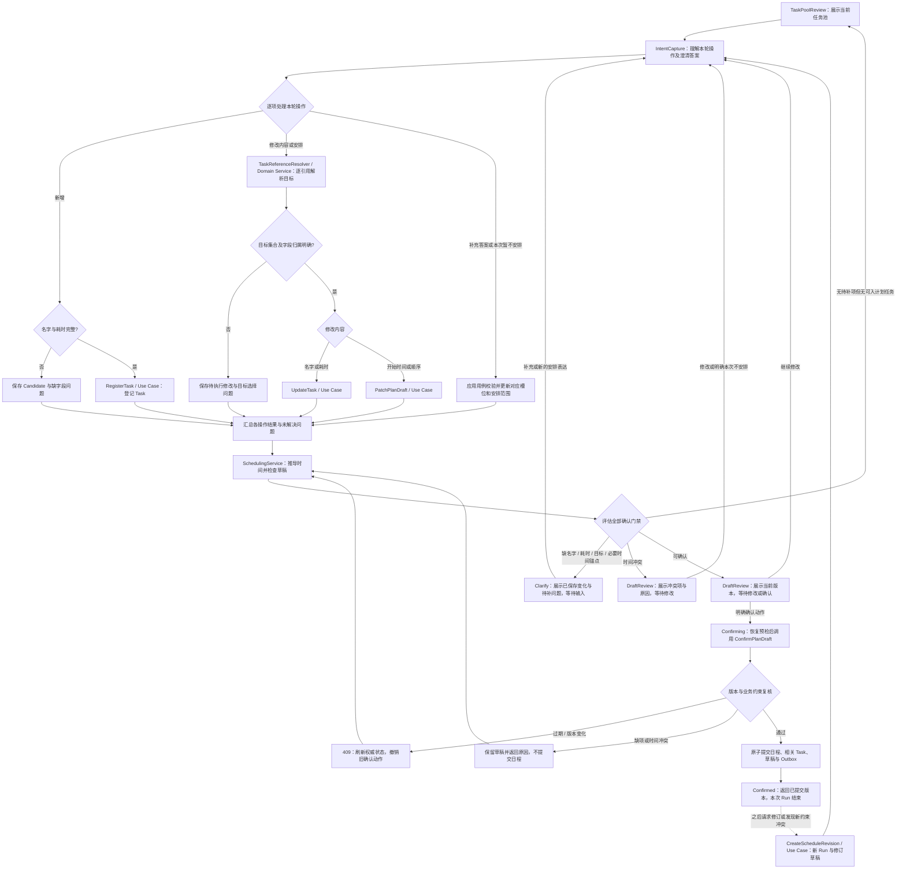
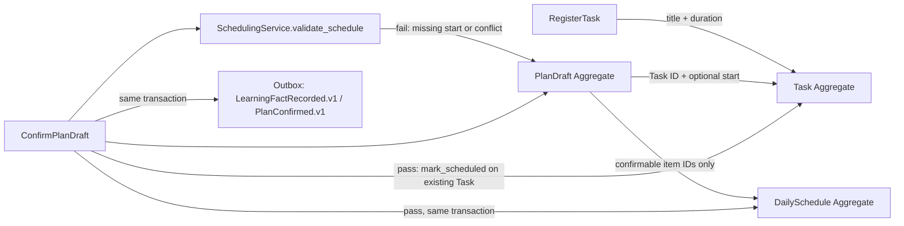
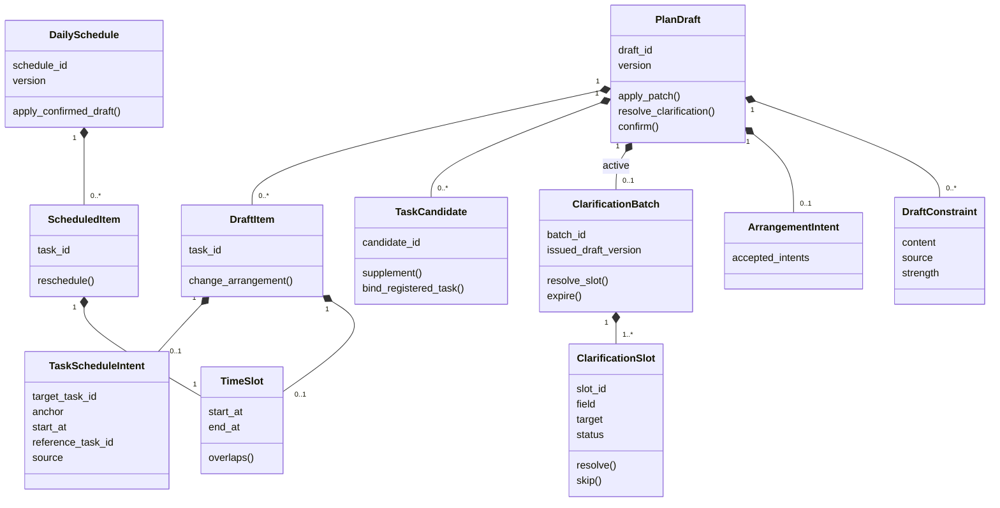
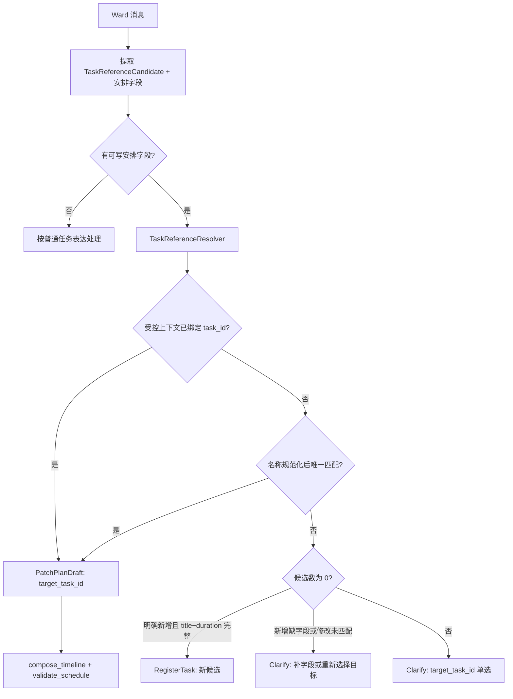
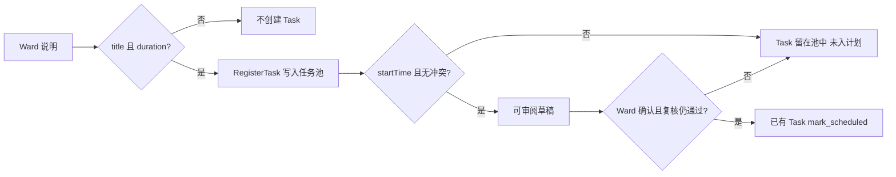
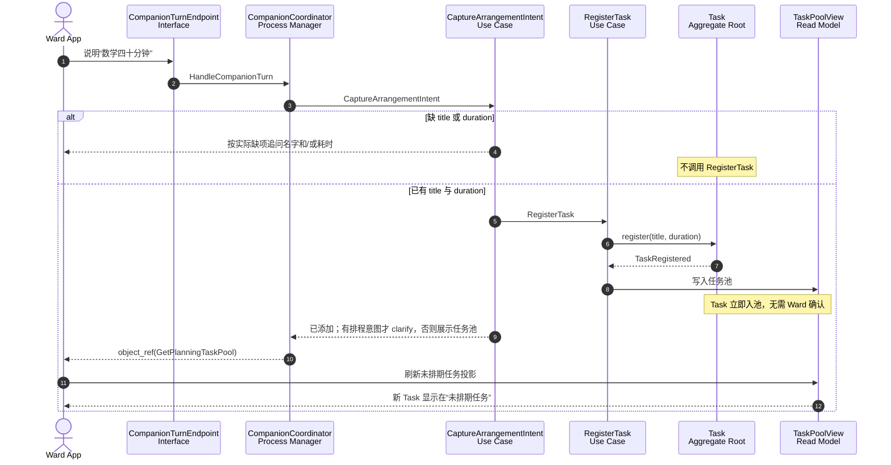
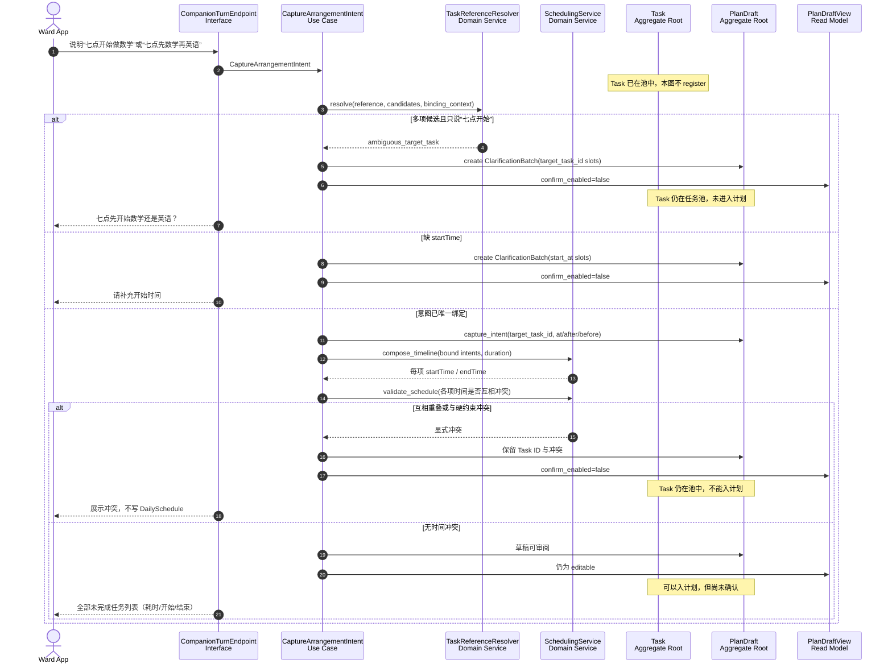
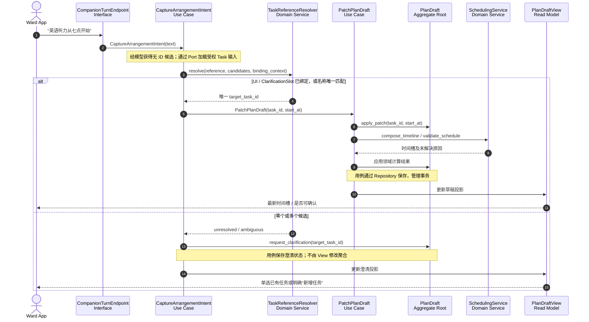
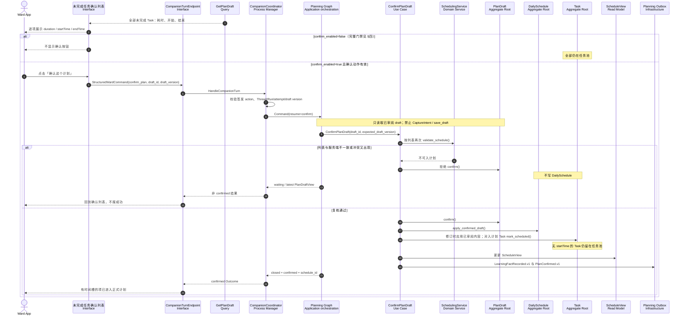
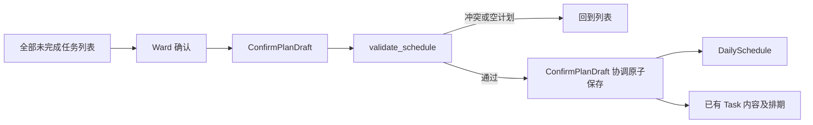

# 读学系统 — Planning & Scheduling Domain Design

> 状态：讨论稿 · 版本：v1.8
> 范围：已知任务池、Ward 安排意图、计划草稿、确认后的正式日程，以及计划协商 Workflow。  
> 关联：[系统 Context Map](ddd-overview.md) · [Companion 编排](domain-companion.md) · [Memory Context](domain-memory.md) · [Server 物理设计](design-server.md) · [计划 PRD](../product/prd-schedule.md)

## 一、边界与不变量

本 Context 拥有任务池、计划草稿和确认后的日程。它不拥有入口 Thread/Run、长期记忆、原始摄像行为或 Guardian 对 Ward 的替代决策权。**创建任务**与**进入计划**分离：有 `title` 与 `planned_minutes` 即可登记 `Task`；要排入正式计划，还须每项有 `start_at` 且通过确定性冲突校验，再经 Ward 确认。所有非结构化 Ward 文本均由模型理解意图与提取槽位；模型不能创建任务、绑定真实 Task ID 或判定无冲突。

`plan_date` 是 Ward 面向用户的本地日历日，而不是 UTC 日期；当前产品时区固定为 `Asia/Shanghai`。时间戳仍以 UTC 存储。Planning Graph、草稿查询、确认和 App 的“今天”必须使用同一个本地 `plan_date`，否则在本地午夜至 UTC 午夜之间会出现草稿落在昨天、今日计划 404 或基准版本错误。

## 二、应用用例与 Workflow Definition

计划协商是固定 Graph，不是 ReAct。模型只在“提取 Ward 意图”“必要追问”“解释草稿调整”节点参与；任务归属、容量、时间冲突、基准版本和确认写入均为确定性服务。

Workflow 及其阶段属于 **Application（应用层）编排**；`IntentCapture`、`Clarify`、`Confirming` 等只是阶段标签，不是独立 DDD 构件。`RegisterTask`、`CaptureArrangementIntent`、`PatchPlanDraft`、`ConfirmPlanDraft` 是 **Application Use Case（应用用例）**。例如 `Confirming` 阶段执行 `ConfirmPlanDraft`，后者调用 Domain 层的 `PlanDraft.confirm()` 等领域行为。阶段、用例与领域方法不要求一一对应，名称也不要求对应同名实现类；时序图生命线已标注角色。

以下是当前业务流程。`UpdateTask`、日程修订与批量选择契约已由 Planning 应用服务实现；图中的框是处理步骤或等待点，具体 DDD 角色在调用处标明。一次输入可以包含多个操作，不按一句话强制选择单一分支。


```mermaid
flowchart TD
    A[TaskPoolReview：展示当前任务池] --> I[IntentCapture：理解本轮操作及澄清答案]
    I --> O{逐项处理本轮操作}
    O -->|新增| N{名字与耗时完整?}
    N -->|否| NC[保存 Candidate 与缺字段问题]
    N -->|是| NT[RegisterTask / Use Case：登记 Task]
    O -->|修改内容或安排| R[TaskReferenceResolver / Domain Service：逐引用解析目标]
    R --> B{目标集合及字段归属明确?}
    B -->|否| BC[保存待执行修改与目标选择问题]
    B -->|是| K{修改内容}
    K -->|名字或耗时| UT[UpdateTask / Use Case]
    K -->|开始时间或顺序| PD[PatchPlanDraft / Use Case]
    O -->|补充答案或本次暂不安排| AN[应用用例校验并更新对应槽位和安排范围]
    NC --> M[汇总各操作结果与未解决问题]
    NT --> M
    BC --> M
    UT --> M
    PD --> M
    AN --> M
    M --> S[SchedulingService：推导时间并检查草稿]
    S --> G{评估全部确认门禁}
    G -->|缺名字 / 耗时 / 目标 / 必要时间锚点| C[Clarify：展示已保存变化与待补问题，等待输入]
    C -->|补充或新的安排表达| I
    G -->|时间冲突| X[DraftReview：展示冲突项与原因，等待修改]
    X -->|修改或明确本次不安排| I
    G -->|无待补项但无可入计划任务| A
    G -->|可确认| D[DraftReview：展示当前版本，等待修改或确认]
    D -->|继续修改| I
    D -->|明确确认动作| F[Confirming：恢复预检后调用 ConfirmPlanDraft]
    F --> V{版本与业务约束复核}
    V -->|过期 / 版本变化| ST[409：刷新权威状态，撤销旧确认动作]
    ST --> S
    V -->|缺项或时间冲突| RE[保留草稿并返回原因，不提交日程]
    RE --> S
    V -->|通过| TX[原子提交日程、相关 Task、草稿与 Outbox]
    TX --> OK[Confirmed：返回已提交版本，本次 Run 结束]
    OK -.->|之后请求修订或发现新约束冲突| REV[CreateScheduleRevision / Use Case：新 Run 与修订草稿]
    REV --> I
```

图中的“汇总”表示本轮操作处理后的统一结果，不表示无条件并行执行。一个操作同时改内容与安排时，先处理内容，再按新耗时处理安排并统一校验；已排期目标先走修订入口，内容变更暂存草稿，不走直接 UpdateTask。所有返回路径都应展示本轮已保存、尚待补充和被拒绝的操作，不能只回复最后一个澄清问题。模型失败或存储失败走下方失败规则，不自动进入 Confirmed。

| 阶段 / 操作 | 输入与应用调用 | 推进、等待与失败规则 |
|---|---|---|
| TaskPoolReview | 查询任务池；Ward 可新增或选择已有任务 | 没有任务时邀请提供名字和耗时；任务登记不要求开始时间或额外确认 |
| IntentCapture | 模型提取无 ID 的新候选、内容修改、安排修改和 slot_updates；用例校验后分派 | 每条非结构化输入都结合当前草稿与 active Batch 处理；旧问题不能抢占本轮其他操作 |
| 新增任务 | 完整时调用 `RegisterTask`；不完整时经 PlanDraft 保存 `TaskCandidate` | 按实际缺失字段建立 `title` / `planned_minutes` Slot，可同时追问；不创建不完整 Task |
| 修改任务内容 | 唯一绑定后调用 `UpdateTask`，由 `Task.update_details()` 保护合法性 | 名字非空、耗时为有效正值；缺目标或更新值无效则保留原内容并澄清。时间安排修改仍走 `PatchPlanDraft` |
| Clarify | 按目标与字段处理答案，或调用 `PlanDraft.defer_target()` 明确本次不安排 | 单目标歧义用单选，明确多目标选择用多选；答案通过校验后恢复原待执行操作，再重新评估整个草稿 |
| DraftReview | `compose_timeline()` + `validate_schedule()`；展示全部未完成任务和未完成候选 | 缺必要锚点则追问开始时间；可确定推导的相对时间不重复追问。有冲突时展示双方、区间及原因，修改后重新审阅 |
| Confirming | 恢复预检、`ConfirmPlanDraft` 重验当前审阅版本与相关 Task / 日程版本 | 门禁统一以 §四为准；过期返回 409，业务冲突返回结构化原因；均不写正式日程、不自动重试确认 |
| Confirmed / 后续修订 | 返回提交版本；后续由 `CreateScheduleRevision` 发起新的协商 | 不恢复已结束 Run 来改写已确认草稿；修订成功前保留原正式版本 |

#### 本轮操作、目标澄清与任务内容修改

1. **新候选可以暂缺名字或耗时。** `candidate_id` 在补充期间保持不变；例如“加一个二十分钟的任务”只追问名字。缺两项时一次列出两项，不能将缺名字统一回复成“请补充时长”。补齐后以候选身份幂等登记 Task，并绑定其 ID。
2. **唯一绑定针对每一个引用，不限制一轮只能操作一个 Task。** “英语改三十分钟”遇到听力和阅读时，不得擅自选中两项；“听力和阅读都改三十分钟”则可产生两个已绑定目标。`target_task_ids` 多选答案必须来自当前签发的受权候选集合，去重且非空；每个更新值须明确是分别赋值还是显式共同赋值。
3. **澄清必须保留待执行修改。** Slot / Batch 关联 `operation_id`、操作种类、目标候选及已接受字段，答案只补绑定关系，不丢失原有“改三十分钟”等要求。名称为空、目标未匹配或歧义不等于新增任务；只有明确新增操作才进入 RegisterTask。
4. **批量修改不静默执行一半。** 一个明确的多目标修改操作中，任一目标未绑定或无效，该操作整体等待；目标和字段都合法后，目标集合的内容修改在同一本地事务中原子保存。一轮中相互独立的操作可以分别成功，依赖未完成操作的后续安排继续等待。每项以 `command_id + operation_id` 去重，报告逐项结果；重试不重复登记已成功任务。
5. **内容与安排分开维护。** `UpdateTask` 用例加载 Task 与受影响的当前草稿，校验 Ward、Task 版本及草稿版本，调用 `update_details()` 后保存。改名字不换 Task ID；改耗时使旧审阅动作失效，并重新推导结束时间及受影响的相对安排。Ward 明示的绝对开始时间保持不变，产生重叠则展示冲突，不静默平移。其他草稿保存其引用 Task 的版本，确认时必须重验，不能靠旧时间槽确认。
6. **已正式排期任务的修改进入修订。** 不通过 UpdateTask 直接改变已确认安排所依赖的名字或耗时；拟修改内容保存在修订草稿 `proposed_task_changes`，与新日程一起确认提交。`UpdateTask` 直接修改范围限定为未正式排期、未开始执行的任务。

#### 澄清范围与开始时间

登记 Task 与本次排程分离：任务只加入池中时不强制追问开始时间；当 Ward 要安排该任务且没有明示或可推导的时间锚点时，才创建 `start_at` Slot。仅说“先数学再英语”仍缺一个可确定的起点；“十九点先数学再英语”可由耗时推导英语时间。

本设计保留“没有 pending Slot 才能确认”的门禁，但允许 Ward **明确暂不安排某个目标**：`PlanDraft.defer_target()` 在目标明确且可编辑时从本次拟安排范围中移除该目标，对依赖它的相对安排继续澄清，不自动删除其他 Task 的安排，将对应待执行操作标为本次不执行、关联 Slot 标为 skipped，并记录原因。必做 Task 必须有暂不安排原因；候选不会因此变为完整 Task，既有 Task 继续留池。skipped 不等于字段有效；重新加入安排时必须重新检查并生成必要问题。不能仅因为另一任务已完整而自动跳过旧 Slot。

#### 确认冲突、恢复与正式计划修订

- **提交前冲突：** ConfirmPlanDraft 在短事务内重验草稿、相关 Task、日程基准版本与最新硬约束，领域校验覆盖合并后的日程。版本比较与写入必须有原子并发保护；两个请求不能都基于同一旧版本成功写入冲突安排。版本变化返回 409，缺项或重叠返回业务错误码、涉及的 Task ID、冲突区间和最新草稿视图。旧确认动作撤销，刷新后的安排必须重新审阅，不能自动确认。
- **已提交后的新问题：** 已成功提交的版本仍是历史事实，不能事后标为“原确认失败”。Ward 后续修改或最新约束暴露冲突时，返回已有日程及冲突说明，由 `CreateScheduleRevision(schedule_id, expected_schedule_version)` 创建新草稿与新 Run；新草稿引用正式版本及 Task 版本，修改、澄清与审阅复用主流程。
- **修订的当前范围：** 仅支持正式计划尚未开始执行的修订；已经开始的计划返回明确拒绝原因，执行中调整另行设计。修订保留原日程项，只有明确修改或移除的项才替换；确认时再次校验执行状态、版本与完整合并结果。修改 Task 内容、更新日程版本、确认草稿与 Outbox 同事务提交，保留历史版本及修改主体。取消或失败不改变原正式计划；修订期间出现新的版本变化再次返回 409。
- **运行恢复：** 结构化答案或确认动作进入 Graph 前校验 actor、run、等待点、草稿版本及 action 绑定；失效时刷新，不盲目恢复。自然语言补充继续进入意图提取。Checkpoint 丢失时重新加载权威业务状态并建立新的审阅入口，不重放确认副作用。
- **技术失败：** 模型解析失败保留输入、提供编辑或重试，不写未验证候选；存储事务失败回滚该操作，不声称成功。确认请求超时且提交结果未知时，用原 confirmation_id 查询或幂等重试，不能创建另一个正式版本。每个等待点允许继续输入或退出，退出保留已保存草稿、不确认日程。

### 2.1 Aggregate 设计与状态变更


```mermaid
flowchart LR
    RT[RegisterTask] -->|title + duration| TK[Task Aggregate]
    PD[PlanDraft Aggregate] -->|Task ID + optional start| TK
    PD -->|confirmable item IDs only| DS[DailySchedule Aggregate]
    UC[ConfirmPlanDraft] --> DSG[SchedulingService.validate_schedule]
    DSG -->|fail: missing start or conflict| PD
    UC --> PD
    UC -->|pass: mark_scheduled on existing Task| TK
    UC -->|pass, same transaction| DS
    UC -->|same transaction| OB[Outbox: LearningFactRecorded.v1 / PlanConfirmed.v1]
```

| Aggregate | Identity / 内部对象 | 行为与本地事件 | Repository Port |
|---|---|---|---|
| `PlanDraft` | `draft_id`；`DraftItem`（**只含 Task ID** + `TaskScheduleIntent` + 可选派生 `start_at`/`end_at`）；`ArrangementIntent`、`DraftConstraint` | `capture_intent()`、`apply_patch()`、`request_clarification()`、`confirm()`；仅入计划校验通过才发 `PlanDraftConfirmed` | `PlanDraftRepository` |
| `DailySchedule` | `schedule_id`；`ScheduledItem` child entity（Task ID + 时间槽） | `apply_confirmed_draft()`（修订保留历史版本）；`ScheduleUpdated` | `DailyScheduleRepository` |
| `Task` | `task_id`；`title`、`planned_minutes`；安排引用另存 | `register(title, planned_minutes)`、`update_details()`、`mark_scheduled(schedule_id)`、`unschedule()` | `TaskRepository` |

任务与计划是两条生命周期：`RegisterTask` 在具备 `title` + `planned_minutes` 时**立即**创建 `Task` 并进入任务池，不经过 Ward 确认；说错了删除即可。`start_at` 不是创建条件。`PlanDraft` / `DailySchedule` 只按 Task ID 引用。要把任务排入正式计划，确认屏必须列出**全部未完成 Task**（每项含耗时、开始、结束时间）；Ward 看清后点「确认这个计划」，只有带有效时间槽且无冲突的项才 `mark_scheduled()`。缺开始/结束的项继续留在任务池，不会因为确认而被悄悄排入。口头说明不能替代该动作。

#### 领域模型清单（聚合及领域服务）

下表统一列出 Domain 层的聚合根、内部实体、值对象和领域服务。“所属聚合”表示所有权；领域服务标为“不属于聚合”，同属 Domain 不表示属于某个聚合内部。聚合内部行同时构成 Entity Inventory。子实体只经根修改，不设独立 Repository；跨聚合仅传 ID 或不可变输入。方法名描述目标业务契约，不代表现有 Python 类已经实现。

| 所属聚合 | 对象 / 规范类型 | 身份 | 主要业务状态 / 输入 | 主要方法 / 输出 | 业务职责与约束 |
|---|---|---|---|---|---|
| Task | `Task` / Aggregate Root | `task_id` | 标题、预计时长、排期引用 | `register()`、`update_details()`、`mark_scheduled()`、`unschedule()` | 登记条件、合法排期变更；任务内容与本次安排分离 |
| PlanDraft | `PlanDraft` / Aggregate Root | `draft_id` | Ward、本地日期、版本、编辑状态、草稿项、澄清批次、基准日程/Task 版本、拟修改内容 | `capture_intent()`、`apply_patch()`、`request_clarification()`、`resolve_clarification()`、`defer_target()`、`confirm()` | 目标归属、编辑资格、审阅版本；保护子对象之间的一致性 |
| PlanDraft | `DraftItem` / Entity | 聚合内 `task_id` | 既有 Task 引用、安排意图、可选时间槽 | `change_arrangement()`、`clear_arrangement()` | 当前草稿每个 Task 至多一项；不得通过草稿项创建 Task |
| PlanDraft | `ClarificationBatch` / Entity | `batch_id` | 槽位集合、响应模式、签发版本、状态 | `resolve_slot()`、`expire()` | 同一草稿最多一个 active 批次；过期回答不能改变新版本 |
| PlanDraft | `ClarificationSlot` / Entity | `slot_id` | 待补字段、Task/Candidate 目标、operation_id、待执行修改、解决状态 | `resolve()`、`skip()` | 值只能作用于绑定目标与字段；跳过不等于满足必填约束 |
| PlanDraft | `TaskCandidate` / Entity | `candidate_id` | 可缺省的标题与时长、待绑定安排字段、登记后的 Task 引用 | `supplement()`、`bind_registered_task()` | 保持跨轮身份；不是 Task，也不是 DraftItem。应用用例登记 Task 后经根绑定引用，再形成草稿项 |
| PlanDraft | `TaskScheduleIntent` / Value Object | 无 | 目标 Task、时间锚点、参考 Task、来源 | 构造校验 | 字段组合见下表；只能引用唯一绑定的既有 Task |
| PlanDraft | `ArrangementIntent` / Value Object | 无 | 已接受的任务安排意图集合 | 构造校验 | 与未验证模型候选分离；集合内的目标归属由根保护 |
| PlanDraft | `DraftConstraint` / Value Object | 无 | 约束内容、来源、硬/软性质 | 构造校验 | 未确认来源不能成为硬约束 |
| DailySchedule | `DailySchedule` / Aggregate Root | `schedule_id` | Ward、本地日期、版本、正式日程项 | `apply_confirmed_draft()` | 接受安排时保护整体无冲突和已开始项不可静默重排；服务校验不能代替根的保护 |
| DailySchedule | `ScheduledItem` / Entity | 聚合内 `task_id` | Task 引用、确认后的时间槽 | `reschedule()`（仅由根调用） | 当前日程每个 Task 至多一项；调整保留身份并受根的重排规则约束 |
| PlanDraft / DailySchedule | `TimeSlot` / Value Object | 无 | `start_at`、`end_at` | 构造校验、`overlaps()` | 结束晚于开始；以统一时区语义比较，不拥有排程或事务状态 |
| 不属于聚合 | `TaskReferenceResolver` / Domain Service | 无 | 无状态；reference、受权 candidates、binding_context | `resolve()` → 唯一 Task ID / 歧义候选 / 未匹配 | 按受控优先级与名称规则回答“指的是谁”；不解释自然语言。规则独立于时间安排，排程只接收已绑定意图 |
| 不属于聚合 | `SchedulingService` / Domain Service | 无 | 无状态；bound_intents、task_estimates、existing_schedule；校验输入为 proposed_slots、existing_schedule、constraints | `compose_timeline()` → 时间槽及未解决原因；`validate_schedule()` → 结构化校验结果 | 展开明示时间与相对顺序，不猜缺失字段；检查完整度、重叠、硬约束与当日容量，按 Task ID 排除被替换旧槽位。生成与校验共享排程语言，保留在同一服务；确认仅重验已审阅安排，不重新计算并静默修改 |

当前采用“一项 Task 在一个草稿/日程内至多出现一次”的身份规则；若未来支持分段安排，须先修订项身份及确认契约。`TaskCandidate` 只保存已接受的待补业务信息，不保存模型原始输出；完整模型候选仍是应用层输入。`Task` 当前无子实体，不需要额外的内部 UML。

时间冲突采用统一的半开区间 `[start_at, end_at)`：`end_at` 必须由 `start_at + planned_minutes` 确定性计算，前一任务在 19:30 结束、后一任务在 19:30 开始属于相邻而不冲突；只有 `start_a < end_b` 且 `start_b < end_a` 时才产生 `time_overlap`。排程校验先检查草稿内项目，再把修订项目与当前正式日程中未被替换的项目合并检查；确认事务会在锁定 Ward、草稿、日程和相关 Task 后再次执行同一校验。任一重叠、缺少完整时间槽、超过当日容量或版本过期，都只能返回结构化原因并保留草稿，不能自动平移或提交部分日程。


```mermaid
classDiagram
    class PlanDraft {
        draft_id
        version
        apply_patch()
        resolve_clarification()
        confirm()
    }
    class DraftItem {
        task_id
        change_arrangement()
    }
    class TaskCandidate {
        candidate_id
        supplement()
        bind_registered_task()
    }
    class ClarificationBatch {
        batch_id
        issued_draft_version
        resolve_slot()
        expire()
    }
    class ClarificationSlot {
        slot_id
        field
        target
        status
        resolve()
        skip()
    }
    class TaskScheduleIntent {
        target_task_id
        anchor
        start_at
        reference_task_id
        source
    }
    class ArrangementIntent {
        accepted_intents
    }
    class DraftConstraint {
        content
        source
        strength
    }
    class DailySchedule {
        schedule_id
        version
        apply_confirmed_draft()
    }
    class ScheduledItem {
        task_id
        reschedule()
    }
    class TimeSlot {
        start_at
        end_at
        overlaps()
    }
    PlanDraft "1" *-- "0..*" DraftItem
    PlanDraft "1" *-- "0..*" TaskCandidate
    PlanDraft "1" *-- "0..1" ClarificationBatch : active
    PlanDraft "1" *-- "0..1" ArrangementIntent
    PlanDraft "1" *-- "0..*" DraftConstraint
    ClarificationBatch "1" *-- "1..*" ClarificationSlot
    DraftItem "1" *-- "0..1" TaskScheduleIntent
    DraftItem "1" *-- "0..1" TimeSlot
    DailySchedule "1" *-- "0..*" ScheduledItem
    ScheduledItem "1" *-- "1" TimeSlot
```

图中组合关系表示所有权；跨子对象的不变量由根保护。Slot 的目标只保存 Task/Candidate ID，正式日程项不持有 DraftItem 对象。两处 `TimeSlot` 是各自按值保存的对象，不是共享可变实体。

Application Use Case 负责授权、通过 Port 加载输入、调用服务和聚合行为、校验并发版本、保存与事务。上述服务不使用 ORM Session、HTTP、模型 SDK、Outbox 或 Checkpoint，也不决定 Graph 跳转。`TimeSlot` 的有效构造、`PlanDraft` 的版本/编辑资格、`DailySchedule` 的整体合法性仍由各自领域对象保护。

当前实现已把无状态的引用解析与排程校验拆到 `app/contexts/planning/domain/scheduling.py`，把多轮操作协调放在 `app/application/workflows/planning_operations.py`。`planning_domain_service.py::PlanningDomainService` 仍同时承担 Repository Adapter、事务应用服务和兼容入口，因此它是过渡实现名称，不等同于表中的纯 Domain Service。目标聚合方法目前仍由应用服务围绕持久化模型保护，后续若继续拆分，必须保持这里的版本、确认门禁与原子提交契约。

`TaskScheduleIntent` 是时间表达的唯一中间表示，不能只写一个脱离归属的 `start_at`：

| 字段 | 规则 |
|---|---|
| `target_task_id` | 必填；必须属于当前 Ward 的未完成任务，且解析结果只能唯一匹配一个 Task。 |
| `anchor` | `at` \| `after` \| `before`。 |
| `start_at` | 仅 `anchor=at` 时由 Ward 明示；不可由模型猜测。 |
| `reference_task_id` | `after/before` 时必填，且不能等于目标任务。 |
| `source` | `ward_explicit` 或 `deterministic_derived`；后者只能由 `compose_timeline()` 产生。 |

例如“数学 18 点开始”绑定数学；“18 点先数学再英语”绑定数学的 `at=18:00` 和英语的 `after=数学`；任务池有数学、英语但 Ward 只说“18 点开始”时，不得给两项都填 18:00，必须以 `ambiguous_target_task` 进入 Clarify。

#### 2.1.1 任务引用解析与 Patch 分支

“已有任务的排程 patch”不是由“改、调整、修改”等字面关键词触发，而是由本轮意图是否同时包含**任务引用**与**可写的安排字段**决定。模型只能产出不含 ID 的候选，例如 `TaskReferenceCandidate(surface="英语", role="schedule_target")` 与 `patch={start_at: ...}`；`TaskReferenceResolver` 在当前 Ward 的可编辑 Task/草稿范围内完成唯一绑定，之后才允许写入。


```mermaid
flowchart TD
    A[Ward 消息] --> B[提取 TaskReferenceCandidate + 安排字段]
    B --> C{有可写安排字段?}
    C -->|否| D[按普通任务表达处理]
    C -->|是| E[TaskReferenceResolver]
    E --> F{受控上下文已绑定 task_id?}
    F -->|是| P[PatchPlanDraft: target_task_id]
    F -->|否| G{名称规范化后唯一匹配?}
    G -->|是| P
    G -->|否| H{候选数为 0?}
    H -->|明确新增且 title+duration 完整| N[RegisterTask: 新候选]
    H -->|新增缺字段或修改未匹配| I[Clarify: 补字段或重新选择目标]
    H -->|否| J[Clarify: target_task_id 单选]
    P --> K[compose_timeline + validate_schedule]
```

模型负责从自然语言抽取 `TaskReferenceCandidate`、`slot_updates` 与 `schedule_patches`；`TaskReferenceResolver` 不再扫描原句判断“几分”是时长还是钟表时间，只对模型给出的无 ID 引用做绑定。其绑定优先级固定如下；每一步必须只产生一个合法 Task，才可进入下一写入动作：

1. 已校验的 UI/Structured command 明示 `task_id`；
2. 当前 `ClarificationSlot.target.task_id`；
3. 当前受控会话焦点（例如 Ward 从某个 Task 卡片进入对话）携带的 `task_id`；
4. 当前 Ward 未完成、可编辑 Task 的规范化名称唯一匹配；
5. 以上均不能唯一确定时，建立 `target_task_id` 的 `ClarificationSlot`，以单选或携带 `slot_id` 的表单要求 Ward 选择。

名称规范化只做可解释、可复现的比较：Unicode NFKC、大小写折叠、空白折叠/移除和有限的标点归一化；不得仅凭向量相似度、历史偏好或模型猜测绑定。引用解析可以在规范化名称上做前缀匹配，但**标题重名检测只允许规范化后的精确等价**，不能用正则、关键词命中或模糊相似度。一个缩写（如“英语”）只在它在当前候选集中唯一时可绑定；同时存在“英语听力”和“英语阅读”时必须澄清。解析到已有 Task 的唯一引用后，即使模型同时给出了同名 `new_task` 候选，也必须拒绝该候选并仅执行 patch。若 Ward 确实要新增同名任务，应通过标题冲突澄清明确选择“仍然新增”，不能由模型自行决定。

标题冲突澄清有三个受控结果：`use_existing(task_id)` 将本次操作绑定到用户选中的已有 Task；`create_new`/`accept_duplicate` 明确允许新增同名 Task 或保留改名结果；`cancel` 放弃本次操作。冲突检查覆盖同一 Ward 当前可编辑的任务、同一草稿中本轮已经创建的候选和正式计划修订中的任务；已完成/取消任务不参与当前可编辑集合。新增、改名和兼容结构化入口必须使用同一规则，不能一条路径静默复用、另一条路径静默创建。

`ClarificationBatch` 是澄清交互的最小单位，不等同于一个 Task，也不等同于一条聊天消息：

| 对象 | 字段与规则 |
|---|---|
| `ClarificationSlot` | `slot_id`、`field`（`title/planned_minutes/start_at/title_conflict/target_task_id/target_task_ids/...`）、`target`（已有 `task_id` 或未创建任务的 `candidate_id`）、`status`（`pending/resolved/skipped`）；关联 `operation_id`、操作种类、已接受字段与候选目标，解决目标后恢复该操作。 |
| `ClarificationBatch` | `batch_id`、多个 Slot、`response_mode`（`named_text/structured_form/single_choice/multiple_choice`）、`issued_draft_version`、`status`（`active/resolved/expired`）。同一 Draft 同时最多一个 active Batch。 |
| `named_text` | 本轮原文连同 Batch 交给模型；模型可在一轮返回多个 `slot_updates` 与独立 `schedule_patches`。模型无法唯一归属时必须保留 Slot 并要求澄清；服务端不得用正则、关键词或字符串广播规则自行写入。 |
| `structured_form` | 每个表单字段携带 `slot_id`，可一次安全提交多个值，不依赖模型猜测。 |

完整信息可在一轮内更新多个 Task，不产生 Clarification：例如“英语试卷和数学作业分别 30 分钟和 50 分钟”会生成两个任务候选/更新。只有仍缺字段时才创建一个含多个待补 Slot 的 Batch。

`ConfirmPlanDraft` 是把**已有 Task** 写入正式日程的本地强一致 Use Case；它必须先通过 `validate_schedule()`，再以 `draft_id + confirmation_id` 去重，原子保存 `DailySchedule`、对已有 Task 做 `mark_scheduled()`、领域事件及 Outbox。它不创建 Task。Ward 点击确认不是入计划的充分条件。

| Trigger and source | Interface / entrypoint | Use Case / Process Manager | Aggregate / domain method | Local domain event | Outbox / projection / next | Consistency, idempotency, failure |
|---|---|---|---|---|---|---|
| Ward 说明新任务且已有 title 与时长 | `POST /companion/turn` | Coordinator → `RegisterTask`（可由 `CaptureArrangementIntent` 同事务协调） | `Task.register(title, planned_minutes)` | `TaskRegistered` | 同事务更新 `TaskPoolView` | **无 Ward 确认**；无开始时间也可创建；缺时长则不创建；纠错靠删除 |
| Ward 修改未排期任务名字/耗时 | `POST /companion/turn` 或已校验 edit | `UpdateTask` | `Task.update_details()`；更新当前草稿并重验时间槽 | 当前不要求新增本地事件 | 同事务 TaskPoolView / PlanDraftView；使旧审阅动作失效 | `command_id + operation_id`；同一批量操作原子提交；校验 Task/草稿版本；失败不部分修改 |
| Ward 请求修改未开始的正式计划 | 已校验修订请求 | `CreateScheduleRevision` | 创建引用原 schedule/version 的新 PlanDraft | 无确认事件 | 新 Run 与修订草稿视图 | 请求幂等；原日程不变；已开始执行或基准变化时拒绝；确认仍走 ConfirmPlanDraft |
| Ward 说明安排（顺序/开始时间） | `POST /companion/turn` | Coordinator → `CaptureArrangementIntent` → `TaskReferenceResolver` | 唯一已有引用则 `PlanDraft.apply_patch()`；否则 `request_clarification()` | 无确认事件 | 同事务 `PlanDraftView`；缺 `start_at` 或目标 Task 歧义则任务留在池中、计划不可确认 | `command_id` 幂等；不得为入计划默认开始时间、复制时间给多个 Task，或将唯一已有引用创建成新 Task |
| 已有 Task 且开始时间足够后生成时间轴 | Planning Workflow / DraftReview | `CaptureArrangementIntent` 后续调用 Domain Service | `compose_timeline()` + `validate_schedule()` | 无 | 有冲突则禁用确认按钮；无冲突仍为 editable 草稿 | 同步、强一致；不写 `DailySchedule`，不新建 Task |
| Ward 局部改时间/顺序 | 文本、语音或已校验 `edit` | `TaskReferenceResolver` → `PatchPlanDraft` | `apply_patch(task_id, schedule_patch)` 后再次 `validate_schedule()` | 无 | 同事务 `PlanDraftView` | 解析依据是任务引用 + 安排字段，不依赖“改”等关键词；非唯一引用进入单选澄清；无 Outbox |
| Ward 确认入计划 | 未完成任务列表上的「确认这个计划」→ 已校验 `confirm` | Coordinator → Planning Graph `Command(resume)` → `ConfirmPlanDraft` | 复核**已审阅** `draft_id + draft_version`，仅对有 start/end 且无冲突的已有 Task `mark_scheduled()` | `PlanDraftConfirmed`、`ScheduleUpdated` | `ScheduleView` | resume 路径不得重新 Capture/Save Draft；列表必须含全部未完成任务；无有效时间槽则不能确认空计划；未填开始时间的项确认后仍留在任务池 |

`PatchPlanDraft` 是同 Context 同步写，无 Outbox。下面 UML 时序图把三件事拆开：**创建任务**只要 title+时长；**已有任务 patch** 必须先唯一绑定 Task ID；**进入计划**要 startTime 且无冲突。确认不再创建 Task。


```mermaid
flowchart LR
    A[Ward 说明] --> B{title 且 duration?}
    B -->|否| C[不创建 Task]
    B -->|是| D[RegisterTask 写入任务池]
    D --> E{startTime 且无冲突?}
    E -->|否| F[Task 留在池中 未入计划]
    E -->|是| G[可审阅草稿]
    G --> H{Ward 确认且复核仍通过?}
    H -->|否| F
    H -->|是| I[已有 Task mark_scheduled]
```

### 2.2 UML 时序图：创建任务（只要 title + duration）

此图**没有** `start_at`、`DailySchedule`、`validate_schedule`，也**没有 Ward 确认**。缺时长则根本没有 Task；说错了从任务池删除即可。

| Participant | Canonical type | Owned responsibility |
|---|---|---|
| Ward App | Actor | 说出任务名与预计时长 |
| CompanionTurnEndpoint | Interface | 鉴权与 DTO |
| CompanionCoordinator | Process Manager | 路由 Planning Run |
| CaptureArrangementIntent | Use Case | 判断能否登记任务 |
| RegisterTask | Use Case | 创建 Task |
| Task | Aggregate Root | 拥有 title 与 duration |
| TaskPoolView | Read Model / Projection | 任务池强一致展示 |


```mermaid
sequenceDiagram
    autonumber
    actor W as Ward App
    participant I as CompanionTurnEndpoint<br/>Interface
    participant C as CompanionCoordinator<br/>Process Manager
    participant U as CaptureArrangementIntent<br/>Use Case
    participant RT as RegisterTask<br/>Use Case
    participant T as Task<br/>Aggregate Root
    participant TP as TaskPoolView<br/>Read Model

    W->>I: 说明“数学四十分钟”
    I->>C: HandleCompanionTurn
    C->>U: CaptureArrangementIntent
    alt 缺 title 或 duration
        U-->>W: 按实际缺项追问名字和/或耗时
        Note over T: 不调用 RegisterTask
    else 已有 title 与 duration
        U->>RT: RegisterTask
        RT->>T: register(title, duration)
        T-->>RT: TaskRegistered
        RT->>TP: 写入任务池
        Note over T,TP: Task 立即入池，无需 Ward 确认
        U-->>C: 已添加；有排程意图才 clarify，否则展示任务池
        C-->>W: object_ref(GetPlanningTaskPool)
        W->>TP: 刷新未排期任务投影
        TP-->>W: 新 Task 显示在“未排期任务”
    end
```

### 2.3 UML 时序图：进入计划（要 startTime，且任务之间无冲突）

前置条件：`Task` 已经在任务池。此图不再创建 Task，只决定能不能排进计划。

| Participant | Canonical type | Owned responsibility |
|---|---|---|
| Ward App | Actor | 给出开始时间或调整时间轴 |
| CompanionTurnEndpoint | Interface | 鉴权与 DTO |
| CaptureArrangementIntent | Use Case | 把已有 Task ID 与开始时间交给排程 |
| TaskReferenceResolver | Domain Service | 在用例已加载的候选中唯一绑定目标 |
| SchedulingService | Domain Service | `compose_timeline` 与 `validate_schedule` |
| Task | Aggregate Root | 已存在的任务，仅作本图前置状态 |
| PlanDraft | Aggregate Root | 只引用已有 Task ID |
| PlanDraftView | Read Model / Projection | 展示能否入计划 |


```mermaid
sequenceDiagram
    autonumber
    actor W as Ward App
    participant I as CompanionTurnEndpoint<br/>Interface
    participant U as CaptureArrangementIntent<br/>Use Case
    participant B as TaskReferenceResolver<br/>Domain Service
    participant S as SchedulingService<br/>Domain Service
    participant T as Task<br/>Aggregate Root
    participant P as PlanDraft<br/>Aggregate Root
    participant R as PlanDraftView<br/>Read Model

    W->>I: 说明“七点开始做数学”或“七点先数学再英语”
    I->>U: CaptureArrangementIntent
    Note over T: Task 已在池中，本图不 register
    U->>B: resolve(reference, candidates, binding_context)
    alt 多项候选且只说“七点开始”
        B-->>U: ambiguous_target_task
        U->>P: create ClarificationBatch(target_task_id slots)
        U->>R: confirm_enabled=false
        Note over T,P: Task 仍在任务池，未进入计划
        I-->>W: 七点先开始数学还是英语？
    else 缺 startTime
        U->>P: create ClarificationBatch(start_at slots)
        U->>R: confirm_enabled=false
        I-->>W: 请补充开始时间
    else 意图已唯一绑定
        U->>P: capture_intent(target_task_id, at/after/before)
        U->>S: compose_timeline(bound intents, duration)
        S-->>U: 每项 startTime / endTime
        U->>S: validate_schedule(各项时间是否互相冲突)
        alt 互相重叠或与硬约束冲突
            S-->>U: 显式冲突
            U->>P: 保留 Task ID 与冲突
            U->>R: confirm_enabled=false
            Note over T,P: Task 仍在池中，不能入计划
            I-->>W: 展示冲突，不写 DailySchedule
        else 无时间冲突
            U->>P: 草稿可审阅
            U->>R: 仍为 editable
            Note over T,P: 可以入计划，但尚未确认
            I-->>W: 全部未完成任务列表（耗时/开始/结束）
        end
    end
```

### 2.4 UML 时序图：已有任务的引用解析与局部 Patch

此分支以“任务引用 + 安排字段”为条件，而非以某个编辑动词为条件。`TaskReferenceResolver` 只能绑定当前 Ward 可编辑范围内的已有 Task；不唯一时先澄清，禁止创建同名新 Task。

| Participant | Canonical type | Owned responsibility |
|---|---|---|
| Ward App | Actor | 表达局部安排 |
| CompanionTurnEndpoint | Interface | 接收输入并交给应用用例 |
| CaptureArrangementIntent | Use Case | 通过 Port 加载受权候选，协调解析与后续操作 |
| TaskReferenceResolver | Domain Service | 对传入候选执行唯一绑定规则，不自行查询数据库 |
| PatchPlanDraft | Use Case | 协调局部修改、排程校验和保存 |
| PlanDraft | Aggregate Root | 修改草稿或记录待澄清问题 |
| SchedulingService | Domain Service | 计算与校验时间安排 |
| PlanDraftView | Read Model / Projection | 展示提交后的草稿结果 |


```mermaid
sequenceDiagram
    autonumber
    actor W as Ward App
    participant I as CompanionTurnEndpoint<br/>Interface
    participant U as CaptureArrangementIntent<br/>Use Case
    participant R as TaskReferenceResolver<br/>Domain Service
    participant P as PatchPlanDraft<br/>Use Case
    participant D as PlanDraft<br/>Aggregate Root
    participant S as SchedulingService<br/>Domain Service
    participant V as PlanDraftView<br/>Read Model

    W->>I: “英语听力从七点开始”
    I->>U: CaptureArrangementIntent(text)
    Note over U: 经模型获得无 ID 候选；通过 Port 加载受权 Task 输入
    U->>R: resolve(reference, candidates, binding_context)
    alt UI / ClarificationSlot 已绑定，或名称唯一匹配
        R-->>U: 唯一 target_task_id
        U->>P: PatchPlanDraft(task_id, start_at)
        P->>D: apply_patch(task_id, start_at)
        P->>S: compose_timeline / validate_schedule
        S-->>P: 时间槽及未解决原因
        P->>D: 应用领域计算结果
        Note over P,D: 用例通过 Repository 保存，管理事务
        P->>V: 更新草稿投影
        V-->>W: 最新时间槽 / 是否可确认
    else 零个或多个候选
        R-->>U: unresolved / ambiguous
        U->>D: request_clarification(target_task_id)
        Note over U,D: 用例保存澄清状态；不由 View 修改聚合
        U->>V: 更新澄清投影
        V-->>W: 单选已有任务或明确“新增任务”
    end
```

### 2.5 UML 时序图：用全部未完成任务列表确认入计划

确认屏不是只展示“即将排入”的那几项，而是 **全部未完成 Task**：每项都给出耗时、开始时间、结束时间。开始/结束为空表示本次不入计划。Ward 看完整张表后点「确认这个计划」；只有时间槽完整且无冲突的项才真正 `mark_scheduled()`。

确认列表是 Query 投影，不是新的写模型。普通草稿显示当前 Task 内容；修订草稿优先显示 `proposed_task_changes` 中待确认的名字/耗时，并标出与正式版本的差异，不能让确认屏仍显示旧耗时。修订确认的时间槽必须与这份已审阅拟修改内容一致。行字段如下。

| 字段 | 来源 | 确认时含义 |
|---|---|---|
| `task_id` / `title` | `Task`；修订名称取拟修改内容 | 已存在的未完成任务，确认时不创建 |
| `planned_minutes` | `Task`；修订耗时取拟修改内容 | 耗时；普通登记已具备，修订随确认原子更新 |
| `start_at` / `end_at` | `PlanDraft` 时间槽，可空 | 都有值才可能入计划；空则确认后仍留在任务池 |
| `will_enter_plan` | 由 `validate_schedule()` 计算 | 有开始/结束且与其它已填时间项无冲突 |
| `unscheduled_reason` | Ward 对必做未排项的说明 | 必做任务未排且无原因时 `confirm_enabled=false` |


```mermaid
sequenceDiagram
    autonumber
    actor W as Ward App
    participant UI as 未完成任务确认列表<br/>Interface
    participant I as CompanionTurnEndpoint<br/>Interface
    participant Q as GetPlanDraft<br/>Query
    participant C as CompanionCoordinator<br/>Process Manager
    participant G as Planning Graph<br/>Application orchestration
    participant U as ConfirmPlanDraft<br/>Use Case
    participant S as SchedulingService<br/>Domain Service
    participant P as PlanDraft<br/>Aggregate Root
    participant D as DailySchedule<br/>Aggregate Root
    participant T as Task<br/>Aggregate Root
    participant V as ScheduleView<br/>Read Model
    participant O as Planning Outbox<br/>Infrastructure

    Q-->>UI: 全部未完成 Task：耗时、开始、结束
    UI-->>W: 逐项展示 duration / startTime / endTime
    alt confirm_enabled=false（完整门禁见 §四）
        UI-->>W: 不显示确认按钮
        Note over T: 全部仍在任务池
    else confirm_enabled=true 且确认动作有效
        W->>UI: 点击「确认这个计划」
        UI->>I: StructuredWardCommand(confirm_plan, draft_id, draft_version)
        I->>C: HandleCompanionTurn
        C->>C: 校验签发 action、Thread/Run/attempt/draft version
        C->>G: Command(resume=confirm)
        Note over G,P: 只读取已审阅 draft；禁止 CaptureIntent / save_draft
        G->>U: ConfirmPlanDraft(draft_id, expected_draft_version)
        U->>S: 按列表再次 validate_schedule()
        alt 列表与服务端不一致或冲突又出现
            S-->>U: 不可入计划
            U->>P: 拒绝 confirm()
            Note over T,D: 不写 DailySchedule
            G-->>C: waiting / latest PlanDraftView
            C-->>I: 非 confirmed 结果
            I-->>W: 回到确认列表，不报成功
        else 复核通过
            U->>P: confirm()
            U->>D: apply_confirmed_draft()
            U->>T: 修订时应用已审阅内容；对入计划 Task mark_scheduled()
            Note over T: 无 startTime 的 Task 仍留在任务池
            U->>V: 更新 ScheduleView
            U->>O: LearningFactRecorded.v1 与 PlanConfirmed.v1
            G-->>C: closed + confirmed + schedule_id
            C-->>I: confirmed Outcome
            I-->>W: 有时间槽的项已进入正式计划
        end
    end
```

| Participant | Canonical type | Owned responsibility |
|---|---|---|
| 未完成任务确认列表 | Interface | 展示全部未完成任务的耗时与时间槽，收集明确确认 |
| GetPlanDraft | Query | 投影确认列表；不是写模型 |
| ConfirmPlanDraft | Use Case | 再校验后只安排有有效时间槽的已有 Task |
| Task | Aggregate Root | 确认时更新已有 Task 排期；修订同时应用已审阅内容，不创建 |


```mermaid
flowchart LR
    Q[全部未完成任务列表] --> W[Ward 确认]
    W --> U[ConfirmPlanDraft]
    U --> S[validate_schedule]
    S -->|冲突或空计划| DR[回到列表]
    S -->|通过| A[ConfirmPlanDraft 协调原子保存]
    A --> D[DailySchedule]
    A --> T[已有 Task 内容及排期]
```

一致性点：Ward 看到的正式计划以本事务提交后的 `ScheduleView` 为准。Memory / Study 最终一致；投递失败由 Outbox 重试。重复确认返回同一 `DailySchedule`。

## 三、Query、接口与基础设施映射

| Query / View | 消费者与新鲜度 | 来源 |
|---|---|---|
| `GetPlanningTaskPool` / `TaskPoolView` | Ward；`TaskRegistered` 提交后必须重新读取最新投影 | 未完成且未入正式日程的 Task、固定约束、授权 MemoryBundle |
| `GetPlanDraft` / `PlanDraftView` | Ward；草稿提交后强一致 | **全部未完成 Task** 的确认列表：`title`、`planned_minutes`、`start_at`、`end_at`、`will_enter_plan` |
| `GetConfirmedSchedule` / `ScheduleView` | Ward/Guardian；确认后强一致 | DailySchedule projection |

`POST /companion/turn` 是统一入口；目标 UI 的 `edit`、`regenerate`、`confirm` 由 `StructuredWardCommand` 映射为上述 Use Case。Ward 只能修改自己的草稿；Guardian 对确认日程只读。版本冲突（包括确认时草稿或日程基准变化）必须原样映射为 `409` 与最新 `PlanDraftView`，不得被包装为 HTTP 200 的 workflow failure；App 收到后撤销旧 action 并刷新版本。

| Port | Adapter / 物理映射 | 失败与治理 |
|---|---|---|
| repositories | SQLAlchemy；`plan_drafts`、tasks、schedules 表 | `ConfirmPlanDraft` 短事务、乐观版本与幂等约束；物理细节见 [design-server.md](design-server.md) |
| Memory query | `MemoryFacade` ACL adapter | 失败时不用历史偏好，仍可按当前 Ward 意图生成草稿 |
| Outbox publisher | 本 Context 本地事务 → Memory / Study Consumer | 仅 `validate_schedule()` 通过并确认后写入；四元组去重；Memory 死信见 [domain-memory.md](domain-memory.md)，`PlanConfirmed.v1` 见 [ddd-overview.md](ddd-overview.md) |

## 四、Working State、Context 与工具

`PlanningWorkingState` 随 `PlanDraft` 持久化，字段为 `task_pool_version`、`arrangement_intent`、`task_reference_candidates`、`target_resolution`、`missing_fields`、`ambiguous_target_task_ids`、`active_clarification_batch`、`timeline_slots`、`schedule_conflicts`、`confirm_enabled`、`baseline_schedule_version`、`task_versions`、`proposed_task_changes`、`draft_items`、`unassigned_task_reasons`、`last_reviewed_at`。它不是长期记忆，也不保存完整语音或聊天。`target_resolution` 至少记录引用原文、候选 Task ID、采用的优先级来源和结果；它使重试、审计与澄清保持确定性。`active_clarification_batch` 是下一轮模型的受控上下文，不是规则引擎的短路指令；模型输出可同时更新其中多个 Slot 和独立时间槽。只有携带 `slot_id` 的结构化表单允许绕过模型。`confirm_enabled` 仅在同时满足时为真：确认列表包含全部未完成 Task；没有 pending Slot（仅显式暂不安排的目标可按 §二规则关闭相关槽位）；每个已填时间意图有唯一 `target_task_id`；至少一项有 `start_at`/`end_at`；已填时间项通过 `validate_schedule()`；必做未排项已有原因。

| ContextSpec 内容 | 来源 | 用途 |
|---|---|---|
| 已知任务池和约束 | Planning Query | 生成/校验草稿的唯一任务来源 |
| 当前草稿与版本 | `PlanDraft` | 支持继续编辑与确认前重检 |
| 最近本 Run 的表达摘要 | 受控消息窗口 | 解决“放到后面”等指代 |
| 估时偏差/计划偏好 | `MemoryFacade` 的最小 Bundle | 仅作软建议，数据不足时不推断 |

允许模型调用的能力仅为 `extract_arrangement_intent`、`ask_required_clarification`、`explain_draft_adjustment`。`extract_arrangement_intent` 每次处理非结构化文本，输出无 ID 的任务引用、`slot_updates`、安排字段与新任务候选；时间点、时长、顺序和本轮是否同时补多个字段均由模型语义判断。由 Workflow 通过应用用例协调的确定性能力为 schema/range 校验、任务池查询、`TaskReferenceResolver`、名称规范化/唯一性校验、`compose_timeline`、`validate_schedule`、草稿 patch 校验、确认事务；它们不解释自然语言。模型不得生成任务 ID、不得发出正式写入命令。

## 五、写回、交互与失败

`ConfirmPlanDraft` 仅在 `validate_schedule()` 通过后，才在本地事务中写 `DailySchedule`、对**已有** `Task` 做 `mark_scheduled()`，以及 `LearningFactRecorded.v1` 与 `PlanConfirmed.v1` Outbox。它不创建 Task。草稿保存、冲突解释、审阅、取消，以及缺开始时间或仍有冲突的确认请求，都不产生已确认学习事实，也不通知 Study。

前端交互信封见 [Companion Interaction Protocol](domain-companion.md#52-companion-interaction-protocol)。新 Task 登记后，App 必须刷新“未排期任务”；若 Ward 要将其排入本次计划但时间意图尚未唯一绑定，返回 `clarify + object_ref(GetPlanningTaskPool)`。仅登记任务时返回已添加结果和任务池，不强制生成开始时间 Slot。`named_text` 始终由模型结合 Batch 语境解析；`structured_form` 的每项必须回传 `slot_id`，可直接确定性写入。计划确认的 `kind` 为 `plan_confirm_list`：`object_ref` 指向 `GetPlanDraft`，列表含全部未完成任务的耗时、开始、结束；`confirm_plan` 仅在 `confirm_enabled=true` 且 Graph 正停在对应 review interrupt 时 `enabled`。确认命令必须带 `draft_id + expected_draft_version + interaction_id`；它恢复已审阅草稿，不能重新生成草稿。确认后只有 `will_enter_plan=true` 的项进入 `DailySchedule`。创建任务没有确认动作。当前 App 的 `planning_confirm` 与「标题+分钟」卡片是兼容过渡，不得继续扩展。

模型解析失败返回可编辑的原输入与 `clarify`；约束不可满足返回多个受限草稿或缺口说明；确认的重复请求以 `draft_id + confirmation_id` 幂等返回同一正式日程。

## 六、验收场景

```gherkin
Given Ward 已表达“先数学四十分钟，再英语”
When CaptureArrangementIntent 处理本轮意图
Then 数学因具备 title 与时长被 RegisterTask 写入任务池
And 英语因缺少时长不创建 Task
And 因缺少开始时间，已有任务未入计划，confirm_enabled=false

Given 任务池已有数学和英语，均具备 title 与时长
And Ward 已表达“七点开始，先数学四十分钟，再英语二十分钟”
And 七点到七点四十与固定网课冲突
When compose_timeline 与 validate_schedule 执行
Then 两个 Task 仍在任务池
And 草稿标出冲突原因，confirm_enabled=false
And 不写 DailySchedule

Given 任务池有数学、英语、阅读三件未完成任务
And 数学、英语已有 startTime/endTime 且无冲突
And 阅读没有开始时间
When 打开确认列表
Then 三件全部展示，各含耗时、开始、结束
And 阅读的开始/结束为空
And 阅读未被要求本次安排，没有 pending Slot；若为必做任务已说明暂不安排原因
When Ward 点击「确认这个计划」且复核通过
Then 仅数学、英语被 mark_scheduled
And 阅读仍留在任务池

Given Ward 点击确认但开始时间已被清空或冲突重新出现
When ConfirmPlanDraft 调用 validate_schedule
Then 返回结构化错误并回到 DraftReview
And Task 仍在任务池，不覆盖现有正式安排

Given 任务池有数学和英语
When Ward 只表达“18 点开始”
Then 不给数学和英语同时写入 18:00
And `ambiguous_target_task` 进入 missing_fields
And 系统只追问“18 点先开始数学还是英语？”

Given Ward 表达“18 点先数学再英语”
When 时间意图通过唯一任务绑定校验
Then 数学的 `start_at=18:00` 来自 `ward_explicit`
And 英语的时间槽只由 `after=数学` 和确定性时长推导
And DraftReview 在确认前展示无重叠时间轴

Given 任务池已有“英语听力”且 Ward 表达“英语听力从 19 点开始”
When `TaskReferenceResolver` 以规范化名称唯一匹配
Then 生成该 Task 的 `target_task_id + start_at` patch
And 不生成 `new_task` 候选或新的 Task

Given 任务池同时有“英语听力”和“英语阅读”
When Ward 表达“英语从 19 点开始”
Then `TaskReferenceResolver` 不能选择任一 Task
And 创建 `target_task_id` 的 single_choice ClarificationSlot
And 在 Ward 选择前不创建 Task，也不写任何时间槽

Given Ward 从“英语听力”的受控 Task 卡片进入对话
When Ward 只表达“19 点开始”
Then 卡片携带的 `task_id` 优先绑定为 target_task_id
And 不依赖“修改”或“调整”等关键词

Given Ward 已打开 draft version 8 的确认列表
When `confirm_plan` 使 Planning Graph resume
Then resume 只读取 version 8 的 draft 并调用 ConfirmPlanDraft
And 不调用 CaptureArrangementIntent、RegisterTask 或 save_draft
And 只有返回 `closed + confirmed` 后 App 才提示确认成功

Given 数学试卷和英语阅读都缺预计时长
When 系统创建 active ClarificationBatch
Then Batch 含两个 `planned_minutes` Slot
And Ward 可回复“数学 30 分钟，英语 50 分钟”一次解决两个 Slot
And Ward 只回复“30 分钟”时系统不得广播，必须澄清归属

Given active ClarificationBatch 的 response_mode 是 structured_form
When Ward 一次填写两个 Slot
Then 每个值按 `slot_id` 原子写入其目标 Task 或 Candidate
And 不调用模型猜测字段归属

Given “英语听力”有 active planned_minutes ClarificationSlot
When Ward 表达“英语听力改成十九点三十分开始”
Then 本轮文本仍进入 `extract_arrangement_intent`
And 模型返回英语听力的 `start_at=19:30` schedule patch
And 不把“十九点三十分”中的“三十分”写入 planned_minutes

Given active ClarificationBatch 尚有时长 Slot
When Ward 表达“英语听力三十分钟，十九点半开始”
Then 模型在同一轮返回该 Slot 的 duration update 与 start_at patch
And 服务端分别校验、绑定并写入两类更新

Given Ward 以 named_text 回答 active ClarificationBatch
When 模型无法唯一归属某个值
Then 服务端不以正则、关键词或字符串规则猜测写入
And 返回带未解决 Slot 的 clarify interaction

Given Ward 说“加一个二十分钟的任务”，没有给出名字
When 本轮新增操作被处理
Then 保存稳定 candidate_id 与 title Slot，仅追问名字，不创建 Task
When Ward 补充“科学阅读”
Then 为该候选幂等登记一个 Task，不因缺开始时间阻止登记

Given 未排期的数学 Task 为四十分钟，草稿安排在 19:00，英语明示 19:40 开始
When Ward 将数学名字改为“数学练习”并将耗时改为六十分钟
Then UpdateTask 保留 Task ID，保存内容和当前草稿的新版本
And 数学结束时间变为 20:00，英语仍为 19:40，展示重叠并禁用确认
And 原确认 action 失效，不静默推迟英语

Given 任务池同时有英语听力和英语阅读
When Ward 说“英语改成三十分钟”
Then 保存待执行修改并单选澄清目标，不修改任一 Task
When Ward 明确回复“两项都改”并通过受权目标集合校验
Then 两个目标原子修改为各三十分钟，随后重新检查安排
And 若其中一个目标已不可编辑，则整个批量修改不提交并说明原因

Given 英语候选缺耗时，数学信息完整且时间无冲突
When Ward 只补充数学开始时间
Then 数学变更保存并显示，但英语 pending Slot 仍阻止确认
When Ward 明确表示“英语这次先不安排，只确认数学”
Then 英语候选保留，其关联操作本次不执行且 Slot 为 skipped
And 在其他门禁满足后展示数学的可确认草稿，仍需明确确认动作
And 重新安排英语时必须再次补齐耗时，skipped 不作为有效值

Given 本轮有“数学改四十分钟”和另一个目标不明的英语修改，二者互不依赖
When 本轮操作处理结束
Then 保存数学操作，保留英语修改等待澄清，并同时展示两项结果
And 使用相同 command_id 与 operation_id 重试不重复应用已完成修改

Given Ward 已审阅草稿，而另一请求更新了日程版本
When Ward 点击确认
Then 返回 409 与最新草稿视图，撤销旧 action，不提交本次日程
And 刷新、处理冲突并重新审阅后才可签发新的确认动作

Given 正式日程已确认且尚未开始执行
When Ward 请求修改其中任务耗时
Then CreateScheduleRevision 创建基于正式版本的新草稿与新 Run
And 拟修改耗时只保存在修订草稿，原 Task 与正式日程暂不改变
When 新草稿通过重检且 Ward 确认
Then 原子更新 Task、日程新版本、草稿与 Outbox，并保留历史和修改主体
And 取消修订或确认失败不改变原正式版本

Given 正式日程已有任务开始执行
When Ward 请求修订，或修订确认前执行状态已变化
Then 拒绝当前范围不支持的执行中修订，说明原因且保留正式安排

Given 确认已提交但客户端没有收到响应
When 客户端以相同 confirmation_id 重试
Then 返回同一已确认版本，不新建日程或再次发布同一确认事实
```
