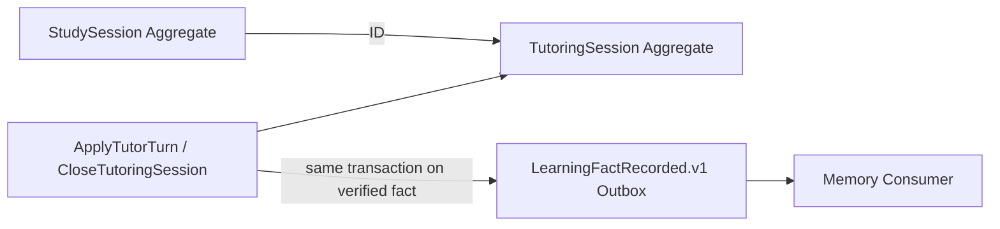

# 读学系统 — Study & Tutoring Domain Design

> 状态：讨论稿 · 版本：v1.0  
> 范围：学习执行会话、启发式答疑、兴趣承接、过程事实与答疑 Workflow。  
> 关联：[系统 Context Map](ddd-overview.md) · [Companion 编排](domain-companion.md) · [Memory Context](domain-memory.md) · [Server 物理设计](design-server.md) · [陪伴 PRD](../product/prd-companion.md)

## 一、边界与不变量

本 Context 拥有 `StudySession`、`TutoringSession`、经验证的 Ward 尝试、实际提示和会话结算事实。它不拥有 Thread/Run、长期画像或实时摄像行为结论。其核心不变量是：不代答、不代写、不把单次卡点升级为稳定能力结论。

| 业务 Aggregate | 强一致不变量 |
|---|---|
| `StudySession` | 归属 Ward 和已确认任务；开始/暂停/结束时间合法；结束后不得继续计时。 |
| `TutoringSession` | 归属活跃学习会话；关闭后不得再追加教学回复；所有持久化提示均经安全/反代写校验。 |

`TutorWorkingState` 不是 Aggregate，而是 `TutoringSession` 的受控 Runtime state / Checkpoint；它没有独立 Repository、Domain Event 或跨 Context 写权。

### 1.1 Aggregate 与应用用例



| Aggregate | Identity / 内部对象 | 行为 / 本地事件 | Repository Port |
|---|---|---|---|
| `StudySession` | `study_session_id`；interval child entity | `start()`、`pause()`、`finish()`；`StudySessionFinished` | `StudySessionRepository` |
| `TutoringSession` | `tutoring_session_id`；`TutoringMessage` child entity | `apply_validated_turn()`、`record_hint()`、`close()`；`TutorTurnRecorded`、`TutoringSessionClosed` | `TutoringSessionRepository` |

| Trigger | Entry / Use Case | Domain action | Follow-up |
|---|---|---|---|
| Ward 开始学习 | Companion invocation → `StartStudySession` | `StudySession.start()` | `StudySessionView` |
| Ward 发送答疑输入 | Companion invocation → `ApplyTutorTurn` | `TutoringSession.apply_validated_turn()` | 仅已验证尝试/实际提示发布 Fact Outbox |
| Ward 结束答疑 | UI command → `CloseTutoringSession` | `TutoringSession.close()` | `tutoring.session_closed` Fact；Memory 异步结算 Episode |

上述写 Use Case 都校验 Ward、会话状态和 `command_id`；`ApplyTutorTurn` 在模型候选已被 Runtime 校验后才开启本地事务，不能把 tool/model adapter 放进 Aggregate。

## 二、受限 ReAct Workflow

答疑使用有界 ReAct，而不是固定教学 Graph：模型可在允许动作中选择下一步，但每轮必须经 Policy/Validator，并受回合、工具和时长预算控制。

| 阶段 | 可选动作 | 确定性 guard | 退出 |
|---|---|---|---|
| 输入理解 | 澄清题目、识别直接索答/代写、识别兴趣发散 | 身份、会话归属、内容安全、题目附件权限 | 进入安全降级、教学或兴趣承接 |
| 教学循环 | `ask_socratic_question`、`surface_concept`、`request_attempt`、`give_targeted_hint`、`offer_similar_practice` | 不输出最终作业答案；提示级别和预算受 Policy 限制 | Ward 表示理解、会话关闭、预算耗尽或升级 |
| 工具观察 | `retrieve_authorized_learning_material`、`inspect_problem_attachment` | allow-list、对象权限、timeout；结果视为不可信内容 | 结果进入下一轮上下文，不直接写事实 |
| 结算 | 总结下一步、记录实际提示/尝试 | 只写验证过的发生事实；不写能力标签 | 关闭后发布事实，异步生成 Episode |

模型最多提出 `TutoringActionCandidate`、工具请求、`TutorWorkingStatePatch` 和展示回复。`OutputValidator` 必须先校验反代写、安全、schema、工具权限和预算；通过后才调用类型化 Study Use Case。

## 三、Query、接口、Working State 与召回

`TutorWorkingState` 由目标 Workflow 按 `tutoring_session_id + state_version` 持久化/Checkpoint，至少包括：`learning_goal`、受控题目引用、Ward 已验证尝试、已给提示及等级、待验证假设、当前策略、预算消耗、最近摘要与安全标记。模型不得保存原始完整对话或将推测写为事实。

恢复按顺序装配：会话/任务的确定性状态 → 最新兼容 Working State → 受限近期消息窗口 → 授权题目/资料 → `MemoryFacade` 返回的最小情境 Bundle。若 state/policy/checkpoint 不兼容，返回重新说明题目或重新开始，不推测旧进度。

| Query / View | 消费者与新鲜度 | 来源 |
|---|---|---|
| `GetStudySession` / `StudySessionView` | Ward；强一致 | StudySession |
| `GetTutoringInteraction` / `TutoringInteractionView` | Ward；最新已校验 Outcome | TutoringSession、Runtime state、授权 ContextBundle |

接口经 Companion 的 Turn/SSE 协议进入；附件检索与学习资料检索是 Application port 的 adapter，必须有对象 ACL、timeout、审计和受控错误。它们的输出是不可信输入，不能直接改 Aggregate。会话/消息/Checkpoint 的物理表、留存和删除映射见 [design-server.md](design-server.md)。

| Application Port | Adapter / 事务边界 | 失败 / 集成 |
|---|---|---|
| Session repositories | SQLAlchemy；Study/Tutoring Session 与消息 | 每个 Use Case 本地短事务；`command_id` 幂等 |
| learning-material query | 授权检索/附件 adapter | timeout 后降级为无资料教学；不可信结果经 Validator |
| Fact publisher | Study 本地事务 Outbox → Memory Consumer | 只发布已验证尝试、实际提示或关闭事实；来源四元组去重 |

## 四、前端交互、事实与失败

目标 UI 通过通用 Turn/SSE 协议呈现 `TutoringInteractionView`：当前问题或题目引用、允许输入方式、当前提示卡、下一步尝试请求、可选“我明白了/继续提示/结束”动作，以及安全降级说明。流式文本只用于展示；最终结构化 Outcome 才改变 UI 状态。

安全拒绝、直接索答或代写请求返回苏格拉底式降级，不能调用写工具。工具失败时可说明资料暂不可用并继续无工具教学；模型/预算失败遵循 Companion Run 的 `failed` / `timed_out` 语义。Ward 结束会话时，目标 Context 记录 `tutoring_episode` 所需的尝试、实际支持和结果事实，并发布 `LearningFactRecorded.v1`；Memory Worker 决定是否生成情境记忆或 Candidate Signal。

## 五、验收场景

```gherkin
Given Ward 请求“直接告诉我这道作业的答案”
When Tutoring Workflow 校验候选回复
Then 返回受控概念启发或要求先展示尝试
And 不写答案、Fact 或长期 Signal

Given Ward 已在同一题目完成两轮有效尝试
When 模型提出下一提示和 Working State patch
Then Validator 只持久化通过 schema 与提示级别 Policy 的 patch
And 关闭会话后才结算可追溯的 tutoring fact
```
