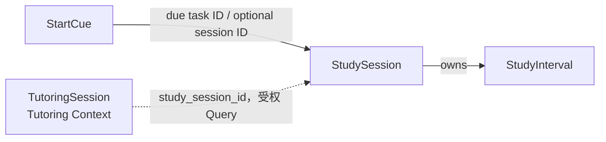
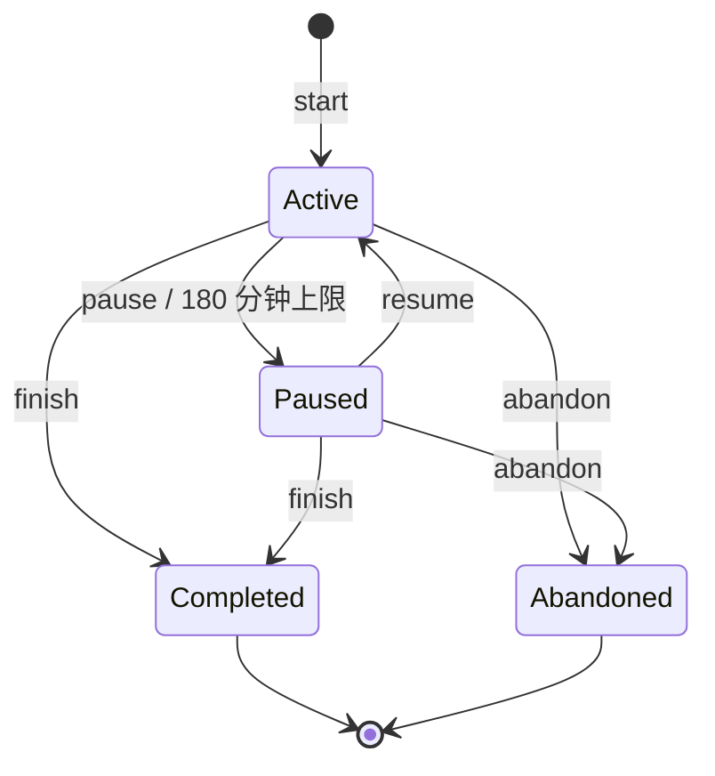
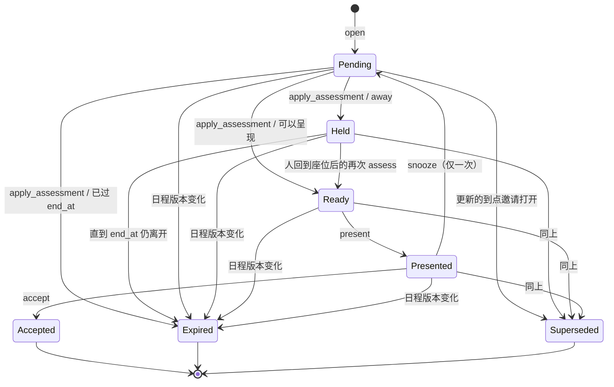
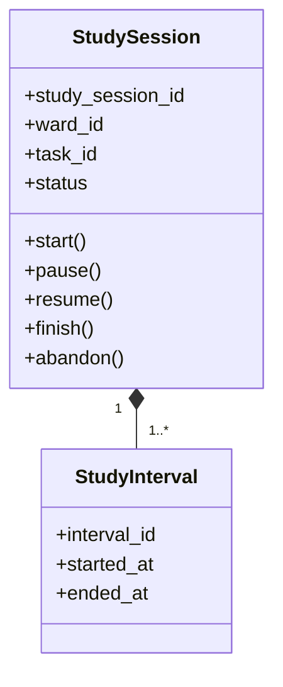
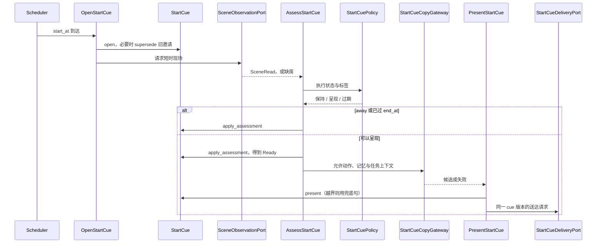

# 读学系统 — Study Domain Design

> 状态：讨论稿 · 版本：v4.0（答疑部分已拆至 [domain-tutoring.md](domain-tutoring.md)）
>
> 范围：学习执行会话（开始、暂停、完成、计时）、任务优先提醒中的到点开始邀请（`StartCue`），以及学习完成事实。
>
> 关联：[系统 Context Map](ddd-overview.md) · [Tutoring 辅导答疑](domain-tutoring.md) · [Companion 编排](domain-companion.md) · [Memory Context](domain-memory.md) · [Planning](domain-planning.md) · [Server 物理设计](design-server.md) · [陪伴 PRD](../product/prd-companion.md)

Context Map 与分层图只在 [ddd-overview.md](ddd-overview.md) 维护。答疑、`TutoringSession`、`ProblemRecord`、发音与 `TutoringTurnLoop` 只在 [domain-tutoring.md](domain-tutoring.md) 维护。Thread/Run、Harness 驱动、`WorkflowInteractionView` 和 SSE 只在 [domain-companion.md](domain-companion.md) 维护。Episode、Signal 与 Profile 只在 [domain-memory.md](domain-memory.md) 维护。物理表、留存和删除只在 [design-server.md](design-server.md) 维护。

## 一、边界与语言

本 Context 拥有 `StudySession`、`StudyInterval` 与 `StartCue`：实际开始、暂停、完成和放弃的执行事实，以及到点未开始的开始邀请。它不拥有答疑（见 [Tutoring](domain-tutoring.md)）、Thread/Run、长期画像、稳定 Signal、已确认日程，也不拥有帧或摄像行为结论。

核心不变量：

- 学习计时只由 `StudySession` 的区间记录。单次执行达到 180 分钟自动暂停，不自动完成；只有 Ward 的完成命令才能 `finish()`。
- 无任务会话不能完成任务，也不发布 `StudySessionCompleted.v1`。
- 暂停、断线、取消 Run 都不结束学习会话。
- `StartCue` 只邀请开始。它不自动 `start()`、不修改 `start_at`、不通知 Guardian。

| 术语 | 本 Context 中的含义 | 明确不是 |
|---|---|---|
| `StudySession` | 一次学习执行。可以不绑定已确认任务 | Thread、计划草稿、摄像片段 |
| `StartCue` | 一张开始邀请。已排进当日计划的某项任务到了开始时间，孩子还没有在做它 | 学习会话、计划修订、分心告警、家长催促 |
| `SceneRead` | 这次邀请采用的现场标签 | 帧、`BehaviorSegment`、专注分 |
| `StartCuePolicy` | 按当前执行和现场标签决定说不说，以及允许哪些动作 | 文案生成、记忆解读、日程冲突校验 |

非目标：Study 不私自发明交互 `kind`；不做实时监工。到点邀请不是分心打分，也不把摄像结论写入本 Context。答疑与发音不属于本 Context，见 [Tutoring](domain-tutoring.md)。

### 1.1 到点邀请的控制模型

到点邀请是固定流程加一次结构化文案调用，不是 `TutoringTurnLoop`，也不是按现场循环选工具。

| 决策 | 选择 | 原因 | 拒绝的方案 | 验证 |
|---|---|---|---|---|
| 谁拥有邀请 | `StartCue` 与 `StartCuePolicy` | 孩子还没在做刚到点的那一项，这是执行事实 | 放进 Planning，或由 Companion 决定说不说 | 刚到点的任务已有进行中或暂停会话则不打开；前一项仍在进行仍会打开 |
| 谁决定动作集合 | `StartCuePolicy` | 能否开始、暂停、再提醒一次是执行不变量 | 模型按记忆自选按钮或改 `start_at` | 集合外动作被拒绝，改用策略兜底句 |
| 谁写给孩子的那句话 | 事务外的一次文案调用 | 说法要用到记忆和当前任务上下文 | 按标签写死唯一文案；多轮 Agent 自行决定催几次 | 调用失败或越界时仍呈现兜底句，且只呈现一次 |
| 谁送达 | Companion | 回复权与 `kind` 属于入口协议 | Study 直接推送或在答疑半轮中插话 | 未登记 `kind` 前动作不可用 |

调度器只触发用例。现场端口没有帧时，用例得到 `no_observation`，不调用视觉分类。

## 二、领域模型


```mermaid
flowchart LR
    SS[StudySession]
    IV[StudyInterval]
    SC[StartCue]
    TS[TutoringSession<br/>Tutoring Context]
    SS -->|owns| IV
    SC -->|due task ID / optional session ID| SS
    TS -.->|study_session_id，受权 Query| SS
```

本 Context 有两个写 Aggregate：`StudySession` 与 `StartCue`，只通过 ID 关联。`StartCue` 不拥有 `StudySession`。`TutoringSession` 属于 Tutoring，只持有 `study_session_id`。

### 2.1 `StudySession`

| 项目 | 设计 |
|---|---|
| Identity | `study_session_id`，归属 `ward_id` |
| 子实体 | `StudyInterval` |
| 值对象 | `SessionWindow` |
| 不变量 | 归属当前 Ward；`task_id` 可空；时间区间不重叠；结束后不再计时；无任务会话不能完成任务 |
| 行为 | `start()`、`pause()`、`resume()`、`finish()`、`abandon()` |
| 本地事件 | `StudySessionStarted`、`StudySessionPaused`、`StudySessionResumed`、`StudySessionFinished`、`StudySessionAbandoned` |
| Repository | `StudySessionRepository` |

`finish()` 只接受 Ward 的完成命令。单次执行达到 180 分钟时，调度适配器调用 `PauseStudySession`，会话进入 `paused`，不自动完成。`abandon()` 表示 Ward 退出且不完成；不发布 `StudySessionCompleted.v1`。


```mermaid
stateDiagram-v2
    [*] --> Active: start
    Active --> Paused: pause / 180 分钟上限
    Paused --> Active: resume
    Active --> Completed: finish
    Paused --> Completed: finish
    Active --> Abandoned: abandon
    Paused --> Abandoned: abandon
    Completed --> [*]
    Abandoned --> [*]
```

#### 无任务会话

学习答疑可以不挂在任何任务上。此时 `StudySession.task_id` 为空，问答照常进行，不修改任何 `Task`，也不能把这次会话完成成某项任务。

任务进行中孩子问了无关问题时的回答与回任务提醒，由 [Tutoring](domain-tutoring.md#21-tutoringsession) 决定；不结束原来的任务会话。

### 2.2 `StartCue`

`StartCue` 是一张开始邀请。计划里的数学写着 19:00 开始，到了 19:00 数学还没有进行中或暂停中的学习会话，就留下这一张，问孩子要不要现在开始。前一项若还在进行，邀请照样留下，卡片上同时给出「继续前一项」和「暂停前一项并开始数学」。

它记下这次邀请的任务、开始和结束时间、当时的现场标签，以及孩子可以点的按钮。孩子接受、推迟、过了结束时间，或后一项到点把这张换掉，邀请就关闭。同一个孩子同时只有一张还开着的邀请。

`StartCue` 没有子实体。现场标签和允许动作都是值对象，因此不另画聚合内部类图；生命周期见下面的状态图。

| 项目 | 设计 |
|---|---|
| Identity | `start_cue_id`；业务幂等键为 `ward_id + due_task_id + schedule_id + schedule_version + start_at` |
| 值对象 | `SceneRead`、`CueAllowance`、邀请窗口（打开时记下的 `start_at` / `end_at`） |
| 引用 | `due_task_id`、`schedule_id`、可选的其他未结束 `study_session_id`、更早仍未开始的 `task_id` 列表 |
| 不变量 | 归属当前 Ward；刚到点的任务已经有进行中或暂停会话则不打开；其他任务仍在进行不影响打开；每名 Ward 同时只留一张未关闭邀请；`snooze()` 最多一次；`present()` 的动作必须属于已保存的 `CueAllowance`；`no_observation` 时正文不得声称看见书桌；接受后才可以在同一事务里开始或暂停会话 |
| 行为 | `open()`、`apply_assessment()`、`present()`、`accept()`、`snooze()`、`expire()`、`supersede()` |
| 本地事件 | `StartCueOpened`、`StartCueHeld`、`StartCueReadied`、`StartCuePresented`、`StartCueAccepted`、`StartCueSnoozed`、`StartCueExpired`、`StartCueSuperseded` |
| Repository | `StartCueRepository` |

`SceneRead.label` 只取 `already_working`、`settling_in`、`other_activity`、`away`、`unclear`、`no_observation`。没有设备、没有观察授权或没有帧，由端口在分类前返回缺席，标签为 `no_observation`，`gap_reason` 只取 `no_device`、`lease_denied`、`no_frames`。分类失败、空结果或无法归类，映射为已有的 `unclear`，不再另设失败标签。`away` 表示看见空座位。


```mermaid
stateDiagram-v2
    [*] --> Pending: open
    Pending --> Held: apply_assessment / away
    Pending --> Ready: apply_assessment / 可以呈现
    Pending --> Expired: apply_assessment / 已过 end_at
    Held --> Ready: 人回到座位后的再次 assess
    Held --> Expired: 直到 end_at 仍离开
    Ready --> Presented: present
    Presented --> Accepted: accept
    Presented --> Pending: snooze（仅一次）
    Pending --> Superseded: 更新的到点邀请打开
    Held --> Superseded: 同上
    Ready --> Superseded: 同上
    Presented --> Superseded: 同上
    Pending --> Expired: 日程版本变化
    Held --> Expired: 日程版本变化
    Ready --> Expired: 日程版本变化
    Presented --> Expired: 日程版本变化
    Accepted --> [*]
    Expired --> [*]
    Superseded --> [*]
```

同一 Ward 已有未关闭邀请时，`open()` 在同一事务里先 `supersede()` 旧邀请。旧邀请上的任务如果孩子还没在做，它的 `due_task_id` 就记入新邀请的「更早还没开始」列表，不另发一张卡片。

`StartCuePolicy` 是无状态领域服务。它只看三件事：除了刚到点的这项，有没有另一条进行中或暂停的会话（不挂任务的会话也算有）、`SceneRead.label`、是否已经推迟过。它不读记忆，不调用模型，不解释任务标题。

| 执行 | 现场 | 处置 | 允许动作 |
|---|---|---|---|
| 没有其他进行中或暂停的会话 | `away` | 保持，先不呈现 | 无 |
| 没有其他进行中或暂停的会话 | 其余标签 | 呈现 | `start_due_task`、尚未用过的 `snooze_once` |
| 另有进行中或暂停的会话 | `away` | 保持，先不呈现 | 无 |
| 另有进行中或暂停的会话 | 其余标签 | 呈现 | `continue_current`、`pause_current_and_start_due`、尚未用过的 `snooze_once` |
| 任意 | 已过 `end_at` 仍未呈现 | 过期 | 无 |

兜底主按钮：没有其他会话时是 `start_due_task`；有其他会话时是 `continue_current`。`unclear` 与 `no_observation` 仍然呈现，兜底句只陈述到点事实，不描述书桌。`no_observation` 的 `scene_claim_allowed=false`。

允许动作没有改期、自动开始和通知家长。孩子说「先做完当前这项」只关闭这次邀请或推迟一次，不修改 Planning 的 `start_at`。已开始执行的正式计划修订仍由 Planning 拒绝。

### 2.3 实体清单

| 对象 | 类型 | Identity | 参与决策的状态 | 行为 | 不变量 |
|---|---|---|---|---|---|
| `StudySession` | Aggregate Root | `study_session_id` | `ward_id`、`task_id?`、`status`、`version` | `start`、`pause`、`resume`、`finish`、`abandon` | 结束后不计时；无任务不可完成 |
| `StudyInterval` | Entity | `interval_id` | `started_at`、`ended_at?`、`end_reason?` | 由 Root 开关 | 同时只有一个未关闭区间 |
| `StartCue` | Aggregate Root | `start_cue_id` | `ward_id`、`due_task_id`、`status`、`schedule_version`、`snooze_count`、`version` | `open`、`apply_assessment`、`present`、`accept`、`snooze`、`expire`、`supersede` | 每名 Ward 同时只有一张未关闭邀请；动作不得超出已保存的允许集合 |
| `SceneRead` | Value Object | 无 | `label`、`gap_reason?` | `validate()` | `no_observation` 必有缺口原因；`away` 不是缺口 |
| `CueAllowance` | Value Object | 无 | 允许动作、兜底主按钮、兜底句、`scene_claim_allowed` | `admits(action)` | 无其他会话时不含暂停或继续；已提醒过一次后不含再推迟 |


```mermaid
classDiagram
    class StudySession {
        +study_session_id
        +ward_id
        +task_id
        +status
        +start()
        +pause()
        +resume()
        +finish()
        +abandon()
    }
    class StudyInterval {
        +interval_id
        +started_at
        +ended_at
    }
    StudySession "1" *-- "1..*" StudyInterval
```

这张图只含 `StudySession` 与 `StudyInterval`。`StartCue` 没有子实体，见 2.2。`StartCuePolicy` 是领域服务，不属于任何一个聚合。

## 三、应用用例

模型调用和工具调用发生在 Use Case 事务之外。完成校验通过后，Use Case 才打开本地短事务。全部写用例校验 Ward、会话版本和 `command_id`；同一 `command_id` 返回原结果，同键不同载荷拒绝。

| 触发 | 入口 | Use Case | 领域动作 | 本地事件 | 后续 | 幂等与失败 |
|---|---|---|---|---|---|---|
| Ward 开始学习 | Companion `RunInvocation` | `StartStudySession` | `start()` | `StudySessionStarted` | `StudySessionView` | `command_id`；无 `task_id` 时不发布完成事件 |
| 暂停或 180 分钟 | Ward 命令或 Scheduler | `PauseStudySession` | `pause()` | `StudySessionPaused` | 关闭当前区间 | 重复暂停无新区间 |
| Ward 继续 | Companion `RunInvocation` | `ResumeStudySession` | `resume()` | `StudySessionResumed` | 打开新区间 | 已结束后拒绝 |
| Ward 完成学习 | `StructuredWardCommand` | `FinishStudySession` | `finish()` | `StudySessionFinished` | 有 `task_id` 时同事务写 `StudySessionCompleted.v1` | 无任务会话拒绝完成 |
| Ward 退出且不完成 | 受权退出命令 | `AbandonStudySession` | `abandon()` | `StudySessionAbandoned` | 不发布完成事件 | 不回滚已提交答疑事实 |
| 调度器到达 `start_at` | Scheduler | `OpenStartCue` | `open()`；若已有未关闭邀请则对旧邀请 `supersede()` | `StartCueOpened`，可能还有 `StartCueSuperseded` | 向现场端口要一段短观察 | 幂等键见 2.2。刚到点的这项已有进行中或暂停会话则不开；前一项仍在进行仍打开 |
| 观察到达、观察超时，或推迟后再次到期 | Scheduler / 观察回调适配器 | `AssessStartCue` | `StartCuePolicy` 后 `apply_assessment()` | `StartCueHeld` 或 `StartCueReadied` | `Ready` 时才在事务外起草文案 | 缺席直接成为 `no_observation`，不调用分类 |
| 文案已通过允许集合校验 | `AssessStartCue` 的后续 | `PresentStartCue` | `present()` | `StartCuePresented` | 请求 Companion 送达 | 动作越界或声称看见了不存在的现场时，改用兜底句再提交；送达失败不回滚 |
| 孩子点卡片，或从首页开始了该任务 | `StructuredWardCommand` 或 `StartStudySession` | `AcceptStartCue` | `accept()`；需要时同一事务 `pause()` / `start()` | `StartCueAccepted`，以及对应的会话事件 | `StudySessionView` | 过期、版本冲突或动作不在允许集合中则拒绝 |
| 孩子点「等一下」 | 受权动作 | `SnoozeStartCue` | `snooze()` | `StartCueSnoozed` | 稍后再 `AssessStartCue` | 第二次推迟拒绝 |
| 新的 `PlanConfirmed.v1` 或到达 `end_at` | 消费适配器或 Scheduler | `ExpireStartCue` | `expire()` | `StartCueExpired` | 已呈现的卡片由 Companion 撤回 | 重复过期返回原结果 |

`StudySessionCompleted.v1` 在 `FinishStudySession` 的同一事务中写入 Outbox，不发布 `LearningFactRecorded.v1`。答疑互动事实由 [Tutoring](domain-tutoring.md#三应用用例) 发布。

### 3.1 `OpenStartCue` 到呈现

文案调用发生在事务外。`AssessStartCue` 提交并得到 `Ready` 之后，应用层才调用一次文案端口。校验通过后，`PresentStartCue` 另开短事务。`away` 停在 `Held`，不调用文案端口。

```python
class StartCueCopyCandidate(BaseModel):
    primary_action: Literal[
        "start_due_task",
        "continue_current",
        "pause_current_and_start_due",
        "snooze_once",
    ]
    secondary_action: Literal[
        "start_due_task",
        "continue_current",
        "pause_current_and_start_due",
        "snooze_once",
    ] | None = None
    text: str
    mentions_scene: bool
```

`primary_action` 与 `secondary_action` 都必须落在已保存的 `CueAllowance` 内，且二者不同。`scene_claim_allowed=false` 时 `mentions_scene` 必须为假。校验失败只再试一次，仍失败则用策略的兜底句和兜底主按钮调用 `present()`。记忆只进入这次文案调用的上下文，不进入 `StartCuePolicy`。


```mermaid
sequenceDiagram
    participant S as Scheduler
    participant O as OpenStartCue
    participant C as StartCue
    participant V as SceneObservationPort
    participant A as AssessStartCue
    participant P as StartCuePolicy
    participant G as StartCueCopyGateway
    participant R as PresentStartCue
    participant D as StartCueDeliveryPort

    S->>O: start_at 到达
    O->>C: open，必要时 supersede 旧邀请
    O->>V: 请求短时现场
    V-->>A: SceneRead，或缺席
    A->>P: 执行状态与标签
    P-->>A: 保持 / 呈现 / 过期
    alt away 或已过 end_at
        A->>C: apply_assessment
    else 可以呈现
        A->>C: apply_assessment，得到 Ready
        A->>G: 允许动作、记忆与任务上下文
        G-->>R: 候选或失败
        R->>C: present（越界则用兜底句）
        R->>D: 同一 cue 版本的送达请求
    end
```

| 参与者 | 标准类型 | 职责 |
|---|---|---|
| `Scheduler` | Infrastructure | 到点、观察超时、`end_at` 和推迟到期时调用用例 |
| `OpenStartCue` / `AssessStartCue` / `PresentStartCue` | Use Case | 授权、短事务、幂等；文案调用留在事务外 |
| `StartCue` | Aggregate Root | 拒绝第二张未关闭邀请、第二次推迟和集合外动作 |
| `StartCuePolicy` | Domain Service | 决定保持、呈现或过期，并给出允许动作 |
| `SceneObservationPort` | Infrastructure | 返回 `SceneRead` 或缺席；不把帧写入 Study |
| `StartCueCopyGateway` | Infrastructure | 一次结构化文案调用 |
| `StartCueDeliveryPort` | Infrastructure | 请 Companion 在有回复权时呈现；失败只重试送达 |

孩子接受时，`AcceptStartCue` 在同一事务中处理邀请和会话：`start_due_task` 调用新会话的 `start()`；`pause_current_and_start_due` 先 `pause()` 当前会话再 `start()` 到点任务；`continue_current` 只 `accept()`，不改变会话。`StartStudySession` 若开始的就是这张邀请的 `due_task_id`，同一事务 `accept(start_due_task)`。这些用例都不发布 `LearningFactRecorded.v1`，也不调用 `GuardianAlertPort`。

## 四、Query

| Query / View | 消费者与新鲜度 | 来源 |
|---|---|---|
| `GetStudySession` / `StudySessionView` | Ward；用例提交后强一致 | `StudySession` 与区间 |
| `GetStartCue` / `StartCueView` | Ward；`PresentStartCue` 提交后强一致 | `StartCue` 的状态、允许动作、到点任务与更早未开始任务的 ID |

`StartCueView` 在读取时经 Planning 受权查询填入任务标题，标题不写回 `StartCue`。`GetStudySession` 也供 [Tutoring](domain-tutoring.md) 作受权 Query 使用，返回 `status`、`ward_id`、`task_id`。Guardian 不通过这些 Query 读取进行中的到点邀请。

## 五、跨 Context 契约

| 事件 | 生产者 | 消费者 | 幂等 | 失败 |
|---|---|---|---|---|
| `StudySessionCompleted.v1` | `FinishStudySession`，且存在 `task_id` | Evaluation；Planning `CompleteTask`（把该 Task 标为 `completed`，见 [Task 状态](domain-planning.md#task-状态)） | `study_session_id + version` | 无任务完成不发布；重复完成返回原结果。Study 不写 `Task` |

Study 消费已有的 `PlanConfirmed.v1`。除准备可执行计划外，`ExpireStartCue` 使仍未关闭、且 `schedule_id + schedule_version` 对不上的 `StartCue` 过期。幂等键沿用 `schedule_id + version`。

`SceneWindow` 是对 Behavior Analysis 的受权查询，不是 Integration Event。`SceneObservationPort` 把缺席译成本 Context 的 `no_observation`。已确认的 `start_at`、`end_at` 与任务标题来自 Planning 的受权查询；Study 不保存日程正文作为第二事实源。标题只进入文案调用。`MemoryBundle` 同样只进入文案调用。

卡片的 `kind` 为 `start_cue`，`object_ref` 指向 `GetStartCue`。动作命令为 `start_due_task`、`continue_current`、`pause_current_and_start_due`、`snooze_once`。这些必须先登记在 [Companion Interaction Protocol](domain-companion.md#52-companion-interaction-protocol)，Study 不私自增加 `kind`。Companion 在当前 Run 仍有回复权时排队，答疑轮次结束后再呈现。送达以 `start_cue_id + version` 去重。

`StartCue` 不发布 `LearningFactRecorded.v1`。一次未开始不进入 Memory。

信封、SSE 和 Run 生命周期的失败语义以 Companion 为准。Fact 入账与 Episode 结算以 Memory 为准。

Tutoring 经受权 Query 读取 `StudySession`，不订阅 Study 的 Domain Event；Study 不读取 Tutoring 的 Aggregate。

## 六、基础设施映射

| Port | Adapter | 超时与失败 |
|---|---|---|
| `StudySessionRepository` | SQLAlchemy | 用例本地短事务；版本冲突返回 `conflict` |
| `StudyOutbox` | Study Outbox | 保存 `StudySessionCompleted.v1`；去重键 `study_session_id + version` |
| `StartCueRepository` | SQLAlchemy | 每名 Ward 至多一张未关闭邀请；版本冲突返回 `conflict` |
| `SceneObservationPort` | Behavior / Device ACL | 超时或无帧映射为 `no_observation`；分类无可用标签映射为 `unclear`；不重试到改变标签 |
| `StartCueCopyGateway` | 模型 Gateway 的一次结构化调用 | 超时或候选非法时使用策略兜底句；不做工具循环 |
| `StartCueDeliveryPort` | Companion 送达适配器 | 按 `start_cue_id + version` 重试；失败不改变 `StartCue` |

Study Repository 不保存完整 transcript，也不保存帧。到点邀请的关联 ID 使用 `start_cue_id + schedule_id + schedule_version`。缺口原因只进入审计，不进入 Ward 文案。授权边界是当前 Ward。

## 七、验收场景

```gherkin
Given 已排进当日计划的任务到达 start_at，且该任务没有进行中或暂停的 StudySession，现场端口没有帧
When OpenStartCue 与 AssessStartCue 完成
Then SceneRead 为 no_observation
And 不调用视觉分类
And 呈现的句子不声称看见书桌
And 不发布 LearningFactRecorded.v1
And 不调用 GuardianAlertPort

Given 现场标签为 away
When AssessStartCue 完成
Then StartCue 进入 Held
And 不调用文案端口
And 在 end_at 仍无人时 ExpireStartCue 将其过期

Given 另有一条进行中或暂停的会话，且现场不是 away
When PresentStartCue 提交
Then 允许动作只有 continue_current、pause_current_and_start_due，以及至多一次 snooze_once
And 文案候选若带有改期动作则被拒绝并改用兜底句

Given Ward 已经对这张邀请 snooze 过一次
When 再次提交 snooze_once
Then SnoozeStartCue 拒绝
And StartCue 仍保持原状态

Given Ward 接受 pause_current_and_start_due
When AcceptStartCue 提交
Then 当前会话暂停，到点任务的新会话开始
And StartCue 进入 Accepted
And Planning 的 start_at 不变

Given StudySession 已 Active 且连续计时达到 180 分钟
When 调度适配器调用 PauseStudySession
Then 会话进入 paused，当前区间关闭
And 不自动 finish，不发布 StudySessionCompleted.v1

Given StudySession 没有 task_id
When Ward 调用 FinishStudySession
Then 命令被拒绝，不发布 StudySessionCompleted.v1
```
