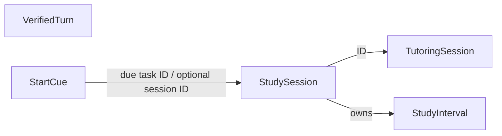
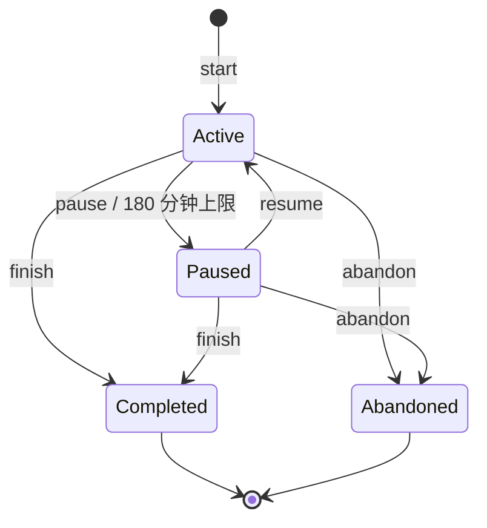
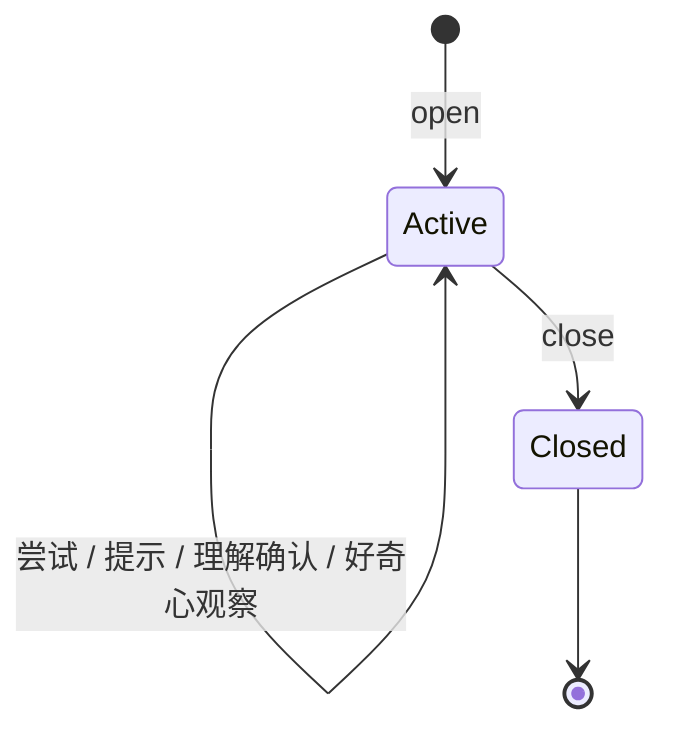
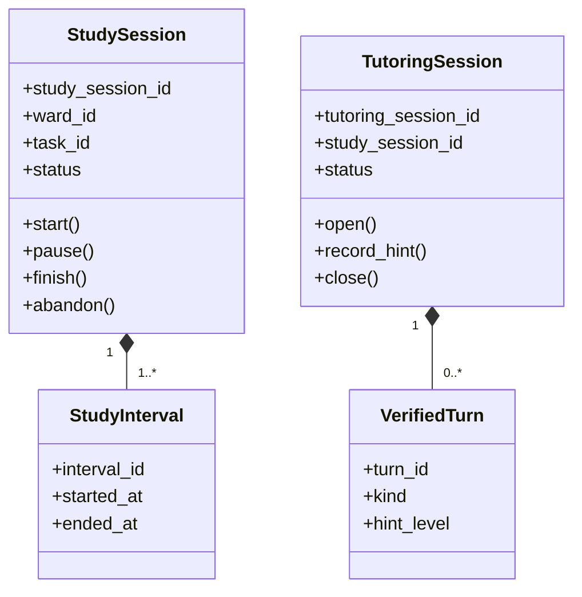
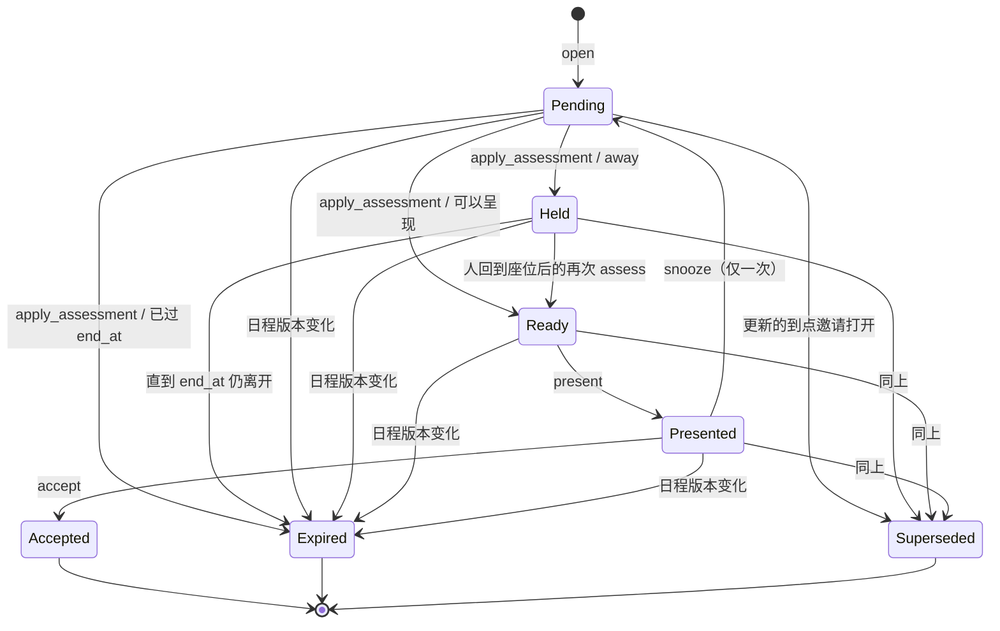
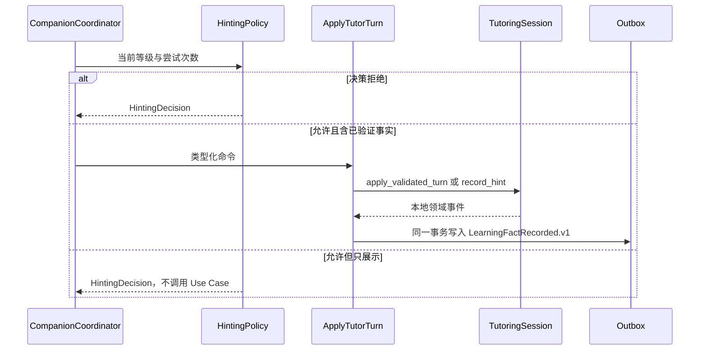
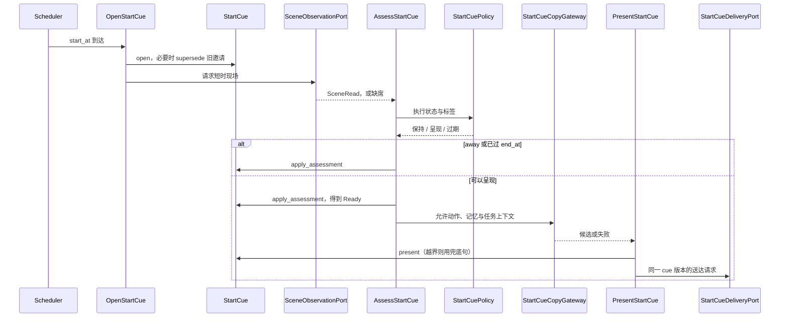
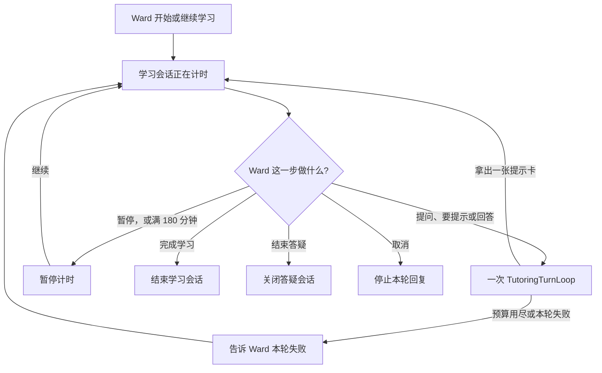
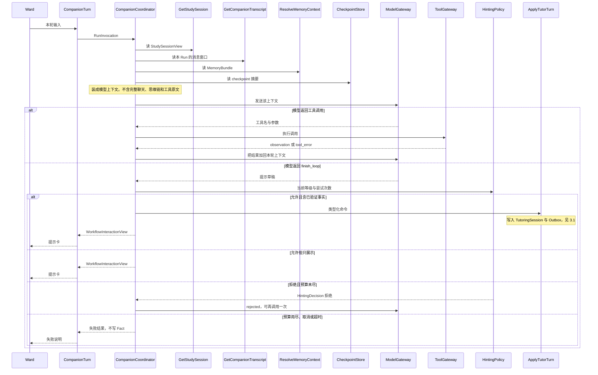

# 读学系统 — Study & Tutoring Domain Design

> 状态：讨论稿 · 版本：v2.2  
> 范围：学习执行会话、启发式答疑、任务优先提醒（口头回任务与到点开始邀请）、过程事实，以及一次 Ward 输入内的 `TutoringTurnLoop`。  
> 关联：[系统 Context Map](ddd-overview.md) · [Companion 编排](domain-companion.md) · [Memory Context](domain-memory.md) · [Planning](domain-planning.md) · [Server 物理设计](design-server.md) · [陪伴 PRD](../product/prd-companion.md)

Context Map 与分层图只在 [ddd-overview.md](ddd-overview.md) 维护。Thread/Run、Harness 驱动、`WorkflowInteractionView` 和 SSE 只在 [domain-companion.md](domain-companion.md) 维护。Episode、Signal 与 Profile 只在 [domain-memory.md](domain-memory.md) 维护。物理表、留存和删除只在 [design-server.md](design-server.md) 维护。

## 一、边界与语言

本 Context 拥有 `StudySession`、`TutoringSession`、`StartCue`、已验证的 Ward 尝试、实际提示、理解确认、好奇心观察和会话关闭事实。它不拥有 Thread/Run、长期画像、稳定 Signal、已确认日程，也不拥有帧或摄像行为结论。

核心不变量：

- L1–L3 不输出最终作业答案、完整解题或代写。L4 只有 `HintingPolicy` 放行后才允许完整思路，并且必须附带验证问题。
- 单次卡点、单次好奇心不升级为稳定能力或稳定兴趣结论。一次到点未开始也不写成学习事实或稳定特质。
- 模型可以起草给 Ward 看的散文；提示等级、按钮、媒体引用、事实写入和“已经记下”只能来自已提交的领域结果。
- `StartCue` 只邀请开始。它不自动 `start()`、不修改 `start_at`、不通知 Guardian。

| 术语 | 本 Context 中的含义 | 明确不是 |
|---|---|---|
| `StudySession` | 一次学习执行。可以不绑定已确认任务 | Thread、计划草稿、摄像片段 |
| `TutoringSession` | 隶属某个未结束 `StudySession` 的答疑会话 | Companion Run 的复制 |
| `VerifiedTurn` | 已通过校验并写入的尝试、提示、理解确认或好奇心观察 | 原始对话、模型候选、Trace |
| `HintLevel` | 当前题目允许的提示等级 L1–L4 | 模型自行选择的下一句话类型 |
| `TutorWorkingState` | 答疑 Run 的 checkpoint | Aggregate、长期记忆、完整 transcript |
| `TutoringTurnLoop` | 一次 Ward 输入内的有界循环 | 跨回合的教学状态机，也不是第二个 Agent |
| `StartCue` | 一张开始邀请。已排进当日计划的某项任务到了开始时间，孩子还没有在做它 | 学习会话、计划修订、分心告警、家长催促 |
| `SceneRead` | 这次邀请采用的现场标签 | 帧、`BehaviorSegment`、专注分 |
| `StartCuePolicy` | 按当前执行和现场标签决定说不说，以及允许哪些动作 | 文案生成、记忆解读、日程冲突校验 |

非目标：不发明交互 `kind`；本期不做作文共创画布、视频媒体、实时监工和拍照搜题。到点邀请不是分心打分，也不把摄像结论写入本 Context。无任务问答与任务进行中的题外提问见下文「无任务答疑」。

### 1.1 控制模型

答疑是混合模式。跨回合的开始、暂停、完成、关闭、取消和超时由应用用例与 Aggregate 状态机控制。`TutoringTurnLoop` 只处理一次 Ward 输入内部的不确定性：理解意图、解析题目或资料、按当前允许等级起草一个交互。

| 决策 | 选择 | 原因 | 拒绝的方案 | 验证 |
|---|---|---|---|---|
| 是否需要循环 | 一次输入内需要 | 本轮可能先检索或看附件，再起草一个合法提示 | 整段答疑一次模型调用；模型连续对孩子自问自答 | 无工具输入直接 `finish_loop`；有附件时先 observation 再起草 |
| 谁控制等级 | `HintingPolicy` | 首轮等级和 L4 门槛是固定教学政策 | 模型自选 `ask_socratic_question` 等动作 | 门槛前的 L4 候选被拒绝 |
| 谁确认循环完成 | `HintingPolicy` 与 `ApplyTutorTurn` | 模型返回的 `finish_loop` 只是候选 | 模型声明“孩子已经懂了”即成功 | 决策拒绝时不写 Fact |
| 循环由谁驱动 | `CompanionCoordinator` | 它是 Process Manager，只编排预算、取消和超时 | 再设一个 Harness 类型 | 未实现的工具由 `ToolGateway` 返回失败 |

`budget_exhausted`、取消和超时由 `CompanionCoordinator` 在模型还能返回 `finish_loop` 之前终止。它们表示本轮没有得到可靠教学结果。

### 1.2 到点邀请的控制模型

到点邀请是固定流程加一次结构化文案调用，不是 `TutoringTurnLoop`，也不是按现场循环选工具。

| 决策 | 选择 | 原因 | 拒绝的方案 | 验证 |
|---|---|---|---|---|
| 谁拥有邀请 | `StartCue` 与 `StartCuePolicy` | 孩子还没在做刚到点的那一项，这是执行事实 | 放进 Planning，或由 Companion 决定说不说 | 刚到点的任务已有进行中或暂停会话则不打开；前一项仍在进行仍会打开 |
| 谁决定动作集合 | `StartCuePolicy` | 能否开始、暂停、再提醒一次是执行不变量 | 模型按记忆自选按钮或改 `start_at` | 集合外动作被拒绝，改用策略兜底句 |
| 谁写给孩子的那句话 | 事务外的一次文案调用 | 说法要用到记忆和当前任务上下文 | 按标签写死唯一文案；多轮 Agent 自行决定催几次 | 调用失败或越界时仍呈现兜底句，且只呈现一次 |
| 谁送达 | Companion | 回复权与 `kind` 属于入口协议 | Study 直接推送或在答疑半轮中插话 | 未登记 `kind` 前动作不可用 |

调度器只触发用例。现场端口没有帧时，用例得到 `no_observation`，不调用视觉分类。

## 二、领域模型


```mermaid
flowchart LR
    SS[StudySession]
    IV[StudyInterval]
    TS[TutoringSession]
    VT[VerifiedTurn]
    SC[StartCue]
    SS -->|ID| TS
    SS -->|owns| IV
    SC -->|due task ID / optional session ID| SS
```

三个 Aggregate 只通过 ID 关联。`StartCue` 不拥有 `StudySession`。`TutorWorkingState` 不在这张图里，它是 Infrastructure checkpoint。

### 2.1 `StudySession`

| 项目 | 设计 |
|---|---|
| Identity | `study_session_id`，归属 `ward_id` |
| 子实体 | `StudyInterval` |
| 值对象 | `SessionWindow` |
| 不变量 | 归属当前 Ward；`task_id` 可空；时间区间不重叠；结束后不再计时；无任务会话不能完成任务 |
| 行为 | `start()`、`pause()`、`resume()`、`finish()`、`abandon()` |
| 本地事件 | `StudySessionStarted`、`StudySessionPaused`、`StudySessionResumed`、`StudySessionFinished`、`StudySessionAbandoned` |
| Repository | `StudySessionRepository` |

`finish()` 只接受 Ward 的完成命令。单次执行达到 180 分钟时，调度适配器调用 `PauseStudySession`，会话进入 `paused`，不自动完成。`abandon()` 表示 Ward 退出且不完成；不发布 `StudySessionCompleted.v1`。


```mermaid
stateDiagram-v2
    [*] --> Active: start
    Active --> Paused: pause / 180 分钟上限
    Paused --> Active: resume
    Active --> Completed: finish
    Paused --> Completed: finish
    Active --> Abandoned: abandon
    Paused --> Abandoned: abandon
    Completed --> [*]
    Abandoned --> [*]
```

#### 无任务答疑

学习答疑可以不挂在任何任务上。此时 `StudySession.task_id` 为空，问答照常进行，不修改任何 `Task`，也不能把这次会话完成成某项任务。

只有一种要分开的情况：当前已经有一项任务的 `StudySession` 处于 `active` 或 `paused`，这段时间里孩子又问了与该任务无关的问题。允许简短回答，同时提醒回到那项任务，并且不结束原来的任务会话。

### 2.2 `TutoringSession`

| 项目 | 设计 |
|---|---|
| Identity | `tutoring_session_id`，归属 `ward_id` 与 `study_session_id` |
| 子实体 | `VerifiedTurn` |
| 值对象 | `ProblemRef`、`HintRecord` |
| 不变量 | 所属学习会话未结束；关闭后不能追加；持久化提示不超过 Policy 允许等级 |
| 行为 | `open()`、`apply_validated_turn()`、`record_hint()`、`confirm_understanding()`、`close()` |
| 本地事件 | `TutoringSessionOpened`、`TutorTurnRecorded`、`HintRecorded`、`UnderstandingConfirmed`、`TutoringSessionClosed` |
| Repository | `TutoringSessionRepository` |


```mermaid
stateDiagram-v2
    [*] --> Active: open
    Active --> Active: 尝试 / 提示 / 理解确认 / 好奇心观察
    Active --> Closed: close
    Closed --> [*]
```

`open()` 在进入该学习会话的首次答疑循环时执行，使信封可以引用 `tutoring_session_id`。只展示、尚未产生互动 Fact 的会话保持 `Active`。没有互动 Fact 的关闭不会被 Memory 结算为 Episode。

暂停学习、断线、取消 Run 和预算耗尽都不进入 `Closed`。

### 2.3 实体清单

| 对象 | 类型 | Identity | 参与决策的状态 | 行为 | 不变量 |
|---|---|---|---|---|---|
| `StudySession` | Aggregate Root | `study_session_id` | `ward_id`、`task_id?`、`status`、`version` | `start`、`pause`、`resume`、`finish`、`abandon` | 结束后不计时；无任务不可完成 |
| `StudyInterval` | Entity | `interval_id` | `started_at`、`ended_at?`、`end_reason?` | 由 Root 开关 | 同时只有一个未关闭区间 |
| `TutoringSession` | Aggregate Root | `tutoring_session_id` | `study_session_id`、`status`、`version` | `open`、`apply_validated_turn`、`record_hint`、`confirm_understanding`、`close` | 关闭后不可追加 |
| `VerifiedTurn` | Entity | `turn_id` | `kind`、`hint_level?`、`command_id` | 由 Root 追加 | 只记录已校验事实，不含思维链和工具原文 |
| `ProblemRef` | Value Object | 无 | 授权题目引用与版本 | `validate()` | 引用必须来自授权解析结果 |
| `HintRecord` | Value Object | 无 | `level`、`policy_version` | `within(allowed)` | 等级只可取自 Policy 结果 |
| `HintingDecision` | Value Object | 无 | `allowed_level`、`return_to_task`、`l4_walkthrough_allowed` | `validate()` | L4 未放行时 `l4_walkthrough_allowed=false` |
| `StartCue` | Aggregate Root | `start_cue_id` | `ward_id`、`due_task_id`、`status`、`schedule_version`、`snooze_count`、`version` | `open`、`apply_assessment`、`present`、`accept`、`snooze`、`expire`、`supersede` | 每名 Ward 同时只有一张未关闭邀请；动作不得超出已保存的允许集合 |
| `SceneRead` | Value Object | 无 | `label`、`gap_reason?` | `validate()` | `no_observation` 必有缺口原因；`away` 不是缺口 |
| `CueAllowance` | Value Object | 无 | 允许动作、兜底主按钮、兜底句、`scene_claim_allowed` | `admits(action)` | 无其他会话时不含暂停或继续；已提醒过一次后不含再推迟 |

`VerifiedTurn.kind` 只取 `attempt`、`hint`、`understanding`、`curiosity`。它不是 Companion journal，不保存完整聊天。


```mermaid
classDiagram
    class StudySession {
        +study_session_id
        +ward_id
        +task_id
        +status
        +start()
        +pause()
        +finish()
        +abandon()
    }
    class StudyInterval {
        +interval_id
        +started_at
        +ended_at
    }
    class TutoringSession {
        +tutoring_session_id
        +study_session_id
        +status
        +open()
        +record_hint()
        +close()
    }
    class VerifiedTurn {
        +turn_id
        +kind
        +hint_level
    }
    StudySession "1" *-- "1..*" StudyInterval
    TutoringSession "1" *-- "0..*" VerifiedTurn
```

这张图只含 `StudySession` 与 `TutoringSession` 的根和子实体。`StartCue` 没有子实体，不画入内部图，见 2.5。`HintingPolicy` 与 `StartCuePolicy` 是领域服务，不属于任何一个聚合。

### 2.4 `HintingPolicy`

`HintingPolicy` 是无状态领域服务。它根据当前 `HintLevel`、同一题目的已验证尝试次数、Policy 版本，以及本轮是否为任务外提问，返回 `HintingDecision`。它不调用模型，不写 Repository，也不解释开放文本。

规则：

- 新题目从 L1 开始。Ward 继续求提示或再次未通过时，才可升到下一等级。
- L1–L3 禁止最终答案、完整解题和代写。
- 同一题目已有三次已验证的未通过尝试，或 Ward 在 L3 之后明确要求再讲解时，才允许 L4。L4 正文必须包含验证问题。
- 当前 `StudySession.task_id` 非空且会话为 `active` 或 `paused`，或者当前时间落在该任务已确认时段内，而本轮是好奇心或闲聊时，`return_to_task=true`。任务会话保持原状态。
- 无任务会话的好奇心不触发回任务提醒。

开放文本属于索答、代写、好奇心、闲聊还是危机情绪，由一次结构化分类调用给出标签。`HintingPolicy` 只消费这个标签。分类调用不选择教学动作，也不写会话。

口头闲聊时的回任务只由 `HintingPolicy` 决定。到点仍未开始的邀请由 `StartCuePolicy` 决定，二者不合并。

### 2.5 `StartCue`

`StartCue` 是一张开始邀请。计划里的数学写着 19:00 开始，到了 19:00 数学还没有进行中或暂停中的学习会话，就留下这一张，问孩子要不要现在开始。前一项若还在进行，邀请照样留下，卡片上同时给出「继续前一项」和「暂停前一项并开始数学」。

它记下这次邀请的任务、开始和结束时间、当时的现场标签，以及孩子可以点的按钮。孩子接受、推迟、过了结束时间，或后一项到点把这张换掉，邀请就关闭。同一个孩子同时只有一张还开着的邀请。

`StartCue` 没有子实体。现场标签和允许动作都是值对象，因此不另画聚合内部类图；生命周期见下面的状态图。

| 项目 | 设计 |
|---|---|
| Identity | `start_cue_id`；业务幂等键为 `ward_id + due_task_id + schedule_id + schedule_version + start_at` |
| 值对象 | `SceneRead`、`CueAllowance`、邀请窗口（打开时记下的 `start_at` / `end_at`） |
| 引用 | `due_task_id`、`schedule_id`、可选的其他未结束 `study_session_id`、更早仍未开始的 `task_id` 列表 |
| 不变量 | 归属当前 Ward；刚到点的任务已经有进行中或暂停会话则不打开；其他任务仍在进行不影响打开；每名 Ward 同时只留一张未关闭邀请；`snooze()` 最多一次；`present()` 的动作必须属于已保存的 `CueAllowance`；`no_observation` 时正文不得声称看见书桌；接受后才可以在同一事务里开始或暂停会话 |
| 行为 | `open()`、`apply_assessment()`、`present()`、`accept()`、`snooze()`、`expire()`、`supersede()` |
| 本地事件 | `StartCueOpened`、`StartCueHeld`、`StartCueReadied`、`StartCuePresented`、`StartCueAccepted`、`StartCueSnoozed`、`StartCueExpired`、`StartCueSuperseded` |
| Repository | `StartCueRepository` |

`SceneRead.label` 只取 `already_working`、`settling_in`、`other_activity`、`away`、`unclear`、`no_observation`。没有设备、没有观察授权或没有帧，由端口在分类前返回缺席，标签为 `no_observation`，`gap_reason` 只取 `no_device`、`lease_denied`、`no_frames`。分类失败、空结果或无法归类，映射为已有的 `unclear`，不再另设失败标签。`away` 表示看见空座位。


```mermaid
stateDiagram-v2
    [*] --> Pending: open
    Pending --> Held: apply_assessment / away
    Pending --> Ready: apply_assessment / 可以呈现
    Pending --> Expired: apply_assessment / 已过 end_at
    Held --> Ready: 人回到座位后的再次 assess
    Held --> Expired: 直到 end_at 仍离开
    Ready --> Presented: present
    Presented --> Accepted: accept
    Presented --> Pending: snooze（仅一次）
    Pending --> Superseded: 更新的到点邀请打开
    Held --> Superseded: 同上
    Ready --> Superseded: 同上
    Presented --> Superseded: 同上
    Pending --> Expired: 日程版本变化
    Held --> Expired: 日程版本变化
    Ready --> Expired: 日程版本变化
    Presented --> Expired: 日程版本变化
    Accepted --> [*]
    Expired --> [*]
    Superseded --> [*]
```

同一 Ward 已有未关闭邀请时，`open()` 在同一事务里先 `supersede()` 旧邀请。旧邀请上的任务如果孩子还没在做，它的 `due_task_id` 就记入新邀请的「更早还没开始」列表，不另发一张卡片。

`StartCuePolicy` 是无状态领域服务。它只看三件事：除了刚到点的这项，有没有另一条进行中或暂停的会话（不挂任务的会话也算有）、`SceneRead.label`、是否已经推迟过。它不读记忆，不调用模型，不解释任务标题。

| 执行 | 现场 | 处置 | 允许动作 |
|---|---|---|---|
| 没有其他进行中或暂停的会话 | `away` | 保持，先不呈现 | 无 |
| 没有其他进行中或暂停的会话 | 其余标签 | 呈现 | `start_due_task`、尚未用过的 `snooze_once` |
| 另有进行中或暂停的会话 | `away` | 保持，先不呈现 | 无 |
| 另有进行中或暂停的会话 | 其余标签 | 呈现 | `continue_current`、`pause_current_and_start_due`、尚未用过的 `snooze_once` |
| 任意 | 已过 `end_at` 仍未呈现 | 过期 | 无 |

兜底主按钮：没有其他会话时是 `start_due_task`；有其他会话时是 `continue_current`。`unclear` 与 `no_observation` 仍然呈现，兜底句只陈述到点事实，不描述书桌。`no_observation` 的 `scene_claim_allowed=false`。

允许动作没有改期、自动开始和通知家长。孩子说「先做完当前这项」只关闭这次邀请或推迟一次，不修改 Planning 的 `start_at`。已开始执行的正式计划修订仍由 Planning 拒绝。

## 三、应用用例

模型调用和工具调用发生在 Use Case 事务之外。完成校验通过后，Use Case 才打开本地短事务。全部写用例校验 Ward、会话版本和 `command_id`；同一 `command_id` 返回原结果，同键不同载荷拒绝。

| 触发 | 入口 | Use Case | 领域动作 | 本地事件 | 后续 | 幂等与失败 |
|---|---|---|---|---|---|---|
| Ward 开始学习 | Companion `RunInvocation` | `StartStudySession` | `start()` | `StudySessionStarted` | `StudySessionView` | `command_id`；无 `task_id` 时不发布完成事件 |
| 首次进入答疑 | Companion `RunInvocation` | `StartTutoringSession` | `open()` | `TutoringSessionOpened` | 可引用的 `tutoring_session_id` | 同一学习会话已有未关闭答疑时恢复，不另开 |
| 暂停或 180 分钟 | Ward 命令或 Scheduler | `PauseStudySession` | `pause()` | `StudySessionPaused` | 关闭当前区间 | 重复暂停无新区间 |
| Ward 继续 | Companion `RunInvocation` | `ResumeStudySession` | `resume()` | `StudySessionResumed` | 打开新区间 | 已结束后拒绝 |
| Ward 完成学习 | `StructuredWardCommand` | `FinishStudySession` | `finish()` | `StudySessionFinished` | 有 `task_id` 时同事务写 `StudySessionCompleted.v1` | 无任务会话拒绝完成 |
| Ward 退出且不完成 | 受权退出命令 | `AbandonStudySession` | `abandon()` | `StudySessionAbandoned` | 不发布完成事件 | 不回滚已提交答疑事实 |
| 已校验的答疑候选 | `HintingPolicy` 允许之后 | `ApplyTutorTurn` | `apply_validated_turn()` 或 `record_hint()` | `TutorTurnRecorded` 或 `HintRecorded` | 同事务写一条互动 Fact | 决策拒绝时不启事务 |
| `tutor_understood` | 上一轮信封中的受权动作 | `ConfirmUnderstanding` | `confirm_understanding()` | `UnderstandingConfirmed` | 互动 Fact | 模型正文里的“你懂了”不能触发 |
| `tutor_close` | 受权关闭动作 | `CloseTutoringSession` | `close()` | `TutoringSessionClosed` | 恰好一条 `tutoring.session_closed` | 重复关闭返回原关闭结果 |
| 调度器到达 `start_at` | Scheduler | `OpenStartCue` | `open()`；若已有未关闭邀请则对旧邀请 `supersede()` | `StartCueOpened`，可能还有 `StartCueSuperseded` | 向现场端口要一段短观察 | 幂等键见 2.5。刚到点的这项已有进行中或暂停会话则不开；前一项仍在进行仍打开 |
| 观察到达、观察超时，或推迟后再次到期 | Scheduler / 观察回调适配器 | `AssessStartCue` | `StartCuePolicy` 后 `apply_assessment()` | `StartCueHeld` 或 `StartCueReadied` | `Ready` 时才在事务外起草文案 | 缺席直接成为 `no_observation`，不调用分类 |
| 文案已通过允许集合校验 | `AssessStartCue` 的后续 | `PresentStartCue` | `present()` | `StartCuePresented` | 请求 Companion 送达 | 动作越界或声称看见了不存在的现场时，改用兜底句再提交；送达失败不回滚 |
| 孩子点卡片，或从首页开始了该任务 | `StructuredWardCommand` 或 `StartStudySession` | `AcceptStartCue` | `accept()`；需要时同一事务 `pause()` / `start()` | `StartCueAccepted`，以及对应的会话事件 | `StudySessionView` | 过期、版本冲突或动作不在允许集合中则拒绝 |
| 孩子点「等一下」 | 受权动作 | `SnoozeStartCue` | `snooze()` | `StartCueSnoozed` | 稍后再 `AssessStartCue` | 第二次推迟拒绝 |
| 新的 `PlanConfirmed.v1` 或到达 `end_at` | 消费适配器或 Scheduler | `ExpireStartCue` | `expire()` | `StartCueExpired` | 已呈现的卡片由 Companion 撤回 | 重复过期返回原结果 |

互动 Fact 的 `event_type` 为 `tutoring.attempt_recorded`、`tutoring.hint_given`、`tutoring.understanding_confirmed` 或 `tutoring.curiosity_observed`。它们在当轮事务提交。`tutoring.session_closed` 只由 `CloseTutoringSession` 发布一次。Memory 在同时具备关闭事实和至少一条互动事实时结算 Episode；Study 不结算 Episode，也不提出 Signal。

安全拒绝、未通过校验的候选、Trace 和工具原文不发布 Fact。好奇心事实提交成功后，展示文案才可以说已经记下。`stable_interest` 仍由 Memory 按自己的门槛处理。

危机情绪标签使本轮不再给题目提示。Use Case 记录本地安全结果并请求 Guardian 通知端口；通知是否送达不改变答疑 Aggregate。模型不能声称已经通知家长。

### 3.1 `ApplyTutorTurn` 时序

写入只发生在 `HintingPolicy` 允许、并且本轮含已验证事实时。完整的读取和模型调用见第四节。


```mermaid
sequenceDiagram
    participant C as CompanionCoordinator
    participant P as HintingPolicy
    participant U as ApplyTutorTurn
    participant A as TutoringSession
    participant O as Outbox
    C->>P: 当前等级与尝试次数
    alt 决策拒绝
        P-->>C: HintingDecision
    else 允许且含已验证事实
        C->>U: 类型化命令
        U->>A: apply_validated_turn 或 record_hint
        A-->>U: 本地领域事件
        U->>O: 同一事务写入 LearningFactRecorded.v1
    else 允许但只展示
        P-->>C: HintingDecision，不调用 Use Case
    end
```

| 参与者 | 标准类型 | 职责 |
|---|---|---|
| `CompanionCoordinator` | Process Manager | 编排这一轮；不修改 Study 的聚合 |
| `HintingPolicy` | Domain Service | 返回允许等级和是否提醒回任务 |
| `ApplyTutorTurn` | Use Case | 授权并提交本地短事务 |
| `TutoringSession` | Aggregate Root | 拒绝超等级提示和关闭后的追加 |
| `Outbox` | Infrastructure | 与聚合在同一事务中保存 `LearningFactRecorded.v1` |

### 3.2 `OpenStartCue` 到呈现

文案调用发生在事务外。`AssessStartCue` 提交并得到 `Ready` 之后，应用层才调用一次文案端口。校验通过后，`PresentStartCue` 另开短事务。`away` 停在 `Held`，不调用文案端口。

```python
class StartCueCopyCandidate(BaseModel):
    primary_action: Literal[
        "start_due_task",
        "continue_current",
        "pause_current_and_start_due",
        "snooze_once",
    ]
    secondary_action: Literal[
        "start_due_task",
        "continue_current",
        "pause_current_and_start_due",
        "snooze_once",
    ] | None = None
    text: str
    mentions_scene: bool
```

`primary_action` 与 `secondary_action` 都必须落在已保存的 `CueAllowance` 内，且二者不同。`scene_claim_allowed=false` 时 `mentions_scene` 必须为假。校验失败只再试一次，仍失败则用策略的兜底句和兜底主按钮调用 `present()`。记忆只进入这次文案调用的上下文，不进入 `StartCuePolicy`。


```mermaid
sequenceDiagram
    participant S as Scheduler
    participant O as OpenStartCue
    participant C as StartCue
    participant V as SceneObservationPort
    participant A as AssessStartCue
    participant P as StartCuePolicy
    participant G as StartCueCopyGateway
    participant R as PresentStartCue
    participant D as StartCueDeliveryPort

    S->>O: start_at 到达
    O->>C: open，必要时 supersede 旧邀请
    O->>V: 请求短时现场
    V-->>A: SceneRead，或缺席
    A->>P: 执行状态与标签
    P-->>A: 保持 / 呈现 / 过期
    alt away 或已过 end_at
        A->>C: apply_assessment
    else 可以呈现
        A->>C: apply_assessment，得到 Ready
        A->>G: 允许动作、记忆与任务上下文
        G-->>R: 候选或失败
        R->>C: present（越界则用兜底句）
        R->>D: 同一 cue 版本的送达请求
    end
```

| 参与者 | 标准类型 | 职责 |
|---|---|---|
| `Scheduler` | Infrastructure | 到点、观察超时、`end_at` 和推迟到期时调用用例 |
| `OpenStartCue` / `AssessStartCue` / `PresentStartCue` | Use Case | 授权、短事务、幂等；文案调用留在事务外 |
| `StartCue` | Aggregate Root | 拒绝第二张未关闭邀请、第二次推迟和集合外动作 |
| `StartCuePolicy` | Domain Service | 决定保持、呈现或过期，并给出允许动作 |
| `SceneObservationPort` | Infrastructure | 返回 `SceneRead` 或缺席；不把帧写入 Study |
| `StartCueCopyGateway` | Infrastructure | 一次结构化文案调用 |
| `StartCueDeliveryPort` | Infrastructure | 请 Companion 在有回复权时呈现；失败只重试送达 |

孩子接受时，`AcceptStartCue` 在同一事务中处理邀请和会话：`start_due_task` 调用新会话的 `start()`；`pause_current_and_start_due` 先 `pause()` 当前会话再 `start()` 到点任务；`continue_current` 只 `accept()`，不改变会话。`StartStudySession` 若开始的就是这张邀请的 `due_task_id`，同一事务 `accept(start_due_task)`。这些用例都不发布 `LearningFactRecorded.v1`，也不调用 `GuardianAlertPort`。

## 四、`TutoringTurnLoop`

循环由 `CompanionCoordinator` 这个 Process Manager 编排。它不另成一种类型。它只做四件事：组装本轮只读上下文、通过基础设施网关执行模型或工具调用、在 `finish_loop` 时询问 `HintingPolicy`、在预算用尽或取消或超时时停住。未实现的工具由 `ToolGateway` 返回 `tool_error`。Coordinator 不维护工具名单，也不检查 schema 版本。

`tutoring-turn-loop.v1` 只声明本 Run 消息窗口、循环次数和 token 预算。改这些数字就换一份配置。L4 门槛仍只由 `HintingPolicy` 决定。

外层图只表示 Ward 可见的阶段，不是类型图。答疑循环只是其中一条路，走完仍回到计时中的会话：


```mermaid
flowchart TD
    A[Ward 开始或继续学习] --> B[学习会话正在计时]
    B --> C{Ward 这一步做什么?}
    C -->|提问、要提示或回答| D[一次 TutoringTurnLoop]
    D -->|拿出一张提示卡| B
    D -->|预算用尽或本轮失败| E[告诉 Ward 本轮失败]
    E --> B
    C -->|暂停，或满 180 分钟| F[暂停计时]
    F -->|继续| B
    C -->|完成学习| G[结束学习会话]
    C -->|结束答疑| H[关闭答疑会话]
    C -->|取消| I[停止本轮回复]
```

暂停、失败和取消都不关闭答疑会话。完成学习才结束 `StudySession`。结束答疑才关闭 `TutoringSession`。

一次循环内部只使用标准类型。读取走 Query，模型与工具走 Infrastructure，等级判断走 Domain Service，写入走 Use Case 和 Aggregate Root。消息窗口、checkpoint 摘要和 `MemoryBundle` 是 Query 的返回值，不是图上的对象。


```mermaid
sequenceDiagram
    participant W as Ward
    participant I as CompanionTurn
    participant C as CompanionCoordinator
    participant QS as GetStudySession
    participant QJ as GetCompanionTranscript
    participant QM as ResolveMemoryContext
    participant K as CheckpointStore
    participant G as ModelGateway
    participant T as ToolGateway
    participant P as HintingPolicy
    participant U as ApplyTutorTurn

    W->>I: 本轮输入
    I->>C: RunInvocation
    C->>QS: 读 StudySessionView
    C->>QJ: 读本 Run 的消息窗口
    C->>QM: 读 MemoryBundle
    C->>K: 读 checkpoint 摘要
    Note over C: 装成模型上下文。不含完整聊天、思维链和工具原文
    C->>G: 发送该上下文

    alt 模型返回工具调用
        G-->>C: 工具名与参数
        C->>T: 执行调用
        T-->>C: observation 或 tool_error
        C->>G: 把结果加回本轮上下文
    else 模型返回 finish_loop
        G-->>C: 提示草稿
        C->>P: 当前等级与尝试次数
        alt 允许且含已验证事实
            C->>U: 类型化命令
            Note over U: 写入 TutoringSession 与 Outbox，见 3.1
            C-->>I: WorkflowInteractionView
            I-->>W: 提示卡
        else 允许但只展示
            C-->>I: WorkflowInteractionView
            I-->>W: 提示卡
        else 拒绝且预算未尽
            P-->>C: HintingDecision 拒绝
            C->>G: rejected，可再调用一次
        else 预算用尽、取消或超时
            C-->>I: 失败结果，不写 Fact
            I-->>W: 失败说明
        end
    end
```

| 参与者 | 标准类型 | 职责 |
|---|---|---|
| `Ward` | Actor | 发起本轮输入 |
| `CompanionTurn` | Interface | 接收 Turn，把最终结果返回给 Ward |
| `CompanionCoordinator` | Process Manager | 组装只读上下文，编排模型调用、预算、取消和超时 |
| `GetStudySession` | Query | 返回 `StudySessionView`，不修改聚合 |
| `GetCompanionTranscript` | Query | 返回本 Run 的近期消息窗口，不修改聚合 |
| `ResolveMemoryContext` | Query | 返回最小 `MemoryBundle`，不修改聚合 |
| `CheckpointStore` | Infrastructure | 保存并读出 checkpoint 摘要 |
| `ModelGateway` | Infrastructure | 发送上下文并返回候选 |
| `ToolGateway` | Infrastructure | 执行一次工具调用；没有实现则返回 `tool_error` |
| `HintingPolicy` | Domain Service | 判断提示等级和是否提醒回任务 |
| `ApplyTutorTurn` | Use Case | 唯一可以写入答疑事实的入口 |

模型每次只返回一个候选。`tool_error` 或拒绝会回到 `ModelGateway`；预算用尽、取消或超时时，Coordinator 把失败结果交给 Interface。

| 节点 | AI-driven | 循环 / 等待 | 退出条件 | 允许调用 | 禁止 |
|---|---|---|---|---|---|
| `StartOrResumeStudy` | 否 | 确定性用例 | 会话已开始、已恢复，或类型化拒绝 | `StartStudySession`、`ResumeStudySession` | 从 transcript 推断任务 |
| `WaitForWard` | 否 | Actor 等待 | 新的自然语言、受权动作、暂停、完成、关闭或取消 | 校验上一轮动作绑定 | 把断线当作取消或关闭 |
| `TutoringTurnLoop` | 是 | 有界循环 | 完成校验接受恰好一个 Ward 交互；或预算、取消、超时停住 | `finish_loop`；工具调用失败即返回 | 连续发出多个教学动作；声称孩子已掌握 |
| `RunFailure` | 否 | 终止展示 | Companion `failed` 或 `timed_out` | 读当前会话 | 写 Fact 或关闭答疑 |
| `Paused` / `StudyFinished` / `TutoringClosed` / `Cancelled` | 否 | 终止或可恢复 | 对应用例已提交 | 读已提交结果 | 由模型选择这些迁移 |

### 4.1 模型候选与 `finish_loop`

模型在循环中只能返回工具请求、`TutorWorkingStatePatch` 候选，或 `finish_loop`。`finish_loop` 由模型经 `ModelGateway` 返回，不由 Coordinator 代写。

```python
class FinishLoopCandidate(BaseModel):
    status: Literal["needs_input"]
    display_text: str
    kind: Literal["tutoring_hint", "text", "text_media"]
    media_refs: list[str] = []
    state_patch: dict | None = None
```

`display_text` 可以是 Markdown / LaTeX。`kind`、媒体和动作必须能投影为 [Companion Interaction Protocol](domain-companion.md#52-companion-interaction-protocol) 的 `WorkflowInteractionView`。答疑使用 `tutoring_hint`、`text`、`text_media` 和失败时的 `failure`。图片只接受已授权 `media_ref`。视频和正文中的任意 URL 不成为可播放或可跳转媒体。

`return_to_task=true` 时，投影必须包含回任务动作。该动作的 `command` 须登记在 `companion-interaction.v1` 后才能启用；Study 不私自增加 `kind`。回任务不关闭 `StudySession` 或 `TutoringSession`。

`TutorWorkingState` 按 `tutoring_session_id + state_version` 保存 checkpoint。字段限于：`learning_goal`、`ProblemRef`、已验证尝试、`HintLevel` 与 `HintRecord`、尝试次数、`return_to_task`、预算消耗、最近摘要和安全标记。模型提出的 patch 通过校验后才写入。checkpoint 不保存原始对话、思维链和工具原文。

### 4.2 完成校验

`CompanionCoordinator` 收到 `finish_loop` 后调用 `HintingPolicy`。五项同时成立才结束本轮：

1. 候选恰好有一个面向 Ward 的交互。
2. 正文符合当前 `HintingDecision`；L4 未放行时不含完整思路或最终答案。
3. 预算尚未耗尽，安全标签允许放行，或已改写成规定的降级文案。
4. 若包含事实或状态变更，对应 Use Case 已提交。
5. “已掌握”只来自 `ConfirmUnderstanding`，不来自 `finish_loop` 文案。

任一项失败时，向模型返回 `rejected`，预算仍在则可以再选一次。`budget_exhausted`、取消和超时不作为 `finish_loop` 的 `status`。恢复时读取该会话已有 checkpoint、Ward 授权和当前等待点。

### 4.3 工具

| 工具 | 权限 | 前置 | 观察结果 | 失败 |
|---|---|---|---|---|
| `inspect_problem_attachment` | 当前 Ward 的题目附件 | 引用属于本次输入或已授权 `ProblemRef` | `unique`、`ambiguous`、`no_match`、`unauthorized`、`tool_error` | 可要求重拍；无候选时不发选择题 |
| `retrieve_authorized_learning_material` | 已授权资料 | 查询范围在 Spec 内 | 上列结果，另加 `stale` | 超时后继续无资料教学 |

工具结果是不可信输入，不直接修改 Aggregate。模型点名一个没有实现的工具时，`ToolGateway` 返回 `tool_error`。单工具只允许一次瞬时重试，重试不重复不可逆写入。

默认上限：每轮最多 4 次循环、4 次模型调用、2 次工具调用、每个工具 1 次重试。墙钟上限使用 Companion Run deadline。模型自报的剩余预算无效。

### 4.4 状态归属

| 数据 | 权威 | 可写者 | 模型能否直接改 | 保留 |
|---|---|---|---|---|
| 学习/答疑事实 | Study Aggregate | Study Use Case | 否 | 见 design-server |
| checkpoint | `CheckpointStore` | 校验通过后的 `CompanionCoordinator` | 否 | 与 Run 一起删除 |
| 工作上下文 | `ContextBuilder` 的单次装配 | 无持久写 | 否 | 不落业务库 |
| 长期记忆 | Memory | Memory Use Case | 否 | Memory 政策 |
| Trace | Companion Trace | `CompanionCoordinator` | 否 | 脱敏，不含思维链 |

上下文由 `GetStudySession`、`GetCompanionTranscript`、`ResolveMemoryContext` 和 `CheckpointStore` 的返回值装配。其他 Ward 的数据、完整原始聊天和未裁剪工具原文不进入上下文。

### 4.5 结果与恢复

| 结果 | 谁产生 | Ward 看见什么 | 调用方恢复 |
|---|---|---|---|
| `needs_input` | 完成校验通过 | 一张提示、澄清或安全降级 | 等待下一轮输入或受权动作 |
| `rejected` | 完成校验失败 | 不直接展示，回到循环 | 预算内重选动作 |
| `budget_exhausted` / `timed_out` | `CompanionCoordinator` | Companion 失败信封 | 显式重试或重新开始，不延长本次预算 |
| `tool_error` | 工具耗尽且无法降级 | 失败信封 | 有界重试 |
| `conflict` | 会话版本不匹配 | 刷新后的权威会话 | 丢弃本地动作并重读 |
| `cancelled` | `CancelAgentRun` | 当前回复权结束 | 已提交的 Study 事务保留；不发布关闭 Fact |

失败不用空的成功信封表示。成就卡上的时长和攻克数只来自已关闭的 `StudyInterval` 与已提交 Fact；模型只起草鼓励语。

## 五、Query

| Query / View | 消费者与新鲜度 | 来源 |
|---|---|---|
| `GetStudySession` / `StudySessionView` | Ward；用例提交后强一致 | `StudySession` 与区间 |
| `GetTutoringInteraction` / `TutoringInteractionView` | Ward；最近一次已校验 Outcome | `TutoringSession`、已提交 `VerifiedTurn`、已有 checkpoint |
| `GetStartCue` / `StartCueView` | Ward；`PresentStartCue` 提交后强一致 | `StartCue` 的状态、允许动作、到点任务与更早未开始任务的 ID |

`TutoringInteractionView` 提供当前题目引用、提示等级、是否需要回任务，以及已提交的尝试和提示摘要。业务数字经信封的 `object_ref` 再读一次，不从展示句子解析。`StartCueView` 在读取时经 Planning 受权查询填入任务标题，标题不写回 `StartCue`。Guardian 不通过这些 Query 读取进行中的答疑正文或到点邀请。

## 六、跨 Context 契约

| 事件 | 生产者 | 消费者 | 幂等 | 失败 |
|---|---|---|---|---|
| `LearningFactRecorded.v1` | `ApplyTutorTurn`、`ConfirmUnderstanding`、`CloseTutoringSession` | Memory `IngestLearningFact` | `source_type + source_id + event_type + source_version` | 投递重试；Study 不因投递失败回滚已提交会话 |
| `StudySessionCompleted.v1` | `FinishStudySession`，且存在 `task_id` | Evaluation；Planning `CompleteTask`（把该 Task 标为 `completed`，见 [Task 状态](domain-planning.md#task-状态)） | `study_session_id + version` | 无任务完成不发布；重复完成返回原结果。Study 不写 `Task` |

Study 消费已有的 `PlanConfirmed.v1`。除准备可执行计划外，`ExpireStartCue` 使仍未关闭、且 `schedule_id + schedule_version` 对不上的 `StartCue` 过期。幂等键沿用 `schedule_id + version`。

`SceneWindow` 是对 Behavior Analysis 的受权查询，不是 Integration Event。`SceneObservationPort` 把缺席译成本 Context 的 `no_observation`。已确认的 `start_at`、`end_at` 与任务标题来自 Planning 的受权查询；Study 不保存日程正文作为第二事实源。标题只进入文案调用。`MemoryBundle` 同样只进入文案调用。

卡片的 `kind` 为 `start_cue`，`object_ref` 指向 `GetStartCue`。动作命令为 `start_due_task`、`continue_current`、`pause_current_and_start_due`、`snooze_once`。这些必须先登记在 [Companion Interaction Protocol](domain-companion.md#52-companion-interaction-protocol)，Study 不私自增加 `kind`。Companion 在当前 Run 仍有回复权时排队，答疑轮次结束后再呈现。送达以 `start_cue_id + version` 去重。

`StartCue` 不发布 `LearningFactRecorded.v1`。一次未开始不进入 Memory。

信封、SSE 和 Run 生命周期的失败语义以 Companion 为准。Fact 入账与 Episode 结算以 Memory 为准。

## 七、基础设施映射

| Port | Adapter | 超时与失败 |
|---|---|---|
| `StudySessionRepository` / `TutoringSessionRepository` | SQLAlchemy | 用例本地短事务；版本冲突返回 `conflict` |
| `LearningFactPublisher` | Study Outbox | 来源四元组去重；死信与补投见 Memory |
| `AttachmentQuery` / `LearningMaterialQuery` | 授权检索适配器 | 超时、ACL 拒绝映射为工具 observation |
| `SafetyClassifier` | 模型 Gateway 的一次结构化调用 | 超时则本轮不放行题目提示 |
| `GuardianAlertPort` | 通知适配器 | 失败只审计，不改写答疑状态；到点邀请不使用此端口 |
| `StartCueRepository` | SQLAlchemy | 每名 Ward 至多一张未关闭邀请；版本冲突返回 `conflict` |
| `SceneObservationPort` | Behavior / Device ACL | 超时或无帧映射为 `no_observation`；分类无可用标签映射为 `unclear`；不重试到改变标签 |
| `StartCueCopyGateway` | 模型 Gateway 的一次结构化调用 | 超时或候选非法时使用策略兜底句；不做工具循环 |
| `StartCueDeliveryPort` | Companion 送达适配器 | 按 `start_cue_id + version` 重试；失败不改变 `StartCue` |

checkpoint、Trace 和 Ward 可见 journal 的存储属于 Companion。Study Repository 不保存完整 transcript，也不保存帧。到点邀请的关联 ID 使用 `start_cue_id + schedule_id + schedule_version`。缺口原因只进入审计，不进入 Ward 文案。

授权边界是当前 Ward。题目切图、语音转写和展示正文按 design-server 的留存与删除执行。Trace 不记录思维链、完整 Prompt 和工具原文。关联 ID 使用 `run_id + turn_id + attempt + study_session_id`。

## 八、验收场景

```gherkin
Given 新题目的当前等级是 L1
When 模型 finish_loop 要求直接给出最终答案
Then 完成校验返回 rejected 或投影为 L1 降级提示
And 不写答案、Fact 或 Signal

Given 同一题目尚无三次已验证未通过尝试
When 模型候选包含 L4 完整思路
Then HintingPolicy 拒绝该等级
And TutoringSession 不记录该提示

Given L4 已被 Policy 放行
When 候选给出完整思路但没有验证问题
Then 完成校验拒绝该候选

Given finish_loop 的正文写着“你已经懂了”
When 完成校验结束本轮
Then 不调用 ConfirmUnderstanding
And 不写 tutoring.understanding_confirmed

Given 本轮产生一条已验证提示
When ApplyTutorTurn 提交
Then 同事务发布 tutoring.hint_given
And 不发布 tutoring.session_closed

Given Ward 取消当前答疑 Run
When CancelAgentRun 完成
Then 已提交的 Study 事务保留
And TutoringSession 仍不是 Closed

Given StudySession 没有 task_id
When Ward 只进行学习问答
Then 会话可以保持 Active
And 不发布 StudySessionCompleted.v1

Given 进行中的任务会话里出现好奇心提问
When 分类标签为好奇心且事实提交成功
Then 发布 tutoring.curiosity_observed
And 交互包含回任务动作
And StudySession 不被结束

Given 已排进当日计划的任务到达 start_at，且该任务没有进行中或暂停的 StudySession，现场端口没有帧
When OpenStartCue 与 AssessStartCue 完成
Then SceneRead 为 no_observation
And 不调用视觉分类
And 呈现的句子不声称看见书桌
And 不发布 LearningFactRecorded.v1
And 不调用 GuardianAlertPort

Given 现场标签为 away
When AssessStartCue 完成
Then StartCue 进入 Held
And 不调用文案端口
And 在 end_at 仍无人时 ExpireStartCue 将其过期

Given 另有一条进行中或暂停的会话，且现场不是 away
When PresentStartCue 提交
Then 允许动作只有 continue_current、pause_current_and_start_due，以及至多一次 snooze_once
And 文案候选若带有改期动作则被拒绝并改用兜底句

Given Ward 已经对这张邀请 snooze 过一次
When 再次提交 snooze_once
Then SnoozeStartCue 拒绝
And StartCue 仍保持原状态

Given Ward 接受 pause_current_and_start_due
When AcceptStartCue 提交
Then 当前会话暂停，到点任务的新会话开始
And StartCue 进入 Accepted
And Planning 的 start_at 不变
```
