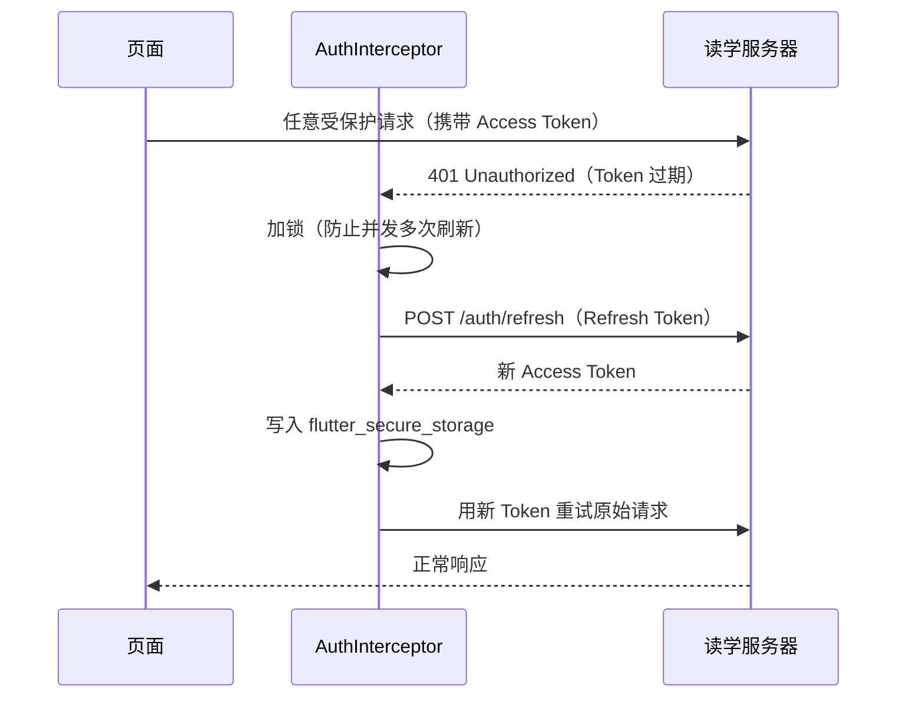
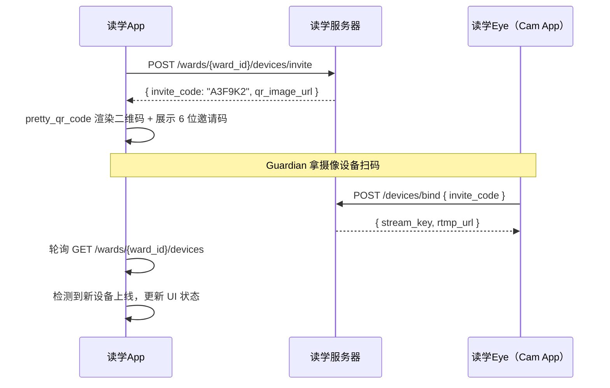
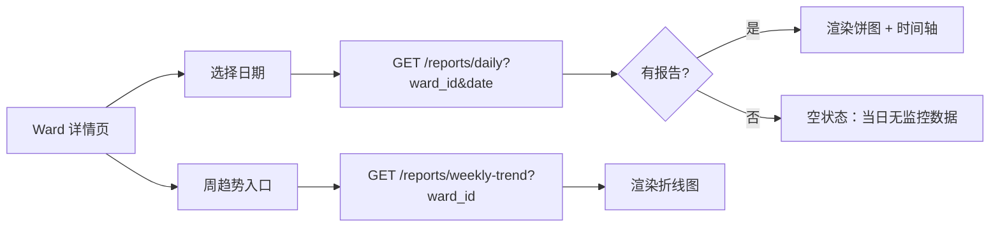

# 读学App（Guardian App）— 架构设计

> 版本 v1.0 | 技术栈：Flutter · Riverpod · dio · fl_chart · go_router
>
> 全系统架构与领域划分见：[docs/ARCHITECTURE.md](../../docs/ARCHITECTURE.md)

---

## 一、定位与职责

读学App 是 **guardian（监护人）** 使用的客户端，支持 iOS 和 Android 双平台，核心职责：

1. 管理 ward 档案（创建、查看、配置分析规则）
2. 添加并管理摄像设备（生成绑定二维码）
3. 查看 ward 的行为报告（日报、时间轴、周趋势）
4. 查看摄像设备实时在线/离线状态

---

## 二、技术选型

### 2.1 完整技术栈

| 分类 | 选型 | 说明 |
|------|------|------|
| 语言/框架 | Flutter 3.x（Dart） | iOS + Android 双平台，一套代码 |
| 状态管理 | Riverpod 2.x + riverpod_generator | 类型安全，异步友好，内置 DI |
| 路由导航 | go_router | Flutter 官方推荐，声明式路由，支持深链接 |
| 网络请求 | dio + AuthInterceptor | 拦截器支持 JWT 自动刷新 |
| 数据模型 | freezed + json_serializable | 不可变数据类 + JSON 序列化，代码生成 |
| 图表可视化 | fl_chart | MIT 协议，支持折线图 / 饼图 / 柱状图 |
| 二维码生成 | pretty_qr_code | 支持嵌入 App 图标，体验更好 |
| Token 存储 | flutter_secure_storage | 使用系统 Keychain / Keystore 加密存储 |
| 偏好存储 | shared_preferences | 轻量键值对（主题、语言等） |
| 图片缓存 | cached_network_image | 帧图片列表懒加载 + 缓存 |
| 设备状态更新 | 轮询（初期）→ WebSocket（可选升级） | 设备状态低频变化，轮询足够 |
| 代码生成 | build_runner | 驱动 freezed / json_serializable / riverpod_generator |

### 2.2 关键选型决策说明

**为什么选 Riverpod 而非 BLoC**

BLoC 的严格分层和大量样板代码适合大型团队项目。本项目团队规模小，Riverpod 的 `AsyncValue`（loading / data / error 三态）与报告加载、设备状态等异步场景天然契合，且代码量更少、可测试性同样优秀。

**为什么选 fl_chart 而非 syncfusion**

syncfusion 社区版有功能限制，商用场景需要付费 License。fl_chart 完全开源（MIT），满足本项目所需的饼图、折线图全部场景，且 API 设计直观。

**行为时间轴用 CustomPainter 手绘而非图表库**

连续行为片段时间轴（BehaviorSegment 列表）是线性色块布局，图表库难以精确控制间距和标注，用 `CustomPainter` 手绘反而更简洁可控。

**Token 必须用 flutter_secure_storage**

Access Token 和 Refresh Token 属于敏感凭证，不能存在普通 `SharedPreferences`（明文存在沙盒中）。`flutter_secure_storage` 在 iOS 上使用 Keychain，在 Android 上使用 Keystore，系统级加密保护。

---

## 三、模块架构

```
duxue-app/
├── features/
│   ├── auth/
│   │   ├── login_page.dart
│   │   └── auth_provider.dart          # Riverpod：登录状态管理
│   ├── ward/
│   │   ├── ward_list_page.dart         # Ward 列表（首页）
│   │   ├── ward_detail_page.dart       # Ward 详情（跳转入口）
│   │   ├── ward_create_page.dart       # 创建 Ward
│   │   └── ward_provider.dart
│   ├── device/
│   │   ├── invite_page.dart            # 生成绑定二维码 + 邀请码
│   │   ├── device_status_page.dart     # 设备列表 + 在线状态
│   │   └── device_provider.dart
│   ├── report/
│   │   ├── daily_report_page.dart      # 日报：饼图 + 时间轴
│   │   ├── weekly_trend_page.dart      # 周趋势：折线图
│   │   ├── behavior_timeline.dart      # 行为片段时间轴（CustomPainter）
│   │   └── report_provider.dart
│   └── profile/
│       ├── profile_list_page.dart      # 分析配置列表
│       ├── profile_edit_page.dart      # 创建/编辑配置
│       ├── label_config_page.dart      # 自定义行为标签
│       └── profile_provider.dart
├── core/
│   ├── api/
│   │   ├── api_client.dart             # dio 实例 + 拦截器注册
│   │   ├── auth_interceptor.dart       # JWT 自动刷新拦截器
│   │   └── endpoints.dart             # 所有 API 路径常量
│   ├── models/                        # freezed 数据模型（由代码生成）
│   │   ├── ward.dart
│   │   ├── device.dart
│   │   ├── report.dart
│   │   └── analysis_profile.dart
│   └── storage/
│       ├── token_storage.dart         # flutter_secure_storage 封装
│       └── prefs_storage.dart         # shared_preferences 封装
├── shared/
│   └── widgets/
│       ├── status_badge.dart          # 设备在线/离线状态徽章
│       ├── behavior_pie_chart.dart    # 行为占比饼图（fl_chart 封装）
│       └── loading_overlay.dart
└── router.dart                        # go_router 路由配置
```

---

## 四、核心流程

### 4.1 认证流程（JWT 自动刷新）



**关键：并发刷新保护**

多个请求同时收到 401 时，只允许一次 refresh，其余请求等待结果后重试：

```dart
class AuthInterceptor extends Interceptor {
  Completer<String>? _refreshCompleter;

  @override
  void onError(DioException err, ErrorInterceptorHandler handler) async {
    if (err.response?.statusCode != 401) {
      handler.next(err);
      return;
    }

    if (_refreshCompleter != null) {
      // 已有刷新在进行，等待其完成
      final newToken = await _refreshCompleter!.future;
      _retry(err.requestOptions, newToken, handler);
      return;
    }

    _refreshCompleter = Completer();
    try {
      final newToken = await _doRefresh();
      _refreshCompleter!.complete(newToken);
      _retry(err.requestOptions, newToken, handler);
    } catch (e) {
      _refreshCompleter!.completeError(e);
      handler.next(err); // 刷新失败，跳转登录页
    } finally {
      _refreshCompleter = null;
    }
  }
}
```

### 4.2 Guardian 绑定设备流程



### 4.3 查看报告流程



---

## 五、状态管理设计（Riverpod）

### 5.1 典型 Provider 示例

```dart
// 日报数据 Provider（自动处理 loading / error / data 三态）
@riverpod
Future<DailyReport> dailyReport(
  DailyReportRef ref, {
  required String wardId,
  required DateTime date,
}) async {
  final api = ref.watch(apiClientProvider);
  return api.getDailyReport(wardId: wardId, date: date);
}

// 设备状态轮询 Provider（每 30 秒自动刷新）
@riverpod
Stream<List<Device>> deviceStatusStream(
  DeviceStatusStreamRef ref,
  String wardId,
) async* {
  while (true) {
    final api = ref.read(apiClientProvider);
    yield await api.getDevices(wardId: wardId);
    await Future.delayed(const Duration(seconds: 30));
  }
}
```

### 5.2 UI 侧消费方式

```dart
class DailyReportPage extends ConsumerWidget {
  @override
  Widget build(BuildContext context, WidgetRef ref) {
    final report = ref.watch(
      dailyReportProvider(wardId: wardId, date: selectedDate),
    );

    return report.when(
      loading: () => const CircularProgressIndicator(),
      error: (e, _) => ErrorWidget(message: e.toString()),
      data: (r) => Column(children: [
        BehaviorPieChart(breakdown: r.labelBreakdown),
        BehaviorTimeline(segments: r.timelineJson),
      ]),
    );
  }
}
```

---

## 六、数据模型（freezed）

```dart
@freezed
class DailyReport with _$DailyReport {
  const factory DailyReport({
    required String wardId,
    required DateTime reportDate,
    required int totalSeconds,
    required Map<String, int> labelBreakdown,   // {"学习": 3000, "走神": 300}
    required List<BehaviorSegment> timelineJson,
  }) = _DailyReport;

  factory DailyReport.fromJson(Map<String, dynamic> json) =>
      _$DailyReportFromJson(json);
}

@freezed
class Device with _$Device {
  const factory Device({
    required String id,
    required String wardId,
    required DeviceType deviceType,
    required DeviceStatus status,
    required DateTime? lastSeenAt,
  }) = _Device;

  factory Device.fromJson(Map<String, dynamic> json) =>
      _$DeviceFromJson(json);
}
```

---

## 七、路由配置（go_router）

```dart
final router = GoRouter(
  redirect: (ctx, state) {
    final isLoggedIn = ctx.read(authProvider).isLoggedIn;
    if (!isLoggedIn && !state.matchedLocation.startsWith('/login')) {
      return '/login';
    }
    return null;
  },
  routes: [
    GoRoute(path: '/login', builder: (ctx, s) => LoginPage()),
    GoRoute(
      path: '/wards',
      builder: (ctx, s) => WardListPage(),
      routes: [
        GoRoute(
          path: ':wardId',
          builder: (ctx, s) => WardDetailPage(wardId: s.pathParameters['wardId']!),
          routes: [
            GoRoute(path: 'report', builder: (ctx, s) => DailyReportPage(...)),
            GoRoute(path: 'devices/invite', builder: (ctx, s) => InvitePage(...)),
            GoRoute(path: 'profiles', builder: (ctx, s) => ProfileListPage(...)),
          ],
        ),
      ],
    ),
  ],
);
```

---

## 八、接口对接清单

| 接口 | 调用方 | 说明 |
|------|--------|------|
| `POST /auth/login` | AuthInterceptor | 登录获取 Token |
| `POST /auth/refresh` | AuthInterceptor | Token 续期 |
| `GET /wards` | ward_provider | Ward 列表 |
| `POST /wards` | ward_provider | 创建 Ward |
| `PATCH /wards/:id` | ward_provider | 更新 Ward（含绑定 profile） |
| `POST /wards/:id/devices/invite` | device_provider | 生成邀请码 + 二维码 |
| `GET /wards/:id/devices` | device_provider | 设备列表 + 状态（轮询） |
| `GET /reports/daily` | report_provider | 日报（饼图 + 时间轴数据） |
| `GET /reports/weekly-trend` | report_provider | 周趋势折线图数据 |
| `GET/POST/PATCH/DELETE /analysis-profiles` | profile_provider | 分析配置 CRUD |
| `POST /analysis-profiles/:id/labels` | profile_provider | 添加自定义行为标签 |

---

## 九、关键依赖（pubspec.yaml）

```yaml
dependencies:
  flutter_riverpod: ^2.6.1
  riverpod_annotation: ^2.3.5
  go_router: ^14.0.0
  dio: ^5.7.0
  freezed_annotation: ^2.4.4
  json_annotation: ^4.9.0
  fl_chart: ^0.69.0
  pretty_qr_code: ^3.3.0
  flutter_secure_storage: ^9.2.2
  shared_preferences: ^2.3.3
  cached_network_image: ^3.4.1

dev_dependencies:
  build_runner: ^2.4.13
  riverpod_generator: ^2.4.3
  freezed: ^2.5.7
  json_serializable: ^6.8.0
```

---

## 十、注意事项

| 场景 | 处理方式 |
|------|---------|
| 并发 401 刷新 Token | AuthInterceptor 用 `Completer` 加锁，只触发一次 refresh |
| Refresh Token 也过期 | 清除本地 Token，跳转登录页 |
| 报告生成中（ward 推流刚结束）| 展示"报告生成中"状态，定时轮询直到可用 |
| 无监控数据的日期 | 展示空状态页，引导 guardian 检查设备连接 |
| 行为时间轴图表复杂度 | 用 `CustomPainter` 手绘色块，不依赖 fl_chart |
| build_runner 性能 | 配置 `build.yaml` 只扫描 `lib/` 目录，避免全量重新生成 |

---

*文档版本 v1.0 | 对应项目 duxue-app*
