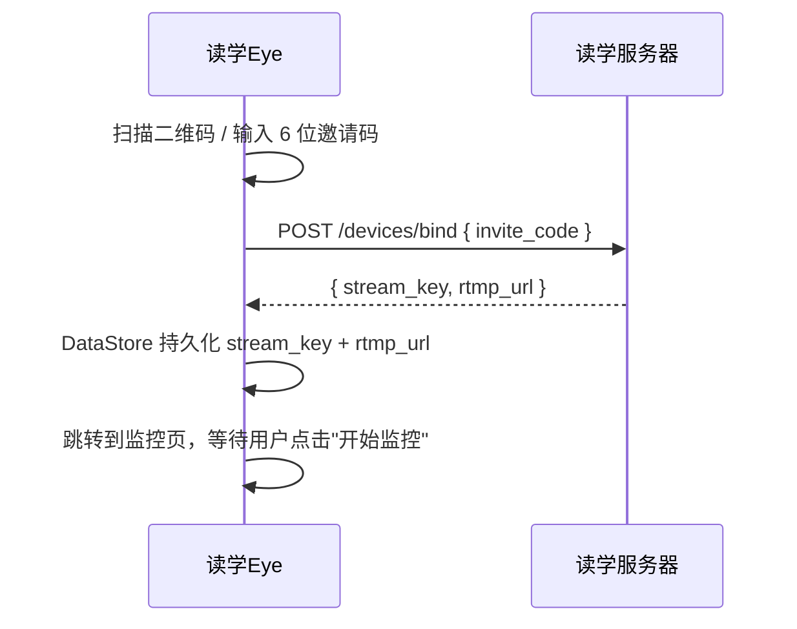
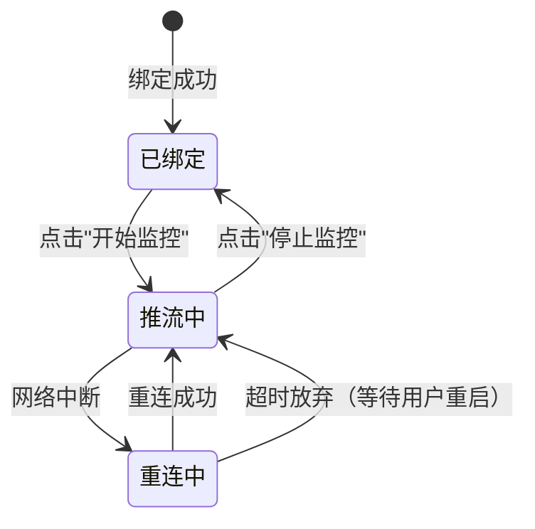

# 读学Eye（Cam App）— 架构设计

> 版本 v1.0 | 技术栈：Kotlin · RootEncoder · Foreground Service · Jetpack Compose
>
> 全系统架构与领域划分见：[docs/ARCHITECTURE.md](../../docs/ARCHITECTURE.md)

---

## 一、定位与职责

读学Eye 是部署在 ward 桌面附近的 **Android 摄像端**，职责单一：

1. 通过邀请码与服务端完成设备绑定，获取 `stream_key`
2. 开启 RTMP 推流，将摄像画面持续推送到读学服务器（SRS）
3. 在锁屏、后台等任何状态下保持稳定推流，直到用户主动停止

> iOS 明确不支持：iPhone/iPad 系统限制后台持续摄像，不适合长期挂机。

---

## 二、技术选型

### 2.1 完整技术栈

| 分类 | 选型 | 说明 |
|------|------|------|
| 语言 | Kotlin | Android 官方首选语言 |
| RTMP 推流 | RootEncoder（pedroSG94） | 开源 Apache 2.0，内置 Camera2，MediaCodec 硬编 |
| 摄像头 API | Camera2（通过 RootEncoder 封装） | 无需额外引入 CameraX，避免两套生命周期冲突 |
| 视频编码 | MediaCodec（硬编 H.264） | 利用硬件加速，低功耗，适合长期挂机 |
| 后台服务 | Foreground Service | Android 8+ 后台摄像唯一合规方案 |
| 锁保持 | WakeLock + WifiLock | 防止 CPU / WiFi 被系统休眠 |
| UI 框架 | Jetpack Compose | 声明式，Kotlin 原生，UI 极简场景下代码量少 |
| 二维码扫描 | ML Kit Barcode Scanning | Google 官方，无需网络，识别率最高 |
| REST API | Retrofit2 + OkHttp | 生态成熟，与 Coroutines 集成完善 |
| 本地存储 | Jetpack DataStore（Proto） | 类型安全，异步非阻塞，替代 SharedPreferences |
| 异步并发 | Kotlin Coroutines + Flow | Kotlin 原生，与 Lifecycle 深度集成 |
| 依赖注入 | Hilt | Google 官方，与 Service / ViewModel 集成顺滑 |

### 2.2 关键选型决策说明

**为什么选 RootEncoder 而非 FFmpeg-kit**

FFmpeg-kit 会使 APK 增加 50~100MB，且通用媒体处理能力对本项目来说是过度设计。RootEncoder 专为 Android 推流设计，APK 增量约 500KB，Camera2 → MediaCodec → RTMP 管线经过生产验证，完全满足需求。

**为什么不用 Flutter**

Cam App 的核心价值在于系统底层能力（后台摄像、硬件编码、服务进程），而非跨平台 UI。Flutter 的相机插件不支持在 Foreground Service 中持续工作，最终仍需通过 Platform Channel 调原生层，徒增复杂度。原生 Kotlin 可直接访问所有 Android 系统 API，调试也更直观。

---

## 三、模块架构

```
duxue-cam/
├── service/
│   └── StreamingService.kt      # Foreground Service 核心，推流主逻辑
├── ui/
│   ├── BindScreen.kt            # 扫码绑定 + 手动输入邀请码
│   ├── MonitorScreen.kt         # 推流状态展示 + 开始/停止
│   └── SettingsScreen.kt        # 分辨率、码率等参数调整
├── data/
│   ├── DeviceDataStore.kt       # 持久化存储 stream_key / rtmp_url
│   └── ApiService.kt            # Retrofit：POST /devices/bind
├── di/
│   └── AppModule.kt             # Hilt 模块注入
└── MainActivity.kt
```

---

## 四、核心流程

### 4.1 设备绑定流程



### 4.2 推流生命周期



### 4.3 StreamingService 设计

`StreamingService` 是整个 App 的核心，处理所有底层资源的生命周期：

```kotlin
@AndroidEntryPoint
class StreamingService : Service() {

    @Inject lateinit var deviceDataStore: DeviceDataStore

    private lateinit var rtmpCamera2: RtmpCamera2
    private lateinit var wakeLock: PowerManager.WakeLock
    private lateinit var wifiLock: WifiManager.WifiLock

    override fun onStartCommand(intent: Intent?, flags: Int, startId: Int): Int {
        startForeground(NOTIF_ID, buildNotification())  // 必须第一行调用
        acquireLocks()                                  // 获取 WakeLock + WifiLock
        startStream()
        return START_STICKY                             // 系统杀掉后自动重启
    }

    override fun onDestroy() {
        rtmpCamera2.stopStream()
        releaseLocks()
        super.onDestroy()
    }
}
```

**两个关键资源锁：**

```kotlin
private fun acquireLocks() {
    // 防止 CPU 进入休眠，中断编码管线
    wakeLock = (getSystemService(POWER_SERVICE) as PowerManager)
        .newWakeLock(PowerManager.PARTIAL_WAKE_LOCK, "DuxueCam:StreamLock")
        .apply { acquire() }

    // 防止 WiFi 在低功耗模式下断开
    wifiLock = (applicationContext.getSystemService(WIFI_SERVICE) as WifiManager)
        .createWifiLock(WifiManager.WIFI_MODE_FULL_HIGH_PERF, "DuxueCam:WifiLock")
        .apply { acquire() }
}
```

**开机自启动：**

```kotlin
class BootReceiver : BroadcastReceiver() {
    override fun onReceive(context: Context, intent: Intent) {
        if (intent.action == Intent.ACTION_BOOT_COMPLETED) {
            // 读取 DataStore，若有绑定记录则自动启动推流
        }
    }
}
```

---

## 五、接口对接

Cam App 只需与服务端交互以下 3 个接口：

| 接口 | 调用时机 | 说明 |
|------|---------|------|
| `POST /devices/bind` | 首次绑定时 | 请求体 `{ invite_code }`，返回 `{ stream_key, rtmp_url }` |
| RTMP 推流 | 点击"开始监控"后 | `rtmp://server/live/{stream_key}`，直连 SRS，不经过 FastAPI |
| RTMP 断流 | 点击"停止监控"或 App 被关闭 | 客户端直接断开 TCP 连接，SRS 触发 `on_unpublish` Webhook |

绑定成功后，`stream_key` 和 `rtmp_url` 永久存储在本地 DataStore，无需每次启动重新绑定。

---

## 六、UI 界面说明

App 共 3 个主要界面，UI 刻意保持极简：

| 界面 | 主要内容 |
|------|---------|
| **绑定页**（BindScreen） | 扫码区域 + 手动输入框 + "绑定"按钮；未绑定时为入口 |
| **监控页**（MonitorScreen） | 已绑定 ward 名称 + 推流状态（在线/断开/重连中）+ 码率/帧率指标 + 开始/停止大按钮 |
| **设置页**（SettingsScreen） | 分辨率选择（1280×720 / 640×480）+ 视频质量（码率）+ 解除绑定 |

> 监控页是常驻界面，用户通常将手机架起后锁屏，App 继续在后台推流。

---

## 七、注意事项与边界条件

| 场景 | 处理方式 |
|------|---------|
| 网络中断 | RootEncoder 提供 `onConnectionFailed` 回调，触发自动重连（最多 5 次，指数退避） |
| 系统杀进程 | `START_STICKY` 保证服务重启；`BootReceiver` 保证开机自启 |
| 电池优化 | 绑定流程引导用户手动将 App 设为"无限制"，无法程序化绕过 |
| 摄像头被占用 | Camera2 互斥，若其他 App 占用摄像头则提示用户关闭其他摄像应用 |
| 绑定码过期 | `/devices/bind` 返回 4xx 时提示 guardian 重新生成邀请码 |
| 重复绑定 | DataStore 中已有 stream_key 时，跳过绑定页直接进入监控页 |

---

*文档版本 v1.0 | 对应项目 duxue-cam*
