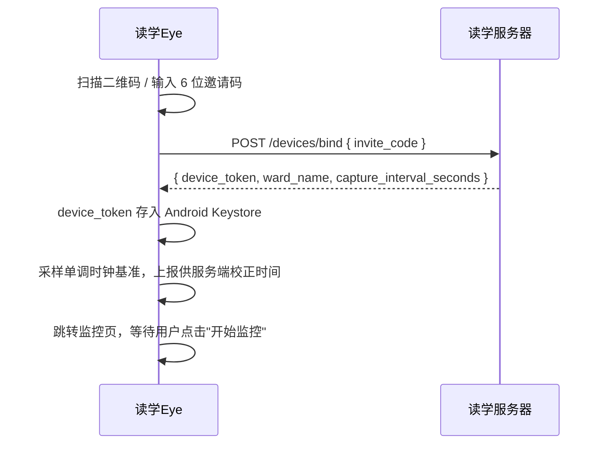
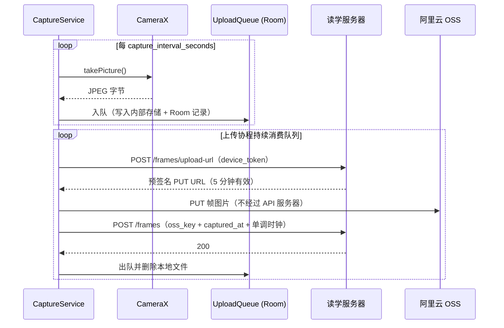

# 读学Eye（Cam App）— 架构设计

> 版本 v2.0 | 技术栈：Kotlin · CameraX · Foreground Service · Room · Jetpack Compose
>
> 全系统架构与领域划分见：[docs/ARCHITECTURE.md](../../docs/ARCHITECTURE.md)

---

## 〇、v2.0 关键变更说明

v1.0 的设计是 **RTMP 视频推流**（RootEncoder + MediaCodec 硬编码 → SRS 服务器）。v2.0 改为 **定时抓拍单帧上传**。

原因：服务端真正需要的输入只是"每隔一段时间一张 JPEG"。推 720p 视频流再由服务端抽掉 99.6% 的帧，浪费约 95% 的带宽，并且为此引入了 SRS、`stream_key`、推流生命周期 Webhook、断流重连状态机、硬编码管线这一整套复杂度。

改为抓拍后的直接收益：

| 维度 | v1.0 推流 | v2.0 抓拍 |
|------|----------|----------|
| 单设备上行带宽 | 约 1500 kbps | 约 80 kbps（640×480 JPEG / 15 秒） |
| 手机功耗 | 持续 H.264 硬编码，是最耗电的环节 | 只在抓拍瞬间编码单张 JPEG |
| 断网期间的数据 | 直接丢失 | 本地排队，联网后补传 |
| 设备鉴权 | 明文 RTMP 携带 `stream_key` | HTTPS + `device_token` |
| 需要的库 | RootEncoder + MediaCodec 管线 | CameraX 单个 ImageCapture 用例 |

**因此 v2.0 中不再存在**：RootEncoder 依赖、RTMP 推流、`stream_key`、编码参数（码率/帧率）配置、断流重连状态机。

---

## 一、定位与职责

读学Eye 是架设在 ward 桌面附近的 **Android 采集端**，职责单一：

1. 通过邀请码与服务端完成设备绑定，获取长效 `device_token`
2. 按服务端下发的间隔（默认 15 秒）持续抓拍单帧并上传
3. 在锁屏、后台等任何状态下保持运行；断网时本地排队，恢复后补传
4. 定期上报心跳，让服务端能区分"设备离线"与"画面一直没变"

> iOS 明确不支持：iPhone/iPad 系统限制后台持续访问摄像头，不适合长期挂机。

---

## 二、技术选型

### 2.1 完整技术栈

| 分类 | 选型 | 说明 |
|------|------|------|
| 语言 | Kotlin | Android 官方首选语言 |
| 摄像头 API | CameraX（`ImageCapture` 用例） | 官方推荐，屏蔽 Camera2 的机型差异；只需拍照能力，不需要预览与分析用例 |
| 图片编码 | JPEG（CameraX 内置） | 单张编码，无需持续视频编码管线 |
| 后台服务 | Foreground Service（`camera` 类型） | Android 8+ 后台使用摄像头的唯一合规方案 |
| 锁保持 | WakeLock + WifiLock | 防止 CPU / WiFi 被系统休眠中断抓拍与上传 |
| 本地上传队列 | Room + 内部存储文件 | 断网时持久化待传帧，进程重启后不丢 |
| 补传兜底 | WorkManager（网络约束触发） | Service 被系统回收后仍能在联网时补传积压帧 |
| UI 框架 | Jetpack Compose | 声明式，Kotlin 原生，UI 极简场景下代码量少 |
| 二维码扫描 | ML Kit Barcode Scanning | Google 官方，无需网络，识别率最高 |
| REST API | Retrofit2 + OkHttp | 生态成熟，与 Coroutines 集成完善 |
| 配置存储 | Jetpack DataStore（Proto） | 类型安全，异步非阻塞 |
| 凭证存储 | EncryptedSharedPreferences（Android Keystore） | `device_token` 属敏感凭证，不能明文存 DataStore |
| 异步并发 | Kotlin Coroutines + Flow | 与 Lifecycle 深度集成 |
| 依赖注入 | Hilt | Google 官方，与 Service / ViewModel 集成顺滑 |

### 2.2 关键选型决策说明

**为什么抓拍而不是推流**

见 §〇。核心是"传输的东西应该等于需要的东西"：服务端需要帧，就传帧。推视频流是在传一个 20 倍冗余的中间产物。

**为什么不绑定 Preview 用例**

监控页不需要一直显示实时预览——手机架好后用户就锁屏了，预览是给没人看的屏幕渲染。只绑定 `ImageCapture` 一个用例，省掉预览的 GPU 合成与屏幕功耗。仅在设置页调整取景角度时临时绑定 Preview。

**相机 session 常开，而非每次抓拍时开关**

每次抓拍才 `bindToLifecycle` 会有数百毫秒的初始化延迟，且频繁开关在部分机型上有失败风险。15 秒间隔下保持 session 常开更稳妥——功耗大头是持续视频编码，去掉它之后相机 session 本身的开销可以接受。

> 代价：相机硬件被独占，其他应用无法使用。这与挂机场景一致（这台手机就是专用采集设备）。若未来把间隔拉长到 60 秒以上，可再评估按需开关。

**为什么不用 Flutter**

Cam App 的核心价值在系统底层能力（后台摄像头访问、前台服务生命周期、开机行为），而非跨平台 UI。Flutter 的相机插件不支持在 Foreground Service 中持续工作，最终仍需通过 Platform Channel 调原生层，徒增复杂度。

---

## 三、模块架构

```
duxue-cam/
├── service/
│   ├── CaptureService.kt        # Foreground Service 核心，抓拍 + 上传 + 心跳
│   └── CaptureScheduler.kt      # 间隔调度，服务端可下发调整
├── capture/
│   ├── CameraController.kt      # CameraX ImageCapture 封装
│   └── ClockCorrector.kt        # 单调时钟采样，供服务端校正 captured_at
├── upload/
│   ├── UploadQueue.kt           # Room 队列：入队 / 出队 / 容量淘汰
│   ├── FrameUploader.kt         # 申请预签名 URL → PUT OSS → 提交元数据
│   └── BackfillWorker.kt        # WorkManager：联网后补传积压帧
├── ui/
│   ├── BindScreen.kt            # 扫码绑定 + 手动输入邀请码
│   ├── MonitorScreen.kt         # 运行状态 + 队列积压 + 开始/停止
│   └── SettingsScreen.kt        # 取景预览、分辨率、解除绑定
├── data/
│   ├── DeviceStore.kt           # device_token（Keystore 加密）+ 配置
│   └── ApiService.kt            # Retrofit：bind / upload-url / frames / heartbeat
├── di/
│   └── AppModule.kt             # Hilt 模块注入
└── MainActivity.kt
```

---

## 四、核心流程

### 4.1 设备绑定流程



邀请码有 10 分钟有效期且一次性；同一邀请码连续失败 5 次会被服务端作废，此时需 guardian 在 App 中重新生成。

### 4.2 抓拍与上传流程



**抓拍与上传解耦**是这个设计的关键：抓拍只负责入队，上传是独立的消费协程。网络不可用时抓拍照常进行，帧堆积在本地队列，恢复后按 `captured_at` 顺序补传。

### 4.3 断网补传与队列容量

| 项 | 设计 |
|----|------|
| 队列上限 | 2000 张或 500 MB，取先到者 |
| 超限策略 | 丢弃最旧的帧（保留最近数据更有价值），并在监控页提示积压 |
| 补传顺序 | 按 `captured_at` 升序，保证时间轴连续 |
| 重试策略 | 指数退避，上限 5 分钟；预签名 URL 过期则重新申请 |
| Service 被回收 | `BackfillWorker` 以 `NetworkType.CONNECTED` 为约束周期运行，兜底补传积压帧 |

### 4.4 心跳与掉线感知

抓拍上传本身不能作为存活信号——画面长时间没变化时也可能没有新帧需要上传，那与设备离线在服务端看来完全一样。

因此心跳独立上报：`CaptureService` 每 60 秒 `POST /devices/heartbeat`。服务端心跳超时 3 分钟即把设备置为 offline 并推送通知给 guardian。

### 4.5 时间戳校正

客户端 `captured_at` 不可直接信任：用户可能修改系统时间或设错时区，导致报告时间轴错乱。

处理方式：每次上传帧元数据时，同时携带设备的单调时钟读数（`SystemClock.elapsedRealtime()`）。服务端在绑定时记录"单调时钟 ↔ 服务端时间"的偏移量，后续用它校正客户端上报的墙钟时间。报告的时间轴一律使用校正后的时间。

---

## 五、Android 版本兼容与保活

这是长期挂机场景最容易出问题的地方，且新系统的限制逐年收紧。

### 5.1 前台服务声明（Android 14+）

使用摄像头的前台服务必须在 manifest 中声明类型并申请对应权限：

```xml
<uses-permission android:name="android.permission.FOREGROUND_SERVICE" />
<uses-permission android:name="android.permission.FOREGROUND_SERVICE_CAMERA" />

<service
    android:name=".service.CaptureService"
    android:foregroundServiceType="camera"
    android:exported="false" />
```

`startForeground()` 必须在 `onStartCommand()` 中尽早调用，否则会触发 ANR 或被系统终止。

### 5.2 开机自启动不再可行

**v1.0 设计的 `BootReceiver` 自动启动推流在新系统上不成立。** Android 12+ 限制从后台启动前台服务；Android 14 起明确禁止在 `BOOT_COMPLETED` 广播中启动 `camera` 类型的前台服务，会抛 `ForegroundServiceStartNotAllowedException`。

替代方案：

```
开机 → BootReceiver 收到 BOOT_COMPLETED
     → 检查本地是否有绑定记录
     → 有 → 发一条常驻通知：「读学Eye 已就绪，点击恢复监控」
             用户点击通知 → 从 Activity 启动前台服务（合法路径）
```

同时服务端侧要有对应机制：设备心跳超时后主动推送通知给 guardian，让 guardian 知道需要去点一下。**"保证永不掉线"是做不到的目标，能做到的是"掉线能被及时发现"。**

### 5.3 厂商后台管理

小米、华为、OPPO、vivo 的后台管理策略比原生 Android 激进得多，仅靠"引导用户把电池优化设为无限制"的通过率有限。应对：

- 绑定流程中引导用户完成电池优化白名单 + 自启动权限设置（无法程序化绕过）
- 保留 `START_STICKY`，让系统回收后有机会重启服务
- 依赖 §4.4 的心跳机制，把兜底放在"发现并通知"而不是"保证不发生"

### 5.4 资源锁

```kotlin
private fun acquireLocks() {
    // 防止 CPU 进入休眠，中断抓拍调度与上传
    wakeLock = (getSystemService(POWER_SERVICE) as PowerManager)
        .newWakeLock(PowerManager.PARTIAL_WAKE_LOCK, "DuxueCam:CaptureLock")
        .apply { acquire() }

    // 防止 WiFi 在低功耗模式下断开
    wifiLock = (applicationContext.getSystemService(WIFI_SERVICE) as WifiManager)
        .createWifiLock(WifiManager.WIFI_MODE_FULL_HIGH_PERF, "DuxueCam:WifiLock")
        .apply { acquire() }
}
```

---

## 六、接口对接

Cam App 与服务端交互的全部接口，均以 `device_token` 作为 Bearer 凭证：

| 接口 | 调用时机 | 说明 |
|------|---------|------|
| `POST /devices/bind` | 首次绑定 | 请求体 `{ invite_code }`，返回 `{ device_token, ward_name, capture_interval_seconds }` |
| `POST /frames/upload-url` | 每帧上传前 | 返回 OSS 预签名 PUT URL，有效期 5 分钟，限定单个 object key |
| `PUT {预签名URL}` | 拿到 URL 后 | 直传 OSS，**不经过读学服务器** |
| `POST /frames` | 图片上传成功后 | 提交元数据 `{ oss_key, captured_at, elapsed_realtime }` |
| `POST /devices/heartbeat` | 每 60 秒 | 上报存活，服务端据此判断在线状态 |

`device_token` 的权限范围严格限定于以上接口，不能读取任何报告或 ward 数据。guardian 在读学App 中"解除绑定"即吊销该 token。

---

## 七、UI 界面说明

App 共 3 个主要界面，UI 刻意保持极简：

| 界面 | 主要内容 |
|------|---------|
| **绑定页**（BindScreen） | 扫码区域 + 手动输入框 + "绑定"按钮；未绑定时为入口 |
| **监控页**（MonitorScreen） | 已绑定 ward 名称 + 运行状态（运行中 / 已停止 / 补传中）+ 今日已上传帧数 + 队列积压数 + 开始/停止大按钮 |
| **设置页**（SettingsScreen） | 取景预览（临时绑定 Preview 用于调整角度）+ 分辨率选择 + 解除绑定 |

> 监控页需明显展示"队列积压数"。积压持续增长是网络或服务端问题的第一个可见信号，比等到 guardian 发现报告缺数据要早得多。
>
> 设置页不再提供码率/帧率配置——抓拍方案下这些参数不存在。分辨率默认 640×480（服务端分析够用且 token 成本最低），仅在识别效果不佳时才需调高。

---

## 八、取景与机位

机位直接决定识别准确率，也决定隐私边界。推荐：**被观察者侧后方约 45°、略高于头顶俯拍**，取景覆盖桌面、上半身与头部轮廓，**不含正脸**。

这个角度下服务端能获取的信息：手部动作、桌面物品（书本 / 手机 / 玩具）、头部朝向（低头朝桌面 vs 转向侧方）——这三项是行为判别中权重最高的信号。同时因为看不到面部特征，满足隐私要求。

设置页的取景预览应叠加参考框，引导用户对齐到这个构图。详见[产品需求文档](../../docs/product-requirements.md)的机位指引。

---

## 九、注意事项与边界条件

| 场景 | 处理方式 |
|------|---------|
| 网络中断 | 抓拍照常，帧入本地队列；上传协程指数退避重试，恢复后按时间序补传 |
| 队列达到容量上限 | 丢弃最旧帧，监控页提示积压 |
| 预签名 URL 过期 | 重新申请后重试该帧，不丢弃 |
| 系统杀进程 | `START_STICKY` 尝试重启；`BackfillWorker` 兜底补传积压帧 |
| 开机重启 | 发通知引导用户点击恢复（见 §5.2），**不能自动启动** |
| 电池优化 | 绑定流程引导用户设为"无限制"，无法程序化绕过 |
| 摄像头被占用 | CameraX 抛出占用异常时提示用户关闭其他摄像应用 |
| 绑定码过期或失效 | `/devices/bind` 返回 4xx 时提示 guardian 重新生成邀请码 |
| 重复绑定 | 本地已有 `device_token` 时跳过绑定页直接进入监控页 |
| 设备时间被修改 | 上报单调时钟供服务端校正（见 §4.5），客户端不做自行修正 |
| 采样间隔调整 | 由服务端下发 `capture_interval_seconds`，Cam 端每次心跳时刷新，无需发版 |

---

*文档版本 v2.0 | 对应项目 duxue-cam*
