# 读学系统 — Server 端架构设计

> 版本 v1.0 | 技术栈：FastAPI · PostgreSQL · Redis · Celery · SRS
>
> 全系统架构与领域划分见：[docs/ARCHITECTURE.md](../../docs/ARCHITECTURE.md)

---

## 一、DDD 分层架构

```mermaid
graph TB
    subgraph 接口层 Interface
        CTR[Controller<br/>路由 / 请求校验 / 响应序列化]
    end

    subgraph 应用层 Application
        CMD[Command Handler<br/>写操作：注册/登录/绑设备/触发分析]
        QRY[Query Handler<br/>读操作：报告/统计/历史记录]
        BUS[Command Bus / Event Bus]
    end

    subgraph 领域层 Domain
        AGG[聚合根<br/>User · UserWard · Device · Frame · AnalysisProfile · AnalysisTask · Report]
        SVC[领域服务<br/>AuthService · BehaviorClassifier(profile驱动) · TimelineBuilder]
        VO[值对象<br/>Email · Password · StreamKey · BehaviorLabel · FieldPrototypes]
        REPO_I[Repository 接口]
        EVT[领域事件<br/>FrameCaptured · AnalysisCompleted · ProfileAssigned]
    end

    subgraph 基础设施层 Infrastructure
        REPO_IMPL[Repository 实现<br/>SQLAlchemy + PostgreSQL]
        MSG[消息队列<br/>Redis + Celery]
        STREAM[流媒体集成<br/>SRS HTTP API]
        AI_INFRA[AI 推理接入<br/>VLM Worker]
        JWT_IMPL[JWT 工具<br/>python-jose + passlib]
    end

    CTR --> CMD
    CTR --> QRY
    CMD --> BUS
    BUS --> AGG
    BUS --> SVC
    AGG --> REPO_I
    AGG --> EVT
    EVT --> MSG
    REPO_I --> REPO_IMPL
    SVC --> AI_INFRA
    MSG --> AI_INFRA
```

---

## 二、CQRS 命令与查询

### 2.1 命令（写操作）

**身份与设备**

| Command | 触发方 | 执行动作 | 产生事件 |
|---------|--------|---------|---------|
| `RegisterUser` | App / Admin | 创建 users + user_guardians 记录 | `UserRegistered` |
| `LoginUser` | App / Cam | 校验密码，签发 JWT | — |
| `CreateWard` | App | 创建 users + user_wards 记录 | `WardCreated` |
| `GenerateInviteCode` | App | 创建 devices 记录，写入 invite_code | — |
| `BindDevice` | Cam App | 验证 invite_code，写入 stream_key，invite_code 置空 | `DeviceBound` |

**分析配置**

| Command | 触发方 | 执行动作 | 产生事件 |
|---------|--------|---------|---------|
| `CreateAnalysisProfile` | App | 创建 analysis_profiles 记录 | — |
| `UpdateAnalysisProfile` | App | 修改 extra_observation_prompt / name | — |
| `AddBehaviorLabel` | App | 创建 behavior_label_configs 记录 | — |
| `UpdateBehaviorLabel` | App | 修改 field_prototypes / priority / is_active | — |
| `DeleteBehaviorLabel` | App | 删除 behavior_label_configs 记录 | — |
| `AssignProfileToWard` | App | 更新 user_wards.analysis_profile_id | `ProfileAssigned` |

**采集与分析**

| Command | 触发方 | 执行动作 | 产生事件 |
|---------|--------|---------|---------|
| `HandleStreamPublish` | SRS Webhook | 定位 ward_id，更新 device.status=online | `StreamStarted` |
| `HandleStreamUnpublish` | SRS Webhook | 更新 device.status=offline，触发报告生成 | `StreamEnded` |
| `CaptureFrame` | Beat 定时器 | 从 SRS 截帧，写入 frames 记录 | `FrameCaptured` |
| `SubmitAnalysisTask` | FrameCaptured 事件 | 推送 {frame_id, profile_id} 到 Celery 队列 | — |
| `CompleteAnalysis` | Celery Worker | 写入 structured_fields + behavior_segments | `AnalysisCompleted` |
| `GenerateReport` | StreamEnded 事件 | 聚合 behavior_segments，写入 reports | `ReportGenerated` |

### 2.2 查询（读操作）

| Query | 触发方 | 返回数据 |
|-------|--------|---------|
| `GetWardDailyReport` | App | 单日各行为时长 + 占比（含自定义标签） |
| `GetBehaviorTimeline` | App | 连续行为片段时间轴 |
| `GetWeeklyTrend` | App | 近 7 天学习时长趋势 |
| `GetFrameList` | App / Admin | 帧列表 + 分析结果（分页） |
| `GetDeviceStatus` | App / Admin | 摄像头在线/离线状态 |
| `GetAnalysisProfile` | App | 配置详情（含所有 behavior_label_configs） |
| `ListAnalysisProfiles` | App | guardian 创建的所有配置列表 |
| `GetTenantSummary` | Admin | 机构下所有 ward 概况 |

### 2.3 领域层关键设计

#### 聚合根职责

| 聚合根 | 所在子域 | 核心职责 | 主要业务规则 |
|--------|---------|---------|------------|
| `User` | IAM | 统一身份入口，持有 type 区分扩展表 | 同一 email 不可重复注册 |
| `UserWard` | Ward | 被监护者档案，持有 profile 绑定 | 只有同租户 guardian 可管理 |
| `AnalysisProfile` | Ward | 聚合 extra_observation_prompt + 所有 BehaviorLabelConfig | 删除 profile 前须检查是否有 ward 引用 |
| `Device` | Device | 持有 stream_key，响应推流事件 | invite_code 使用后必须置空 |
| `Frame` | Capture | 帧图片记录，持有 structured_fields | 只有 analyzed=false 的帧才可入队 |
| `AnalysisTask` | Analysis | 追踪单帧推理任务生命周期 | 失败超过3次标记 failed，不再重试 |
| `Report` | Report | 按 ward + 日期聚合行为统计 | 同 ward 同日期只允许一条记录（幂等重生成） |

#### BehaviorClassifier 领域服务 — 配置驱动设计

`BehaviorClassifier` 是连接 VLM 输出与最终行为标签的核心服务，从 `AnalysisProfile` 读取配置而非内置固定规则：

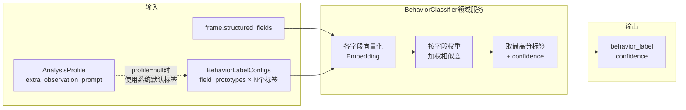

**Profile 为空的降级逻辑**：`user_wards.analysis_profile_id = NULL` 时，`BehaviorClassifier` 自动加载系统内置的默认 profile（学习 / 走神 / 离开），确保所有 ward 都能正常分析。

#### 领域事件流

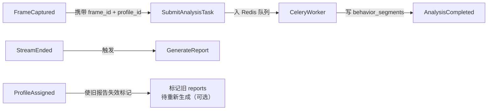

> `ProfileAssigned` 事件说明：guardian 修改 ward 的分析配置后，历史已生成的报告不会自动重算（成本过高），但可以标记为"配置已变更"，App 端提示 guardian "以下报告基于旧配置生成"。

### 2.4 关键流程：帧采集 → 分析全链路

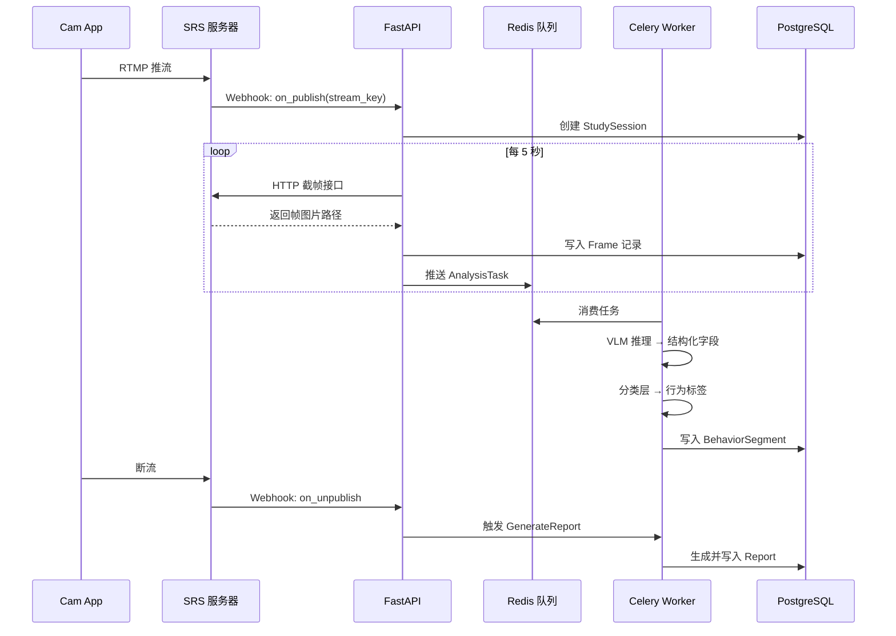

---

## 三、认证方案（自实现 JWT）

不引入外部 Auth 服务，由 Infrastructure 层实现。

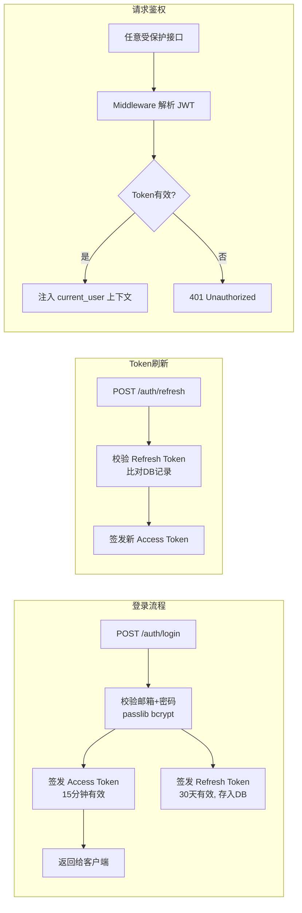

| 字段 | 说明 |
|------|------|
| Access Token | JWT，payload 含 `user_id / role / tenant_id`，15 分钟有效 |
| Refresh Token | 随机字符串，存 `refresh_tokens` 表，支持主动吊销 |
| 密码存储 | bcrypt hash，cost factor = 12 |
| Cam App 绑定 | 邀请码（6位，一次性有效），绑定后颁发长效设备 Token |

---

## 四、数据库表设计

### 4.1 用户体系设计（Table-Per-Type）

系统中有三类"人"，采用基础表 + 扩展表模式。扩展表的 `id` 直接复用 `users.id`，是同一个值而非外键关联：

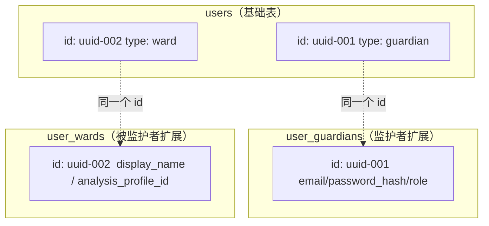

> **user_guardians**（guardian）：家长、老师、机构管理员 — 有密码，在 App 登录，可配置分析规则
>
> **user_wards**（ward）：被监护者 — 无密码，由 guardian 创建，**不需要任何地方登录**，每人可绑定独立分析配置
>
> **Cam App** 持有推流用的 `stream_key`，是设备身份标识，不走人类账号体系

### 4.2 自定义分析配置设计

guardian 可以为每个 ward 设置独立的 VLM 分析内容，覆盖两个层次：

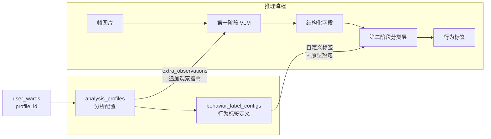

| 配置层 | 表 | 影响阶段 | 示例 |
|-------|-----|---------|------|
| VLM 额外观察指令 | `analysis_profiles.extra_observations` | 第一阶段 | "请额外观察是否有咬手指、揉眼睛等小动作" |
| 自定义行为标签 | `behavior_label_configs` | 第二阶段 | 新增"咬手指"标签，定义 hand_action 原型短句 |

系统内置默认配置（学习/走神/离开），无自定义配置的 ward 自动使用默认值。

### 4.3 ER 图

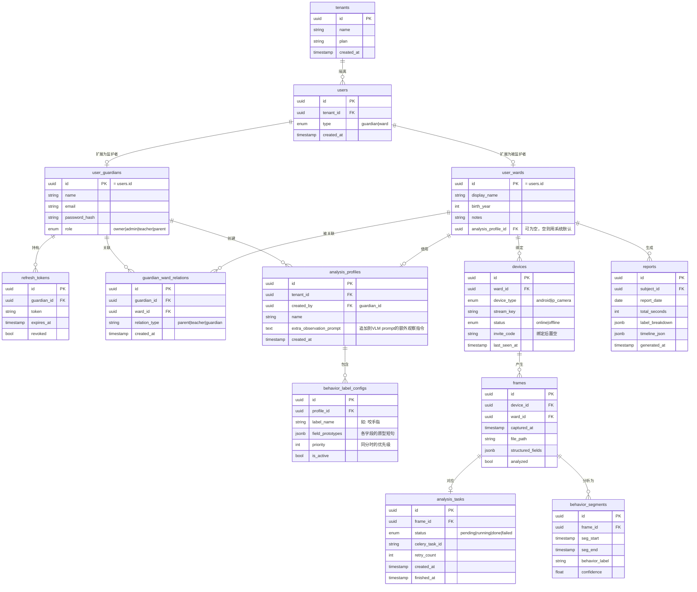

### 4.4 关键字段说明

| 表 | 字段 | 说明 |
|----|------|------|
| `users.type` | enum | 区分 guardian/ward，决定查哪张扩展表 |
| `user_guardians.role` | enum | `owner`=机构创始人，`admin`=管理员，`teacher`=老师，`parent`=家长 |
| `user_wards.analysis_profile_id` | uuid FK | 指向该 ward 的专属分析配置；为空则使用系统内置默认配置 |
| `analysis_profiles.extra_observations` | text | 追加到 VLM 第一阶段 prompt 末尾的额外观察指令 |
| `behavior_label_configs.field_prototypes` | JSONB | 第二阶段分类层各字段的原型短句，如 `{"hand_action":["手指放在嘴边","咬指甲"]}` |
| `behavior_label_configs.priority` | int | 多个标签同等相似度时的决胜顺序 |
| `frames.ward_id` | uuid FK | 冗余字段，报告统计直接按被监护者过滤，无需 join devices |
| `frames.structured_fields` | JSONB | VLM 输出的 7 个结构化字段 |
| `devices.stream_key` | string | 推流地址唯一标识，SRS Webhook 通过此字段定位 ward |
| `devices.invite_code` | string | Cam App 首次绑定用，绑定后置空（一次性） |
| `reports.label_breakdown` | JSONB | 各行为时长汇总，如 `{"学习":3000,"咬手指":120,"离开":300}` |

---

## 五、核心场景示例

### 场景 A：Guardian 绑定设备

**前提**：guardian 已注册账号，并在 App 中为 ward 创建了档案。

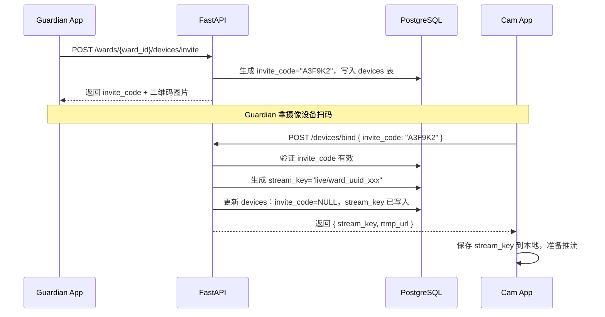

### 场景 B：Guardian 为 Ward 设置自定义分析配置

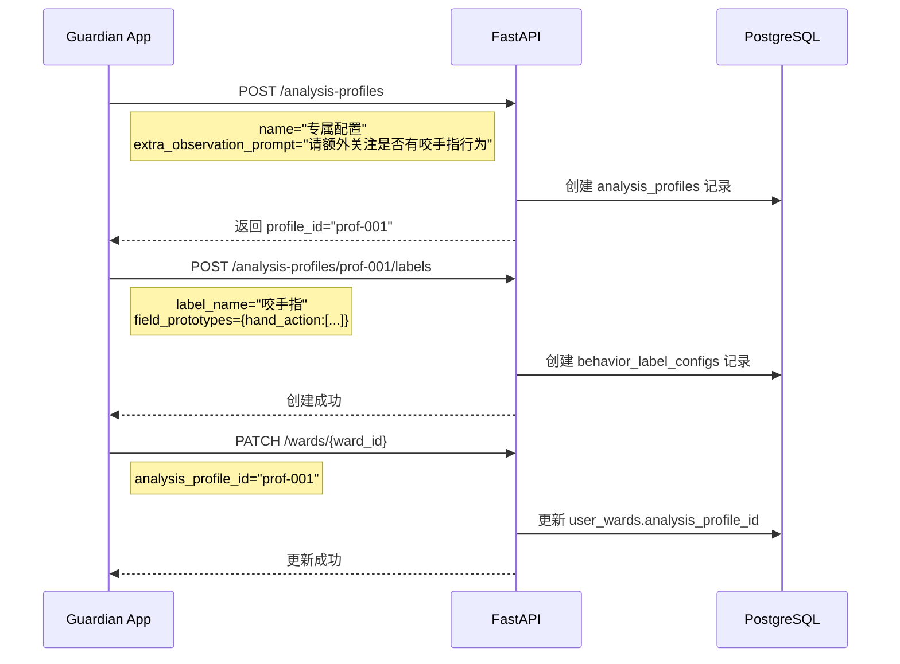

### 场景 C：Cam App 推流 → 帧分析全流程

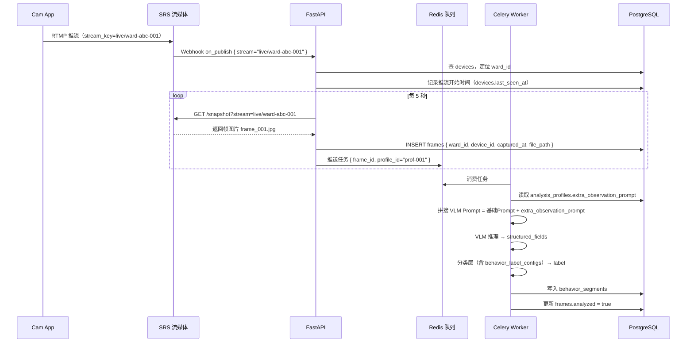

---

## 六、目录结构

```
server/
├── interfaces/                # 接口层（Controller）
│   ├── http/
│   │   ├── auth_router.py
│   │   ├── ward_router.py
│   │   ├── device_router.py
│   │   ├── profile_router.py
│   │   └── report_router.py
│   └── webhook/
│       └── srs_webhook.py
│
├── application/               # 应用层（CQRS）
│   ├── commands/
│   │   ├── auth_commands.py
│   │   ├── device_commands.py
│   │   ├── profile_commands.py
│   │   ├── capture_commands.py
│   │   └── analysis_commands.py
│   └── queries/
│       ├── report_queries.py
│       └── ward_queries.py
│
├── domain/                    # 领域层
│   ├── user/
│   │   ├── user.py
│   │   └── repository.py
│   ├── ward/
│   │   └── analysis_profile.py
│   ├── device/
│   ├── capture/
│   │   └── frame.py
│   ├── analysis/
│   │   ├── analysis_task.py
│   │   └── behavior_segment.py
│   └── report/
│       └── report.py
│
└── infrastructure/            # 基础设施层
    ├── persistence/
    │   ├── models.py
    │   └── repositories/
    ├── auth/
    │   └── jwt_service.py
    ├── messaging/
    │   └── celery_tasks.py
    ├── stream/
    │   └── srs_client.py
    └── ai/
        ├── vlm_runner.py
        └── classifier.py
```

---

## 七、技术选型汇总

| 分类 | 选型 | 说明 |
|------|------|------|
| Web 框架 | FastAPI | 异步，自动 OpenAPI 文档，依赖注入 |
| ORM | SQLAlchemy 2.x | 异步支持，与 PostgreSQL 配合成熟 |
| 数据库 | PostgreSQL 16 | JSONB 支持结构化字段存储，RLS 支持多租户 |
| 缓存/队列 | Redis 7 | Celery Broker + 会话缓存 |
| 任务调度 | Celery + Celery Beat | AI 推理异步化，定时截帧 |
| 流媒体 | SRS 6.x | RTMP 接收，HTTP 截帧 API，Webhook 回调 |
| 认证 | python-jose + passlib | JWT 自实现，无外部依赖 |
| 容器化 | Docker Compose | 本地及生产一致部署 |

---

## 八、CI/CD 与部署方案

### 8.1 基础设施选型

| 组件 | 阿里云服务 | 说明 |
|------|-----------|------|
| 服务器 | **ECS**（2核4G 起步） | 运行 FastAPI + Celery + SRS 容器 |
| 数据库 | **RDS for PostgreSQL** | 托管，自动备份，开发/生产各一个实例 |
| 缓存/队列 | **云数据库 Redis** | 托管，Celery Broker，开发/生产各一个实例 |
| 镜像仓库 | **ACR（容器镜像服务）** | 存储 Docker 镜像，国内拉取速度快 |
| 文件存储 | **OSS** | 存储帧图片，替代本地文件系统 |
| 域名/HTTPS | **SLB + SSL 证书** | 反向代理，443 终结 TLS |

### 8.2 CI/CD 全流程

```
开发者 push 到 main 分支
         │
         ▼
  GitHub 代码仓库
  （触发 Actions，paths: duxue-server/**）
         │
         ▼
  ┌──────────────────────────────┐
  │    GitHub Actions 临时虚拟机  │
  │                              │
  │  1. pytest 跑单测             │
  │  2. alembic check 检查迁移    │
  │  3. docker build 构建镜像     │
  │  4. docker push 推送镜像      │
  └──────────────┬───────────────┘
                 │ push 镜像
                 ▼
  ┌──────────────────────────────┐
  │       阿里云 ACR              │
  │     （镜像中转仓库）           │
  │  duxue-server:latest         │
  │  duxue-server:{git-sha}      │
  └──────────────┬───────────────┘
                 │ SSH 登录 ECS，执行：
                 │   git pull（拉取最新 compose 文件）
                 │   docker compose pull
                 │   alembic upgrade head（迁移）
                 │   docker compose up -d
                 ▼
  ┌──────────────────────────────┐
  │        阿里云 ECS             │
  │      （生产服务器）            │
  │                              │
  │  容器：api / worker / beat    │
  │  容器：srs                   │
  │                              │
  │  连接：阿里云 RDS（PostgreSQL）│
  │  连接：阿里云 Redis            │
  └──────────────────────────────┘
```

### 8.3 数据流：一次 push 到上线

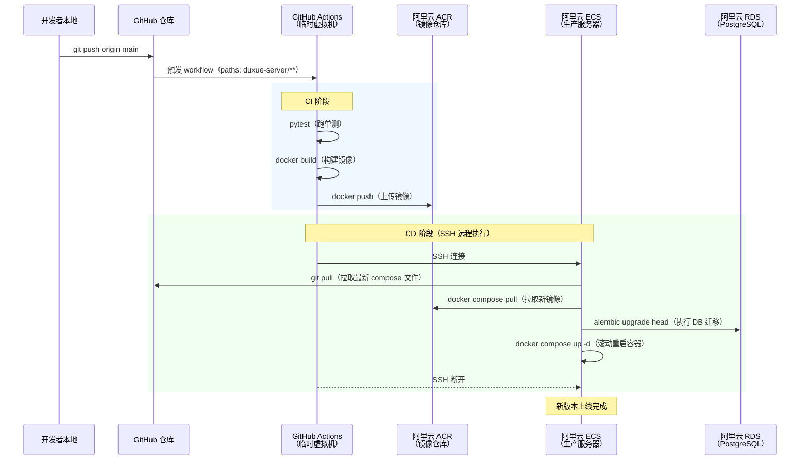

### 8.4 目录结构与配置文件管理

```
duxue-server/
├── docker-compose.yml    # 提交 Git，通用结构，不含硬编码值
├── Dockerfile            # 提交 Git
├── .env.example          # 提交 Git，列出所有变量名（值留空）
├── .env.dev              # 加入 .gitignore，本地开发用
│                         # （连开发环境 RDS/Redis）
└── .env.prod             # 只存在于 ECS，永远不入 Git
                          # （连生产环境 RDS/Redis）
```

两个环境通过 `.env` 文件区分，`docker-compose.yml` 本身不区分环境：

```yaml
# docker-compose.yml（提交 Git）
services:
  api:
    image: ${API_IMAGE:-duxue-server:latest}
    env_file: ${ENV_FILE:-.env.dev}
    ports:
      - "8000:8000"

  worker:
    image: ${API_IMAGE:-duxue-server:latest}
    command: celery -A infrastructure.messaging.celery_tasks worker -l info
    env_file: ${ENV_FILE:-.env.dev}

  beat:
    image: ${API_IMAGE:-duxue-server:latest}
    command: celery -A infrastructure.messaging.celery_tasks beat -l info
    env_file: ${ENV_FILE:-.env.dev}

  srs:
    image: ossrs/srs:6
    ports:
      - "1935:1935"
      - "1985:1985"
    volumes:
      - ./srs.conf:/usr/local/srs/conf/srs.conf
```

本地启动：
```bash
docker compose up api worker beat srs
# 默认读 .env.dev
```

生产部署（由 GitHub Actions 在 ECS 上执行）：
```bash
ENV_FILE=.env.prod \
API_IMAGE=registry.cn-hangzhou.aliyuncs.com/xxx/duxue-server:{git-sha} \
docker compose up -d api worker beat srs
```

### 8.5 GitHub Actions Workflow 说明

两个 workflow 文件，职责分离：

| 文件 | 触发条件 | 作用 |
|------|---------|------|
| `deploy-server.yml` | push 到 main，且 `duxue-server/**` 有变更 | 正常发布流程（测试 → 构建 → 部署） |
| `rollback-server.yml` | 手动触发，输入目标 git sha | 回滚到指定版本 |

具体实现见 `.github/workflows/` 目录。

### 8.6 回滚方式

每次构建都以 `git sha` 作为镜像 tag 存入 ACR，回滚通过 GitHub Actions 手动触发，**无需登录 ECS**。

**操作步骤：**

1. 在 GitHub 仓库页面，进入 **Actions → Rollback Server**
2. 点击 **Run workflow**
3. 在输入框中填入要回滚到的 `git sha`（从 commit 历史或之前的 Actions 记录中查到）
4. 点击确认，Actions 自动完成：拉取目标镜像 → 执行迁移降级 → 重启容器

```
GitHub Actions 页面
  │
  │  手动触发 Rollback Server workflow
  │  输入：target_sha = abc123def
  │
  ▼
GitHub Actions 临时虚拟机
  │  SSH 到 ECS，执行：
  │    alembic downgrade（按需）
  │    docker compose up -d（使用 abc123def 镜像）
  ▼
ECS 恢复到指定版本
```

---

*文档版本 v1.0 | 对应项目版本 duxue-server*
