# 读学系统 — Server 端架构设计

> 版本 v2.0 | 技术栈：FastAPI · PostgreSQL · Redis · Celery · OSS
>
> 全系统架构与领域划分见：[docs/ARCHITECTURE.md](../../docs/ARCHITECTURE.md)

---

## 〇、v2.0 关键变更说明

v2.0 相对 v1.0 有三处架构级调整，理解这三点就能理解整份文档的其余部分：

| 变更 | v1.0 | v2.0 | 原因 |
|------|------|------|------|
| **采集方式** | Cam 端 RTMP 推流到 SRS，服务端每 5 秒截帧 | Cam 端每 15 秒本地抓拍一张 JPEG，预签名直传 OSS | 系统需要的输入只是帧图片。推 720p 视频再抽掉 99.6% 的帧，浪费约 95% 带宽，并引入 SRS、stream_key、推流生命周期 Webhook、断流重连等一整套复杂度 |
| **推理方式** | 每帧实时调用 VLM API | 每日 Batch 异步推理，实时 API 仅作降级 | 报告是次日查看的，业务上不需要实时结果；Batch 单价为实时的 50%，且天然规避实时 API 的并发限制 |
| **分析产物** | 单张 `behavior_segments` 表 | 拆为 `frame_predictions`（逐帧）+ `behavior_segments`（归并后片段） | 片段天然对应多帧，挂单个 `frame_id` 在语义上不成立；拆开后调整平滑参数可直接重算历史，无需重跑 VLM |

**因此 v2.0 中不再存在**：SRS 组件、`stream_key`、`on_publish` / `on_unpublish` Webhook、Celery Beat 定时截帧、断流重连状态机。

### 关于帧门控：第一期不做

早期方案曾设计一层"帧门控"（人形检测 + 帧差比对），在调用 VLM 之前过滤掉无人或画面无变化的帧。**第一期不实现，所有帧全量送 VLM。** 理由见 §2.5，简述有三点：

1. **AI 路线决定了它的收益会消失。** 目标形态是 fine-tune 后自部署模型、按需启停云 GPU。那时成本按 GPU 运行时间计而非帧数，门控省的是电费不是钱，而单卡容量对可预见的设备规模过剩两个数量级。
2. **人形检测在本项目机位下判别力差，且错误方向危险。** 侧后方俯拍、只有上半身、趴桌时轮廓消失，会把"趴着睡着了"漏检成"离开"——恰恰是最需要捕捉的行为。VLM 靠语义理解就能正确处理这种情况。
3. **门控会破坏 fine-tune 的数据来源。** 训练数据只能从第一期真实运行中来，被门控跳过的帧就是缺失的训练样本，而且跳过判据（画面变化小）会让数据集系统性地缺失静止场景。

**因此第一期也不存在**：`FrameGate` 领域服务、人形检测模型、帧差计算、`frames.diff_score` / `gate_decision` / `anchor_frame_id` 字段。

---

## 一、分层架构

分层的目的是让"业务规则"与"技术实现"能各自独立演进，因此保留四层划分和 Repository 抽象。但**不引入 Command Bus / Event Bus / 聚合根基类这类框架式设施**——当前规模（约 12 张表、20 余个接口、1~2 人团队）下，这些设施带来的样板代码成本高于收益，与项目"方案简单"的原则冲突。领域事件直接以 Celery 任务投递即可。

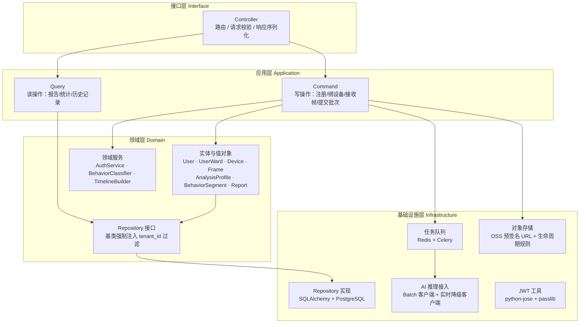

> **Repository 基类必须强制注入租户过滤**。这是多租户隔离的唯一防线：只要有一个查询忘记按 `tenant_id` 过滤就会越权，所以不能依赖每个调用方自觉，必须在基类层面收口。详见 §4.5。

---

## 二、命令与查询

### 2.1 命令（写操作）

**身份与设备**

| Command | 触发方 | 执行动作 | 产生事件 |
|---------|--------|---------|---------|
| `RegisterUser` | App / Admin | 创建 users + user_guardians 记录 | `UserRegistered` |
| `LoginUser` | App / Cam | 校验密码，签发 JWT | — |
| `CreateWard` | App | 创建 users + user_wards 记录 | `WardCreated` |
| `GenerateInviteCode` | App | 创建 devices 记录，写入 invite_code + 过期时间（10 分钟） | — |
| `BindDevice` | Cam App | 校验 invite_code 未过期未使用，签发长效 device_token，invite_code 置空 | `DeviceBound` |

**分析配置**

| Command | 触发方 | 执行动作 | 产生事件 |
|---------|--------|---------|---------|
| `CreateAnalysisProfile` | App | 创建 analysis_profiles 记录 | — |
| `UpdateAnalysisProfile` | App | 修改 extra_observation_prompt / name | — |
| `AddBehaviorLabel` | App | 创建 behavior_label_configs 记录 | — |
| `UpdateBehaviorLabel` | App | 修改 field_prototypes / priority / is_active | — |
| `DeleteBehaviorLabel` | App | 删除 behavior_label_configs 记录 | — |
| `AssignProfileToWard` | App | 更新 user_wards.analysis_profile_id | `ProfileAssigned` |

**采集**

| Command | 触发方 | 执行动作 | 后续动作 |
|---------|--------|---------|---------|
| `RequestUploadUrl` | Cam App | 校验 device_token，签发 OSS 预签名 PUT URL（有效期 5 分钟） | — |
| `IngestFrame` | Cam App | 帧已直传 OSS，此处只落元数据：写 frames 记录（`analyzed=false`，进入待批次池） | — |
| `ReportHeartbeat` | Cam App | 更新 `devices.last_heartbeat_at`，刷新在线状态 | — |
| `MarkDeviceOffline` | Beat（每分钟） | 心跳超时 3 分钟的设备置为 offline | 推送掉线通知给 guardian |

> `IngestFrame` 只写元数据、不接触图片字节。帧图片由 Cam 端直传 OSS，不经过 API 进程——否则 API 服务器要承担全部上行带宽与转发 CPU，把抓拍省下的成本又花回去。

**分析**

| Command | 触发方 | 执行动作 | 后续动作 |
|---------|--------|---------|---------|
| `SubmitDailyBatch` | Beat（每日 22:00 及流量低谷） | 将当日 `analyzed=false` 的帧打包为 JSONL，提交 Batch 任务 | 写 analysis_batches 记录 |
| `PollBatch` | Beat（每 10 分钟） | 查询 Batch 状态，完成则拉取结果 | 完成后投递 `IngestBatchResult` |
| `IngestBatchResult` | `PollBatch` | 解析结果写入 `frames.structured_fields`，跑分类层写 frame_predictions | 投递 `GenerateReport` |
| `FallbackToRealtime` | Beat（批次超 20 小时未完成） | 改用实时 API 补跑该批次剩余帧，保证次日可见 | 标记 `analysis_batches.fallback_used` |
| `GenerateReport` | Beat（每日凌晨）+ 批次完成后 | 时序平滑 → 片段归并 → 写 behavior_segments 与 reports（幂等覆盖） | 推送"报告就绪"通知 |

> **报告生成以 Beat 定时为主、事件触发为辅**。v1.0 把报告生成挂在推流结束事件上，但手机断连是常态（网络抖动、系统回收、切换 WiFi），一天可能触发几十次重算。v2.0 改为每日凌晨为"昨天有数据的 ward"统一生成，幂等覆盖；批次完成时的触发只是让报告尽早可见，不是唯一来源。跨天的帧按 ward 所在时区切分归属。

### 2.2 查询（读操作）

| Query | 触发方 | 返回数据 |
|-------|--------|---------|
| `GetWardDailyReport` | App | 单日各行为时长 + 占比（含自定义标签） |
| `GetBehaviorTimeline` | App | 连续行为片段时间轴 |
| `GetWeeklyTrend` | App | 近 7 天学习时长趋势 |
| `GetFrameList` | App / Admin | 帧列表 + 分析结果（分页） |
| `GetDeviceStatus` | App / Admin | 摄像头在线/离线状态 |
| `GetAnalysisProfile` | App | 配置详情（含所有 behavior_label_configs） |
| `ListAnalysisProfiles` | App | guardian 创建的所有配置列表 |
| `GetTenantSummary` | Admin | 机构下所有 ward 概况 |

### 2.3 领域层关键设计

#### 核心实体职责

| 实体 | 所在子域 | 核心职责 | 主要业务规则 |
|------|---------|---------|------------|
| `User` | IAM | 统一身份入口，持有 type 区分扩展表 | 同一 email 不可重复注册 |
| `UserWard` | Ward | 被监护者档案，持有 profile 绑定 | 只有同租户 guardian 可管理 |
| `AnalysisProfile` | Ward | 聚合 extra_observation_prompt + 所有 BehaviorLabelConfig | 删除 profile 前须检查是否有 ward 引用 |
| `Device` | Device | 持有 device_token，上报心跳与帧 | invite_code 有过期时间且使用后置空；心跳超时自动置 offline |
| `Frame` | Capture | 帧元数据 + VLM 结构化字段 | OSS 对象与记录同生命周期，留存期到即一并清理 |
| `FramePrediction` | Analysis | 单帧行为标签，与 Frame 一对一 | 必须记录推理来源（`api` / `local`），模型切换期间要能对比两者结论 |
| `BehaviorSegment` | Analysis | 平滑归并后的连续行为片段 | 由 FramePrediction 派生，可随时按新参数重算 |
| `AnalysisBatch` | Analysis | 追踪一次每日 Batch 推理作业 | 超 20 小时未完成必须降级实时补跑 |
| `Report` | Report | 按 ward + 日期聚合行为统计 | 同 ward 同日期只允许一条记录（幂等重生成） |

#### BehaviorClassifier 领域服务 — 配置驱动设计

`BehaviorClassifier` 是连接 VLM 输出与最终行为标签的核心服务，从 `AnalysisProfile` 读取配置而非内置固定规则：

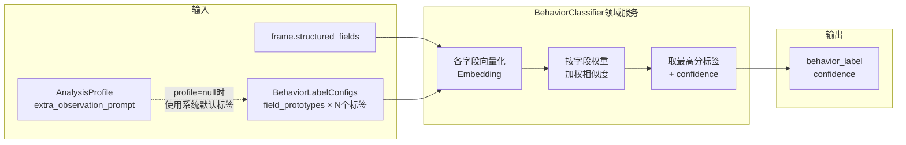

**Profile 为空的降级逻辑**：`user_wards.analysis_profile_id = NULL` 时，`BehaviorClassifier` 自动加载系统内置的默认 profile（学习 / 走神 / 离开），确保所有 ward 都能正常分析。

#### 任务流

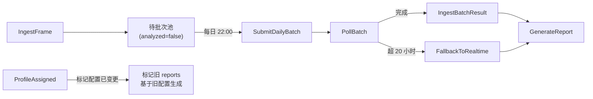

> `ProfileAssigned` 事件说明：guardian 修改 ward 的分析配置后，历史报告不会自动重算 VLM 部分（成本过高），但会标记为"配置已变更"，App 端提示 guardian"以下报告基于旧配置生成"。
>
> 注意区分两类重算成本：改**分类层配置**（标签定义、原型短句）只需重跑第二阶段，从已有 `structured_fields` 重算即可，成本极低；改 **extra_observation_prompt** 才需要重新调用 VLM。前者可以自动重算，后者不行。

### 2.4 关键流程：帧采集 → 分析全链路

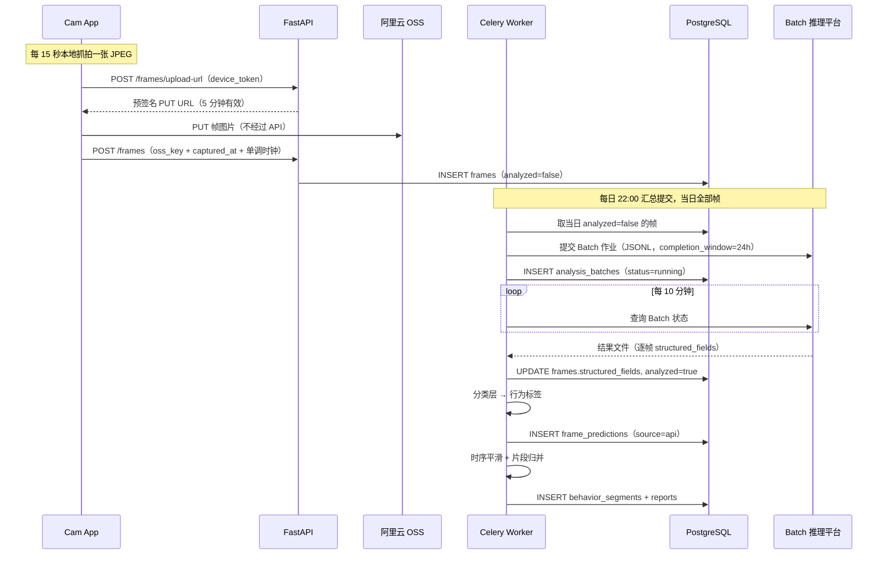

### 2.5 AI 推理演进路线（决定了很多设计取舍）

理解这条路线才能理解为什么第一期不做帧门控、为什么 `frame_predictions.source` 要区分推理来源。

| 阶段 | 推理方式 | 成本结构 | 触发进入下一阶段的条件 |
|------|---------|---------|-------------------|
| **第一期（当前）** | 百炼 Batch API + `qwen3-vl-flash`，全量帧 | 按帧数线性计费 | 积累到足够的真实场景标注数据 |
| **第二期** | 用第一期数据 fine-tune 一个小模型（2B~7B） | 一次性训练成本 | 模型在黄金集上达到可用准确率 |
| **第三期（目标形态）** | 自部署 fine-tune 模型，**按需启停云 GPU** | 按 GPU 运行时长计费，与帧数基本无关 | — |

**第三期的成本结构是关键。** 每日批量分析只需在夜间启动 GPU 实例跑一次，跑完即关。以单设备每天 4 小时、15 秒间隔的 960 帧为例，一个 fine-tune 后的小模型配合 vLLM 连续批处理，实际推理时间在十几分钟量级——即 GPU 每天只需运行不到半小时。在这个形态下：

- 帧数增加不会线性推高成本，只是让那半小时变成一小时
- 单卡容量对可预见的设备规模（几十台）过剩两个数量级
- **门控省下的是电费，不是钱**

> ⚠️ 这个结论**只对"按需启停"成立**。如果是 24 小时常驻的 GPU 实例，月费用很可能比 Batch API 贵一个量级以上，成本模型会完全反过来。选择自部署时必须确认部署形态是按需启停。

#### 为什么第一期不做帧门控

早期方案设计过一层门控（人形检测过滤"无人"帧 + 帧差比对跳过"无变化"帧），现已**移出第一期范围**。三个理由，按重要性排序：

**1. 门控与 fine-tune 的数据需求直接冲突。** 训练数据只能从第一期真实运行中来。被门控跳过的帧就是缺失的训练样本，而且跳过判据是"画面变化小"——这会让数据集系统性地缺失静止场景，而静止恰恰是书桌场景中最常见的状态。用这种数据训出来的模型，在最高频的场景上反而最弱。

**2. 人形检测在本项目机位下判别力差，且错误方向是单向危险的。** 我们的机位是侧后方 45° 俯拍、只有上半身、下半身被桌子遮挡、夜间可能低光——这恰好是 YOLO（COCO person 类以站立全身样本为主）最弱的场景组合。最糟的情况是**趴桌睡觉**：人形轮廓基本消失，极易漏检成"离开"，而这正是最需要捕捉的行为。相比之下 VLM 靠语义理解就能正确处理趴睡。

> 这里有个值得记住的张力：为隐私考虑"不拍正脸"的机位设计，与通用人形检测的可靠性是直接冲突的。正面机位检测会稳得多，但我们不能用。

误判成本的不对称性同样重要——漏检（有人判成无人）会直接产出错误的"离开"标签且**没有任何纠正机会**（都不送 VLM 了）；而误检只是多花一次调用的钱，无害。

**3. 第一期的绝对成本本来就很低。** 门控优化的是"每设备成本"，而第一期是自用验证期，设备数是个位数。为一个绝对值很小的数字引入准确率未知的组件，是典型的过早优化。

#### 第一期实际采用的降本手段

这几项的共同特点是**不依赖任何判断准确率**，因此零风险：

| 手段 | 效果 | 说明 |
|------|------|------|
| **限制监控时段** | 最有效 | 只在 guardian 配置的时段（如晚间写作业的两小时）采集，而非全天挂机。比门控省得多且完全不影响准确性 |
| 采样间隔 15 秒（而非 5 秒） | ÷3 | 报告统计的是行为时长占比，一次走神通常持续分钟级，15 秒粒度对结论几乎无影响 |
| Batch 接口 | ÷2 | 见 §2.6 |
| 模型档位 `flash` + 分辨率 640×480 | 量级 | "看清坐姿和手在干什么"不需要 max 档；image token 数正比于像素面积 |

#### 什么条件下才重新考虑门控

只有同时满足以下两条时才值得做：

1. 仍在使用按帧计费的 API（即第三期自部署没有落地），**且**
2. 设备规模增长到成本确实可观

如果按计划走到第三期，**这一层可能永远不需要实现**。

### 2.6 Batch 异步推理与降级

**为什么可以用 Batch：** 报告是当日监控结束后生成、guardian 事后查看的，系统中没有任何一个页面需要"这一帧刚分析完"。因此 Batch 的异步延迟在业务上不是妥协。

**收益：** 输入输出 token 均为实时价的 50%；同时天然规避实时 API 的并发与 QPS 限制——多个 ward 同时采集时，实时调用会撞限流并导致 Celery 队列堆积，而 Batch 是提交文件后由平台自行排队。

**平台约束**（阿里云百炼，见 [批量推理文档](https://help.aliyun.com/zh/model-studio/batch-inference)）：

| 项 | 约束 |
|----|------|
| 支持的视觉模型 | `qwen3-vl-flash`、`qwen3-vl-plus`、`qwen-vl-plus`、`qwen-vl-max` 及其 latest 版本 |
| 单文件上限 | 5 万条请求 / 500 MB / 单行 6 MB |
| `completion_window` | 24h ~ 336h，**是最长等待时间而非承诺时延** |
| 计费 | 仅对成功请求计费；**不能与上下文缓存折扣叠加** |
| 接口 | 兼容 OpenAI，`client.batches.create()`，`base_url` 指向 batch 专用端点 |

**降级策略（保证次日可见）：**

```
22:00  打包当日待推理帧 → 提交 Batch(completion_window=24h)
       reports 状态置为「生成中」，App 端显示等待态
  │
  ├─ 每 10 分钟轮询 → 完成则生成报告并推送通知
  │
  └─ 已过 20 小时仍未完成
        → 取该批次未返回的帧，改用实时 API 补跑
        → analysis_batches.fallback_used = true（用于监控 Batch 时延的可靠性）
```

其余降本手段见 §2.5，与 Batch 的 50% 折扣是乘法关系。

**暂不考虑多帧拼图**（把 9 张帧拼成 3×3 网格一次请求以摊薄 prompt 开销）：模型在网格图上容易错乱格子编号，准确率会下降，需要在图上叠加编号并在 prompt 中要求按编号输出，还得实测验证。收益不确定而复杂度确定，等 §2.5 那几项做完仍嫌贵再说。

**切换到自部署模型时的接口约定**：`batch_client` 与 `realtime_client` 都只暴露"输入一批帧、输出一批 `structured_fields`"这一个方法。第三期接入自部署模型时新增一个 `local_client` 实现同样的接口，调用方无需改动。切换期间通过 `frame_predictions.source`（`api` / `local`）区分来源，可以对同一批帧跑两条链路做结论对比。

---

## 三、认证方案（自实现 JWT）

不引入外部 Auth 服务，由 Infrastructure 层实现。

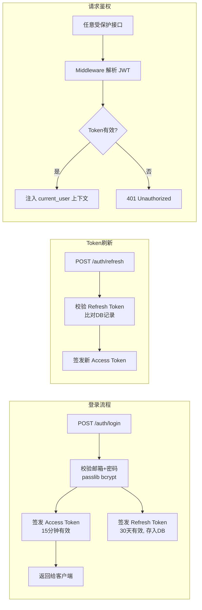

| 字段 | 说明 |
|------|------|
| Access Token | JWT，payload 含 `user_id / role / tenant_id`，15 分钟有效 |
| Refresh Token | 随机字符串，存 `refresh_tokens` 表，支持主动吊销 |
| 密码存储 | bcrypt hash，cost factor = 12 |
| Cam App 绑定 | 邀请码（6 位，10 分钟内一次性有效），绑定后颁发长效 `device_token` |

### 3.1 设备身份（device_token）

v1.0 用 `stream_key` 作为推流凭证，但 RTMP 走 1935 明文端口，key 在网络上可见，抓到即可冒充推流污染某个 ward 的数据。v2.0 改为抓拍上传后，设备身份统一走 HTTPS + Bearer Token，这个问题从根源上消失：

| 项 | 设计 |
|----|------|
| 签发时机 | `BindDevice` 成功时签发，随后所有帧上传与心跳请求携带 |
| 存储 | 服务端只存 `device_token_hash`（与密码同样处理），Cam 端存于 Android Keystore |
| 有效期 | 长效，不自动过期；guardian 在 App 中"解除绑定"即吊销 |
| 权限范围 | 仅限三个接口：申请上传 URL、提交帧元数据、上报心跳。不能读取任何报告或 ward 数据 |
| 邀请码防爆破 | 绑定接口按 IP 与按码双维度限流，同一邀请码失败 5 次即作废 |

> 帧上传用 **OSS 预签名 PUT URL**（有效期 5 分钟、限定单个 object key），Cam 端拿到后直传。这样既不让 API 承担带宽，也不需要把 OSS 的长期凭证下发到客户端。

---

## 四、数据库表设计

### 4.1 用户体系设计（Table-Per-Type）

系统中有三类"人"，采用基础表 + 扩展表模式。扩展表的 `id` 直接复用 `users.id`，是同一个值而非外键关联：

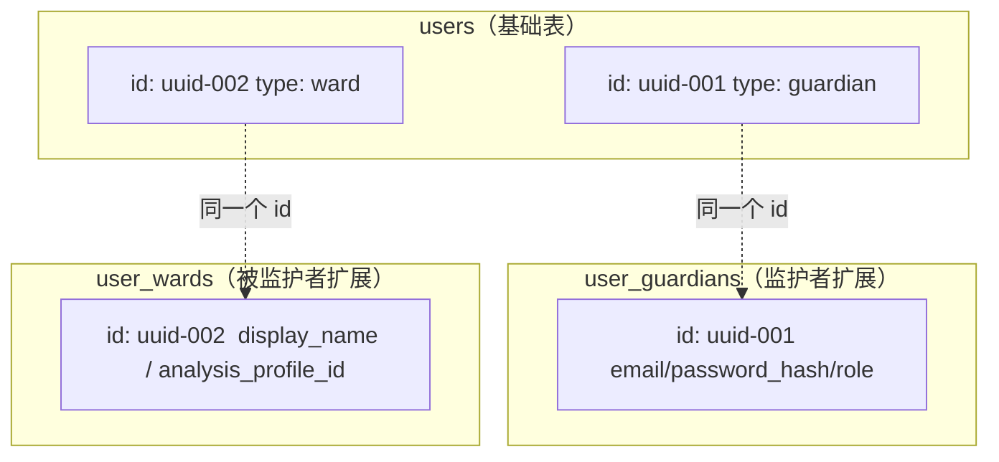

> **user_guardians**（guardian）：家长、老师、机构管理员 — 有密码，在 App 登录，可配置分析规则
>
> **user_wards**（ward）：被监护者 — 无密码，由 guardian 创建，**不需要任何地方登录**，每人可绑定独立分析配置
>
> **Cam App** 持有 `device_token`，是设备身份标识，不走人类账号体系（见 §3.1）

### 4.2 自定义分析配置设计

guardian 可以为每个 ward 设置独立的 VLM 分析内容，覆盖两个层次：

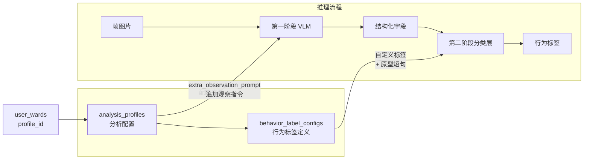

| 配置层 | 表 | 影响阶段 | 修改后是否需重跑 VLM | 示例 |
|-------|-----|---------|------------------|------|
| VLM 额外观察指令 | `analysis_profiles.extra_observation_prompt` | 第一阶段 | 需要 | "请额外观察是否有咬手指、揉眼睛等小动作" |
| 自定义行为标签 | `behavior_label_configs` | 第二阶段 | 不需要，从已存 `structured_fields` 重算即可 | 新增"咬手指"标签，定义 hand_action 原型短句 |

系统内置默认配置（学习/走神/离开），无自定义配置的 ward 自动使用默认值。

> 字段名以本表为准：**`extra_observation_prompt`**（v1.0 文档中曾出现 `extra_observations` 的写法，已统一）。

#### 分类层的实现分两步走

本文档描述的目标形态是**分字段加权相似度**——`field_prototypes` 按字段组织原型短句，各字段按 §4.2 的权重加权后取最高分。

但 `scripts/5_classify.py` 现有的 `EmbeddingClassifier` 是**整句质心**方案：把每个类别的全部参考句求平均得到一个质心向量，再与拼接后的整句描述比余弦相似度。`classifier/categories.yaml` 也是按整句列表组织的。

**第一期保持整句质心方案**，理由是字段权重本身需要真实数据才能定——在拿到真实机位素材、看清各字段的实际判别力之前，权重设多少都是拍脑袋。等 §9.2 的黄金集建立起来，能量化"改成分字段加权能提升多少"时再改造，那时 `behavior_label_configs.field_prototypes` 才有意义。

在此之前，让参考句本身侧重高权重信息（多描述手部动作与桌面物品、少描述身体姿态）就能获得大部分收益，成本几乎为零。

#### structured_fields 字段定义

VLM 第一阶段输出的结构化字段。字段设计需与实际机位配合——系统推荐的机位是**被观察者侧后方约 45° 略高于头顶俯拍**，取景覆盖桌面、上半身与头部轮廓但不含正脸（隐私考虑，见[产品需求文档](../../docs/product-requirements.md)）：

| 字段 | 含义 | 分类权重 | 说明 |
|------|------|---------|------|
| `hand_action` | 手部动作 | 高 | 判别度最高：握笔书写 / 翻书 / 摆弄玩物 / 持手机 |
| `desk_objects` | 桌面可见物品 | 高 | 书本 vs 手机 vs 玩具，是区分学习与走神最可靠的信号 |
| `head_orientation` | 头部朝向 | 中 | 低头朝桌面 / 转向侧方 / 抬头。**不依赖看到眼睛** |
| `body_pos` | 身体姿态 | 中 | 端坐 / 前倾 / 趴桌 / 后靠 |
| `seat_status` | 在座状态 | 中 | 在座 / 离座 / 不在画面 |
| `motion_state` | 运动状态 | 低 | 静止 / 小幅活动 / 大幅移动 |

> **不使用 `gaze_target`（视线目标）字段**。v1.0 设计中它权重第二高，但该字段依赖看清眼睛，与"不拍正脸"的机位要求直接冲突。改用 `head_orientation` 后，判别权重转移到 `hand_action` 与 `desk_objects`。
>
> **需要接受的能力损失**：在此机位下，"睁眼发呆"与"低头看书"无法区分——两者的头部朝向、手部状态、桌面物品可能完全一致。这是机位选择的必然代价，不是模型能力问题。若"发呆"是核心指标，可用"长时间完全静止"作为补充信号（真在阅读的人会翻页、会移动手），但这属于跨帧时序信息，须在片段归并阶段判断，不能在单帧上做。
>
> 相应地，`classifier/categories.yaml` 中现有大量依赖"目光"的参考短句（"目光空洞"、"目光朝向侧方"、"目光集中在桌面书本上"）**必须在标注开始之前重写**，否则标注数据会全部作废。

### 4.3 ER 图

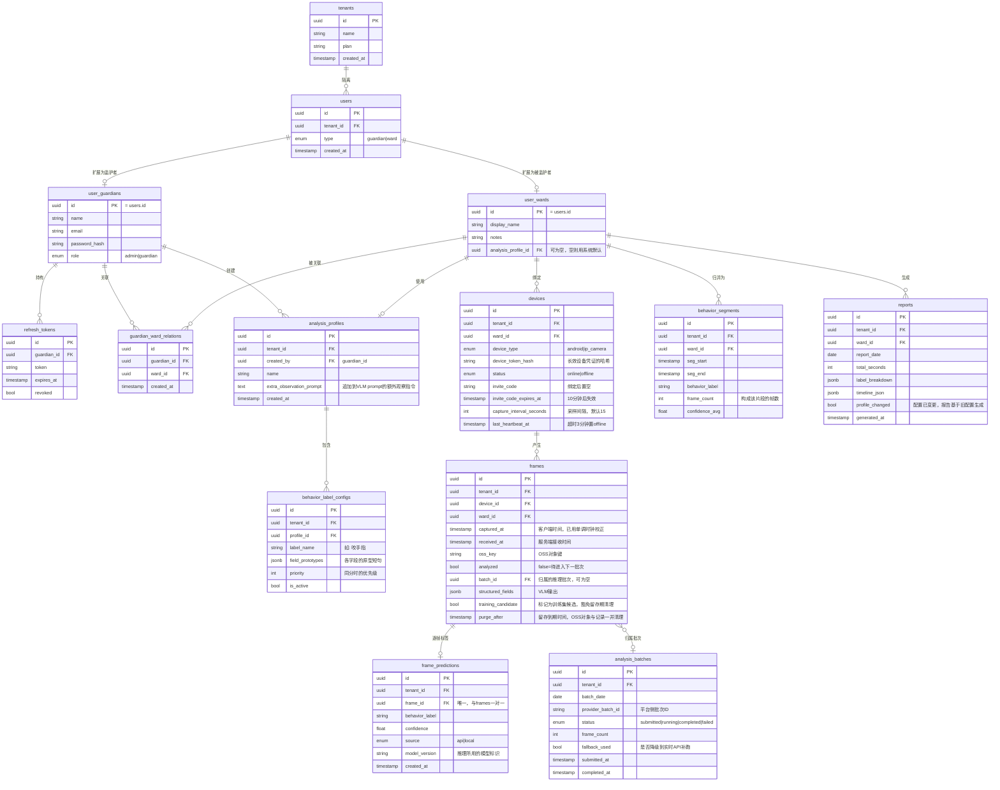

### 4.4 关键字段说明

| 表 | 字段 | 说明 |
|----|------|------|
| `users.type` | enum | 区分 guardian/ward，决定查哪张扩展表 |
| `user_guardians.role` | enum | `owner`=机构创始人，`admin`=管理员，`teacher`=老师，`parent`=家长 |
| `user_wards.analysis_profile_id` | uuid FK | 指向该 ward 的专属分析配置；为空则使用系统内置默认配置 |
| `analysis_profiles.extra_observation_prompt` | text | 追加到 VLM 第一阶段 prompt 末尾的额外观察指令 |
| `behavior_label_configs.field_prototypes` | JSONB | 第二阶段分类层各字段的原型短句，如 `{"hand_action":["手指放在嘴边","咬指甲"]}` |
| `behavior_label_configs.priority` | int | 多个标签同等相似度时的决胜顺序 |
| `frames.ward_id` | uuid FK | 冗余字段，报告统计直接按被监护者过滤，无需 join devices |
| `frames.captured_at` | timestamp | **客户端时间不可直接信任**：用户可能改系统时间或设错时区。Cam 端上传时一并带设备单调时钟（`elapsedRealtime`），服务端在绑定时记录偏移量并据此校正后再入库 |
| `frames.analyzed` | bool | `false` 即待推理，每日批次直接按此字段捞取。第一期无门控，所有帧都会走到 `true` |
| `frames.structured_fields` | JSONB | VLM 输出的结构化字段（见 §4.2） |
| `frames.training_candidate` | bool | 标记为 fine-tune 训练集候选，**豁免留存期自动清理**。见 §4.6 |
| `frames.purge_after` | timestamp | 留存到期时间。到期后 OSS 对象由生命周期规则删除，DB 记录由定时任务清理，见 §4.6 |
| `frame_predictions.source` | enum | `api`=远程 API 推理，`local`=自部署模型推理。第二/三期模型切换时用于对同一批帧做两条链路的结论对比 |
| `frame_predictions.model_version` | string | 具体模型标识（如 `qwen3-vl-flash` 或 `duxue-vl-v3`）。badcase 归因时必须知道是哪个版本判的 |
| `devices.device_token_hash` | string | 长效设备凭证的哈希（明文只在签发时返回一次）。替代 v1.0 的 `stream_key` |
| `devices.invite_code` | string | Cam App 首次绑定用，一次性，配合 `invite_code_expires_at` 限定 10 分钟 |
| `devices.capture_interval_seconds` | int | 采样间隔，默认 15。服务端下发给 Cam 端，便于统一调整而无需发版 |
| `analysis_batches.fallback_used` | bool | 该批次是否降级到实时 API。用于监控 Batch 实际时延的可靠性——若长期为 true，说明 Batch 方案不适用 |
| `behavior_segments.frame_count` | int | 构成该片段的帧数。片段由多帧归并而来，因此**不持有** `frame_id` |
| `reports.label_breakdown` | JSONB | 各行为时长汇总，如 `{"学习":3000,"咬手指":120,"离开":300}` |
| `reports.profile_changed` | bool | guardian 修改过分析配置，App 端据此提示"本报告基于旧配置生成" |

### 4.5 多租户隔离

**所有业务表都带 `tenant_id`**，包括 `devices` / `frames` / `frame_predictions` / `behavior_segments` / `analysis_batches` / `reports` / `behavior_label_configs`。这是冗余字段，理由与 `frames.ward_id` 的冗余完全相同：避免每次归属校验都要 join 三四层。

隔离靠两道防线，两道都要有：

1. **Repository 基类强制注入过滤。** 所有查询经由基类构造，`tenant_id` 条件由基类从请求上下文自动附加，业务代码无法绕过。不能依赖每个调用方自觉——只要有一个查询忘记加条件就会越权，而这类 bug 在测试中极难发现。
2. **PostgreSQL 行级安全（RLS）。** 在所有业务表上启用 RLS 策略，作为应用层出错时的兜底。

> 这个改动越晚做成本越高：等表里已有数据、代码里已有几十处查询时再补 `tenant_id`，需要数据回填 + 全量审查每一处查询。**必须在第一版建表时就带上。**

### 4.6 数据留存与删除

帧图片是敏感数据，同时也是存储成本的主体（按 15 秒间隔、每天 4 小时计算，单设备约 960 张/天）。采用分级留存：

| 数据 | 留存期 | 清理方式 |
|------|-------|---------|
| 帧图片（OSS 对象） | **第一期 90 天**，产品化前收紧至 30 天 | OSS 生命周期规则按前缀自动删除 |
| 标记 `training_candidate=true` 的帧图片 | 长期保留，豁免自动清理 | 写入独立的 OSS 前缀（如 `training/`），不挂生命周期规则 |
| `frames` 记录与 `structured_fields` | 与图片同期删除元数据，但**保留 `structured_fields`** | 结构化字段体积极小且是报告的真正来源，长期保留 |
| `frame_predictions` / `behavior_segments` / `reports` | 长期保留 | — |

> **第一期留存期为什么放宽到 90 天**：第二期 fine-tune 的训练数据只能从第一期真实运行中来，30 天窗口很可能不够攒到覆盖各种光照、坐姿、行为类别的样本。这是自用验证期可以接受的取舍——对外提供服务前必须收紧回 30 天。
>
> 训练集的挑选走**人工筛选**，不做自动去重。第一期数据量在单设备千帧/天的量级，人工过一遍完全可行，没必要为此引入帧差计算。选中的帧标记 `training_candidate=true` 即可豁免清理。

必须提供的能力：

- **`DeleteWardData` 命令**：删除某个 ward 的全部帧图片与分析数据，**包括已标记为训练候选的帧**。个人信息保护法赋予的删除权是硬要求，不能因为"这批数据要拿来训练"就豁免。
- **账号注销时的级联清理**：注销后异步清理该租户下所有 OSS 对象。

> `frames.purge_after` 在写入时即根据租户配置计算好，清理任务只需按此字段扫描，不需要每次重新推导留存策略。

---

## 五、核心场景示例

### 场景 A：Guardian 绑定设备

**前提**：guardian 已注册账号，并在 App 中为 ward 创建了档案。

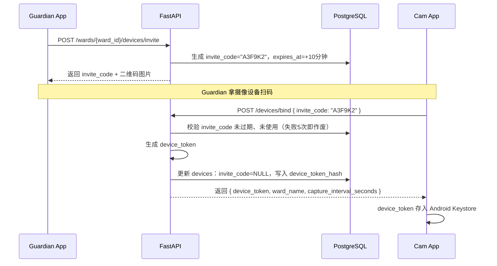

### 场景 B：Guardian 为 Ward 设置自定义分析配置

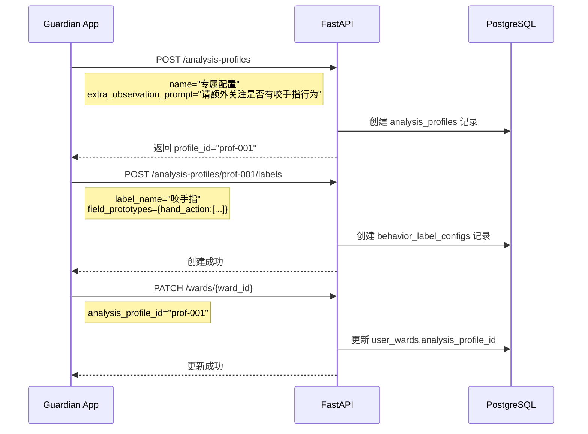

### 场景 C：一天的采集与分析

以一台设备监控 4 小时、15 秒间隔为例，共产生 960 帧，全部送 VLM：

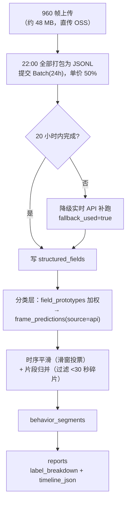

**960 帧是全天挂机的上限，不是典型值。** 第一期最有效的降本手段是限制监控时段——只在实际需要观察的两小时内采集，帧数直接降到 480。这比任何门控都省，且不引入准确率风险。

> 上线后应用 `scripts/0_quicktest.py` 按真实素材核算单 ward 的实际日成本。这个数字决定两件事：定价模型，以及第三期自部署的优先级。

单帧推理时的 Prompt 组装：

```
基础 Prompt（要求输出 §4.2 定义的结构化字段）
  + analysis_profiles.extra_observation_prompt（该 ward 的额外观察指令）
```

分类层从 `behavior_label_configs.field_prototypes` 读取该 profile 的全部标签定义，按 §4.2 的字段权重做加权相似度，取最高分标签。`analysis_profile_id` 为空的 ward 自动使用系统内置默认配置（学习 / 走神 / 离开）。

---

## 六、目录结构

```
server/
├── interfaces/                # 接口层（Controller）
│   └── http/
│       ├── auth_router.py
│       ├── ward_router.py
│       ├── device_router.py       # 绑定 / 心跳
│       ├── frame_router.py        # 申请上传 URL / 提交帧元数据
│       ├── profile_router.py
│       └── report_router.py
│
├── application/               # 应用层
│   ├── commands/
│   │   ├── auth_commands.py
│   │   ├── device_commands.py
│   │   ├── profile_commands.py
│   │   ├── capture_commands.py    # RequestUploadUrl / IngestFrame / ReportHeartbeat
│   │   └── analysis_commands.py   # SubmitDailyBatch / IngestBatchResult / GenerateReport
│   └── queries/
│       ├── report_queries.py
│       └── ward_queries.py
│
├── domain/                    # 领域层
│   ├── user/
│   │   ├── user.py
│   │   └── repository.py
│   ├── ward/
│   │   └── analysis_profile.py
│   ├── device/
│   ├── capture/
│   │   └── frame.py
│   ├── analysis/
│   │   ├── frame_prediction.py
│   │   ├── behavior_segment.py
│   │   ├── behavior_classifier.py
│   │   └── timeline_builder.py    # 时序平滑 + 片段归并
│   └── report/
│       └── report.py
│
└── infrastructure/            # 基础设施层
    ├── persistence/
    │   ├── models.py
    │   └── repositories/
    │       └── base.py            # 强制注入 tenant_id 过滤（见 §4.5）
    ├── auth/
    │   ├── jwt_service.py
    │   └── device_token_service.py
    ├── messaging/
    │   ├── celery_tasks.py
    │   └── beat_schedule.py       # 每日批次 / 报告 / 心跳超时 / 留存清理
    ├── storage/
    │   └── oss_client.py          # 预签名 URL + 生命周期规则
    └── ai/
        ├── inference_client.py    # 统一接口：一批帧 → 一批 structured_fields
        ├── batch_client.py        # Batch 提交 / 轮询 / 结果拉取
        ├── realtime_client.py     # 降级用实时 API
        └── prompt_builder.py
```

> `inference_client.py` 定义的统一接口是为第三期留的接缝：切换到自部署模型时新增一个 `local_client.py` 实现同样的接口即可，应用层无需改动。

---

## 七、技术选型汇总

| 分类 | 选型 | 说明 |
|------|------|------|
| Web 框架 | FastAPI | 异步，自动 OpenAPI 文档，依赖注入 |
| ORM | SQLAlchemy 2.x | 异步支持，与 PostgreSQL 配合成熟 |
| 数据库 | PostgreSQL 16 | JSONB 存结构化字段，RLS 作为多租户兜底 |
| 缓存/队列 | Redis 7 | Celery Broker + 会话缓存 |
| 任务调度 | Celery + Celery Beat | 每日批次提交与轮询、报告生成、心跳超时、留存清理 |
| 对象存储 | 阿里云 OSS | 帧图片，预签名 URL 直传 + 生命周期规则自动清理 |
| VLM 推理 | 百炼 Batch API（`qwen3-vl-flash`） | 单价为实时的 50%；实时 API 仅作超时降级。第三期切换为自部署 fine-tune 模型 |
| 分类层 | sentence-transformers | 第二阶段分字段加权嵌入相似度 |
| 认证 | python-jose + passlib | JWT 自实现，无外部依赖 |
| 容器化 | Docker Compose | 本地及生产一致部署 |

> **不再使用 SRS**。v1.0 引入它是为了接收 RTMP 推流并截帧，v2.0 改为 Cam 端抓拍直传后，这个组件及其运维、端口暴露（1935）、Webhook 端点全部不再需要。
>
> **第一期不引入 OpenCV / YOLO / MediaPipe**。这些原本是帧门控的依赖，门控移出第一期后一并去掉（原因见 §2.5）。服务端因此没有任何本地视觉计算，也就没有 CPU 密集环节。

---

## 八、CI/CD 与部署方案

### 8.1 基础设施选型

| 组件 | 阿里云服务 | 说明 |
|------|-----------|------|
| 服务器 | **ECS**（2核4G 起步） | 运行 FastAPI + Celery worker/beat 容器 |
| 数据库 | **RDS for PostgreSQL** | 托管，自动备份，开发/生产各一个实例 |
| 缓存/队列 | **云数据库 Redis** | 托管，Celery Broker，开发/生产各一个实例 |
| 镜像仓库 | **ACR（容器镜像服务）** | 存储 Docker 镜像，国内拉取速度快 |
| 文件存储 | **OSS** | 帧图片，Cam 端预签名直传；配生命周期规则自动清理 |
| 域名/HTTPS | **SLB + SSL 证书** | 反向代理，443 终结 TLS |

**带宽估算。** 抓拍方案下，单设备上行约 80 kbps（640×480 JPEG 约 50 KB，每 15 秒一张则更低），且**帧图片直传 OSS 不经过 ECS**，ECS 只承担元数据请求。因此 ECS 公网带宽按 API 流量估算即可，1~5 Mbps 起步足够。

> 对比 v1.0：RTMP 推流方案下单设备上行约 1500 kbps 且全部流经 ECS，1~5 Mbps 只够 1~2 台设备，带宽会是最先撞墙的地方。这也是采集方式调整的直接收益之一。

**CPU 估算。** 第一期服务端不做任何本地视觉计算（门控已移出，见 §2.5），ECS 只跑 API 与任务编排，2 核绰绰有余。第三期自部署模型时，GPU 走独立的按需启停实例，不占用这台 ECS。

### 8.2 CI/CD 全流程

```
开发者 push 到 main 分支
         │
         ▼
  GitHub 代码仓库
  （触发 Actions，paths: duxue-server/**）
         │
         ▼
  ┌──────────────────────────────┐
  │    GitHub Actions 临时虚拟机  │
  │                              │
  │  1. pytest 跑单测             │
  │  2. alembic check 检查迁移    │
  │  3. docker build 构建镜像     │
  │  4. docker push 推送镜像      │
  └──────────────┬───────────────┘
                 │ push 镜像
                 ▼
  ┌──────────────────────────────┐
  │       阿里云 ACR              │
  │     （镜像中转仓库）           │
  │  duxue-server:latest         │
  │  duxue-server:{git-sha}      │
  └──────────────┬───────────────┘
                 │ SSH 登录 ECS，执行：
                 │   git pull（拉取最新 compose 文件）
                 │   docker compose pull
                 │   alembic upgrade head（迁移）
                 │   docker compose up -d
                 ▼
  ┌──────────────────────────────┐
  │        阿里云 ECS             │
  │      （生产服务器）            │
  │                              │
  │  容器：api / worker / beat    │
  │                              │
  │  连接：阿里云 RDS（PostgreSQL）│
  │  连接：阿里云 Redis            │
  │  连接：阿里云 OSS（帧图片）    │
  └──────────────────────────────┘
```

> **这不是滚动部署。** `docker compose up -d` 是先停后起，API 会有数秒到数十秒不可用。当前阶段可以接受，但必须知道它是有停机窗口的重启部署，不要按零停机来设计依赖。
>
> **数据库迁移必须向后兼容。** `alembic upgrade head` 在旧容器仍在运行时执行，破坏性变更（删列、改类型）会让旧代码立即报错。约定采用 expand-contract 两阶段：先加列并双写，确认新版本稳定后的下一次发布再删旧列。

### 8.3 数据流：一次 push 到上线

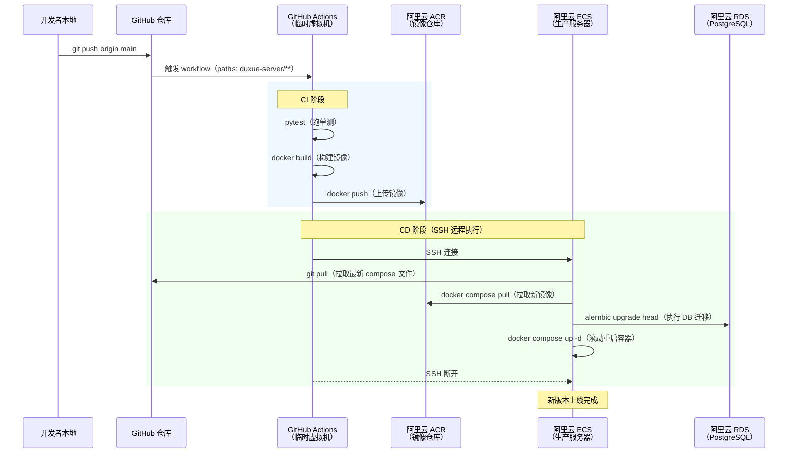

### 8.4 目录结构与配置文件管理

```
duxue-server/
├── docker-compose.yml    # 提交 Git，通用结构，不含硬编码值
├── Dockerfile            # 提交 Git
├── .env.example          # 提交 Git，列出所有变量名（值留空）
├── .env.dev              # 加入 .gitignore，本地开发用
│                         # （连开发环境 RDS/Redis）
└── .env.prod             # 只存在于 ECS，永远不入 Git
                          # （连生产环境 RDS/Redis）
```

> 根目录 `.gitignore` 需覆盖 `.env*` 通配并对 `.env.example` 加白名单例外。仅忽略 `.env` 和 `.env.prod` 是不够的——`.env.dev` 同样含开发环境数据库凭证。

两个环境通过 `.env` 文件区分，`docker-compose.yml` 本身不区分环境：

```yaml
# docker-compose.yml（提交 Git）
services:
  api:
    image: ${API_IMAGE:-duxue-server:latest}
    env_file: ${ENV_FILE:-.env.dev}
    ports:
      - "8000:8000"

  worker:
    image: ${API_IMAGE:-duxue-server:latest}
    command: celery -A infrastructure.messaging.celery_tasks worker -l info
    env_file: ${ENV_FILE:-.env.dev}

  beat:
    image: ${API_IMAGE:-duxue-server:latest}
    command: celery -A infrastructure.messaging.celery_tasks beat -l info
    env_file: ${ENV_FILE:-.env.dev}
```

本地启动：
```bash
docker compose up api worker beat
# 默认读 .env.dev
```

生产部署（由 GitHub Actions 在 ECS 上执行）：
```bash
ENV_FILE=.env.prod \
API_IMAGE=registry.cn-hangzhou.aliyuncs.com/xxx/duxue-server:{git-sha} \
docker compose up -d api worker beat
```

### 8.5 GitHub Actions Workflow 说明

两个 workflow 文件，职责分离：

| 文件 | 触发条件 | 作用 |
|------|---------|------|
| `deploy-server.yml` | push 到 main，且 `duxue-server/**` 有变更 | 正常发布流程（测试 → 构建 → 部署） |
| `rollback-server.yml` | 手动触发，输入目标 git sha | 回滚到指定版本 |

具体实现见 `.github/workflows/` 目录。

### 8.6 回滚方式

每次构建都以 `git sha` 作为镜像 tag 存入 ACR，回滚通过 GitHub Actions 手动触发，**无需登录 ECS**。

**操作步骤：**

1. 在 GitHub 仓库页面，进入 **Actions → Rollback Server**
2. 点击 **Run workflow**
3. 在输入框中填入要回滚到的 `git sha`（从 commit 历史或之前的 Actions 记录中查到）
4. 点击确认，Actions 自动完成：拉取目标镜像 → 执行迁移降级 → 重启容器

```
GitHub Actions 页面
  │
  │  手动触发 Rollback Server workflow
  │  输入：target_sha = abc123def
  │
  ▼
GitHub Actions 临时虚拟机
  │  SSH 到 ECS，执行：
  │    alembic downgrade（按需）
  │    docker compose up -d（使用 abc123def 镜像）
  ▼
ECS 恢复到指定版本
```

---

## 九、测试与 AI 效果闭环

### 9.1 测试分层

| 层次 | 范围 | 说明 |
|------|------|------|
| 领域逻辑单测 | `TimelineBuilder` 平滑归并、`BehaviorClassifier` 加权 | 纯函数为主，无需外部依赖 |
| API 集成测试 | 完整请求链路 + 真实 PostgreSQL | 用 testcontainers 起临时库；**必须覆盖跨租户越权用例**——这是 §4.5 那两道防线唯一的验证手段 |
| AI 黄金集回归 | 固定标注集上的分类准确率 | 见 §9.2 |

### 9.2 AI 黄金集回归

VLM 与分类层的输出是非确定性的，缺少回归基准意味着每次改 prompt 或标签配置都是盲改。

维护一个固定的黄金标注集（建议 200~300 帧，覆盖各行为类别与不同光照/坐姿），把 `scripts/7_evaluate.py` 接入 CI：任何涉及 prompt 或 `field_prototypes` 的变更都跑一遍，准确率跌破阈值即 fail。

这个黄金集在第三期还有第二个用途：**验收 fine-tune 模型**。自部署模型能否替换 API，判据就是它在同一个黄金集上不劣于 `qwen3-vl-flash`。

### 9.3 Badcase 反馈闭环

这是 AI 产品准确率信任的来源，不是靠首版模型效果建立的。它同时也是第二期 fine-tune 训练数据的主要来源：

```
guardian 在 App 时间轴上点「这段标错了」
        │
        ▼
收集该片段对应的帧 + structured_fields + model_version
        │
        ├─ 分类层问题（structured_fields 正确但标签错）
        │     → 调 field_prototypes，可直接从已存字段重算，无需重跑 VLM
        │
        └─ VLM 问题（structured_fields 本身就错）
              → 标记 training_candidate=true，进入重标注池
        │
        ▼
定期评审 → 补充黄金集 / 调整配置 / 累积 fine-tune 训练集
```

拿到一个 badcase 时第一步是判断错在哪一阶段——这决定了修复成本相差几个数量级：分类层问题改配置重算即可，VLM 问题才需要重新推理甚至重训。`frame_predictions.model_version` 用于归因到具体模型版本。

---

## 十、可观测性接入范围

完整方案见 [docs/observability.md](../../docs/observability.md)。服务端的接入优先级：

**立即做**：OTEL 自动插桩（FastAPI / SQLAlchemy / Celery / Redis），全部通过环境变量配置，零业务代码改动。

**随第一版做**：四个自定义业务指标——VLM 推理耗时分布、Celery 队列深度、帧上传成功率、在线设备数。另外补两个 v2.0 特有的关键指标：

| 指标 | 类型 | 为什么重要 |
|------|------|-----------|
| `duxue.vlm.frames_analyzed_daily` | Counter | 每日实际推理帧数。第一期无门控，这个数字直接等于账单，是判断何时该做第三期自部署的依据 |
| `duxue.batch.fallback_ratio` | Gauge | 降级到实时 API 的批次占比。若长期偏高，说明 Batch 的实际时延不可靠，需要重新评估该方案 |

**延后**：移动端 OTEL（Cam / App）。两端 SDK 成熟度不足（Logs 信号仍为实验阶段，需手动注入 trace_id 绕过），投入产出比低。移动端先接 Sentry 收 crash 即可覆盖绝大部分排障需求。

---

*文档版本 v2.0 | 对应项目版本 duxue-server*
